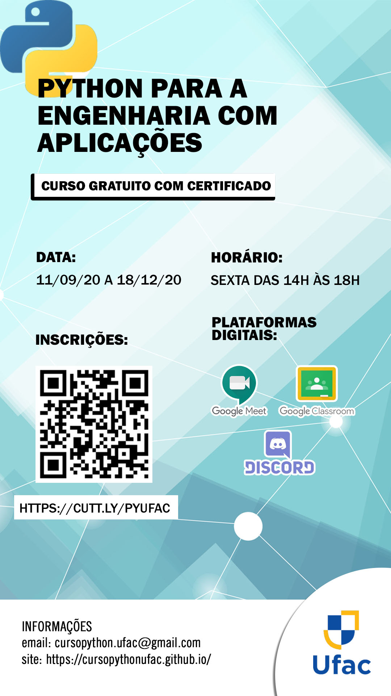

# Python para a engenharia com aplicações

## Como é o curso?

Neste curso será ensinado o Python dentro do ambiente de desenvolvimento Jupyter Lab com aplicações voltadas para estudantes, profissionais e pesquisadores de engenharia. Este ambiente permite a criação de __Notebooks__, um conceito de documento que inclui textos tradicionais com títulos, figuras, equações, etc, e códigos Python. Os resultados da programação em Python são impressos dentro do documento, permitindo, inclusive, a criação de botões interativos dentro do Notebook, possibilitando a criação gráficos e outros elementos interativos. No curso, serão apresentados os conceitos básicos da linguagem de programação Python aplicados à alguns problemas da engenharia e da matemática, que serão previamente explicados ao decorrer das aulas. Além disso, o curso contará com atividades práticas semanais, que serão apresentadas nas aulas de videoconferências e em apostilas no formato de ‘Notebooks’. Ao final do curso cada participante deverá fazer um projeto final de curso para consolidar o conhecimento adquirido. Finalmente, o participante pode contar com a ajuda dos bolsistas e/ou voluntários para tirar dúvidas durante as aulas e na resolução das tarefas semanais.

## Informações importantes

**Início**: 11/09

**Término**: 18/12

**Período de inscrição**: 02/09 à 11/09

**Horário**: Das 14h às 18hs (Toda sexta)

**Inscrição**: https://cutt.ly/pyUFAC

**Plataformas:** Google Meet (Streamming) + Google Classroom (Plataforma educacional) + Discord (Chat)

**Contato**: cursopython.ufac@gmail.com