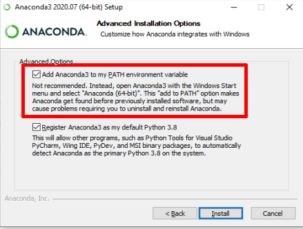

# Conteúdo do curso
----
### **Capítulo 1:** Primeiros passos
> Neste capítulo vamos apresentar o ambiente de desenvolvimento do Jupyter Lab e introduzir as linguagens Markdown e Python. Além disso, vamos ensinar como instalar o Anaconda para utilizar o Jupyter Lab com o Python.







### **Capítulo 2:** Saída de dados e sentenças lógicas

> Neste capítulo vamos aprender um pouco mais sobre a função `print()` e o método `.format()`. Além disso, como funciona as variáveis booleanas e os operadores lógicos & relacionais.









### Capítulo 3: Módulos e pacotes

> Neste capítulo vamos aprender a expandir a linguagem Python através dos módulos e pacotes.







### Capítulo 4: Estruturas de decisão

> Neste capítulo vamos aprender sobre as estruturas de decisão do Python e sobre as extensões do Jupyter Notebook.



{% include menu-atividade-resp.html 
roteiro="notebooks/cap4/cap4.html" 
material="https://github.com/cursopythonUFAC/cursopythonUFAC.github.io/raw/master/notebooks/cap4/ca%E1%B9%954.zip" 
entrega="https://classroom.google.com/c/MTYzNjkzMjMzNDE4?cjc=etkqkdg" 
solucao="solucao/cap4.pdf"
%}

### Capítulo 5: Estrutura de repetição while 

> Neste capítulo vamos aprender sobre as estruturas de repetição `while`, `while-else` e os comandos `break` e `continue`.





### Capítulo 6: Widgets

> Neste capítulo vamos aprender sobre as entradas iterativas do Jupyter, os Widgets.



### Capítulo 7: Lista

> Neste capítulo vamos aprender sobre as listas, tupla, for e list comprehension.



### Capítulo 8: Saídas do IPython

> Neste capítulo vamos aprender um pouco sobre as saídas do IPython e sobre alguns métodos de strings.



# Informações importantes

-----

<strong style="color:red">Precisamos coletar seus nomes completos:</strong> [https://forms.gle/ndULDdNL5P8KbqyH9](https://forms.gle/ndULDdNL5P8KbqyH9)

> Infelizmente não temos os nomes completos de todos os inscritos. Por favor preencha este formulário com o nome completo para que possamos associar o nome com o CPF.
>
> **Observação**: Use o seu e-mail de inscrição.
>
> **Link do formulário:** [https://forms.gle/ndULDdNL5P8KbqyH9](https://forms.gle/ndULDdNL5P8KbqyH9)

**Onde:** No Google **Meet** (Ver o menu superior)

**Datas**: de 11/09 à 18/12 (**Toda sexta**)

**Horário**:  

- **Brasília**: Das 16hs às 20hs  
- **Local (Acre)**: Das 14hs às 18hs

**Contato**: cursopython.ufac@gmail.com

**Observações:**

> Os links de todas as **plataformas digitais** podem ser acessadas no **menu superior**.

> O **conteúdo do curso** pode ser alcançado no **final da página**.

# Plataformas

----

### Anaconda

Anaconda é a distribuição que usaremos para rodar os nossos códigos Python em Notebooks. Link para download:

> [https://www.anaconda.com/products/individual](https://www.anaconda.com/products/individual)

A instalação é simples. Basta clicar Next toda vida, porém tem uma ressalva:

> Caso necessite de rodar o Python no terminal do Windows pode clicar na opção: 

### **Discord**

O **Discord** é tipo um **Whatsapp**, só que com muito mais recursos. Será nosso canal de comunicação entre você e os tutores. Lá você poderão **conversar** e **tirar dúvidas** e receber **informações relativas ao curso**. O link para download pode ser encontrado logo abaixo:  

> [https://discord.com/download](https://discord.com/download)  

O link de **convite** para o servidor é: [https://discord.gg/G4k53CS](https://discord.gg/G4k53CS)

É recomendado a utilização da versão Desktop do **Discord**. 

### **Google Classroom**

O **Google Classroom** é a plataforma de ensino  aonde você enviará as suas atividades. Você pode acessá-la clicando no ícone **Entregar atividade**.  Lembrando que a presença nas lives não serão obrigatórias, entretanto nós recomendamos a presença sempre que possível. As **atividades têm caráter obrigatório** e devem ser entregues via Google Classroom/Sala de Aula.  

### **Google Meet**

O **Google Meet** é a plataforma de *streamming* (**lives**) aonde aconterão os encontros semanais. O **link** da live será enviado **uma hora antes** pelos canais de comunicação do curso. Além disso, durante as aulas, **você poderá acessar a live (Google Meet)  no menu superior de plataformas digitais**, localizado no topo do site.

### **Canal no Youtube**

No nosso canal no Youtube você pode encontrar as aulas anteriores. O link para o Canal está disponível [aqui](https://www.youtube.com/channel/UCyMrBqAj-98a70ZWPZZb9IQ) e no **menu superior**. 
