<center><div style="font-size:32px;display:inline-block;font-weight:bold;" class="aula-title">Capítulo 1: Primeiros passos</div></center>


----

# Introdução

----

**Mas afinal o que é o Jupyter Notebook?**

O Notebook é um conceito revolucionário, pois permite unir código e texto, assim cada funcionalidade pode ser explicada detalhadamente. Você também pode criar funcionalidades dinâmicas, como gráficos, análise de dados ou outros cálculos, em tempo real.

Utilizando o Jupyter é possível escrever o trabalho da faculdade, relatórios de estágio, fazer anotações para consolidar o aprendizado, desenvolver os estágios iniciais da sua pesquisa científica, ou criar este material didático que você esta lendo neste momento. Veja abaixo algumas imagens do que o Jupyter é capaz. 


> Imagens tiradas do site oficial do Jupyter Notebook.

`Você será capaz de fazer algo parecido com isso em algumas capítulos!`

Por padrão, os códigos do Jupyter Notebook são feitos na linguagem de programação Python. É possível trabalhar com outras linguagens, porém não será abordado neste curso. O texto é feito através da linguagem `Markdown`, uma linguagem de marcação (ou criação?) tão simples que é possível dominar os conceitos básicos em menos de 10 minutos. Embora simples, o `Markdown` é uma linguagem poderosa! Por exemplo, partes do site de apoio do curso foi feito utilizando a linguagem Markdown, assim como o roteiro deste capítulo.

> **Curiosidade:**  O nome Jupyter vem de [**Ju**]lia, [**Pyt**]hon [**e R**], as principais linguagens de programação utilizadas pelos cientistas de dados. É possível utilizar o Jupyter com essas três linguagens, e com outras, como C++.

**E o JupyterLab?**

O `JupyterLab` é uma evolução do antigo (Porém, ainda bastante usado) ambiente de desenvolvimento `Jupyter Notebook`. Este ambiente de desenvolvimento utiliza tecnologias web mais modernas que o seu velho companheiro, possui alta performance e possui um interface mais flexível e poderosa.

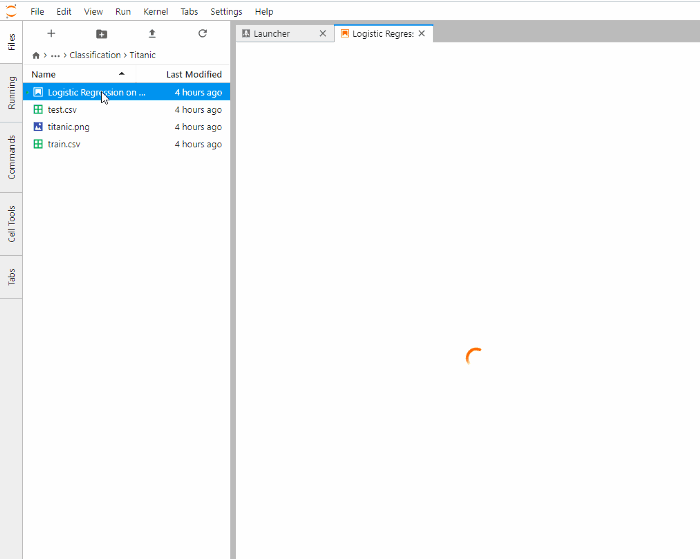

> Imagem retirada do site: https://towardsdatascience.com/.

## Parte 1: Instalação do Anaconda

Existem várias maneiras de instalar um ambiente de desenvolvimento de Python na sua máquina. Uma das maneiras mais práticas é através do **Anaconda**. Primeiramente acesse o site:

https://www.anaconda.com/products/individual

Procure por **Download** e baixe o instalador:  
> Certifique-se que está baixando o `anaconda3`, a versão do Anaconda com o Python3.  

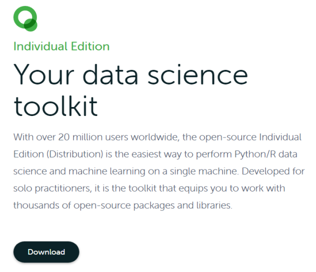

Depois siga os passos como a instalação de qualquer outro programa do windows. Contudo, atente-se para selecionar `Add Anaconda3 to my PATH environmental variable`, como mostrado na figura abaixo: 


Após a instalação ser concluida, vá no menu iniciar e execute o **Anaconda Navigator (anaconda3)**. Este aplicativo é um hub que nos fornece atalhos para diversos outros aplicativos. 

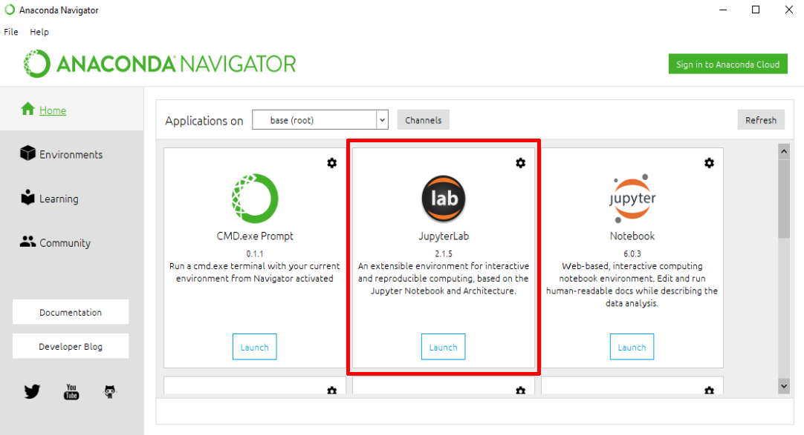

Clique em **Launch**, o programa irá iniciar o servidor e abrir a interface do Jupyter Notebook no navegador.

> Caso tenham dificuldades em abrir a interface do Jupyter no Navegador, recomendamos que utilize o navegador Google Chrome.

**Instalação no Linux**

A instalação no Linux pode ser feita seguindo o passo a passo disponível no link abaixo:

> [https://docs.anaconda.com/anaconda/install/linux/](https://docs.anaconda.com/anaconda/install/linux/)

Após a instalação você pode executar o Anaconda Navigator utilizando o comando `anaconda-navigator` no terminal. Caso queira criar um atalho no menu da sua distribuição, você pode dá uma olhada [aqui](https://dannyda.com/2020/03/21/how-to-create-shortcut-icon-for-anaconda-anaconda3-navigator-launch-anaconda-navigator-in-linux-debian-ubuntu-kali-linux).

Se ainda assim você estiver dúvidas em relação à instalação do Anaconda você pode ajuda aos nossos monitores no nosso servidor do Discord.

## Parte 2: Instalação do Discord

**Passo 1: Instalação e criando conta**

Baixe o Discord em [https://discord.com/download](https://discord.com/download) e instale-o.


Na tela de login, caso ainda não possua uma conta, clique em "Registre-se".


Preencha seus dados e crie uma nova conta. Após o processo, será necessário verificar sua conta pelo seu e-mail. Agora, já estará apto a logar no Discord. 

**Passo 2: Entrar em um servidor Discord**

Agora que já estamos logados, está na hora de entrar em um servidor Discord, no nosso caso, no servidor do `Curso de Python UFAC`.

Procure na sua tela inicial o botão indicado por um `+`, como mostrado na seguinte imagem.


Clique no botão "Entrar em um servidor". 


No campo "Insira um convite", você irá inserir um dos links de convite do nosso servidor Discord, no caso, o link é: https://discord.gg/ruCdT7Z ou https://discord.gg/xCpHFBH


**Passo 3: Interagindo no servidor**

Agora que já estamos no servidor, podemos usufruir dos seus canais de Voz e de Texto. 


Os canais sinalizados com um `#`(seta em azul) são canais onde os membros podem interagir por meio de **texto**, e os canais sinalizados com um pequeno auto-falante (seta em amarelo) são canais onde pode-se interagir por **voz**.

No canto inferior esquerdo, são encontrados os botões de bloquear o microfone, bloquear o som, compartilhar tela, ligar vídeo e desconectar.


Em nosso Discord, você pode chamar a atenção de algum monitor em qualquer dos canais de texto utilizando o comando `!ajuda`.


Também pode utilizar o comando `!informacoes`, para imprimir na tela algumas informações sobre o curso.


Caso o Discord não reconheça seu microfone, tente ir em configurações (no canto inferior direito), e selecionar a aba "Voz e vídeo" para mudar os dispositivos de entrada e saída.


Para qualquer dúvida em relação ao Discord, procurar o monitor **Gustavo**.

# Atividade 1: A interface do Jupyter

----

Ao abrir o programa pela primeira vez você irá encontrar uma interface parecida com essa:

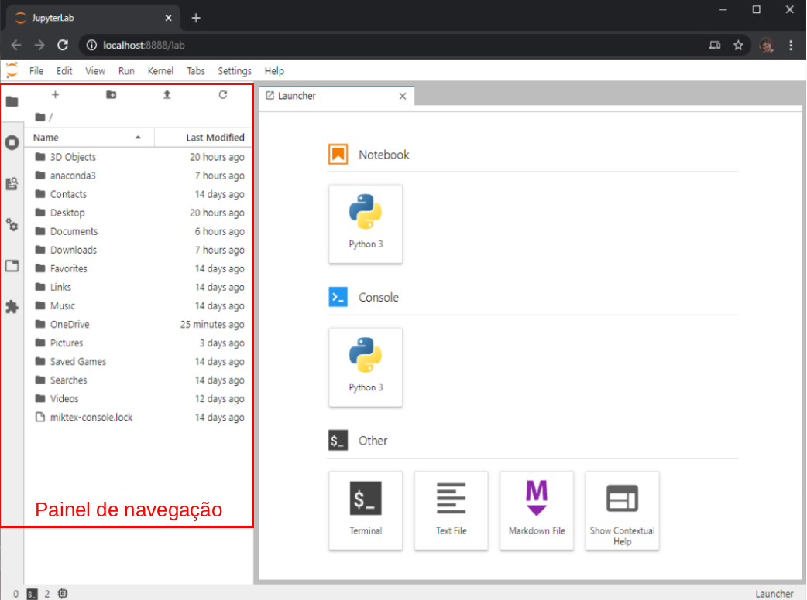

Ao clicar no ícone de pasta no lado esquerdo. Você poderá abrir ou fechar o painel de navagação.  Assim, abra o painel e selecione uma pasta para criar seus projetos. Caso necessário é possível clicar uma pasta dentro do próprio painel de navegação. Iremos criar a pasta `Documents/Meus_notebooks`. Dentro desta pasta iremos criar uma outra pasta chamada `Aula_1`.

Depois de selecionar a pasta de trabalho, na aba **Launcher**. Nesta aba você poderiar criar novas instâncias de `Notebook`, `Console`, arquivos `Markdown`, dentre outros. Onde tem `Notebook` selecione `Python 3`. Irá criar um novo arquivo na sua pasta de trabalho chamado `Untitled.ipynb`. Você pode renomeá-lo clicando no botão direito e em seguida em `Rename`.  Coloque o nome do arquivo como: `Aula_1.ipynb`.

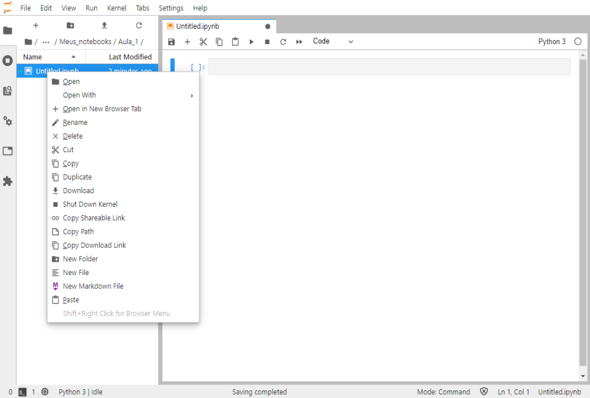

**Trocando para o tema escuro**

Caso não se sinta confortável com o tema claro que vem por padrão no JupyterLab é possível trocar clicando no menu superior em `Settings/JupyterLab Theme/JupyterLab Dark`. Caso queira mudar o tema da barra de rolagem deixe a opção `Theme Scrollbars` ativa. 

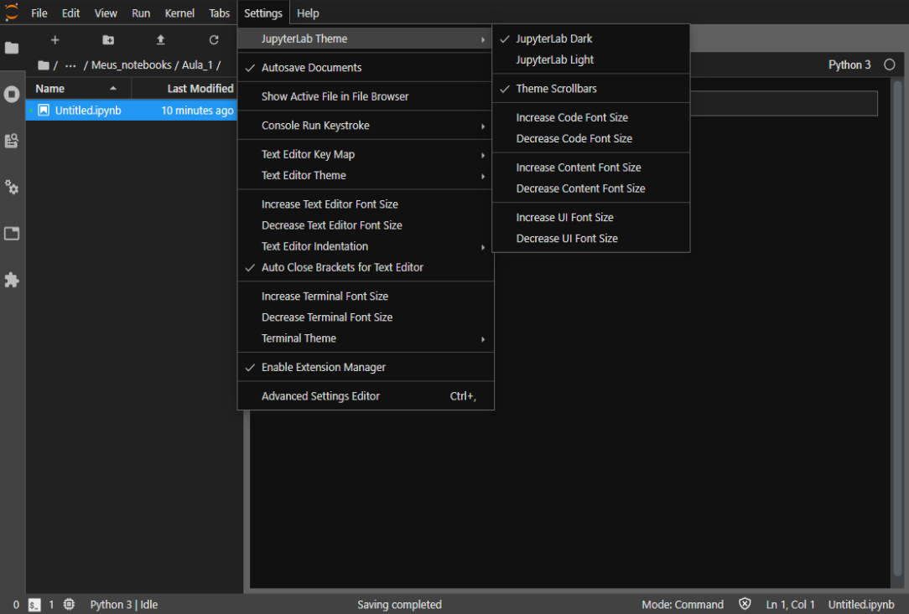

**Menu de ajuda**

Dentro do próprio Notebook é possível acessar a documentação oficial de muitas das "tecnologias" utilizada na confecção dos Notebooks. Isto é bem prático, pois evita aquela pesquisa no Google que nem sempre trás informações relevantes. Por exemplo, clique em `Help>Markdown Reference` e irá abrir uma aba com as principais referências da linguagem. E ainda, há um pequeno tutorial que você pode fazer mais tarde, em casa.

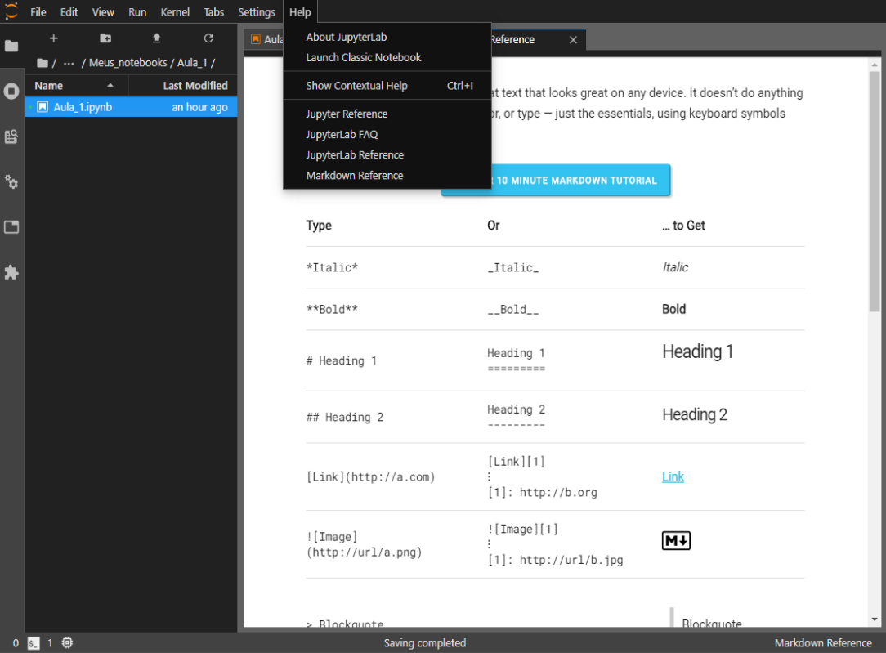

Lembre-se de **sempre visitar este menu** antes de fazer aquela pesquisa no google.

## Parte 1: Criação e Execução de Células

Um Notebook é formado por uma ou mais células. Uma célula é um espaço aonde é possível escrever um trecho de código (Python) ou texto (código Markdown).  Algumas ações relacionadas ao notebook e às células podem ser executadas no painel superior da aba. A figura abaixo mostra alguns atalhos do painel superior.

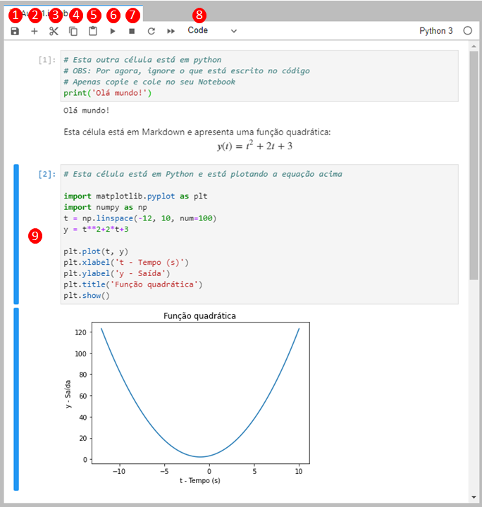

> Figura 1.1: Exemplos de células no Jupyter.

| **No.** | **Descrição**                                                |
| :-----: | ------------------------------------------------------------ |
|    1    | Salvar Notebook                                              |
|    2    | Adicionar uma nova célula abaixo                             |
|    3    | Recortar uma célula                                          |
|    4    | Copiar uma célula                                            |
|    5    | Colar uma célula                                             |
|    6    | Executar (Compilar) uma célula e ir para a próxima célula    |
|    7    | Parar a execução do código (Muito importante quando seu código trava!) |
|    8    | Mudar do modo código para o modo texto (Markdown)            |
|    9    | Area de seleção de células                                   |

> Tabela 1.1: Descrição de cada botão ou região da Figura 1.1.


**Agora vamos para a prática!**

Vamos à um exemplo. Considere os códigos abaixo, **não se preocupe em entendê-los agora**. Considere os códigos abaixo:

**Célula 1:** Modo texto - Markdown

```markdown
## Atividade 1
----
```

**Célula 2:** Modo código - Python

>```python
># Está célula está em Python.
># Iremos escrever nossa primeira célula
>print("Olá mundo")
>```

**Célula 3:** Modo texto - Markdown

```markdown
Esta célula está em **Markdown** e apresenta uma função quadrática:
$$y(t)=t^2+2t+3$$
```

**Célula 4:** Modo código - Python

> ```python
> # Esta célula está em Python e está plotando a equação acima
> 
> import matplotlib.pyplot as plt
> import numpy as np
> t = np.linspace(-12, 10, num=100)
> y = t**2+2*t+3 
> plt.plot(t, y) 
> plt.xlabel('t - Tempo (s)') 
> plt.ylabel('y - Saída') 
> plt.title('Função quadrática') 
> plt.show() 
> ```

**Copie e cole-os no seu Notebook de acordo com a linguagem indicada e depois execute-os.**

> **Dicas**: 
>
> > Para executar a célula e avançar para a próxima célula pressione no botão `▶` (Número 6 na Figura 1.1).
>
> > Se necessário, pode-se adicionar uma célula abaixo clicando no `+`, representado pelo `número 2` na Figura 1.1.
>
> > Se necessário é possível mover as células na região `9` da Figura 1.1.

## Parte 2: Copiar e colar células

Crie um novo Notebook, nomeie como `Aula_1aux`, recorte a célula 1 do seu primeiro Notebook e cole no Notebook `Aula_1aux`.

## Parte 3: Kernel e Células

Toda vez que uma célula de código é executada, os valores das variáveis finais das variáveis são salvas na memória. Primeiramente:

1. Crie três células de código como mostra abaixo (Copie e cole os códigos em Python):

**Célula 1:** Bloco de atribuição da variável `x`:

> ```python
> # Célula 1:
> # Atribua o valor 0 à variável 'x'
> x=0
> ```

**Célula 2:** Incremente a variável `x` em 1:

> ```python
> # Célula 2:
> # Incremente esta variável em 1
> x=x+1
> ```


**Célula 3:** Imprima o valor da variável `x`:

> ```python
> # Célula 3:
> # Mostre o valor de 'x'
> x
> ```

2. Reinicie o Kernel indo no menu `Kernel>Restart Kernel...` 

   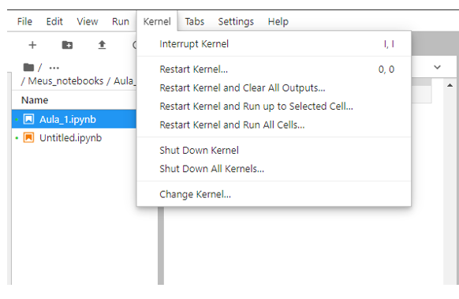

3. Execute as células na seguinte ordem:

​	Célula 1 $\rightarrow$ Célula 2 $\rightarrow$ Célula 2 $\rightarrow$ Célula 2 $\rightarrow$ Célula 3 $\rightarrow$  Célula 2 $\rightarrow$ Célula 3 $\rightarrow$  Célula 1 $\rightarrow$ Célula 3


> **Dicas:** 
>
> > Selecione a célula e utilize o atalho `Ctrl+Enter` para executar a célula pelo teclado.
>
> > Use as teclas $\uparrow$ e $\downarrow$ para movimentar entre as células.
>
> > Um atalho para reiniciar o Kernel é apertar `0` duas vezes.


> **Observação**: Observe que toda vez que uma célula é executada há um aumento da numeração do lado direito da célula. Esta numeração indica a ordem que as células foram executada. 

4. Reinicie o Kernel novamente. E execute a Célula 2. O que ocorreu?

> **Explicação**: Quando reiniciamos o Kernel e executamos a Célula 2, haverá um erro. Isso ocorre, porque a variável é criada na Célula 1. E quando limpamos a memória, ela deixa de existir.

**Teoria:**

O Kernel é o servidor que roda o código em Python. Quando clicamos em `Restart Kernel...`  estamos reiniciando o servidor, portanto todos os dados da memória serão deletados. Para isso o podemos recorrer ao menu do `Kernel` , o servidor que roda o código em Python. Abaixo segue uma tabela que explica cada função do menu  `Kernel`.

|                Opção                 | Função                                                |
| :----------------------------------: | ----------------------------------------------------- |
|          Restart Kernel...           | Reinicia o kernel (Apaga todas as variáveis)          |
| Restart Kernel and Clean All Outputs | Reinicia o kernel e limpa todas as saídas das células |
|   Restart Kernel and Run All Cells   | Reinicia o kernel e roda todo o Notebook              |

> Tabela 1.2: Algumas funções do menu Kernel.

## Parte 4: Atalhos

O Jupyter permite o uso de vários atalhos que podem facilitar a nossa vida. No menu `Run` podemos ver alguns atalhos:

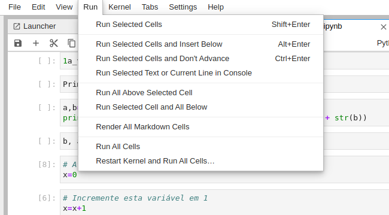

|   Atalho    | Função                                       |
| :---------: | -------------------------------------------- |
| Shift+Enter | Rode a célula e avance para a próxima célula |
| Ctrl+Enter  | Rode a célula, mas não avance                |
|  Alt+Enter  | Rode a célula e insira outra célula abaixo   |

**Modo de edição e modo de comando:**

Existem alguns atalhos que só podem ser acessados no modo de comando. De forma resumida:
> No modo de edição você pode editar as células e no modo de comando você pode utilizar alguns atalhos relacionado às células.

É possível ver se a célula está no modo de comando ou de edição na barra de status:

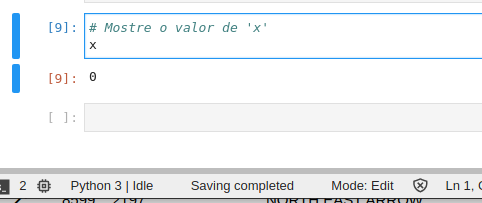

> Figura 1.2: Esta célula está no modo de de edição.

Para acessar o **modo de comando** clique na região esquerda fora da célula ou simplesmente aperte o botão `Esc`, e para acessar o **modo de edição** clique dentro da célula ou aperte `Enter`. No modo de comando é possível utilizar os seguintes atalhos:

|            Atalho             | Função                             |
| :---------------------------: | ---------------------------------- |
|      D, D (D duas vezes)      | Apaga a célula                     |
|     Setas &uarr; e &darr;     | Navegue entre as células           |
|               A               | Adiciona uma célula acima (Above)  |
|               B               | Adiciona uma célula abaixo (Below) |
| Shift + Setas &uarr; e &darr; | Seleciona mais de uma célula       |

Além disso, é possível selecionar várias células pressionando `Shift` e clicando com o mouse.

# Atividade 2: Introdução ao Markdown

----

## Parte 1: A linguagem Markdown

Primeiramente iremos apenas brincar de copiar e colar.  Abra uma nova instância do seu notebook e compare-o lado à lado, sempre com uma instância compilada (Executada) e outra não.

Antes de começar adicione a seguinte célula de texto abaixo:

```markdown
## Atividade 2
----
```

Agora vamos criar uma nova visão do nosso notebook. Em cima da aba do seu Notebook clique com o botão direito e aparecerá um menu. Procure por `New view for Notebook` e clique. 

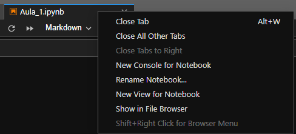

Ao final você verá uma cópia do seu Notebook na aba ao lado. Utilize a aba da direita para visualizar os resultados da sua escrita em Markdown em tempo real. Para isso basta clicar no modo de edição de texto na aba da esquerda, enquanto a aba da direita está executada.  

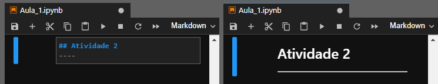

Agora vamos aprender a partir de alguns exemplos.

### Exemplo 1: Texto genérico

**Tarefa:** Nesta célula apenas copie e cole e veja o que acontece.

```markdown
# Capítulo 1 - Primeiros passos
#### Data da aula: 11 de setembro de 2020.

### Contato.
**Nome**: Beatriz Mestra em Markdown
**E-mail**: beatriz.mestra@cursopythonufac.github.io
**Telefone**: (68) 9 9999-9999

# 1. Elementos textuais em Markdown

### Primeiro vamos ver como deixar nosso texto em negrito, itálico ou tachado.
### Exemplo:
Esta palavra está em **negrito**. Engraçado, pois __esta também__.

Legal para vocês, mas eu estou em *itálico*, assim como _esta_.

~~Eu sou apenas um tachado mesmo.~~ 

### É importante saber, principalmente na hora de fazer o seu cabeçalho, que existe *hierarquias* de títulos. Se você já é familiarizado com HTML, saberá do que estamos falando.
### Exemplo:
# Título Nível 1

## Título Nível 2

## Título Nível 3

### Título Nível 4

#### Título Nível 5

##### Título Nível 6

### ------------------------------------------------

### Podemos escrever códigos em linha:
### Para fazer isto, basta: ` codigo aqui `

**Exemplo**:
`print("codigo inline")`

### Ou \``` codigo aqui ```:

​```python
myname = "Mestre"
myage = 200

if myage >= 18:
    print("Pode ser preso.")
else:
    print("Não pode ser preso.")
​```
```

Conseguiu encontrar alguns padrões?

Após a execução, **delete esta célula**.

> **Dicas:** 
>
> - Sempre que estiver em dúvida em relação ao Markdown, recorra ao menu `Help>Markdown reference`.
> - Use o atalho `D,D` para deletar a célula.
> - Trabalhe em markdown com a tela divida.

Vamos estudar cada elemento com detalhes.

### Exemplo 2: Títulos

Os títulos são criados utilizando `#`. Podemos ter títulos de diversos níveis ou hierarquias. O título com apenas uma `#` gera um título de nível 1, com dois `#`, `##` gera um texto nível dois, e assim por diante. No Markdown podemos criar títulos de até Nível 6.

```markdown
# Título Nível 1

## Título Nível 2

## Título Nível 3

### Título Nível 4

#### Título Nível 5

##### Título Nível 6
```


Resulta em:

># Título Nível 1
>
>## Título Nível 2
>
>## Título Nível 3
>
>### Título Nível 4
>
>#### Título Nível 5
>
>##### Título Nível 6

### Exemplo 3: Comentários

Comentários são parte de códigos que não aparecem no trecho final. Veja um exemplo:

​```markdown
<!--Esta frase não vai aparecer pois é um comentário.-->

Esta frase vai aparecer, pois não é um comentário.
```

Resulta em:

> Esta frase vai aparecer, pois não é um comentário.

Observe que a parte do texto que estava entre `<!--` e `-->` não aparece no seu texto final, pois é um comentário. Somente a frase de baixo, que não é um comentário, aparece.

Podemos escrever comentários em mais de uma linha. utilizando entre o comentário os delimitadores `<!---` e `-->`:

```markdown
<!---
Este é um comentário multi-linha.
Portanto eu posso pular uma linha e continuar escrevendo o comentário.
-->
```

Esta frase vai aparecer, pois não é um comentário.
> **Curiosidade:**  
> A notação de comentário apresentada é uma notação da linguagem de marcação de texto HTML. Utilizamos a notação em HTML sempre que queremos fazer algo que não é possível no Markdown nativamente.

Existem alguns interpretadores de Markdown que permitem comentários, porém isso não é uma regra, e existem muitas variações da sintaxe. Portanto, é preferível sempre utilizar a sintaxe de comentário em HTML. Uma das implementações que funciona no Jupyter é:

```markdown
[//]: # (Isto é um comentário com a sintaxe do Markdown que funciona no Jupyter.)
[//]: # (Este é outro comentário em uma nova linha.)
```

### Exemplo 4: Quebra linha

Para quebrar uma linha em Markdown devemos utilizar `dois espaços` no final da frase. Podemos utilizar, também, um espaçamento de uma linha entre uma frase e outra. Veja o exemplo:

```markdown
<!--- 
Vamos tentar escrever duas palavras embaixo da outra sem nada adicional:
-->
Arroz
Feijão

<!--- 
Por fim, vamos utilizar o primeiro exemplo. Porém vamos adicionar dois spaços depois de "Arroz", resultando em "Arroz  "
-->
Arroz  
Feijão
​```
```

Resulta em:

> Arroz Feijão
>
> Arroz  
> Feijão

### Exemplo 5: Novo parágrafo

Para criar um novo parágrafo é simples, basta adicionar mais de um quebra linha entre duas frase. Veja o exemplo:

 ```markdown
Estou criando o primeiro parágrafo para o meu texto.

Agora vou criar mais um parágrafo para o meu texto.
 ```

Resulta em:

> Estou criando o primeiro parágrafo para o meu texto.
>
> Agora vou criar mais um parágrafo para o meu texto.


### Exemplo 6: Itálico

Podemos criar textos em itálico utilizando `_` ou `*` entre o texto que você quer deixar em itálico. Por exemplo:

```markdown
Legal para vocês, mas eu estou em *itálico*, assim como _esta_.
```

Resulta em:

> Legal para vocês, mas eu estou em *itálico*, assim como _esta_.

Agora, para praticar, tente escrever a frase abaixo utilizando Markdown:

> Em textos acadêmicos, palavras em inglês devem estar sempre em ítalico, como: *mouse*, _software_ e _love_.

### Exemplo 7: Negrito

De forma similar ao itálico, podemos utilizar o `__` ou `**` para criar um texto em negrito.

```markdown
Esta palavra está em **negrito**. Engraçado, pois __esta também__.
```

Resulta em:

> Esta palavra está em **negrito**. Engraçado, pois __esta também__.

**Tarefa:** Tentando escrever as frases em Markdown:

> O **rato** roeu a **roupa** do **rei** de **roma**.   
> Eu **gosto** de **pizza**

> **Dica:** Lembre-se de usar o quebra linha (Dois espaços).

### Exemplo 8: Itálico e negrito

Para criar um texto em itálico e negrito, basta combinar as duas formatações. Por exemplo

De forma similar ao itálico, podemos utilizar o `__` ou `**` para criar um texto em negrito.

 ```markdown
Esta palavra está em _**negrito e itálico**_. Engraçado, pois *__esta também__*.
 ```

Resulta em:

> Esta palavra está em _**negrito e itálico**_. Engraçado, pois *__esta também__*.

**Tarefa:** Tente reescrever a frase abaixo:

> Eu _**gosto**_ de **Guaraná**, mas não **_gosto_** de **_Coca-Cola_**.

### Exemplo 9: Tachado

Para escrever um texto em tachado, utilizamos `~~` entre o texto. Veja o exemplo abaixo:

```markdown
~~Eu sou apenas um tachado mesmo.~~ 
```

Resulta em:

> ~~Eu sou apenas um tachado mesmo.~~ 

**Tarefa:** Reescrava o exemplo anterior utilizando tachado. O resultado deve ser algo parecido com isso:

> ~~Eu _**gosto**_ de **Guaraná**, mas não **_gosto_** de **_Coca-Cola_**.~~

### Exemplo 10: Código em linha

Podemos escrever um trecho de código em uma frase utilizando o caracter crase. 

Veja o exemplo abaixo:

```markdown
Para imprimir "Olá mundo!" em python utilizamos o "comando" `print("Olá mundo")`.
```

Resulta em:

> Para imprimir "Olá mundo!" em python utilizamos o "comando" `print("Olá mundo")`.

Observe que o comando "print("Olá mundo")" é apresentado em um fundo diferente, indicando que é um código.

**Tarefa:** Reproduza a frase abaixo:

   "Um triângulo é formados por 3 lados, os lados `a`, `b` e `c`."

### Exemplo 11: Código multi-linha

Podemos criar um código que funciona em mais de uma linha. Para isso vamos utilizar a seguinte notação 

Fizemos acima um código genérico. Se quisermos especificar a linguagem de programação devemos usar: 

 ```markdown
​```linguagem
Aqui vai mostrar o código no modo texto
​```
 ```
 Por exemplo, se considerarmos a linguagem Markdown:


 ```markdown
​```markdown
<!---
Isto aqui é um comentário multi-linha.
E esta é a segunda linha do comentário
-->  
Se eu executar esta célula o comando de **negrito** irá aparecer. 

​```
 ```

Resulta em:

> ```markdown
> <!---
> Isto aqui é um comentário multi-linha.
> E esta é a segunda linha do comentário
> -->
> Se eu executar esta célula o comando de **negrito** irá aparecer. 
> ```

Agora tente criar um bloco de código no Markdown com a linguagem Python:

```python
# Este código será apresentado na forma de texto, em Markdown
ling = "python"

if ling != "python":
    print("Não é uma boa linguagem.")
else:
    print("Melhor linguagem.")
```

A especificação da linguagem permite realçar algumas notações de sintaxe da linguagem, facilitando a visualização no seu texto final. Porém é possível criar um bloco de código multi-linha sem realçe. Para isso basta não colocar não colocar o nome da linguagem. Como mostra abaixo:

```
# Este código será apresentado na forma de texto, em Markdown
ling = "python"

if ling != "python":
    print("Não é uma boa linguagem.")
else:
    print("Melhor linguagem.")
```

### Exemplo 12: Citações

Podemos escrever citações. Veja como:

```markdown
> Agir, eis a inteligência verdadeira. 
> Serei o que quiser. Mas tenho que querer o que for. 
> O êxito está em ter êxito, e não em ter condições de êxito. 
> Condições de palácio tem qualquer terra larga, 
> mas onde estará o palácio se não o fizerem ali?
```
Resulta em:

---

>Agir, eis a inteligência verdadeira. 
>Serei o que quiser. Mas tenho que querer o que for. 
>O êxito está em ter êxito, e não em ter condições de êxito. 
>Condições de palácio tem qualquer terra larga, 
>mas onde estará o palácio se não o fizerem ali?

---

Agora pense num poema bem bonito e escreva no formato de citação.

### Exemplo 13: Lista não ordenada

Para trabalhar com lista não ordenada podemos utilizar o sinal de `-` antes da frase:

```markdown
**Lista não ordenada:**

- item 1
- item 2
- item 3
```
Resulta em:

> **Lista não ordenada:**
>
> - item 1
> - item 2
> - item 3

**Tarefa:** Seguindo o exemplo acima, tente criar lista não ordenada.

> **Dica:** Afazeres domésticos, compras de supermercado, coisas que eu quero aprender em Python, etc.

### Exemplo 14: Lista ordenada


Veja como faz uma lista ordenada:

```markdown
**Lista ordenada:**
1. Elemento 1
2. Elemento 2
3. Elemento 3
```
Resulta em:

> **Lista ordenada:**
>
> 1. Elemento 1
> 2. Elemento 2
> 3. Elemento 3

**Tarefa:** Crie uma lista ordenada, considerando a numeração como ordem de prioridade.

> **Dica:** suas músicas favoritas, seus filmes favoritos, seus pokemons favoritos, etc

### Exemplo 15: Lista dentro de lista

Podemos criar uma lista dentro de uma lista adicionando uma identação, como mostra abaixo:

```markdown
- item 1
   - item 1.1
   - item 1.2
   - item 1.3
- item 2
   1. item 2.1
   2. item 2.2
   3. item 3.3
- item 3
```

Resulta em:

>1. item 1
>  - item 1.1
>  - item 1.2
>  - item 1.3
>2. item 2
>   - item 2.1
>   - item 2.2
>   - item 3.3
>- item 3


**Tarefa: ** Abaixo tem uma receita de bolo. Tente reproduzir em Markdown o exemplo abaixo:


> 1. Ingredientes:
>   - Ovo
>   - Farinha de trigo
>   - Leite
>   - Fermento
> 2. Modo de preparo:
>   - Bata no liquidificador o leite com o ovo
>   - Jogue a farinha de trigo na mistura
>   - Bote para assar

## Parte 2: Criando o cabeçalho

Você se lembra do menu de ajuda do Jupyter? Entre lá e procure por `Markdown Reference`.


Dentro do seu Notebook crie uma célula no topo da atividade.

> **Dica:** Clique na primeira célula, entre no modo de comando e aperte `A` de Above.

Agora crie o seu cabeçalho.

O meu ficou assim:

```html
<center><h1>Capítulo 1: Primeiros passos</h1></center>

<center><div style="font-size:24px;display:inline-block;">11 de setembro de 2020</div></center>

__Nome do(a) aluno(a)__: Beatriz Mestra em Markdown  
__Matrícula__: 9999999999999  
__Telefone__: (68) 9 9999-9999  
__E-mail__: beatriz.mestra@cursopythonufac.github.io  
```

> **Dica:** Não se esqueça dos dois espaços para quebrar a linha

Resulta em:

----

<center><div style="font-size:28px;display:inline-block;font-weight: bold;margin-block-end: 0.43em;">Capítulo 1: Primeiros passos</div></center>

<center><div style="font-size:24px;display:inline-block;margin-block-end: 0.83em;">11 de setembro de 2020</div></center>

__Nome do(a) aluno(a)__: Beatriz Mestra em Markdown  
__Matrícula__: 9999999999999  
__Telefone__: (68) 9 9999-9999  
__E-mail__: beatriz.mestra@cursopythonufac.github.io  

-----

>**Dicas:** 
>
>- Se você conhece, você pode usar em HTML e CSS para deixar o seu texto ainda mais rico. Mais informações [aqui](https://www.w3schools.com/html/html_basic.asp).
>
>- Evite usar muitos títulos no seu cabeçalho (`#`,  `##`, etc) no seu cabeçalho pois isso pode atrapalhar na geração de índice ao exportar seu Notebook para pdf, LaTeX ou HTML.

**Ah, não se esqueça de criar os títulos e cabeçalhos das próximas atividades 😉**


# Atividade 2: Introdução ao Python

----

## Parte 1: Comentários

Digite em seu notebook o seguinte código:

> ```python
> # aqui vamos refazer o cabeçalho utilizando variáveis
> # aliás, você sabe quem sou eu?
> 
> '''
> Eu sou um comentário em Python.
> No meu caso, sou de várias linhas.
> Mas o meu colega ali em cima, é de apenas uma.
> Sacou? :D
> '''
> 
> #Precisamos adicionar qualquer código para o comentário não gerar uma string multilinha
> print()
> ```

Execute o código. Você pode ir até "Run" ou use o atalho `Ctrl + Enter`.

**Tarefa:** Agora use sua imaginação e crie o seu próprio cabeçalho utilizando comentários.

> **Dicas:** 
>
> - Use o comentário multi-linha para criar o seu cabeçalho. 
>
> - Lembre-se de adicionar o comando `print()` para evitar que o comentário seja interpretado como uma *string*.

## Parte 2: Operadores

Em Python, podemos escrever expressões matemáticas. Expressões consistem de valores, como `2` e operadores, como o `+`.

Escreveremos `2+2` na célula abaixo, e vemos que a expressão irá assumir o valor final de `4`. 

> ```python
> 2+2
> ```
>
> 4

Podemos usar diversos operadores para computar diversas expressões como quisermos, como listado na tabela abaixo.

| Operador |    Operação     | Exemplo | Resulta em |
| :------: | :-------------: | :-----: | :--------: |
|    **    |    Expoente     | 2 ** 3  |     8      |
|    %     |      Resto      | 22 % 8  |     6      |
|    //    | Divisão inteira | 22 // 8 |     2      |
|    /     |     Divisão     | 22 / 8  |    2.75    |
|    *     |  Multiplicação  |  3 * 5  |     15     |
|    -     |    Subtração    |  5 - 2  |     3      |
|    +     |     Adição      |  2 + 2  |     4      |

A ordem dos operadores da matemática do Python é similar à usada na matemática comum, ou seja, primeiro as potências (`**`), depois multiplicações e divisões (`*` e `/`) e por fim as somas e subtrações (`+` e `-`), da esquerda para a direita. Podemos também usar parênteses. Agora, vamos tentar calcular o valor de algumas operações para exercitar o que foi aprendido. 

### Exemplo 1: Operações de somar, subtrair e multiplicar e dividir

**Tarefa:** Execute as seguintes operações:

> **Dica:** Para executá-las você deve utilizar células diferente para cada uma. Desta forma é mostrado o resultado abaixo da célula

>```python
># Célula 1
>2+2+3
>```
>
>```python
># Célula 2
>7-4
>```
>
>```python
># Célula 3
>3*9
>```
>
>```python
># Célula 4
>23/7
>```

### Exemplo 2: Divisão de parte inteira

A divisão de parte inteira retorna somente a parte inteira de uma divisão. Veja o exemplo abaixo:

> ```python
># Considerando a divisão normal, /:
> 23/7
> ```
> 
>  3.2857142857142856
>    
>```python
> # Considerando a divisão de parte inteira, //:
>23//7
> ```
> 
> 3

**Tarefa**: Tente resolver os cálculos abaixo utilizando a divisão normal e a divisão de parte inteira:

- $8\div7$
- $50 \div 3$

### Exemplo 3: Resto

Podemos encontrar o resto de uma divisão utilizando o operador `%`.

**Tarefa:** Calcule o resto das seguintes operações:

- $23\div 7$
- $40 \div 4$
- $43 \div 3$

### Exemplo 4: Potenciação

O operador `**` permite calcular operação de exponenciação, considerando o exemplo:

> ```python
> 2**5
> ```

O número `2` é a base é `5` é o expoente.

**Tarefa:** Calcule as seguintes expressões:

- $2^5$
- $2^3$

### Exemplo 5: Raiz

No Python _vanilla_ (Sem módulos ou extensões) não existe a operação de raiz. Entretanto podemos reescrever esta operação utilizando a operação de potênciação com números fracionários ou decimais. Por exemplo, para calcular $\sqrt{4}$ utilizamos:

> ```python
> 4**0.5
> ```

**Tarefa: ** Calcule as seguintes expressões:

- $\sqrt[4]{256}$
- $\sqrt[3]{27}$
- $\sqrt{8}$

> **Dica:** Para calcular $\sqrt[3]{x}$ coloque o expoente (1/3) entre parênteses. Como mostra abaixo
>
> ```javascript
> x**(1/3)
> ```

### Exemplo 6: Parênteses

Assim como na matemática, os parênteses tem prioridade na execução em comparação às outras operações. Por exemplo:

> ```python
> (5-1)*((7+1)/(3-1))
> ```
>
> 16

Irá resolver primeiro o que está em parênteses. Abaixo tem-se a tabela de prioridade dos operadores:

| Prioridade |      Operadores      | Significado                                     |
| :--------: | :------------------: | ----------------------------------------------- |
|     1      |         `()`         | Parêntese                                       |
|     2      |         `**`         | Potênciação                                     |
|     3      | `*`, `/`, `//` e `%` | Multiplicação, divisão, divisão inteira e resto |
|     4      |      `+` e `-`       | Soma e subtração                                |

**Tarefa:** tente calcular as seguintes operações:

- $\frac{8}{2}\times (2+2)$
- $(2+3)\times 3^3$
- $7+7\div 7 + 7 \times 7 -7$
- $\sqrt[3]{4}$
- $\sqrt{9^2-4\times 3}$
- $\sqrt[3]{(9^2-4)\times3}$

### Exemplo 7: Expressão sem sentido

O python não reconhece expressões que não fazem sentido, como a expressão `5+`. 

**Tarefa:** Tente executar a expressão abaixo:

> ```python
> 5+
> ```

O que aconteceu?

> **Dica:** Escreva a resposta em Markdown em uma célula de texto abaixo.

## Parte 3: Tipos de dados

Existem diversos tipos de dados em Python que se comportam de diferente formas em expressões, os três tipos mais básicos são:

|       Tipo de dado        |                    Exemplo                    |
| :-----------------------: | :-------------------------------------------: |
|          Inteiro          |           -2, -1, 0, 1, 2, 3, 4, 5            |
| Decimal (Ponto flutuante) |    -1.25, -1.0, -0.5, 0.0, 0.5, 1.0, 1.25     |
|      Texto (String)       | 'a', 'aa', 'aaa', 'Hello!', 'curso de python' |

Inteiros (`int`) se refere aos números inteiros, números em ponto flutuante (`float`) se refere a números com casa decimal e strings são textos.

> **Observação:** Note que as strings tem sempre aspas simples em suas extremidades como `'Isso é uma string'`

Note, que você pode somar dois inteiros, como `3+5`, mas não pode somar (ou concatenar) um inteiro e uma string, como na célula abaixo.

### Exemplo 1: Escrevendo uma string

Podemos escrever a string `python` no modo código da seguinte forma:

> ```python
> 'python'
> ```
>    'python'

**Tarefa:** Escreva a string `Eu adoro pizza` no modo código.

### Exemplo 2: Concatenando strings

Podemos concatenar (Juntar) uma string utilizando o operador `+`. Por exemplo:

> ```python
> "curso "+"de "+"Python"
> ```
>
>    'curso de Python'

**Tarefa: ** Concatene as seguintes strings para formar uma frase:

- `"O "`
- `"céu "`
- `"é "`
- `"Azul"`

### Exemplo 3: Repetindo e concatenando strings

Podemos repetir uma determinada string e concatená-las utilizando as notações abaixo:

>```python
>'abacaxi ' * 5
>```
>
>  'abacaxi abacaxi abacaxi abacaxi abacaxi '

**Tarefa: ** Utilize operadores de string para gerar a seguinte frase:

> O céu é Azul Azul Azul

Utilize somente as strings:

- `"O "`
- `"céu "`
- `"é "`
- `"Azul"`

### Exemplo 5: Expressão sem sentido

O Python não consegue concatenar uma string e um número. Como por exemplo:

> ```python
> 5 + 'abacate'
> ```

## Parte 4: Variáveis

Em Python, podemos armazenar nossos dados em variáveis. 

### Exemplo 1: Atribuição de variáveis

Variáveis funcionam como caixas em que podemos guardar o que quisermos utilizando o operador de atribuição, `=`.  Veja os exemplos abaixo:

>```python
>a = 40
>b = 2
>a+b
>```
>
>  42

**Tarefa:** Repita o exemplo acima considerando três variáveis `a`, `b` e `c`. Atribua os valores delas em 5, 10 e 15.

### Exemplo 2: Usando expressões em atribuições de variáveis

> ```python
> texto_1 = 'Olá '
> texto_2 = 'Mundo!'
> texto_final = texto_1 + texto_2
> # Para mostrar o valor da variável basta escrever a variável no final da célula
> texto_final
> ```

> **Observação:** A última linha da célula acima, `texto_final`, não irá mostrar resultados em scripts normais de Python. Neste caso devemos utilizar a função `print(texto_final)`.

**Tarefa:** A equação de segundo grau tem o seguinte formato:
$$
ax^2+bx+c=0
$$
Podemos encontrar as duas soluções, $x_1$ e $x_2$ deste tipo de equação com a fórmula de Baskara:
$$
\Delta = b^2-4ac
$$

$$
x_1=\frac{-b+ \sqrt{\Delta}}{2a}
$$

$$
x_2=\frac{-b-\sqrt{\Delta}}{2a}
$$

Utilizando o conceito de variáveis, crie um programa capaz de resolver uma equação de segundo grau com $a=1$, $b=4$ e $c=7$.

### Exemplo 3: Variável `_`

Caso a última linha de uma célula for um valor ou uma expressão. O Jupyter irá imprimir o valor desta expressão abaixo da célula e armazenar o valor desta expresão na variável `_`. Vamos verificar isso na prática. Crie duas células:

> ```python
> # Célula 1: atribuição da variável _
> 2
> ```
> ```python
> # Célula 2: Some em 3 a variável _ e salve o resultado nela mesma
> _+3
> ```

> **Dica: ** Para quem tem familiaridade com o MATLAB a variável `_` é equivalente à variável `ans`

Agora execute as células na seguinte ordem:

​	Célula 1 $\rightarrow$ Célula 2 $\rightarrow$ Célula 2 $\rightarrow$ Célula 2 $\rightarrow$ Célula 1 $\rightarrow$  Célula 2 $\rightarrow$ Célula 1

**Tarefa: ** Reinicie o Kernel e adicione a expresão `print()` no final da célula 1 (Abaixo).  Execute a Célula 1 e a Célula 2. O que aconteceu? Justifique sua Resposta.

> ```python
> # Célula 1: atribuição da variável _
> 2
> print()
> ```

### Exemplo 4: Nome das variáveis

Os nomes de variáveis só podem ser uma palavra, sem acentos, com números e underline `_`. Nomes de variáveis não podem começar com números. 

**Tarefa:** Escreva e execute as células abaixo:

>```python
>Primeira_variavel=1
>```
>
>```python
>1a_variavel=1
>```
>
>```python
>Primeira_variavel=1
>```
>
>```python
>Primeira variavel=1
>```
>
>```python
>Primeira_variável=1
>```
>

Escreva um comentário em Python no topo de cada célula explicando o porquê esta sintáxe funciona ou não funciona.

### Exemplo 5: Atribuição múltipla

No Python é possível atribuir vários valores de variáveis numa mesma expressão. Desta forma, teremos em ambos os lados do operador `=` um conjunto de variáveis e de valores, separados por vírgula. Execute o exemplo abaixo:

> ```python
> ## Atribui a=2 e b=3
> a, b = 2, 3
> 
> ## Mostra os valores de a e b abaixo da célula
>a, b
> ```

**Tarefa:** Utilizando a mesma lógica crie um código capaz de atribuir três variáveis $a=6$, $b=7$ e $c=10$.

### Exemplo 6: Trocando o valor de duas variáveis

No Python podemos utilizar a atribuição múltipla para trocar o valor de duas ou mais variáveis sem a necessidade de criar uma outra variável auxiliar.  Veja e execute o exemplo abaixo:

> ```python
> # Atribui o valor de a=2 e b=3
> a, b = 2, 3
> 
> # Troca os valores de a e b
> a, b = b, a
> 
> # Mostra os valores de a e b abaixo da célula
> a, b
> ```
> (3, 2)

**Tarefa:** Crie um código capaz de trocar os valores das variáveis $a=b$, $b=c$ e $c=a$. Inicialize essas variáveis com os valores $a=6$, $b=7$ e $c=10$.

## Parte 5: Entrada & saída

As funções de entrada e 


**print()**:

A função `print()` tem o objetivo de imprimir na tela o valor que estiver sendo passado, como você pôde perceber no exemplo anterior. Escreva o código abaixo e execute.

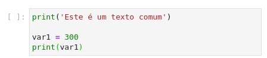

**input()**:

A função `input()` tem o objetivo de pedir ao usuário algum dado para ser manualmente entrado no terminal. Agora siga o exemplo e execute


Note que os dados coletados pela função `input()` são sempre do tipo `string`. Veremos no próximo exemplo como transformar esses dados.

## Parte 6: Transformação de dados

Algumas vezes será necessário converter de um tipo de dado para outro para podemos operar. A função `Input()`, por exemplo, sempre resulta em uma `string`, mas podemos usar outras funções para podermos transformar esse dado em um número. Essas funções são `str()`, `int()` e `float()`. Escreva o código abaixo, execute e veja o que acontece:

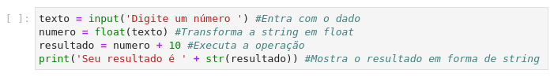

## Parte 7: Atribuição múltipla


# Atividade 4: Para casa

### Exercício 1: Complete a frase

Crie pequeno programa (uma ou mais células) capaz de produzir a seguinte frase:

> "Olá, meu nome é \_\_\_\_\_\_, tenho \_\_\_ anos, e minha idade daqui a 5 anos será \_\_\_."

Tente construir a seguinte frase, utilizando `input()`, `print()` e conversão de dados.

Além disso, utilize o Markdown para desenvolver um pequeno enunciado para o programa.

### Exercício 2: Pergunta teórica

Por que a expressão abaixo causa erro? 

```python
print('Eu saí de casa ' + 10 + ' vezes na semana passada')
```

> **Dica:** Responda esta pergunta utilizando o modo texto (Markdown).

### Exercício 3: Fórmula de báskara

Crie pequeno programa (uma célula) capaz de resolver qualquer equação de segundo:
$$
ax^2+bx+c=0
$$
O usuário deve entrar com os parâmetros $a$, $b$ e $c$. Utilize a função input para capturar os dados de entrada.

> **Dica:**
>
> Para resolver a equação de segundo grau você pode utilizar a fórmula de Baskara:  
>  
> $${x_1,x_2}=\frac{-b\pm\sqrt{\Delta}}{2a}$$
>
> $$\Delta=b^2-4ac$$
> 

Está equação retorna duas soluções, $x_1$ e $x_2$. Você deve usar a função `print()` para imprimir o resultado das variáveis $x_1$ e $x_2$ na tela na tela. 

### Exercício 4: Trocando valores de duas variáveis

Crie uma pequeno programa capaz de trocar o valor entre duas variáveis sem a necessidade de criar uma terceira variável. 

>  **Dica:** Utilize o conceito de atribuição múltipla para fazer a troca das variáveis. 

