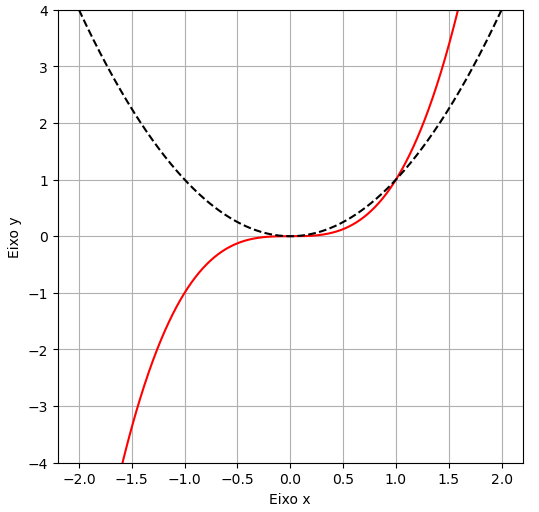
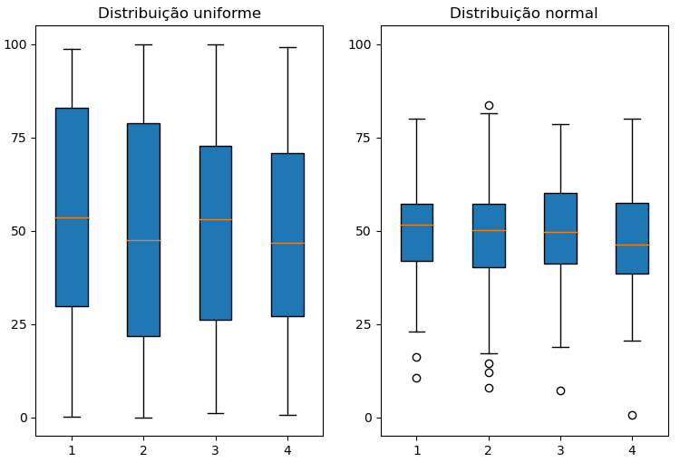

<center><div style="font-size:32px;display:inline-block;line-height:1.1;font-weight:bold;margin:0 0 15px" class="aula-title">Capítulo 10: Numpy e Matplotlib</div></center>

# Atividade 1: Numpy

Numpy é uma **biblioteca de álgebra linear para Python**. É uma das principais bibliotecas utilizadas para na engenharia e matemática. Ela é **extremamente rápida** vistos que seus **principais métodos foram compilados em C**, desta forma é possível trabalhar com uma quantidade de dados gigantescas em um curto espaço de tempo. Numpy tem um **desempenho superior** as **listas** e **tuplas**, visto que o Python é uma linguagem simples para o usuário, mas muito lenta para o computador. Sendo assim, trabalhando com o numpy estamos trabalhando com o melhor dos dois mundos. Além disso, devido a sua popularidade, o Numpy é um dos **blocos de construção de todas as outras bibliotecas de matemática e engenharia, junto com o sympy e o pandas**.

Como o Numpy é uma biblioteca de algebra linear. Pode-se dizer que os **array** de Numpy são essencialmente de duas formas, **vetores** e **matrizes**:

- Vetores são estritamente arrays de 1 dimensão;
- Matrizes são arrays de duas dimensões (Porém, pode-se haver matrizes de 1 linha ou coluna, ou matrizes de 3 ou mais dimensões).

### Exemplo 1: Criação de vetores e matrizes

**Importando a biblioteca:**

A documentação de Numpy recomenda que a importação seja feita da seguinte forma:

> ```python
> import numpy as np #A documentação recomenda utilizar np
> ```

**Primeiro array:**

Inicialmente vamos definir uma lista qualquer, e utilizar o método `array` para converter a lista em um array de Python:

> ```python
> lista = [2,4,6,8,10] #Crio uma lista
> array=np.array(lista) #Uso o método array para converter a minha lista para um array de numpy
> display(array)
> type(array) #Podemos usar o método type e verificar o método 
> ```
>
> array([ 2,  4,  6,  8, 10])   
> numpy.ndarray

**Array de duas dimensões (Matriz):**

Para criar um matriz, ou um array de duas dimensões utilizamos lista de lista.

> ```python
> matriz_identidade=[[1,0,0],[0,1,0],[0,0,1]] #Definindo uma matriz identidade 3x3
> np.array(matriz_identidade) #Convertendo a lista de lista em uma array de duas dimensões
> ```
>
> array([[1, 0, 0],   
>        [0, 1, 0],  
>        [0, 0, 1]])

> **Dica:** É fácil perceber a dimensão de uma matriz através da quantidade de colchetes (Matriz tem dois colchetes e vetor tem apenas um colchete)

### Exemplo 2: Funções de criação de arrays

**Função `arange`:**

Com a função `arange` é possível criar uma sequência de números dentro de um intervalo. Ele tem a seguinte notação:

```python
np.arange(
    inicio,
    fim,
    [passo] # Este último é opcional, o padrão é 1
)
​```
ou:
​```python
np.arange(
    fim
)
```

Quando utilizamos apenas um argumento, o intervalo retornado é $x\in[0,\text{fim})$, com passo 1.

Vamos criar uma sequência de inteiros dentro do intervalo $x\in[0,10)$:

> ```python
> np.arange(0,10)
> ```
>
> array([0, 1, 2, 3, 4, 5, 6, 7, 8, 9])

Ou simplesmente:

> ```python
> np.arange(10)
> ```
>
> array([0, 1, 2, 3, 4, 5, 6, 7, 8, 9])

Observe que o **último elemento** não está incluso.

> **Dica:** Ele é semelhante ao `range()` do Python.

Podemos adicionar ao parâmentro de passo um intervalo de `0.5`:

> ```python
> np.arange(0,10,0.5)
> ```
>
> array([0. , 0.5, 1. , 1.5, 2. , 2.5, 3. , 3.5, 4. , 4.5, 5. , 5.5, 6. , 6.5, 7. , 7.5, 8. , 8.5, 9. , 9.5])

**Função `zeros`:**

O função `zeros` permite criar matriz ou vetores só de zeros. Ela tem a seguinte notação:
```python
np.zeros(
    tamanho, # Para vetor: um número | Para matriz: Tupla com o tamanho da matriz
    dtype=[tipo] #opcional (Padrão é float)
)
```

Por exemplo, podemos criar um vetor de tamanho 3 só de zeros:

> ```python
> vetor_nulo=np.zeros(3) #Definindo um vetor nulo com 3 matrizes
> display(vetor_nulo)
> ```
>
> array([0., 0., 0.])

Ou uma matriz 5x3 de inteiros (5 linhas e 3 colunas) só com elementos nulos usando uma **tupla**:

> ```python
> matriz_nula=np.zeros((5,3),dtype=int)
> display(matriz_nula)
> ```
>
> array([[0, 0, 0],    
>        [0, 0, 0],    
>        [0, 0, 0],    
>        [0, 0, 0],    
>        [0, 0, 0]])

Ou ainda uma matriz 3D de 3x3x3:

> ```python
> matriz_3D_nula=np.zeros((3,3,3))
> display(matriz_3D_nula)
> ```
>
> array([[[0., 0., 0.],   
>         [0., 0., 0.],   
>         [0., 0., 0.]],  
>        [[0., 0., 0.],  
>         [0., 0., 0.],  
>         [0., 0., 0.]],  
>        [[0., 0., 0.],  
>         [0., 0., 0.],  
>         [0., 0., 0.]]])

**Função `ones`**:

A função `ones` é semelhante à função `zeros` , só que ao invés de criar arrays nulos, cria-se arrays preenchidos com 1. Vamos refazer os exemplos anteriores:

- Vetor de tamanho 3:

> ```python
> np.ones(3)
> ```
>
> array([1., 1., 1.])

- Matriz 5x3 de inteiros:

> ```python
> np.ones((3,3,3))
> ```
>
> array([[[1., 1., 1.],   
>         [1., 1., 1.],   
>         [1., 1., 1.]],   
>        [[1., 1., 1.],   
>         [1., 1., 1.],   
>         [1., 1., 1.]],   
>        [[1., 1., 1.],   
>         [1., 1., 1.],   
>         [1., 1., 1.]]])

**Função `empty`:**

A função `empty` cria um array vazio, ou seja, os valores dentro da matriz não são inicializados. Sua sintaxe é parecida com as funções `zeros` e `ones`.


Para exemplificiar veja o exemplo abaixo:

> ```python
> d=np.empty(20)
> d
> ```
>
> array([0. , 0.5, 1. , 1.5, 2. , 2.5, 3. , 3.5, 4. , 4.5, 5. , 5.5, 6. , 6.5, 7. , 7.5, 8. , 8.5, 9. , 9.5])

Observe que a lista foi inicializada com valores "aleatórios". Na verdade estes valores **já estavam na memória**, esse tipo de operação é útil quando queremos **inicializar uma matriz para depois preenche-la** com valores.

**Matriz identidade:**  
Matriz identidade é uma matriz que contêm 1 na sua diagonal principal (Diagonal da direita para esquerda), e zero no restante da matriz. Abaixo a matriz $M$ é uma matriz identidade 3x3:


$$
M=\begin{bmatrix}
1 & 0 & 0 \\
0 & 1 & 0 \\
0 & 0 & 1
\end{bmatrix}
$$


A matriz identidade é sempre quadrada (O número de linhas é igual ao número de coluna).

Para criar uma matriz identidade do tamanho $n\times n$ no numpy utilizamos a função:
```python
eye(n)
```
Vejamos o exemplo abaixo para a criação de uma matriz 3x3:

> ```python
> np.eye(3)
> ```
>
> array([[1., 0., 0.],  
>        [0., 1., 0.],  
>        [0., 0., 1.]])

Considerando valores complexos:

> ```python
> np.eye(3,dtype=complex)
> ```
>
> array([[1.+0.j, 0.+0.j, 0.+0.j],   
>        [0.+0.j, 1.+0.j, 0.+0.j],   
>        [0.+0.j, 0.+0.j, 1.+0.j]])

> **Observação:** Para quem estudou algebra linear, sabe qual a importância da matriz identidade.

**Função `linspace`:**

A função `linspace` é semelhante ao `arange` só que no `arange` você controla o intervalo entre os valores e no `linspace` você controla o **número de pontos**. O método tem a seguinte notação:
```python
x=linspace(
    i, #início
    f, #fim
    [no_de_pontos] # Padrão é 50 pontos (Argumento opcional)
)
```
onde $x\in[i,f]$.

Vejam alguns exemplos:

- Criação de um vetor de 0 a 10 com 50 pontos:

> ```python
> np.linspace(0,10) #Criamos um vetor de 0 a 10 com 50 pontos (50 pontos é o padrão)
> ```
>
> array([ 0.        ,  0.20408163,  0.40816327,  0.6122449 ,  0.81632653,
>         1.02040816,  1.2244898 ,  1.42857143,  1.63265306,  1.83673469,
>         2.04081633,  2.24489796,  2.44897959,  2.65306122,  2.85714286, 3.06122449,  3.26530612,  3.46938776,  3.67346939,  3.87755102, 4.08163265,  4.28571429,  4.48979592,  4.69387755,  4.89795918, 5.10204082,  5.30612245,  5.51020408,  5.71428571,  5.91836735, 6.12244898,  6.32653061,  6.53061224,  6.73469388,  6.93877551, 7.14285714,  7.34693878,  7.55102041,  7.75510204,  7.95918367, 8.16326531,  8.36734694,  8.57142857,  8.7755102 ,  8.97959184, 9.18367347,  9.3877551 ,  9.59183673,  9.79591837, 10.        ])

- Vetor de 0 a 10 com 2 pontos:

> ```python
> np.linspace(0,10,2) #Vetor de 0 a 10 com 2 pontos 
> ```
>
> array([ 0., 10.])

- Vetor de 0 a 10 com 3 pontos

> ```python
> np.linspace(0,10,3) #Vetor de 0 a 10 com 3 pontos 
> ```
>
> array([ 0.,  5., 10.])

### Exemplo 3: Criação de vetores ou matrizes pseudo-aleatórias

O sub-módulo `random` permite trabalhar com números (pseudo)-aleatórios no numpy. 

**Função `rand`:**

Dentro desse sub-módulo tem a fução `rand()`. Esta função permite criar um vetor de 0 a 1 seguindo uma **distribuição uniforme**. Para exemplificar, segue alguns exemplos.

> **Observação:** Na distribuição uniforme todos os números tem igual probabilidade de aparecer.

- Vetor aletório de tamanho 5:

> ```python
> np.random.rand(5)
> ```
>
> array([0.94118875, 0.34111341, 0.80662278, 0.45170693, 0.66366523])

- Matriz aleatória de tamanho 5x3:

> ```python
> np.random.rand(5,3)
> ```
>
> array([[0.60231965, 0.13915405, 0.14062354],   
>        [0.27107605, 0.18510555, 0.21056944],   
>        [0.10201384, 0.28359186, 0.14403438],   
>        [0.30504466, 0.12530748, 0.51605981],  
>        [0.99243939, 0.39609503, 0.9970822 ]])

- Matriz 3D aleatória de tamanho 3x3x3:

> ```python
> np.random.rand(3,3,3)
> ```
>
> array([[[0.77764142, 0.43046879, 0.53158257],  
>         [0.64275742, 0.83375245, 0.95512209],  
>         [0.7829738 , 0.77918175, 0.55932601]],  
>        [[0.41110129, 0.52807456, 0.44260406],  
>         [0.69113728, 0.31073929, 0.4410191 ],  
>         [0.98909848, 0.42453472, 0.05985846]],  
>        [[0.16424895, 0.41459249, 0.82175022],  
>         [0.85997619, 0.81019046, 0.82846896],  
>         [0.0065252 , 0.62029727, 0.15771548]]])

- Criando um vetor aleatório de 0 a 10:

Neste caso basta multiplicar o vetor resultante por 10:

> ```python
> np.random.rand(5)*10
> ```
>
> array([7.83576456, 1.01106823, 1.41474059, 7.40103568, 7.87425518])

**Função `randn`**

A função `randn` é simular à função `rand`, só que ao invés de usar uma distribuição uniforme, utiliza uma distribuição normal. Sua sintaxe é similar à função `rand`. Considerando uma distribuição normal de $X \tilde N(\mu,\sigma^2)$, onde:

- $\mu\rightarrow$ Média da população;
- $\sigma\rightarrow$ Desvio padrão da população.

Podemos encontrar a variável $Z$:

$$
Z=\frac{x-\mu}{\sigma}
$$

onde $Z$ é o valor retornado por `randn` e $x$ é um valor da amostra.

Se quisermos encontrar apenas $Z$, basta utilizar a função `randn`. 

Veja o exemplo abaixo de uma matriz 5x3 de valores de $Z$:

> ```python
> np.random.randn(5,3)
> ```
>
> array([[ 0.1472857 , -0.13911195,  0.77754573],   
>        [ 0.74258769,  0.68650298, -0.11081065],  
>        [-0.11407845,  0.47306611,  1.19310296],  
>        [-0.73273615, -0.75575008, -1.23730874],  
>        [-2.08020549,  0.5424344 , -0.96590237]])

Para encontrar as amostras $x_i$ da população devemos definir o valor da média e do desvio padrão da população, e aplicar a seguinte fórmula:

$$
x=\mu+\sigma\cdot Z
$$

Por exemplo, considere uma distribuição normal com média 5 e desvio padrão 1.5. Vamos criar um vetor com 5 elementos, considerando esta distribuição:

> ```python
> média=5
> desvio_padrão=1.5
> média+desvio_padrão*np.random.randn(5)
> ```
>
> array([7.85996339, 6.19473181, 5.24679766, 6.72999723, 6.6830092 ])

**Função `randint`:**

A função `randint` é simular à função `rand`, só que retorna **números inteiros**. Sua sintáxe é um pouco diferente da função `rand`, e é mostra abaixo:
```python
randint(i, #início
        f, #fim (Intervalo aberto)
        [no_pontos] #número de pontos (opcional)
       )
```
Veja com $x\in[0,100)$ e $100$ amostras:

> ```python
> np.random.randint(0,100,10)
> ```
>
> array([ 3, 90, 63, 58, 27, 61, 64, 78, 11, 10])

**Usando o `rand` para recriar um "`randint`":**

Podemos recriar o método `randint` com a função `rand`. Basta utilizar o método de arrays `round`:

> ```python
> (100*np.random.rand(10)).round(0)
> ```
>
> array([93., 39., 94., 33.,  8., 18., 11., 44., 60., 51.])

Ou ainda:

> ```python
> np.round((100*np.random.rand(10)),0)
> ```
>
> array([76., 69.,  3., 66., 75.,  1., 45., 55., 19., 94.])

A diferença desse método para o `randint` é que a resultante é um **array de float** e o intervalo final é **fechado**.

### Exemplo 4: Métodos e atributos de arrays

**Método `reshape`:**

O método `reshape` permite mudar o formato do array. Desta forma, podemos tranformar vetores em matrizes ou em matrizes 3, e vice-versa. Seus argumentos são similares às funções `zeros` e `ones`.

Para exemplificar, veja o exemplo abaixo:

- Criando um array de 27 elementos:

> ```python
> arr=np.linspace(10,270,27) #Array com 27 elementos
> display(arr)
> ```
>
> array([ 10.,  20.,  30.,  40.,  50.,  60.,  70.,  80.,  90., 100., 110., 120., 130., 140., 150., 160., 170., 180., 190., 200., 210., 220., 230., 240., 250., 260., 270.])

- Transformando o vetor `arr` em uma matrix 3x9:

> ```python
> arr=arr.reshape((3,9))
> arr
> ```
>
> array([[ 10.,  20.,  30.,  40.,  50.,  60.,  70.,  80.,  90.],
>        [100., 110., 120., 130., 140., 150., 160., 170., 180.],
>        [190., 200., 210., 220., 230., 240., 250., 260., 270.]])

- Transformando o vetor `arr` em uma matriz 3x3x3:

> ```python
> arr=arr.reshape((3,3,3))
> arr
> ```
>
> array([[[ 10.,  20.,  30.],  
>         [ 40.,  50.,  60.],  
>         [ 70.,  80.,  90.]],  
>        [[100., 110., 120.],  
>         [130., 140., 150.],  
>         [160., 170., 180.]],  
>        [[190., 200., 210.],  
>         [220., 230., 240.],  
>         [250., 260., 270.]]])

**Método `astype`:**

Converte array de um tipo em outro tipo. Por exemplo, podemos transformar o vetor `arr` em uma matriz 3x3x3 de `complex`:

> ```python
> arr.reshape(3,3,3).astype(complex)
> ```
>
> array([[[ 10.+0.j,  20.+0.j,  30.+0.j],  
>         [ 40.+0.j,  50.+0.j,  60.+0.j],  
>         [ 70.+0.j,  80.+0.j,  90.+0.j]],  
>        [[100.+0.j, 110.+0.j, 120.+0.j],  
>         [130.+0.j, 140.+0.j, 150.+0.j],  
>         [160.+0.j, 170.+0.j, 180.+0.j]],  
>        [[190.+0.j, 200.+0.j, 210.+0.j],  
>         [220.+0.j, 230.+0.j, 240.+0.j],  
>         [250.+0.j, 260.+0.j, 270.+0.j]]])

**Atributo `shape`:**

Enquanto o método executa uma ação de um determinado objeto, o atributo é uma característica de um objeto.

Um dos atributos dos objetos `array` é o `shape`. Ele indica o formato do array. Veja o exemplo para a matriz 3D `arr`:

> ```python
> arr.shape
> ```
>
> (3, 3, 3)

**Atributo `size`:**

O atributo `size` indica a quantidade de elementos do array. Veja o exemplo para `arr`:

> ```python
> arr.size
> ```
>
> 27

**Métodos `max`, `min`, `mean` e `std`:**

Estes métodos retornam o **valor máximo**, **valor mínimo**, **valor médio** e **desvio padrão**, respectivamente.

Veja os exemplos para a matriz 3D `arr`:

> ```python
> arr.max() #Máximo de arr
> ```
>
> 270.0
>
> ```python
> arr.min() #Mínimo de arr
> ```
>
> 10.0
>
> ```python
> arr.mean() #Média do vetor
> ```
>
> 140.0
>
> ```python
> arr.std() #Desvio padrão do vetor
> ```
>
> 77.88880963698615

**Métodos `argmax` e `argmin`:**

Retornam o **índice** na qual o maior ou o menor elemento se encontram:

> ```python
> i=arr.argmax()
> i
> ```
>
> 26

Se quisermos saber o maior elemento a partir do `argmax()`:

> ```python
> print('O valor do índice de maior elemento:',i)
> print('O maior elemento:',arr.reshape(arr.size)[i])
> ```
>
> O valor do índice de maior elemento: 26  
> O maior elemento: 270.0

O `argmin` é similar:

> ```python
> i=arr.argmin()
> print('O valor do índice de menor elemento:',i)
> print('O menor elemento:',arr.reshape(arr.size)[i])
> ```
>
> O valor do índice de menor elemento: 0   
> O menor elemento: 10.0

### Exemplo 5: Indexação e fatiamento de arrays

A indexação e fatiamento de arrays é **similar** às indexação e fatiamento nas variáveis compostas, como **listas**, **tuplas** e **strings**. Para exemplificar vamos utilizar o array abaixo e aplicar algumas operações.

> ```python
> # Criando um array de inteiros com o intervalo 0 a 145 de 5 em 5
> arr = np.arange(0,150,5,dtype=int)
> arr
> ```
>
> array([  0,   5,  10,  15,  20,  25,  30,  35,  40,  45,  50,  55,  60,  65,  70,  75,  80,  85,  90,  95, 100, 105, 110, 115, 120, 125, 130, 135, 140, 145])

- Buscando o último elemento:

> ```python
> arr[-1]
> ```
>
> 145

- Dizendo que os elementos de índice 2 ou maior vale 150:

> ```python
> arr[2:]=150
> arr
> ```
>
> array([  0,   5, 150, 150, 150, 150, 150, 150, 150, 150, 150, 150, 150, 150, 150, 150, 150, 150, 150, 150, 150, 150, 150, 150, 150, 150, 150, 150, 150, 150])

**Trabalhando com matrizes:**

- Transformando o `arr` em uma matriz 6x5:

> ```python
> arr = np.arange(0,150,5,dtype=int).reshape(6,5) #Transformando o arr em uma matriz 6x5
> arr
> ```
>
> array([[  0,   5,  10,  15,  20],  
>        [ 25,  30,  35,  40,  45],  
>        [ 50,  55,  60,  65,  70],  
>        [ 75,  80,  85,  90,  95],  
>        [100, 105, 110, 115, 120],  
>        [125, 130, 135, 140, 145]])

- Selecionando todos os elementos da última linha:

> ```python
> arr[-1,:]
> ```
>
> array([125, 130, 135, 140, 145])

Ou ainda, usando a notação de lista:

> ```python
> arr[-1][:]
> ```
>
> array([125, 130, 135, 140, 145])

Ou ainda:

> ```python
> arr[-1]
> ```
>
> array([125, 130, 135, 140, 145])

- Selecionando todos os elementos a partir da segunda coluna:

> ```python
> arr[:,2:]
> ```
>
> array([[ 10,  15,  20],   
>        [ 35,  40,  45],  
>        [ 60,  65,  70],  
>        [ 85,  90,  95],  
>        [110, 115, 120],  
>        [135, 140, 145]])

**Método `copy`:**

Digamos que queremos criar um subarray de `arr` e atribuir o valor 30 para todos os elementos desse subarray:

> ```python
> arr = np.arange(0,150,5,dtype=int).reshape(6,5) #Transformando o arr em uma matriz 6x5
> arr2=arr[3:][:]
> arr2
> ```
>
> array([[ 75,  80,  85,  90,  95],  
>     [100, 105, 110, 115, 120],  
>     [125, 130, 135, 140, 145]])  
> ```python
> arr2[:]=100
> display(arr2)
> ```
>
> array([[100, 100, 100, 100, 100],  
>     [100, 100, 100, 100, 100],  
>     [100, 100, 100, 100, 100]])
>
> ```python
> display(arr)
> ```
>
> array([[  0,   5,  10,  15,  20],  
>        [ 25,  30,  35,  40,  45],  
>        [ 50,  55,  60,  65,  70],  
>        [100, 100, 100, 100, 100],  
>        [100, 100, 100, 100, 100],  
>        [100, 100, 100, 100, 100]])

Observe que o valor de `arr` foi alterado também. Para corrigir vamos utilizar o método `copy`:

> ```python
> arr = np.arange(0,150,5,dtype=int).reshape(6,5) #Transformando o arr em uma matriz 6x5
> arr2=arr[3:][:].copy()
> arr2[:]=100
> display(arr2)
> ```
>
> array([[100, 100, 100, 100, 100],  
>     [100, 100, 100, 100, 100],  
>     [100, 100, 100, 100, 100]])  
> ```python
> display(arr)
> ```
>
> array([[  0,   5,  10,  15,  20],  
>        [ 25,  30,  35,  40,  45],  
>        [ 50,  55,  60,  65,  70],  
>        [ 75,  80,  85,  90,  95],  
>        [100, 105, 110, 115, 120],  
>        [125, 130, 135, 140, 145]])

Neste caso o método `copy` criou uma cópia do subarray de `arr` em `arr2`, ao invés de passar a referência.

**Seleção ou fatiamento por condicionais:**

Se executarmos o código abaixo, será retornado um array de booleanos:

> ```python
> bol=arr > 50
> ```
>
> array([[False, False, False, False, False],  
>        [False, False, False, False, False],  
>        [False,  True,  True,  True,  True],  
>        [ True,  True,  True,  True,  True],  
>        [ True,  True,  True,  True,  True],  
>        [ True,  True,  True,  True,  True]])

Podemos usar este array para fazer fatiamento de arrays:

> ```python
> arr[bol]
> ```
>
> array([ 55,  60,  65,  70,  75,  80,  85,  90,  95, 100, 105, 110, 115,  120, 125, 130, 135, 140, 145])

Ou ainda modificar valores de um array:

> ```python
> arr[arr>=50]=-1
> arr
> ```
>
> array([[ 0,  5, 10, 15, 20],  
>        [25, 30, 35, 40, 45],  
>        [-1, -1, -1, -1, -1],  
>        [-1, -1, -1, -1, -1],   
>        [-1, -1, -1, -1, -1],  
>        [-1, -1, -1, -1, -1]])

### Exemplo 6: Operação com arrays

Diferente das listas, os arrays nos permite operar de forma muito mais simples.

Primeiro vamos criar um array:

> ```python
> arr = np.arange(0,50,5)
> display(arr)
> ```
>
> array([ 0,  5, 10, 15, 20, 25, 30, 35, 40, 45])

E fazer algumas operações

**Somando arrays:**

> ```python
> # Somando arrays
> arr + arr
> ```
>
> array([ 0, 10, 20, 30, 40, 50, 60, 70, 80, 90])

**Multiplicando arrays:**

> ```python
> #Multiplicação
> arr2=arr*arr
> arr2
> ```
>
> array([   0,   25,  100,  225,  400,  625,  900, 1225, 1600, 2025])

**Subtraindo arrays:**

> ```python
> #Subtraindo arrays
> arr2-arr
> ```
>
> array([   0,   20,   90,  210,  380,  600,  870, 1190, 1560, 1980])

**Divisão de arrays:**

> ```python
> arr/arr
> ```
>
> array([nan,  1.,  1.,  1.,  1.,  1.,  1.,  1.,  1.,  1.])

Observe que o valor inicial foi nan, porque 0/0 é indeterminado. Vamos tentar a divisão por zero:

> ```python
> 1/arr
> ```
>
> array([       inf, 0.2       , 0.1       , 0.06666667, 0.05      ,       0.04      , 0.03333333, 0.02857143, 0.025     , 0.02222222])

Observe que 1/0 é infinito.

**Exponenciação:**

> ```python
> arr**2
> ```
>
> array([   0,   25,  100,  225,  400,  625,  900, 1225, 1600, 2025])

**Somando com uma constante:**

> ```python
> arr+5
> ```
>
> array([ 5, 10, 15, 20, 25, 30, 35, 40, 45, 50])

**Raiz quadrada:**

> ```python
> np.sqrt(arr)
> ```
>
> array([0.        , 2.23606798, 3.16227766, 3.87298335, 4.47213595,       5.        , 5.47722558, 5.91607978, 6.32455532, 6.70820393])

**Funções trigonométricas:**

> ```python
> np.cos(arr)
> ```
>
> array([ 1.        ,  0.28366219, -0.83907153, -0.75968791,  0.40808206,
>         0.99120281,  0.15425145, -0.90369221, -0.66693806,  0.52532199])
>
> ```python
> np.sin(arr)
> ```
>
> array([ 0.        , -0.95892427, -0.54402111,  0.65028784,  0.91294525,
>        -0.13235175, -0.98803162, -0.42818267,  0.74511316,  0.85090352])
>
> ```python
> np.tan(arr)
> ```
>
> array([ 0.        , -3.38051501,  0.64836083, -0.8559934 ,  2.23716094,       -0.13352641, -6.4053312 ,  0.47381472, -1.11721493,  1.61977519])

**Funções inversas trigonométricas:**

> ```python
> cos=np.linspace(0,1,3)
> print('Cosseno:',cos)
> print('Arco cosseno:',np.arccos(cos)*180/np.pi)
> ```
>
> Cosseno: [0.  0.5 1. ]  
> Arco cosseno: [90. 60.  0.]

**Média, mínimo, máxima, soma e desvio padrão:**

Uma outra forma de encontrar os valores mínimo, máximo, soma e média e desvio padrão é através das funções correspondentes:

> ```python
> np.mean(arr) #Média
> ```
>
> 22.5
>
> ```python
> np.max(arr) #Máximo
> ```
>
> 45
>
> ```python
> np.min(arr) #Mínimo
> ```
>
> 0
>
> ```python
> np.sum(arr) #Soma
> ```
>
> 225
>
> ```python
> np.std(arr) #Desvio padrão
> ```
>
> 14.361406616345072

**Outras funções:**

Existem muitas outras funções que estão disponíveis na documentação:

> [https://numpy.org/doc/stable/reference/ufuncs.html](https://numpy.org/doc/stable/reference/ufuncs.html)

#### Tarefa 1: Matriz complexa

Considere uma matriz complexa:
$$
A=
\begin{bmatrix}
  6 + 2j  &  12 + 4j  &  18 + 6j  &  24 + 8j  &  30 + 10j \\
  36 + 12j  &  42 + 14j  &  48 + 16j  &  54 + 18j  &  60 + 20j \\
  66 + 22j  &  72 + 24j  &  78 + 26j  &  84 + 28j  &  90 + 30j \\
  96 + 32j  &  102 + 34j  &  108 + 36j  &  114 + 38j  &  120 + 40j \\
  126 + 42j  &  132 + 44j  &  138 + 46j  &  144 + 48j  &  150 + 50j 
\end{bmatrix}
$$

1. Crie essa matriz utilizando a função `arange` ou `linspace` e o método `reshape`
2. Calcule o conjugado dessa matriz (Veja a documentação)
3. Selecione a segunda coluna desta matriz

**Solução:**

> ```python
> from IPython.display import Markdown as md
> ```
>
> ```python
> A=(np.arange(6,151,6)+1j*np.arange(2,51,2)).reshape(5,5)
> print('1.')
> display(A)
> print('2.')
> display(np.conjugate(A))
> print('3.')
> display(A[:,1])
> ```

### Exemplo 7: Matrizes

As matrizes tem algumas particularidades em relação aos escalares. Desta forma, precisamos de um maior cuidado em relação à operação esses elementos.

**Matriz transposta:**

Para calcular a matriz transposta podemos utilizar o atributo `T`. da matriz.

Primeiramente vamos criar uma matriz:

> ```python
> A=np.arange(6).reshape(3,2)
> display(A)
> ```
>
> array([[0, 1],  
>        [2, 3],  
>        [4, 5]])

Depois podemos calcular a transposta como é mostrado abaixo:

> ```python
> A.T
> ```
>
> array([[0, 2, 4],
>        [1, 3, 5]])

Ou ainda, a função ou o método `transpose`:

> ```python
> # Função transpose
> np.transpose(A)
> ```
>
> array([[0, 2, 4],
>        [1, 3, 5]])
>
> ```python
> # Método transpose
> A.transpose()
> ```
>
> array([[0, 2, 4],
>        [1, 3, 5]])

**Multiplicação de matrizes:**

A multiplicação de matrizes é diferente da multiplicação de escalar. Como o numpy sempre faz as operações termo a termo, para fazer a multiplicação de matrizes devemos utilizar uma função específica para isso, que no caso é a função `dot()`. 

Vamos fazer a seguinte operação $B=A\cdot A^T$:

> ```python
> B=np.dot(A,A.T)
> display(B)
> ```
>
> array([[ 1,  3,  5],
>        [ 3, 13, 23],
>        [ 5, 23, 41]])

**Multiplicação de matrizes (termo a termo):**

Para fazer a multiplicação de matrizes termo a termo, basta multiplicar normalmente:

> ```python
> A*A
> ```
>
> array([[ 0,  1],
>        [ 4,  9],
>        [16, 25]])

**Diagonal principal:**

Para retornar a diagonal principal de uma matriz basta usar a função `diagonal`:

> ```python
> C=np.diagonal(B)
> C
> ```
>
> array([ 1, 13, 41])

**Matriz diagonal:**

Podemos usar a função `diagflat` para criar uma matriz diagonal (Matriz com elementos não nulos na diagonal principal e elementos nulos fora da diagonal principal):

> ```python
> np.diagflat(C)
> ```
>
> array([[ 1,  0,  0],  
>        [ 0, 13,  0],  
>        [ 0,  0, 41]])

> **Observação:** Podemos usar a função `diag()` para encontrar a diagonal principal de uma matriz e para criar matrizes diagonal. Ela é uma função de compatibilidade com MATLAB.

> ```python
> np.diag(B)
> ```
>
> array([ 1, 13, 41])
>
> ```python
> np.diag(np.diag(B))
> ```
>
> array([[ 1,  0,  0],  
>        [ 0, 13,  0],  
>        [ 0,  0, 41]])

**Diagonal secundária:**

Para obter a diagonal secundária devemos "girar" da esquerda para a direta a matriz usando a função `fliplr()`. Primeiramente vamos repetir a matriz B:

> ```python
> B
> ```
>
> array([[ 1,  3,  5],  
>        [ 3, 13, 23],  
>        [ 5, 23, 41]])

Depois vamos "girar" a matriz B utilizando `fliplr`:

> ```python
> np.fliplr(B)
> ```
>
> array([[ 5,  3,  1],  
>        [23, 13,  3],  
>        [41, 23,  5]])

Para calcular a sua diagonal secundária, logo em seguida:

> ```python
> np.diagonal(np.fliplr(B))
> ```
>
> array([ 5, 13,  5])

**Matriz inversa:**

Para determinar a matriz inversa podemos utilizar o submódulo de algebra linear, o `linalg`. Dentro desse sub-módulo existe a função `ìnv` que calcula a inversa do vetor.

Por exemplo, considere uma matriz:
$$
D=
\begin{bmatrix}
1 & 2 \\
3 & 4
\end{bmatrix}
$$

> ```python
> D=np.array([[1,2],[3,4]])
> ```

E queremos calcular a matriz inversa de $D$:

> ```python
> np.linalg.inv(D)
> ```
>
> array([[-2. ,  1. ],  
>        [ 1.5, -0.5]])

**Determinante:**

Para calcular o determinante podemos recorer a função `det` do submódulo `linalg`. Podemos calcular o determinante de $D$:

> ```python
> np.linalg.det(D)
> ```
>
> -2.0000000000000004

**Outras operações com matrizes:**

O Numpy têm várias funções prontas para o cálculo de problemas de algebra linear. Todas as funções pode ser encontrado na documentação:

> [https://numpy.org/doc/stable/reference/routines.linalg.html](https://numpy.org/doc/stable/reference/routines.linalg.html)

#### Tarefa 2: Sistema linear

Considere um sistema linear com as seguintes equações:

$$
\begin{cases}
2x+y+3z=4\\
x-y+5z=3\\
3x+y-2z=1
\end{cases}
$$

Para resolver este sistema linear podemos escrevê-lo na forma matricial:

$$
A\cdot W=B
$$

onde:

$$
A=\begin{bmatrix}
2 & 1 & 3\\
1 & -1 & 5\\
3 & 1 & -2
\end{bmatrix}
$$

$$
W=\begin{bmatrix}
x \\ y \\ z 
\end{bmatrix}
$$

$$
B=\begin{bmatrix}
4 \\ 3 \\ 1
\end{bmatrix}
$$

A solução deste sistema linear é:
$$
W=A^{-1}\cdot B
$$

Responda utilizando o numpy:

1. Calcule o determinante de A
2. Calcule a inversa de A
3. Resolva este sistema linear utizando a definição acima.
4. Resolva este sistema linear utilizando a função `solve` do submódulos

**Solução:**

> ```python
> #Definindo as matrizes
> A=np.array([[2,1,3],[1,-1,5],[3,1,-2]])
> display(A)
> B=np.array([4,3,1]).reshape(3,1)
> display(B)
> ```

1. Determinante

> ```python
> DetA=np.linalg.det(A)
> display(DetA)
> ```

2. Inversa

> ```python
> InvA=np.linalg.inv(A)
> display(InvA)
> ```

3. Resolução do sistema linear

> ```python
> from IPython.display import Markdown as md
> ```
>
> ```python
> W=np.dot(InvA,B)
> md(fr"""
> A solução da equação é:
> \begin{{cases}}
>     x={float(W[0])}\\
>     y={float(W[1])}\\
>     z={float(W[2])}
> \end{{cases}}
> """)
> ```

4. Resolva este sistema linear utilizando a função `solve` do submódulos

> ```python
> W=np.linalg.solve(A,B)
> md(fr"""
> A solução da equação é:
> \begin{{cases}}
>     x={float(W[0])}\\
>     y={float(W[1])}\\
>     z={float(W[2])}
> \end{{cases}}
> """)
> ```

### Exemplo 8: Concatenação de arrays

A concatenação de arrays pode ser feita através da função `concatenate` que tem a seguinte notação:
```python
concatenate(
    tupla_com_os_arrays,
    [axis] #Eixo opcional
    )
```
Vamos criar dois arrays a e b:

> ```python
> a = np.arange(6).reshape(3,2)
> b = (np.ones(6)).reshape(3,2)
> ```

Eixo 0 concatena nas colunas:

> ```python
> np.concatenate((a,b),axis=0) # Eixo 0 concatena nas colunas
> ```
>
> array([[0., 1.],   
>        [2., 3.],   
>        [4., 5.],   
>        [1., 1.],   
>        [1., 1.],   
>        [1., 1.]])

Eixo 1 concatena nas linhas:

> ```python
> np.concatenate((a,b),axis=1) #Eixo 1 concatena nas linhas
> ```
>
> array([[0., 1., 1., 1.],
>        [2., 3., 1., 1.],
>        [4., 5., 1., 1.]])

### Exemplo 9: Perfomance do Numpy

Vimos que na teoria o `numpy` é muito mais eficiente que trabalhar com lista. Vamos comparar na prática, comparando o método `range()` para criar listas e o método `arange()` para criar arrays. 

**Memória do `numpy` vs `list`:**

> ```python
> #importando o módulo system para medir o tamanho da lista
> import sys
> ```
>
> ```python
> Lista=list(range(1000)) #Declarando uma tupla de 0 a 999
> Numpy_Array=np.arange(1000) #Declarando um numpy array de 0 a 999
> print('Tamanho de cada elemento da lista em bytes:',sys.getsizeof(Lista))
> print('Tamanho total da lista em bytes:',sys.getsizeof(Lista)*len(Lista))
> print('Tamanho de cada elemento do numpy array em bytes:',Numpy_Array.itemsize)
> print('Tamanho total do numpy array em bytes:',Numpy_Array.itemsize*Numpy_Array.size)
> ```
>
> Tamanho de cada elemento da lista em bytes: 8056  
> Tamanho total da lista em bytes: 8056000  
> Tamanho de cada elemento do numpy array em bytes: 8  
> Tamanho total do numpy array em bytes: 8000

**Velocidade de execução das operações:**

No nosso segundo teste de desempenho vamos comparar a operação de $x^2$, onde $x$ pertence a um vetor de 1 milhão de elementos. Para medir o tempo de execução iremos utilizar o módulo `time`.

> ```python
> import time #importando o módulo time
> ```

Criando a lista e o array:

> ```python
> lista = list(range(1000000))  #Criando uma lista de 1 milhão de elementos
> array = np.arange(1000000) #Criando um array de 1 milhão de elementos
> # Fazendo calculando o valor quadrado da lista e do array
> 
> arrayQuadrado = array**2
> ```

Medindo o  tempo da operação em uma lista:

> ```python
> for i in range(10):
>     Tempo_inicial = time.time()  #Iniciando o contador
>     listaQuadrado = [i**2 for i in lista]
>     Tempo_gasto=time.time()-Tempo_inicial
>     print(i,'- O tempo gasto foi:',Tempo_gasto*1000,'ms')
> ```
>
> 0 - O tempo gasto foi: 177.23417282104492 ms  
> 1 - O tempo gasto foi: 181.779146194458 ms  
> 2 - O tempo gasto foi: 193.6969757080078 ms  
> 3 - O tempo gasto foi: 186.5365505218506 ms  
> 4 - O tempo gasto foi: 177.30140686035156 ms  
> 5 - O tempo gasto foi: 179.00490760803223 ms  
> 6 - O tempo gasto foi: 185.7607364654541 ms  
> 7 - O tempo gasto foi: 180.2222728729248 ms  
> 8 - O tempo gasto foi: 185.9571933746338 ms  
> 9 - O tempo gasto foi: 177.34956741333008 ms

Medindo o tempo da operação em um numpy array:

> ```python
> for i in range(10):
>     Tempo_inicial = time.time()  #Iniciando o contador
>     listaQuadrado = array**2
>     Tempo_gasto=time.time()-Tempo_inicial
>     print(i,'- O tempo gasto foi:',Tempo_gasto*1000,'ms')
> ```
>
> 0 - O tempo gasto foi: 7.731437683105469 ms  
> 1 - O tempo gasto foi: 1.1243820190429688 ms  
> 2 - O tempo gasto foi: 0.8718967437744141 ms   
> 3 - O tempo gasto foi: 0.7486343383789062 ms   
> 4 - O tempo gasto foi: 0.7238388061523438 ms  
> 5 - O tempo gasto foi: 0.7958412170410156 ms  
> 6 - O tempo gasto foi: 0.7092952728271484 ms  
> 7 - O tempo gasto foi: 0.7219314575195312 ms  
> 8 - O tempo gasto foi: 0.6957054138183594 ms  
> 9 - O tempo gasto foi: 0.7140636444091797 ms

# Atividade 2: Matplotlib

Matplolib é uma biblioteca de criação de gráficos mais popular do Python. De uma forma geral, as outras bibliotecas são derivadas da biblioteca Numpy. Podemos dizer que ela biblioteca mãe de todas as outras funções e/ou bibliotecas de visualização dados. Além disso Matplotlib é muito poderoso, pois **ela dá controle sob todos os aspectos da figura** e foi projetada para ser **semelhante ao MATLAB**. 

A documentação do Matplotlib pode ser acessada abaixo:

> [https://matplotlib.org/](https://matplotlib.org/)

Dentro da documentação é possível ver uma aba de exemplos (Gallery):

> [https://matplotlib.org/gallery/index.html](https://matplotlib.org/gallery/index.html)

Nesta página é possível ver tudo que é possível fazer com essa biblioteca. Com uma série de gráficos e funcionalidades diferentes.

### Exemplo 1: Primeiro gráfico

No `matplotlib` quase sempre utilizamos o sub-módulo `pyplot`, desta forma podemos importar essa subclasse como mostrado abaixo, geralmente apelidamos este sub-módulo como `plt`:

> ```python
> import matplotlib.pyplot as plt
> ```

A principal função de plotagem é a função `plot`, ela tem a seguinte notação:
```python
plot(x, #Array com os valores do eixo x
     y #Array com os valores do eixo y
```
É importante frisar que esta notação do `plot` é semelhante à **plotagem paramétrica**.

Caso queiramos plotar apenas a informação do `y` podemos usar a seguinte notação:

```python
plot(y #Array com os valores do eixo y
)
```
Nesse caso o espaçamento entre os pontos de y será 1.

Para exemplificar o nosso primeiro gráfico vamos plotar uma onda:

$$
f(t)=4\cos(4\pi\cdot t)
$$

> ```python
> t=np.linspace(0,4,1000) #Criando um vetor de tempo com 1000 pontos
> plt.plot(t, #Primeiro argumento é o x
>          4*np.cos(4*np.pi*t), #Segundo argumento é o y
>         );
> ```
>
> 

Podemos customizar o nosso gráfico através das seguintes funções:

- `xlabel(str)` $\rightarrow$ Título do eixo x
- `ylabel(str)` $\rightarrow$ Título do eixo y
- `grid(bool)` $\rightarrow$ Linhas (grid)
- `title(str)` $\rightarrow$ Título do gráfico
- `xlim(min,max)` $\rightarrow$ Limites do eixo x
- `ylim(min,max)` $\rightarrow$ Limites do eixo y
- `yticks(array)`$\rightarrow$ Indicadores do eixo y
- `xticks(array)` $\rightarrow$ Indicadores do eixo x

> ```python
> plt.plot(t,4*np.cos(4*np.pi*t)); #Ploto o gráfico de cor vermelha
> plt.xlabel('Tempo (s)'); #Adiciono o título do eixo x como 'Tempo (s)'
> plt.ylabel('Amplitude'); #Adiciono o título do eixo y como 'Amplitude'
> plt.grid(True); #Coloco uma grid no gráfico
> plt.title('Gráfico de uma onda'); #Adiciono um título ao gráfico
> plt.xlim(0,4); #Digo que os limites de tempo (Eixo x) do gráfico é de [0,4]
> plt.ylim(-5,5); #Digo que os limites de tempo (Eixo y) do gráfico é de [-5,5]
> plt.xticks(np.arange(5)); #Digo onde estarão os indicadores do eixo x
> plt.yticks(np.arange(-5,6,1)); #Digo onde estarão os indicadores do eixo y
> ```
>
> 

### Exemplo 2: Customização e plotagem de múltiplos gráficos

Neste segundo exemplo vamos aprender a plotar mais de um gráfico na mesma figura e customizar a linha de cada gráfico. Para isso vamos utilizar as seguintes equações:


$$
\begin{cases}
    y_1(t)=t\\
    y_2(t)=t^{1.25}\\
    y_3(t)=t^{1.5}\\
    y_4(t)=t^{1.75}\\
    y_5(t)=t^{2}
\end{cases}
$$


**Plotando múltiplos gráficos:**

Para plotar mais de um gráfico na mesma figura é muito simples, basta escrever outro gráfico depois do outro. 

Primeiramente vamos criar o vetor do eixo x:

> ```python
> t=np.linspace(0,1,10) #Criando um vetor de 0 a 1 com 10 pontos
> ```

Depois plotamos os gráficos:

> ```python
> # Plot
> plt.plot(t,t);
> plt.plot(t,t**1.25);
> plt.plot(t,t**1.5);
> plt.plot(t,t**1.75);
> plt.plot(t,t**2);
> ```
>
> 

Observe que o próprio `matplotlib` definiu cores diferentes para cada gráfico. Assim fica fácil identificá-los. Entretanto podemos customizá-los.

**Customização dos gráficos:**

O terceiro parâmetro da função plot é o parâmetro de abreviação de estilo da linha do gráfico. Nele podemos alterar os seguintes aspectos:

- cor (**`color`**) $\rightarrow$ Pode ser o nome da cor ou o nome simplificado (Padrão: azul)
- estilo da linha (**`linestyle`**) $\rightarrow$ Pode ser linha sólida, pontos, tracejado, etc (Padrão: linha sólida)
- Marcador (**`markers`**) $\rightarrow$  São 'pontos' ou marcadores em cada ponto real do gráfico.

O parâmetro deve ser escrito na forma de string seguindo a seguinte ordem `cor+estilo+marcação`.

Abaixo segue as abreviações de algumas cores disponíveis:

| Abreviação |   Cor    | Nome completo |
| :--------: | :------: | :-----------: |
|    `r`     | Vermelho |     `red`     |
|    `g`     |  Verde   |    `green`    |
|    `b`     |   Azul   |    `blue`     |
|    `k`     |  Preto   |    `black`    |
|    `y`     | Amarelo  |   `yellow`    |
|    `m`     | Magenta  |   `magenta`   |
|    `c`     |  Ciano   |    `cyan`     |
|    `w`     |  Branco  |    `ẁhite`    |

Além dessas, existem outras cores nomeadas que podem ser encontradas na documentação:

> [https://matplotlib.org/3.1.0/gallery/color/named_colors.html](https://matplotlib.org/3.1.0/gallery/color/named_colors.html)

O estilo da linha também tem abreviações, que são apresentados abaixo:

| Abreviação |   Estilo de linha   | Nome completo |
| :--------: | :-----------------: | :-----------: |
|    `-`     |    Linha sólida     |    `solid`    |
|    `--`    |      Trecejado      |   `dashed`    |
|    `-.`    | Tracejado com ponto |   `dashdot`   |
|    `:`     |      Ponteado       |   `dotted`    |

Por fim, como a lista de marcadores são muito grande, é interessante olhar a documentação para mais detalhes.

> [https://matplotlib.org/api/markers_api.html](https://matplotlib.org/api/markers_api.html)

No exemplo abaixo temos alguns estilos possíveis:

> ```python
> t=np.linspace(0,1,10)
> 
> # Cor ou estilo ou marcador (Os parâmetros ausentes terão os valores padrão)
> 
> plt.plot(t,t+1.75,'g'); #Apenas cor
> plt.plot(t,t+1.5,':'); #Apenas estilo
> plt.plot(t,t+1.25,'.'); #Apenas marcador
> 
> #Cor + estilo:
> plt.plot(t,t+1,'k-.'); #Cor preta com tracejados e pontos
> 
> #Cor + marcador
> plt.plot(t,t+0.75,'y*'); #Cor magenta com marcador de *
> 
> #Cor + estilo + marcador
> plt.plot(t,t+0.5,'r--o'); #Cor vermelha com tracejados e marcador de bola
> 
> #Cor sem abreviação
> plt.plot(t,t+0.25,'lightsalmon'); #Colocando uma cor diferente das abreviadas
> 
> #Customizando cada parâmetro seperadamente utilizando os nomes dos parâmetros correspondentes
> plt.plot(t,t,color='tab:cyan',linestyle='--',marker='s');
> ```
>
> 

#### Tarefa 3: Customização avançada

Crie dois gráficos sobrepostos de uma equação de terceiro grau:
$$
y(t)=x^3
$$

com $t\in[-2,2]$ e 10 pontos.

Utilizando os seguintes parâmetros de linha para o primeiro gráfico:

 - `linestyle` $\rightarrow$ Tracejado
 - `marker` $\rightarrow$ `+`
 - `color` $\rightarrow$ Preto

E os seguintes parâmetros para o segundo gráfico:

- `linewidth` (Largura da linha) $\rightarrow$ 20
- `alpha` (Tranparência) $\rightarrow$ 0.5

**Solução:**

> ```python
> t=np.linspace(-2,2,10)
> 
> plt.plot(t,t**2,color='k',linestyle='--',marker='+')
> plt.plot(t,t**2,color='#e69900',linewidth=20,alpha=0.5);
> ```

### Exemplo 3: Sub-gráficos (Subplot)
Dentro de uma mesma figura é possível criar mais de um "plot", para isso vamos recorrer a função `subplot`. A função subplot tem a seguinte notação:

```python
subplot(
    nrows, #Número de linhas que será dividida a figura
    ncols, #Número de coluna que será dividida a figura
    index #Posição da do subplot
)
```
Para ficar mais claro vamos tentar plotar o exemplo anterior em gráficos diferentes.

> ```python
> t=np.linspace(0,1,10)
> 
> #Subplot 1 - Cor ou estilo ou marcador
> plt.subplot(
>     3, #Irei dividir a minha figura em 3 linhas
>     2, # 2 colunas
>     1 # Esse será o primeiro subplot
> ) 
> 
> plt.plot(t,t+1.75,'g'); #Apenas cor
> plt.plot(t,t+1.5,':'); #Apenas estilo
> plt.plot(t,t+1.25,'.'); #Apenas marcador
> 
> #Subplot 2 - Cor + estilo
> plt.subplot(3,2,2) #Nomear os parâmetros é opcional
> plt.plot(t,t+1,'k-.');
> 
> #Subplot 3 - Cor + marcador
> plt.subplot(3,2,3)
> plt.plot(t,t+0.75,'y*');
> 
> #Subplot 4 - Cor + estilo + marcador
> plt.subplot(3,2,4)
> plt.plot(t,t+0.5,'r--o'); #Cor vermelha com tracejados e marcador de bola
> 
> #Subplot 5 - Cor + abreviação
> plt.subplot(3,2,5)
> plt.plot(t,t+0.25,'lightsalmon'); #Colocando uma cor diferente das abreviadas
> 
> #Subplot 6 - Configurando os parâmetros separadamente
> plt.subplot(3,2,6)
> plt.plot(t,t,color='tab:cyan',linestyle='--',marker='s');
> # O parâmetro color suportar cores hexadecimais
> ```
>
> 

Em cada subplot pode ser feito **customizações de forma isolada**, por exemplo, podemos adicionar um título no primeiro subplot e utilizar a **função tight_layout() para cuidar das sobreposições**:

> ```python
> t=np.linspace(0,1,10)
> 
> #Subplot 1 - Cor ou estilo ou marcador
> plt.subplot(
>     3, #Irei dividir a minha figura em 3 linhas
>     2, # 2 colunas
>     1 # Esse será o primeiro subplot
> ) 
> 
> plt.plot(t,t+1.75,'g'); #Apenas cor
> plt.plot(t,t+1.5,':'); #Apenas estilo
> plt.plot(t,t+1.25,'.'); #Apenas marcador
> plt.title('Primeiro subplot')
> 
> #Subplot 2 - Cor + estilo
> plt.subplot(3,2,2) #Este será o segundo subplot
> plt.plot(t,t+1,'k-.');
> 
> #Subplot 3 - Cor + marcador
> plt.subplot(3,2,3)
> plt.plot(t,t+0.75,'y*');
> 
> #Subplot 4 - Cor + estilo + marcador
> plt.subplot(3,2,4)
> plt.plot(t,t+0.5,'r--o'); #Cor vermelha com tracejados e marcador de bola
> 
> #Subplot 5 - Cor + abreviação
> plt.subplot(3,2,5)
> plt.plot(t,t+0.25,'lightsalmon'); #Colocando uma cor diferente das abreviadas
> 
> #Subplot 6 - Configurando os parâmetros separadamente
> plt.subplot(3,2,6)
> plt.plot(t,t,color='tab:cyan',linestyle='--',marker='s');
> 
> #Usando o método tight_layout para cuidar das sobreposições
> plt.tight_layout()
> ```
>
> 

### Exemplo 4: Abordagem orientada a objeto

A forma que a vimos até o momento é a forma mais rápida de criação de gráficos, nela utilizamos **funções** para a criação e customização dos gráficos, porém ela **não dá controle completo sobre todos os elementos** das imagens. Uma forma utilizada na criação de gráfico é através da **abordagem orientada a objeto**, que será **exemplificada nesse exemplo**.


**Figura:**

Figura é nada mais nada menos que "uma caixa" onde os gráficos e/ou desenho são plotados em figuras. 

Para criar uma **figura vazia** basta utilizamos a **função `figure()`**. Nesta função temos interesse em dois parâmetros:

```python
figure(figsize, #Controla o tamanho da figura figsize=(largura,altura)
       dpi #"Qualidade" da figura
      )
```

Então vamos criar a figura:

> ```python
> fig = plt.figure(figsize=(6,6),dpi=100); #Criação de uma figura vazia de tamanho 6 x 6 com 100 dpi
> ```
> \<Figure size 600x600 with 0 Axes\>

Observe que a figura vazia não tem nenhum eixo.

**Eixo:**

Eixo é nada mais nada menos que um **retângulo** no qual fica inserido o gráfico.


Podemos adicionar este eixo através do método `add_axes`. O método `add_axes` recebe um retângulo com 4 argumentos:
```python
fig.add_axes([esquerda,direita,largura,altura])
```
onde:

- margem esquerda $\rightarrow$ posicionamento em relação à esquerda da figura (Normalizado)
- margem inferior $\rightarrow$ posicionamento em relação ao inferior da figura (Normalizado)
- largura $\rightarrow$ largura do retângulo (Normalizado)
- altura $\rightarrow$ altura do retângulo (Normalizado)

> ```python
> fig = plt.figure(figsize=(6,6),dpi=100); #Criação do objeto fig da classe Figure
> ax1 = fig.add_axes([
>     0.05, #5% de margem esquerda
>     0.05, #5% de margem direita
>     0.9, #90% de largura
>     0.8  #80% de altura
> ])
> ```
>
> 

**Criando o gráfico:**

Neste exemplo vamos criar um limaçon cuja a fórmula é apresentada abaixo:

$$
h(\theta)=\begin{cases}
	x(\theta)=r(\theta)\cdot \cos(\theta)\\
	y(\theta)=r(\theta)\cdot \sin(\theta)
\end{cases}
$$

onde:

$$
r(\theta)=a+b\cos(\theta)
$$

No nosso exemplo iremos utilizar $a=1$ e $b=1.05$.

> ```python
> theta=np.linspace(0,2*np.pi,10000) #Criando o vetor theta
> 
> #Definindo o valor de p
> r=1+1.05*np.cos(theta)
> 
> #Definindo os valores de x e y
> 
> x=r*np.cos(theta)
> y=r*np.sin(theta)
> 
> fig = plt.figure(figsize=(6,6),dpi=100); #Criando a figura
> ax_maior = fig.add_axes([0.05,0.05,0.9,0.8]); #Criando o primeiro eixo
> 
> #Plotando o gráfico
> ax_maior.plot(x,y);
> 
> #Customização do eixo
> ax_maior.axis('equal') #Selecionando o aspecto do eixo para igual
> ax_maior.set_title('Visão geral'); #Adiciona título ao gráfico
> 
> #Adicionando o segundo eixo (Detalhe)
> ax_menor = fig.add_axes([0.35,0.3,0.3,0.3]); 
> ax_menor.plot(x,y); 
> 
> #Geralmente os métodos de axis são parecidos com as funções apresentadas anteriormente
> ax_menor.set_yticks([0]); #Modificando 
> ax_menor.set_xticks([0]);
> ax_menor.set_xlim(-0.1,0.1);
> ax_menor.set_ylim(-0.1,0.1);
> ax_menor.set_title('Detalhe');
> ax_menor.grid(True);
> 
> #Removendo as labels dos ticks de x e y
> ax_menor.set_xticklabels(''); 
> ax_menor.set_yticklabels('');
> ```
>
> 

#### Tarefa 4: Abordagem orientada à objeto

Refaça o Exemplo 1 utilizando a abordagem orientada à objeto. Considere:

- Uma figura de tamanho 6x3 e 100 dpi;
- Eixo com margem de $10\%$ e altura/largura de $90\%$ da figura;
- O Gráfico deve ser vermelho e tracejado.

**Solução:**

> ```python
> #Defino o vetor de tempo
> t=np.linspace(0,10,1000);
> 
> #Crio a figura
> fig=plt.figure(figsize=[6,3],dpi=100);
> 
> #Crio o eixo
> ax=fig.add_axes([0.1,0.1,0.9,0.9]);
> 
> ax.plot(t,4*np.cos(4*np.pi*t),'r--');
> ax.set_xlabel('Tempo (s)');
> ax.set_ylabel('Amplitude');
> ax.grid(True);
> ax.set_title('Gráfico de uma onda');
> ax.set_xlim(0,4);
> ax.set_ylim(-5,5);
> ax.set_xticks(np.arange(5));
> ax.set_yticks(np.arange(-5,6,1));
> ```

### Exemplo 5: Subplots

No exemplo anterior aprendemos a criar um gráfico através da abordagem orientada a objeto. Para isso, precisamos criar uma figura e um eixo. A função `subplots` cria a figura e cria o eixo, facilitando a criação da imagem. Alguns argumentos do `subplots` é apresentado abaixo:

```python
subplots(
    figsize, # Tamanho da figura
    dpi, # 'dots per inches' da figura
    nrows, #Número de linhas que minha figura será dividida
    ncols #Número de colunas que minha figura será dividida
)
```

Para exemplificar a função subplots iremos fazer um exemplo bem simples:

> ```python
> fig, ax = plt.subplots(figsize=(6,6),dpi=100) #Invocando a função subplots que retorna a figura e o eixo
> 
> x = np.linspace(-2,2,1000);
> 
> ax.plot(x,x**3,'r-');
> ax.plot(x,x**2,'k--')
> ax.set_xlabel('Eixo x');
> ax.set_ylabel('Eixo y');
> ax.set_ylim(-4,4);
> ax.grid(True);
> ```
>
> 

### Exemplo 6: Adicionando legenda

Para adicionar legenda podemos utilizar o método `legend`, para isso devemos adicionar ao método `plot` o argumento `label`:

> ```python
> fig, ax = plt.subplots(figsize=(6,6),dpi=100)
> 
> x = np.linspace(-2,2,1000);
> 
> #Adicionando as labels (Nomes) dos gráficos
> ax.plot(x,x**3,'r-',label='Função cúbica');
> ax.plot(x,x**2,'k--',label='Função quadrática')
> 
> ax.set_xlabel('Eixo x');
> ax.set_ylabel('Eixo y');
> ax.set_ylim(-4,4);
> ax.grid(True);
> 
> ax.legend(); #Imprimindo a legenda
> ```
>
> 

> **Observação:** Existe a função `plt.legend()` que permite a criação de legendas utilizando a abordagem funcional.

#### Tarefa 5: Argumento `loc`

Utilize o argumento `loc` no método `legend` para mudar a posição da legenda para o canto inferior esquerdo.

**Solução:**

> ```python
> fig, ax = plt.subplots(figsize=(6,6),dpi=100)
> 
> x = np.linspace(-2,2,1000);
> 
> #Adicionando as labels (Nomes) dos gráficos
> ax.plot(x,x**3,'r-',label='Função cúbica');
> ax.plot(x,x**2,'k--',label='Função quadrática')
> 
> ax.set_xlabel('Eixo x');
> ax.set_ylabel('Eixo y');
> ax.set_ylim(-4,4);
> ax.grid(True);
> 
> ax.legend(loc=3); #Imprimindo a legenda
> ```

#### Tarefa 6: Função `legend()`

Refaça a Tarefa 5 utilizando a abordagem funcional e utilize a função `plt.savefig('tarefa6.png',dpi=300)` para salvar a sua figura.

**Solução:**

> ```python
> plt.figure(figsize=(6,6),dpi=100) #Criando a figura
> 
> plt.plot(x,x**3,'r-',label='Função cúbica');
> plt.plot(x,x**2,'k--',label='Função quadrática')
> 
> plt.xlabel('Eixo x');
> plt.ylabel('Eixo y');
> plt.ylim(-4,4);
> plt.grid(True);
> 
> plt.legend(loc=3); #Imprimindo a legenda
> plt.savefig('tarefa6.png',dpi=300)
> ```

### Exemplo 7: Sub-gráficos (Subplots)

Podemos criar sub-gráficos através dos argumentos `nrow` e `ncols`. Neste caso a função irá retornar uma **array de eixos**.

Vamos plotar os mesmos gráficos em sub-figuras separadas:

> ```python
> fig, axs = plt.subplots(figsize=(9,6),dpi=100,nrows=1,ncols=2)
> 
> #display(axs)
> 
> x = np.linspace(-2,2,1000);
> 
> axs[0].plot(x,x**3,'r-');
> axs[1].plot(x,x**2,'k--');
> 
> Titulos=['cúbica','quadrática']
> 
> #Como ax é um array de eixos, podemos iterar no array
> for i, ax in enumerate(axs):
>     ax.set_xlabel('Eixo x');
>     ax.set_ylabel('Eixo y');
>     ax.set_ylim(-4,4);
>     ax.grid(True);
>     
>     #Adicione o título no final
>     ax.set_title(f'Função {Titulos[i]}')
> ```
>
> 

### Exemplo 9: Gráficos estatísticos

Existem muitos tipos de plotagem que podemos criar com o Matplotlib. Em relação aos gráficos estatísticos podemos considerar alguns exemplos:

- `hist()` $\rightarrow$ Histogramas
- `scatter()` $\rightarrow$ Gráficos de dispersão
- `boxplot()` $\rightarrow$ Diagrama de extremos e quartis

**Gráficos de dispersão:**

> [Documentação](https://matplotlib.org/3.3.3/api/_as_gen/matplotlib.pyplot.scatter.html)

Para exemplificar o uso de dispersão vamos comparar duas amostras:

- Amostra 1 $\rightarrow$ Distribuição uniforme (Usa `np.random.rand()`);
- Amostra 2 $\rightarrow$ Distribuição normal (Usa `np.random.randn()`) com média 50 e desvio padrão 10.

Vamos criar as amostras:

> ```python
> np.random.seed(200) #Selecionando um seed para reprodubilidade
> 
> qtd=100 #Tamanho das populações
> 
> # Amostra 1:
> a1=np.random.rand(4,qtd)*100
> 
> 
> # Amostra 2:
> desvio_padrão=15
> média=50
> 
> a2=média+desvio_padrão*np.random.randn(4,qtd);
> 
> #Concatenando as duas amostras em uma matriz 3D
> a=np.concatenate((a1,a2),axis=0).reshape(2,4,qtd)
> ```

Plotando os gráficos:

> ```python
> fig, axs = plt.subplots(nrows=1,ncols=2,figsize=(9,6),dpi=100)
> 
> distribuição=['uniforme','normal']
> marcador='so'
> 
> for i, ax in enumerate(axs):
>     p=ax.scatter(a[i,0,:], #Valor de x
>                a[i,1,:], #Valor de y
>                c=a[i,2,:], #Cor
>                s=a[i,3,:], #Área
>                alpha=0.5, #Alfa
>                vmin=0, #limite inferior das cores
>                vmax=100, #limite superior das cores
>                marker=marcador[i]
>               )
>     ax.set_xlim([-5,105])
>     ax.set_ylim([-5,105])
>     ax.set_title(f'Distribuição {distribuição[i]}')
>     
> #Adicionando uma colorbar
> fig.colorbar(p, #Gráfico
>              ax=axs, #Lista de eixos que a colorbar vai plotar
>              orientation='horizontal' #Orientação fraction=0.05
>              );
> ```
>
> 

**Histogramas**

> [Documentação](https://matplotlib.org/3.3.3/api/_as_gen/matplotlib.pyplot.hist.html)

Vamos analisar nossas duas amostras utilizando o método `hist()`.

> ```python
> fig, axs = plt.subplots(nrows=1,ncols=2,figsize=(9,6),dpi=100)
> 
> cores='gr'
> 
> for i, ax in enumerate(axs):
>     #Transforma o array de 4x100 em 400x1
>     amostras=a[i,:,:].reshape(a[i,:,:].size,1);
>     
>     ax.hist(amostras, #Amostras da minha população
>                 bins=50, #Quantidade de intervalos
>                 facecolor=cores[i] #cor
>                );
>     ax.grid(True)
>     ax.set_xlim(0,100)
>     ax.set_ylim(0,30)
>     ax.set_xlabel('População');
>     ax.set_ylabel('Probabilidade')
>     ax.set_title(f'Distribuição {distribuição[i]}');
> ```
>
> 

**Diagrama de extremos e quartis:**

> [Documentação](https://matplotlib.org/3.1.1/api/_as_gen/matplotlib.pyplot.boxplot.html)

> ```python
> fig, axs = plt.subplots(nrows=1,ncols=2,figsize=(9,6),dpi=100)
> 
> for i, ax in enumerate(axs):
>     ax.boxplot(a[i,:,:].T, #Amostra (Ou conjunto de amostras)
>                vert=True, #Modo vertical
>                patch_artist=True #Estilo do gráfico (True deixa mais bonito)
>               );
>     ax.set_ylim(-5,105);
>     ax.set_title(f'Distribuição {distribuição[i]}');
>     
>     ax.set_yticks(np.arange(0,110,25));
> ```
>
> 

### Exemplo 10: Outros tipos de gráficos

Além dos gráficos estatísticos, o numpy permite criar outros tipos de gráficos. Segue alguns exemplos:

- [Gráficos de barras](https://matplotlib.org/3.1.1/api/_as_gen/matplotlib.pyplot.bar.html) (`bar`)

- [Gráficos 3D](https://matplotlib.org/mpl_toolkits/mplot3d/tutorial.html) $\rightarrow$ Vários métodos

- Dentre outros

Para exemplificar veja como é feito um gráfico de barras super simples:

> ```python
> Dados = np.array([20, 34, 30, 35, 27])
> 
> x = np.arange(Dados.size)
> plt.bar(x, Dados);
> plt.xticks(x,('Brasil', 'Peru', 'Bolivia', 'Porto Rico', 'Guatemala'));
> ```
>
> 

### Exemplo 11: Visualização de dados incorporada ao Pandas

O pandas tem uma série de métodos que permitem a visualização de dados. Neste exemplo veremos algumas delas.

Inicialmente iremos importar o pandas:

> ```python
> import pandas as pd
> ```

**Histograma:**

Agora vamos importar nosso primeiro `dataframe` utilizando o arquivo `paises.csv`:

> ```python
> df1 = pd.read_csv("paises.csv", #Nome do dataframe
>                   index_col=0 #selecionando a coluna Name
>                  )
> ```

Deste dataframe vamos visualizar os dados do Brasil.

> ```python
> plt.figure(figsize=(6,4),dpi=100);
> df1["Brasil"].plot.hist(bins=50,facecolor='r'); #Posso usar .hist também
> plt.title('Histograma do Brasil');
> ```
>
> 

**Area:**

Para exemplificar o plot de área vamos utilizar como exemplo o arquivo `experimento.csv`.

Importando o dataframe:

> ```python
> df2=pd.read_csv('experimento.csv')
> ```

Plotando o gráfico:

> ```python
> df2.plot.area();
> ```
>
> 

**Gráficos de barras:**

Usando o mesmo dataframe anterior:

> ```python
> df2.plot.bar();
> ```
>
> 

Colocando todos na mesma barra:

> ```python
> df2.plot.bar(stacked=True);
> ```
>
> 

**Gráfico de linhas:**

> ```python
> df1['Brasil'].plot.line(linewidth=0.5,figsize=(12,3));
> ```
>
> 

**Grático de dispersão:**

> ```python
> df1.plot.scatter(x='Brasil',y='Peru',c='Guatemala', s=(df1['Porto Rico'])**2*10,
>                  cmap='inferno', #Define o estilo de cor
>                  alpha=0.4);
> ```
>
> 

**Diagrama de extremos e quartis:**

> ```python
> df1.plot.box();
> ```
>
> 

### Exemplo 12: SciPy e funções especiais

A bibliteca scipy tem uma coleção de algoritmos matemáticos e funções de conviniências construída sobre o Numpy. A documentação do SciPy é composta de várias seções, cujo o link está abaixo:

> [https://docs.scipy.org/doc/scipy/reference/](https://docs.scipy.org/doc/scipy/reference/)

Nela podemos destacar alguns sub-módulos:

- [Transformada de Fourier](https://docs.scipy.org/doc/scipy/reference/fft.html) $\rightarrow$ `scipy.fft`
- [Processamento digital de sinais](https://docs.scipy.org/doc/scipy/reference/signal.html) $\rightarrow$ `scipy.signal`
- [Algebra linear](https://docs.scipy.org/doc/scipy/reference/linalg.html) $\rightarrow$ `scipy.linalg`
- [Otimização](https://docs.scipy.org/doc/scipy/reference/optimize.html) $\rightarrow$ `scipy.optimize`
- Dentre outros

Dentre estes submódulos, vamos utilizar o submódulo `scipy.signal` para plotar algumas funções especiais.

Importando a biblioteca:

> ```python
> from scipy import signal
> ```

Criando o vetor de tempo:

> ```python
> t = np.linspace(-1, 1,10000);
> ```

**Onda quadrada:**

> ```python
> y = signal.square(2*np.pi*5*t);
> plt.plot(t,y);
> ```
>
> 

**Impulso unitário:**

> ```python
> y = signal.unit_impulse(t.size,int(t.size/2)); #Impulso em 0
> plt.plot(t,y);
> ```
>
> 

**Degrau unitário:**

> ```python
> y = np.heaviside(t,0); #Degrau
> plt.plot(t,y);
> ```
>
> 

**Onda dente de serra:**

> ```python
> y=signal.sawtooth(2 * np.pi * 5 * t);
> plt.plot(t,y);
> ```
>
> 

### Exemplo 13: Matplotlib e Widgets

Para adicionar a possibilidade de interatividade no Matplotlib pode-se usar o comando mágico:


```bash
%matplotlib widget
```

Entretanto para adicionar essa possibilidade é necessário instalar a extensão:

```
jupyter-matplotlib
```

E instalar o pacote:

```bash
conda install -c conda-forge ipympl
```

Ao adicionar o comando mágico na célula em que o gráfico é adicionado um widget que permite controlar o gráfico. Veja o exemplo abaixo:

> ```python
> %matplotlib widget
> fig, axs = plt.subplots(nrows=1,ncols=2,
>                         num='Comparação entre as distribuições' #Adiciono um nome à figura
>                        )
> 
> distribuição=['uniforme','normal']
> marcador='so'
> 
> for i, ax in enumerate(axs):
>     p=ax.scatter(a[i,0,:], #Valor de x
>                a[i,1,:], #Valor de y
>                c=a[i,2,:], #Cor
>                s=a[i,3,:], #Área
>                alpha=0.5, #Alfa
>                vmin=0, #limite inferior das cores
>                vmax=100, #limite superior das cores
>                marker=marcador[i],
>                cmap='plasma' #Mudando o cmap para plasma
>               )
>     ax.set_xlim([-5,105])
>     ax.set_ylim([-5,105])
>     ax.set_title(f'Distribuição {distribuição[i]}')
>     
> #Adicionando uma colorbar
> fig.colorbar(p, #Gráfico
>              ax=axs, #Lista de eixos que a colorbar vai plotar
>              orientation='horizontal' #Orientação fraction=0.05
>              );
> ```
>
> 

# Atividade 3: Projeto final

Neste momento chegamos ao final do curso, desta forma vocês estão capacitados para criar suas próprias aplicações. Sugere-se que faça algo simples utilizando o conhecimento adquirido durante as aulas. Segue algumas sugestões:

- Sistema de supermercado
- Dashboards (Veja alguns exemplos aqui: https://voila-gallery.org/)
- Exercícios de alguma disciplina (ou conteúdo) da graduação ou pós graduação (Se for o caso)
- Alguma aplicação de sua pesquisa científica (Se for o caso)
- Análise de algum dado utilizando Matplotlib e Pandas

No final da próxima aula, caso haja voluntários disponibilizaremos espaço para àqueles que quiserem apresentar os seus projetos.

> **Dica:** Para quem está interessado no Voilà siga este tutorial logo abaixo:
>
> > [https://pythonforundergradengineers.com/deploy-jupyter-notebook-voila-heroku.html](https://pythonforundergradengineers.com/deploy-jupyter-notebook-voila-heroku.html)
>
> ou visite esse Github:
>
> > [https://github.com/voila-dashboards/voila-heroku](https://github.com/voila-dashboards/voila-heroku)