<center><div style="font-size:32px;display:inline-block;line-height:1.1;font-weight:bold;margin:0 0 15px" class="aula-title">Sympy e conversão de notebooks</div></center>

Neste capítulo será introduzido o uso do Python na **computação cientítica**. Apresentaremos algo leve como o cálculo diferencial e integral em conjunto com o **Scipy** e o **Sympy**, junto com o Sympy aprenderemos **outros conceitos de funções**.  Posteriormente aprenderemos outras funções relevantes do `Sympy`  e ao final aprenderemos a converter os Notebooks para: 

- Arquivos de texto (PDF);
- Slides (Reveal);
- Aplicativos e slides dinâmicos (Voila+Reveal).

# Atividade 1: Integral

Por definição a integral $I(x)$ é a área em baixo da curva. O gráfico a esquerda é uma função quadrática $f(x)=x^2-5t+6$ e a integral desta função, $I$, corresponde à área em baixo da curva de $f(x)$, considerando um intervalo de 0 a 10:

> ```python
> # Importando as bibliotecas
> import numpy as np
> import matplotlib.pyplot as plt
> import matplotlib
> 
> 
> matplotlib.rc('figure',dpi = 100) #Modificando o valor padrão das figuras para 100 de dpi
> 
> # Mais detalhes podem ser vistos aqui
> # https://matplotlib.org/tutorials/introductory/customizing.html
> ```
>
> ```python
> #Criando os vetores x e y
> x = np.linspace(0,10,20)
> y = x**2 - 5*x + 10
> 
> #Criando uma figura com dois gráficos (duas colunas e uma linha)
> fig, axs = plt.subplots(nrows=1,ncols=2,figsize=(12,4)) 
> 
> # Usamos o método 'plot' para fazer plotagem em linha
> axs[0].plot(x,y,label="$y(x)=x^2-5x+10$");
> 
> # Usamos o método `fill_between` para plotagem em ÁREA
> # Documentação: https://matplotlib.org/3.3.3/api/_as_gen/matplotlib.pyplot.fill_between.html
> axs[1].fill_between(x,y,label=r"$I=\int_{0}^{10}\left(x^2-5x+10\right)dt$");
> # Observe que utilizamos o modo raw (r) para escrever a fração no modo de equação: \frac{5}{2}
> 
> #Adicionando alguns elementos no gráfico
> for ax in axs:
>     ax.legend(loc="upper left") #legenda na parte superior esquerda
>     ax.set_xlabel("x")
>     ax.set_ylabel("f(x)")
> ```
> 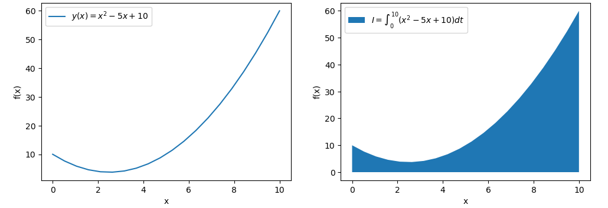

O símbolo da integral é o "$\int$" e $a$ e $b$ são os intervalos de integração.

$$
I=\int_{a}^{b}f(x)dt
$$

No nosso caso $a=0$ e $b=10$ e $y(x)=x^2 - 5x + 10$.

Resolver a integral de um polinômio é a mesma coisa que resolver indidualmente as integrais. Além disso, as constantes podem sair para fora da integral:

$$
I=\int_{0}^{10}\left(x^2-5x+10\right)=\int_{0}^{10}x^2dx-5\int_{0}^{10}xdx+10\int_{0}^{10}dx
$$

Ao resolver cada uma das integrais individualmente temos:

$$
I=\left[\frac{x^3}{3}-5\frac{x^2}{2}+10x\right]_0^{10}
$$

Para encontrar o valor numérico da área devemos substituir os limites de integração no valor de $x$. Sempre subtraindo o intervalo final, $a=10$, do inicial $b=0$:

$$
I=\left[\frac{10^3}{3}-5\frac{10^2}{2}+10\cdot10\right]-\left[\frac{0^3}{3}-5\frac{x^2}{2}+10\cdot 0\right]=\frac{550}{3}
$$
Logo a área abaixo da curva é:
$$
I=\frac{550}{3}
$$

## Parte 1: Integração analítica com o Sympy

O Python permite o cálculo analítico da integral utilizando as funções do pacote [Sympy](https://www.sympy.org/pt/index.html) utilizando variáveis simbólicas. Já trabalhamos com este pacote anteriormente na plotagem de gráficos. 

> ```python
> # Importando sympy
> import sympy as sym
> ```
>
> ```python
> # Antes de proceguir vamos criar funções que irá facilitar a nossa vida
> import IPython
> 
> def md(txt):
>     """
>     Mostra um texto em Markdown
>     """
>     display(IPython.display.Markdown(txt))
> 
> def Eqn(eq):
>     """
>     Função equação:
>     Imprime uma equação centralizada
>     """
>     return md(fr"""\begin{{equation}}{eq}\end{{equation}}"""
>     )
> ```
> 
> 

### Exemplo 1: Integral definida

Para resolver a integral utilizamos a função [integrate](https://docs.sympy.org/latest/modules/integrals/integrals.html). Nela podemos resolver integrais indefinidas (Os limites de integração não são definidos) ou definidas (Os limites de integração são definidos). E ainda, para mostrar as expressões na saída Markdown podemos utilizar a função [latex](https://docs.sympy.org/latest/tutorial/printing.html):

> ```python
> # Definindo a função f(x)
> x = sym.symbols('x')
> y = x**2-5*x+10
> 
> # Mostrando a equação na forma de Markdown
> Eqn(f'y(x)={sym.latex(y)}')
> ```
> 
> 
> $$
> x^{2} - 5 x + 10
> $$
>
> ```python
> # Resolvendo a integral indefinida
> I = sym.integrate(y)
> ```
>
> ```python
> # Mostrando o resultado na forma de Markdown
> Eqn(f'I(x)={sym.latex(sym.Integral(y))}={sym.latex(I)}+c')
> 
> # A função 'Integral' permite mostrar a operação de integral sem resolve-la
> ```
> 
> 
> $$
> I(x)=\int \left(x^{2} - 5 x + 10\right)\, dx=\frac{x^{3}}{3} - \frac{5 x^{2}}{2} + 10 x+c
> $$

Alternativamente, podemos utilizar o método `doit` para resolver a integral:

> ```python
> x = sym.symbols('x')
> y = x**2-5*x+10
> # Mostrando a equação na forma de Markdown
> Eqn(f'y(x)={sym.latex(y)}')
> 
> #Resolvendo a integral
> Int=sym.Integral(y) #Definindo a integral
> Eqn(f'I(x)={sym.latex(Int)}={sym.latex(Int.doit())}+c')
> ```
> 
> 
> $$
> y(x)=x^{2} - 5 x + 10
> $$
>
> $$
> I(x)=\int \left(x^{2} - 5 x + 10\right)\, dx=\frac{x^{3}}{3} - \frac{5 x^{2}}{2} + 10 x+c
> $$

O sympy permite resolver integrais complexas de forma analítica. 

**Tarefa 1:** Utilizando o Sympy e as saídas do IPython resolva as integrais das seguintes funções:
$$
y(x)=\sqrt{x + 1}
$$

$$
y(x)=\frac{x^{2} - 3 x + 5}{3 x^{3} + x^{2} + x}
$$


> ```python
> #Tarefa: Resolva as integrais usando o Sympy
> y2 = sym.sqrt(1+x) # Definindo a função
> Int2=sym.Integral(y2) # Definindo a integral
> 
> Eqn(f'y(x)={sym.latex(y2)}')
> Eqn(f'I(x)={sym.latex(Int2)}={sym.latex(Int2.doit())}+c')
> ```
> 
> 
> $$
> y(x)=\sqrt{x + 1}
> $$
>
> $$
> I(x)=\int \sqrt{x + 1}\, dx=\frac{2 \left(x + 1\right)^{\frac{3}{2}}}{3}+c
> $$
> ```python
> y3 = (x**2-3*x+5)/(3*x**3+x**2+x)
> Eqn(f'y(x)={sym.latex(y3)}')
> Eqn(f'I(x)={sym.latex(sym.Integral(y3))}={sym.latex(sym.integrate(y3))}+c')
> ```
> 
> 
> $$
> y(x)=\frac{x^{2} - 3 x + 5}{3 x^{3} + x^{2} + x}
> $$
>
> $$
> I(x)=\int \frac{x^{2} - 3 x + 5}{3 x^{3} + x^{2} + x}\, dx=5 \log{\left(x \right)} - \frac{7 \log{\left(x^{2} + \frac{x}{3} + \frac{1}{3} \right)}}{3} - \frac{34 \sqrt{11} \operatorname{atan}{\left(\frac{6 \sqrt{11} x}{11} + \frac{\sqrt{11}}{11} \right)}}{33}+c
> $$

### Exemplo 2: Integrais definidas

Podemos atribuir um intervalo de integração a nossa integral adicionando uma tupla com as variáveis e os limites de integração superior e inferior:
```python
integrate(f(x),(x,a,b))
```
onde $a$ e $b$ são os limites inferior e superior, respectivamente.

> ```python
> a=0 # Limite inferior
> b=10 # Limite superior
> 
> md(f'Vamos tentar resolver a integral de $y(x)={sym.latex(y)}$ considerando os intervalos de ${a}$ a ${b}$:')
> ```
>
> Vamos tentar resolver a integral de $y(x)=x^{2} - 5 x + 10$ considerando os intervalos de $0$ a $10$:
>
> ```python
> I=sym.integrate(y)
> Int=sym.Integral(y,(x,a,b))
> 
> Eqn(fr'I(x)={sym.latex(Int)}=\left[{sym.latex(I)}\right]_{a}^{{{b}}}={sym.latex(Int.doit())}')
> ```
>
> $$
> I(x)=\int\limits_{0}^{10} \left(x^{2} - 5 x + 10\right)\, dx=\left[\frac{x^{3}}{3} - \frac{5 x^{2}}{2} + 10 x\right]_0^{10}=\frac{550}{3}
> $$

## Parte 2: Integração numérica

Além da integração analítica é possível calcular a integral através de métodos numéricos. Este método é especialmente útil quando a função não é integrável ou quando a função não é definida matemáticamente. Inicialmente vamos apresentar alguns métodos de integração e posteriormente vamos utilizar este conceito em um problema prático.

### Exemplo 3: Regra trapezoidal

Mas como calcular a integral deste gráfico se não temos uma função definida. Neste caso podemos utilizar técnicas de integração númerica. Como a regra do retangular e trapezoidal apresentada gráficamente na figura abaixo:

> ```python
> #Criando os vetores x e y
> x = np.linspace(0,10)
> y = x**2 - 5*x + 10
> 
> # Criando vetores para demonstrar a integração numérica
> xi = np.arange(0,11,2)
> yi = xi**2 - 5*xi + 10
> 
> fig, axs = plt.subplots(nrows=1,ncols=2,figsize=(8,6))
> 
> Títulos = ['retangular','trapezoidal']
> 
> for j, ax in enumerate(axs):
>     if j==0:
>         ax.fill_between(xi,yi,step='pre',color='cyan',label=f'Área = {yi[1:].sum()*2:g}');
>     elif j==1:
>         ax.fill_between(xi,0,yi,color='cyan',alpha=0.4,label=f'Área = {np.trapz(yi,xi):g}');
>     ax.plot(x,y,label="$y(x)=x^2-5x+10$");
>     ax.set_title(f'Regra {Títulos[j]}');
>     ax.legend();
>     ax.grid(True);
> ```
>
> 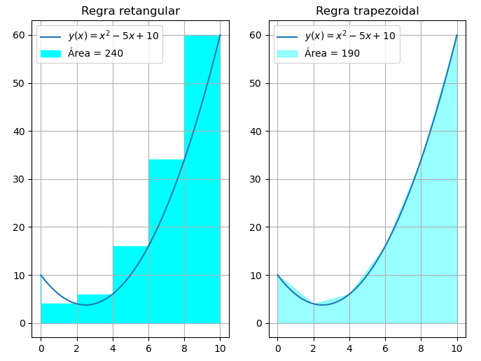

A regra retangular divide a figura em diversos retângulos e calcular a área destes retângulos (A esquerda). Embora simples, possui uma baixa precisão. Já a regra trapezoidal divide a figura em trapézios (A direita). Considerando os mesmos passos de integração, a regra trapezoidal tem uma precisão no cálculo da área muito superior.

O numpy permite o cálculo da área utilizando o método trapezoidal através da função `trapz(y,[x],[dx])`, cuja a documentação está disponível [aqui](https://numpy.org/doc/stable/reference/generated/numpy.trapz.html).

> ```python
> md(f'Usando a função `trapz` o valor da integral é {np.trapz(yi,dx=xi[1]-xi[0]):g}, já com a regra retangular o valor da integral é {yi[1:].sum()*2}.')
> ```
>
> Usando a função `trapz` o valor da integral é 190, já com a regra retangular o valor da integral é 240.

Caso haja necessidade de maior precisão, pode-se utilizar a **regra de Simpson**. Este método utiliza polinómios (de segundo grau) para fazer o cálculo da integral, como mostra a figura abaixo, retirada da [Wikipédia](https://pt.wikipedia.org/wiki/F%C3%B3rmula_de_Simpson):
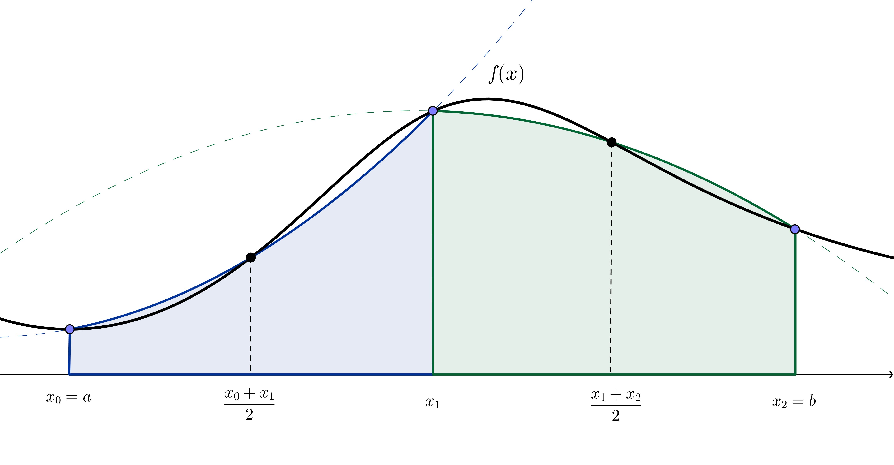

Para utilizar a regra de Simpson devemos recorrer a função `simps(y,[x],[dx])` do sub-módulo `integrate` do scipy.

> ```python
> # Importando utilizando o sub-módulo de integração
> from scipy import integrate
> 
> # Mostrando o resultado da integração
> md(f'De acordo com o `simp` o valor da área é {integrate.simps(yi,xi):.6g}, isso dá uma diferença de {abs(integrate.simps(yi,xi)-np.trapz(yi,xi))/integrate.simps(yi,xi)*100:.2}\% comparado com o `trapz`.')
> ```
>
> De acordo com o `simp` o valor da área é 184.667, isso dá uma diferença de 2.9% comparado com o `trapz`.

### Exemplo 4: Integração a partir de funções

Além dos métodos citados (Trapezoidal e Simpson) existem **outros métodos mais precisos**, como o método de [quadratura](https://docs.scipy.org/doc/scipy/reference/generated/scipy.integrate.quad.html) e o [método de Romberg](https://docs.scipy.org/doc/scipy/reference/generated/scipy.integrate.romb.html). Ambos os métodos estão disponíveis através de funções do sub-módulo [integrate](https://docs.scipy.org/doc/scipy/reference/integrate.html) através das funções `quad` e `romberg`.

Ao contrário das outras funções apresentadas anteriormente, que calculam a integral a partir de amostras, as funções `quad` e `romberg` calculam a integrais através de funções. A função `quad`, por exemplo, tem a seguinte sintaxe:

```python
integral, erro_estimado = quad(
     func, #Função
     a, #limite inferior de integração
     b #limite superior de integração
)
```
Para calcular a integral a partir deste método você deve definir a função previamente ou utilizar uma **função anônima**.

> ```python
> # Como o método de quadratura recebe uma função, ao invés de um vetor y é necessário criá-la
> 
> def y(x):
>     return x**2-5*x+10
> 
> # Agora podemos calcular o valor de integral
> I, erro = integrate.quad(y,0,10)
> ```
>
> ```python
> # Alternativamente podemos utilizar uma 'função de uma anônima - 'anonymous function', desta forma, não precisamos declarar a função anteriormente
> 
> I, erro = integrate.quad(lambda x: x**2-5*x+10, #Definição de uma função anônima (função de uma única linha)
>                    0, #limite inferior
>                    10 #limite superior
>                   )
> md(f'Pelo método de quadratura a área do gráfico é {I:.4g} e pelo método de Romberg a integral é {integrate.romberg(lambda x: x**2-5*x+10,0,10):.4g}.')
> ```
>
> Pelo método de quadratura a área do gráfico é 183.3 e pelo método de Romberg a integral é 183.3.

### Exemplo 5: Integração a partir de um arquivo csv

O cálculo da área do gráfico tem várias aplicações. Por exemplo, dada uma curva de velocidade em relação ao tempo, pode-se encontrar a **distância percorrida através do cálculo da área do gráfico (A integral)**. 

Considere que a velocidade de um veículo em um determinado percurso foi registrada e salva no arquivo `velocidade.csv`. Podemos importar este arquivo e mostrar o gráfico de velocidade em função do tempo.

> ```python
> #### Plotando o gráfico utilizando o numpy e matplotlib
> 
> tempo, velocidade = np.loadtxt("velocidade.csv",
>                             unpack=True, #Permite que cada variável tem o seu valor correspondente
>                             delimiter=',', #Delimitador do arquivo csv
>                             skiprows=1 #Pula o cabeçalho (Primeira linha)
>                            )
> 
> plt.figure(figsize=(12,4));
> plt.plot(tempo,velocidade,label='Velocidade (km/h)');
> plt.fill_between(tempo,velocidade,color='lightcyan',label='Área do gráfico')
> plt.legend();
> plt.xlabel('Tempo (h)');
> ```
>
> 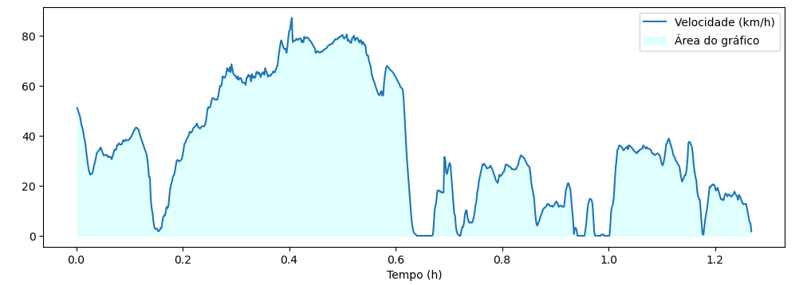
>
> ```python
> #### Plotando o gráfico utilizando o pandas
> # import pandas as pd
> 
> # df = pd.read_csv('velocidade.csv',index_col=0) #importa o csv e seleciona o tempo como índice
> # df.plot.line(figsize=(12,4)); #Plota o gráfico
> # plt.fill_between(df.index,df['Velocidade (km/h)'],color='lightcyan',label='Área do gráfico');
> # plt.legend();
> ```
>
> ```python
> d_simp=integrate.simps(velocidade,tempo)
> d_trap=integrate.trapz(velocidade,tempo)
> 
> md(f"Utilizando o método de Simpson a distância percorrida pelo veículo foi de $A={d_simp:g}$ km. Pelo método trapezoidal a distância foi de $A={d_trap:g}$ km. E o erro entre os dois métodos foi de ${abs(d_simp-d_trap)*1000:g}$ m, que é relativamente pequena.")
> ```
>
> Utilizando o método de Simpson a distância percorrida pelo veículo foi de $A=45.1984$ km. Pelo método trapezoidal a distância foi de $A=45.2086$ km. E o erro entre os dois métodos foi de $10.2292$ m, que é relativamente pequena.

Podemos plotar o gráfico de distância percorrida, $d$, se variarmos o período de integração de $0$ a $t_0$:

$$
d(t_0)=\int_0^{t_0} v(t) dt
$$

Com **$t_0$ variando** de um valor imediatamente superior a zero até o último valor do array de tempo. Além disso, por definição $d(0)=0$.

> ```python
> # Usando o list comprehension para criar array com t0 variando entre os valores de tempo
> d=np.array([0]+[integrate.simps(velocidade[:t0],tempo[:t0]) for t0 in range(1,tempo.size)])
> ```
>
> ```python
> #Plotando o gráfico
> plt.figure(figsize=(12,4));
> plt.plot(tempo,velocidade,label='Velocidade (km/h)');
> plt.plot(tempo,d,label='Distância percorrida (km)');
> plt.legend();
> plt.xlabel('Tempo (h)');
> plt.grid(True);
> ```
>
> 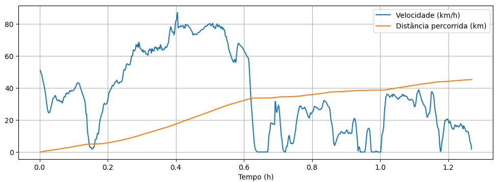

# Atividade 2: Derivada

Derivada $f'(x)$ é a inclinação de uma reta tangente à uma curva $f(x)$. A reta tangente é demonstrada na figura abaixo retirada da [Wikipédia](https://pt.wikipedia.org/wiki/Derivada):
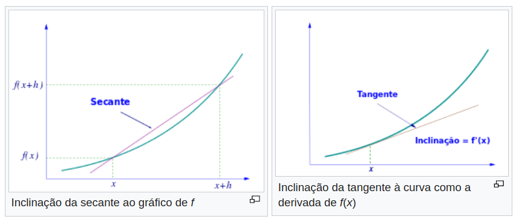

Em termos matemáticos a definição da derivada é dada por:

$$
\frac{dy}{dx}=\lim_{h\rightarrow 0} \frac{y(x+h)-y(x)}{h}
$$

## Parte 3: Derivada analítica com o Sympy

### Exemplo 6: Primeira derivada

O `sympy` permite fazer o cálculo derivada de forma analítica através da função [diff](https://docs.sympy.org/latest/tutorial/calculus.html). Esta função tem os seguintes parâmetros:

```python
diff(y(x),
     [x], #Opcional
     [ordem] #Opcional (Padrão 1)
    )
```

Por exemplo, a derivada de:

> ```python
> # Definindo a função
> x=sym.symbols('x')
> y=x**2 - 5*x +10
> ```
>
> ```python
> # Mostrando o resultado da derivada
> problema=sym.Derivative(y)
> derivada=sym.diff(y)
> Eqn(fr'\frac{{dy}}{{dx}}={sym.latex(problema)}={sym.latex(derivada)}')
> 
> # Explicando o que faz cada função:
> # - A função Derivative mostra o valor da derivada não resolvida
> # - A função latex converte uma expressão no sympy para o formato de equação do latex
> ```
>
> $$
> \frac{dy}{dx}=\frac{d}{d x} \left(x^{2} - 5 x + 10\right)=2 x - 5
> $$

Ou ainda, pelo método `doit`:

> ```python
> problema=sym.Derivative(y)
> Eqn(fr'\frac{{dy}}{{dx}}={sym.latex(problema)}={sym.latex(problema.doit())}')
> ```
>
> $$
> \frac{dy}{dx}=\frac{d}{d x} \left(x^{2} - 5 x + 10\right)=2 x - 5
> $$

Para encontrar a derivada em um determinado ponto, podemos usar o método `subs`. O método subs tem a seguinte sintaxe:
```python
subs(old, #Variaveis antigas (Pode ser uma tupla ou um escalar)
    new #Variaveis novas (Pode ser uma tupla ou um escalar a variável pode ser simbólica ou não)
    )
```

> ```python
> pto=3
> md(f'Por exemplo, caso seja necessário achar o valor da derivada no ponto {pto}:')
> Eqn(fr"y'({pto})={sym.latex(derivada.subs(x,3))}")
> ```
>
> Por exemplo, caso seja necessário achar o valor da derivada no ponto 3:
> $$
> y'(3)=1
> $$

Caso queiramos a derivada de segunda ordem, podemos acrescentar um segundo parâmetro:

> ```python
> # Mostrando o resultado da segunda derivada
> Eqn(fr'\frac{{d^2}}{{dx^2}}\left({sym.latex(y)}\right)={sym.latex(sym.diff(y,x,2))}')
> ```
>
> $$
> \frac{d^2}{dx^2}\left(x^{2} - 5 x + 10\right)=2
> $$

### Exemplo 7: Lambdify

Vimos anteriormente como plotar o gráfico utilizando o Sympy, porém com pouca customização. Relembrando como era feita a plotagem utilizando o Sympy:

> ```python
> # Função
> x=sym.symbols('x')
> y = x**2 -5*x+10
> dydx=y.diff()
> I=y.integrate()
> 
> # Plotando na mesma função
> sym.plot(y,dydx,I,title='Plotando usando uma função')
> 
> # Customizando cada gráfico
> p1=sym.plot(y,show=False,title='Customizando cada gráfico',legend=True)
> p2=sym.plot(dydx,line_color='r',show=False)
> p3=sym.plot(I,line_color='g',show=False)
> p1.extend(p2)
> p1.extend(p3)
> p1.show()
> ```
>
> 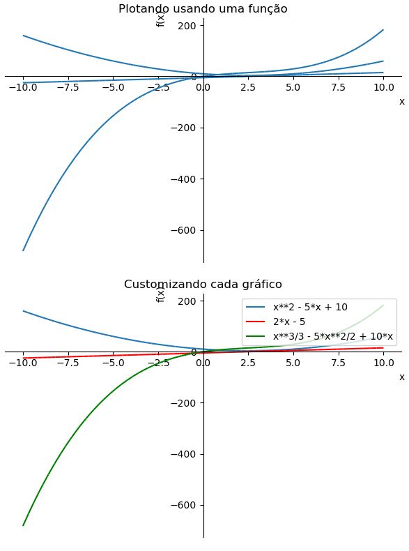

Entretando, a função de plotagem do Sympy **não é muito flexível**, ela é útil apenas para plotagens rápidas sem grandes customizações. Caso seja necessário uma customização maior podemos utilizar o **Matplotlib**. Para isso podemos utilizar a função [lambdify](https://docs.sympy.org/latest/modules/utilities/lambdify.html) do Sympy. Esta função **transforma uma função do Sympy em uma função (lambda) do Python**. A função tem a seguinte sintaxe:

```python
lambdify(variáveis, #array ou escalar das variáveis da função
         expressão, #Função propriamente dita
         biblioteca #Biblioteca no qual a função deve ser convertida (Math ou numpy, por exemplo)
        )
```

> ```python
> # Função
> x=sym.symbols('x')
> y = x**2 -5*x+10
> dydx=y.diff()
> I=y.integrate()
> 
> # Transformando as funções do Sympy em funções lambda (Inline function)
> yLamb=sym.lambdify(x,y,'numpy')
> dydxLamb=sym.lambdify(x,dydx,'numpy')
> ILamb=sym.lambdify(x,I,'numpy')
> 
> #Criando o vetor x
> x=np.linspace(-6,10,100)
> 
> #Plotando os gráficos
> plt.plot(x,yLamb(x),label=f'y(x)=${sym.latex(y)}$');
> plt.plot(x,dydxLamb(x),label=f'$y\'(x)={sym.latex(dydx)}$');
> plt.plot(x,ILamb(x),label=f'$I(x)={sym.latex(I)}$');
> plt.grid(True);
> plt.ylim(-50,50);
> plt.legend();
> ```
>
> 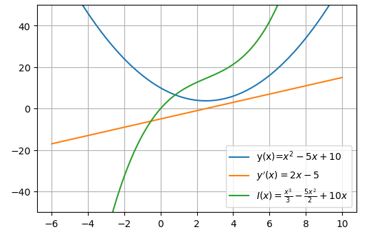

## Parte 4: Diferenciação numérica

Em algoritmos numéricos não é possível tender o $h$ tender a zero, logo devemos aproximar a derivada por:

$$
\frac{dy}{dx}\approx\frac{\Delta y}{\Delta x}=\frac{y(x+h)-y(x)}{h}
$$

Neste caso, estamos trabalhando com a inclinação da reta secante.

### Exemplo 8: Métodos avançar e retroceder

Existem dois métodos de cálculo da derivada:

- Método avançar (_forward_) 
$$
\frac{dy}{dx}\approx\frac{y(x+h)-y(x)}{h}
$$
- Método retroceder (_backward_)

$$
\frac{dy}{dx}\approx\frac{y(x)-y(x-h)}{h}
$$

> ```python
> ### Criando os vetores x e y
> x = np.linspace(0,10)
> f = lambda x: x**2 - 5*x + 10 #Criando uma inline function para ser utilizada posteriormente
> 
> # Definindo o vetor y
> y = f(x)
> 
> ### Criando vetores para demonstrar as retas secantes
> xi = np.arange(0,11,2)
> yi = f(xi)
> 
> ### Plotando os gráficos
> fig, ax = plt.subplots(figsize=(6,6))
> ax.plot(xi,yi,'-o',label='Retas secantes',alpha=0.3,color='black');
> ax.plot(x,y,label="$y(x)=x^2-5x+10$");
> ax.legend();
> ax.grid(True);
> 
> ### Adicionando textos
> Pontos = ('y(x-h)','y(x)','y(x+h)')
> 
> # Customizações do texto (Alinhamento)
> # Mais informações: https://matplotlib.org/3.1.1/tutorials/text/text_props.html
> Alinhamento = ({'ha': 'center', 'va': 'bottom'}, #y(x-h)
>                {'ha': 'center', 'va': 'top'}, #y(x)
>                {'ha': 'left', 'va': 'top'} #y(x+h)
>               )
> for i in range(3):
>     #Adicionando os pontos
>     ax.text(xi[i],yi[i]+(-1)**bool(i), #Posição
>             Pontos[i], #Textos
>             Alinhamento[i] #Parâmetros
>            ) 
> 
> ### Adicinando anotações
> # Mais informações: https://matplotlib.org/3.3.3/tutorials/text/annotations.html
> Textos=['Retroceder','Avançar']
> 
> for x in [1,3]:
>     ax.annotate(Textos[int((x-1)/2)], #Textos
>                 xy=(x,f(x)+2), #Posição final da seta
>                 xytext=(x,f(x)+10), #Posição do texto
>                 textcoords='data',
>                 ha='center',
>                 arrowprops=dict(arrowstyle="->",facecolor='black') #Parâmetros
>                )
> ```
>
> 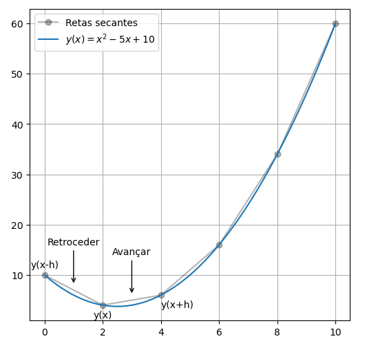

```python
# Criando uma função de derivada
def dydx(fun,a=0,h=0.01,Método="Avanço"):
    """
    Função que calcula a derivada:
    fun <- Função
    a <- Ponto (Padrão = 0)
    h <-dx (Padrão = 2)
    Método <- Avanço ou retroceder (Padrão = avanço)
    """
    if Método=="Avanço":
        return (fun(a+h)-fun(a))/h 
    else:
        return (fun(a)-fun(a-h))/h
```

Teste essa função com vários valores.

> ```python
> #Criando uma inline function para ser a nossa função
> y = lambda x: x**2 - 5*x + 10 
> 
> #Criando um DataFrame
> import pandas as pd
> resultados = pd.DataFrame(index=np.arange(0,5,1)) #Os índices são os pontos
> 
> #Preenchendo o dataframe
> hs=[2,0.5,0.1]
> Métodos=["Avanço","Retroceder"]
> 
> for h in hs:
>  for Método in Métodos:
>      resultados[f"{Método} e h={h}"]=dydx(y,a=resultados.index,h=h,Método=Método)
> md(resultados.to_markdown())
> ```
>
> |      | Avanço e h=2 | Retroceder e h=2 | Avanço e h=0.5 | Retroceder e h=0.5 | Avanço e h=0.1 | Retroceder e h=0.1 |
> | ---: | -----------: | ---------------: | -------------: | -----------------: | -------------: | -----------------: |
> |    0 |           -3 |               -7 |           -4.5 |               -5.5 |           -4.9 |               -5.1 |
> |    1 |           -1 |               -5 |           -2.5 |               -3.5 |           -2.9 |               -3.1 |
> |    2 |            1 |               -3 |           -0.5 |               -1.5 |           -0.9 |               -1.1 |
> |    3 |            3 |               -1 |            1.5 |                0.5 |            1.1 |                0.9 |
> |    4 |            5 |                1 |            3.5 |                2.5 |            3.1 |                2.9 |
>
> ```python
> resultados.index.name="$x$"
> resultados.plot(lw=1,marker='.');
> plt.grid();
> plt.ylabel("$y'(x)$");
> plt.title("Comparativo do método de avanço e retroceder");
> plt.ylim(-8,6);
> ```
>
> 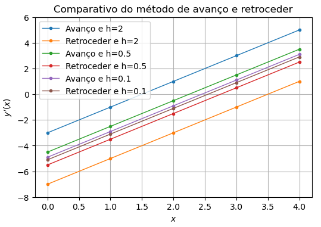

Se analisarmos graficamente, percebemos que o método avanço sempre tem um erro 'positivo' e o método atraso tem um erro 'negativo'.

### Exemplo 9: Método central
Para aumentar a precisão da derivada podemos utilizar um método que **combina tanto o método avançar, quanto o método retroceder**, o método central:

$$
\frac{dy}{dx}\approx\frac{y(x+h/2)-y(x-h/2)}{h}=\frac{y(x+h)-y(x-h)}{2h}
$$

> ```python
> # Vamos modificar a nossa função de derivada e incluir o método central
> def dydx(fun,a=0,h=0.01,Método="Central"):
>     """
>     Função que calcula a derivada:
>     fun <- Função
>     a <- Ponto (Padrão = 0)
>     h <-dx (Padrão = 2)
>     Método <- Avanço ou retroceder (Padrão = avanço)
>     """
>     if Método=="Avanço":
>         return (fun(a+h)-fun(a))/h 
>     elif Método=="Retroceder":
>         return (fun(a)-fun(a-h))/h
>     else: #Método central
>         return (fun(a+h)-fun(a-h))/(2*h)
> ```
>
> ```python
> # Adicionando mais uma coluna no Dataframe
> resultados["Central e h=2"]=dydx(y,a=resultados.index,h=2,Método="Central")
> ```
>
> ```python
> #Plotando o gráfico resultante
> md(resultados.to_markdown())
> resultados.plot(lw=1,marker='.');
> plt.grid();
> plt.ylabel("$y'(x)$");
> plt.title("Comparativo do método de avanço, retroceder e central");
> plt.ylim(-8,6);
> ```
>
> |      | Avanço e h=2 | Retroceder e h=2 | Avanço e h=0.5 | Retroceder e h=0.5 | Avanço e h=0.1 | Retroceder e h=0.1 |
> | ---: | -----------: | ---------------: | -------------: | -----------------: | -------------: | -----------------: |
> |    0 |           -3 |               -7 |           -4.5 |               -5.5 |           -4.9 |               -5.1 |
> |    1 |           -1 |               -5 |           -2.5 |               -3.5 |           -2.9 |               -3.1 |
> |    2 |            1 |               -3 |           -0.5 |               -1.5 |           -0.9 |               -1.1 |
> |    3 |            3 |               -1 |            1.5 |                0.5 |            1.1 |                0.9 |
> |    4 |            5 |                1 |            3.5 |                2.5 |            3.1 |                2.9 |
> 
> 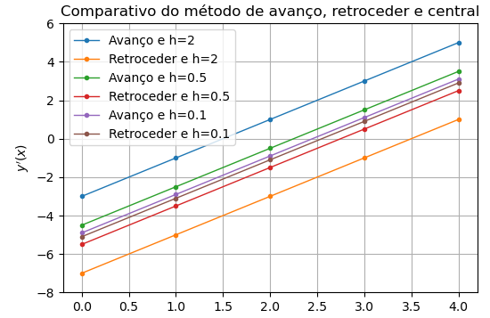

Observe que mesmo com um valor de $h$ grande o método retroceder trouxe bons resultados. 

Finalmente, podemos utilizar a função [derivative](https://docs.scipy.org/doc/scipy/reference/generated/scipy.misc.derivative.html) do submódulo `misc` do Scipy, que tem a seguinte sintaxe:
```python
derivative(func,#função
           x0,#Ponto
           [dx]#Valor de h (opcional, padrão 1)
          )
```

> ```python
> # Adicionando mais uma coluna no Dataframe
> from scipy import misc
> 
> resultados["Scipy"]=misc.derivative(y,resultados.index)
> md(resultados.to_markdown())
> ```
>
> |      | Avanço e h=2 | Retroceder e h=2 | Avanço e h=0.5 | Retroceder e h=0.5 | Avanço e h=0.1 | Retroceder e h=0.1 | Scipy |
> | ---: | -----------: | ---------------: | -------------: | -----------------: | -------------: | -----------------: | ----: |
> |    0 |           -3 |               -7 |           -4.5 |               -5.5 |           -4.9 |               -5.1 |    -5 |
> |    1 |           -1 |               -5 |           -2.5 |               -3.5 |           -2.9 |               -3.1 |    -3 |
> |    2 |            1 |               -3 |           -0.5 |               -1.5 |           -0.9 |               -1.1 |    -1 |
> |    3 |            3 |               -1 |            1.5 |                0.5 |            1.1 |                0.9 |     1 |
> |    4 |            5 |                1 |            3.5 |                2.5 |            3.1 |                2.9 |     3 |

### Exemplo 10: Derivada a partir de um arquivo csv


A integral da velocidade fornece a distância percorrida. A aceleração é a derivada em função do tempo:

$$
a=\frac{dv}{dt}
$$

Assim, como a integral a derivada também tem um significado físico. Para encontrar o valor da derivada podemos utilizar diretamente a definição do método central:

$$
\frac{dv}{dt}\approx\frac{v(t+h)-v(t-h)}{2h}
$$

Neste caso o valor de $h$ é o período de amostragem de $t$, ou seja `h=t[1]-t[0]`. 

Como a distância $h$ é o próprio período de amostragem, logo podemos trabalhar a diferença das velocidades diretamente com os índices. Assim a derivada resulta em:

$$
\frac{dv}{dt}\approx\frac{v[k+1]-v[k-1]}{2(t[1]-t[0])}
$$

Onde $k$ é um vetor de índice do vetor de tempo.

Podemos calcular o método avanço ou retroceder utilizando o fatiamento de arrays. No caso do método de avanço:
$$
\frac{dv}{dt}\approx\frac{v[k+1]-v[k]}{2h}
$$

O gráfico abaixo compara os dois métodos:

> ```python
> h2=2*(tempo[1]-tempo[0]) #Calculando previamente o valor de 2h
> 
> dvdt_m=np.array([(velocidade[k+1]-velocidade[k-1])/h2 for k in range(1,tempo.size-1)])
> 
> #filt=signal.sosfilt(sos, dvdt)
> 
> # Podemos obter o mesmo resultado através do fatiamento de arrays
> dvdt_a=(velocidade[1:]-velocidade[:-1])/(tempo[1]-tempo[0])
> ```

O gráfico abaixo compara os dois métodos:

> ```python
> kmh2toms2=1000/(3600**2)
> 
> plt.figure(figsize=(12,4));
> plt.plot(tempo[1:-1],dvdt_m*kmh2toms2,label='Valor médio',lw=1);
> plt.plot(tempo[:-1],dvdt_a*kmh2toms2,'--',label='Avanço',alpha=0.5,lw=1);
> plt.legend();
> plt.ylabel('Aceleração (m/s²)')
> plt.grid(True);
> ```
>
> 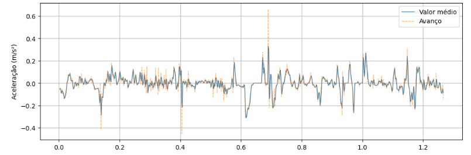

Observe que o método do valor médio é mais preciso e apresenta "picos" menores.

Comparando os gráficos:

> ```python
> fig, ax1 = plt.subplots(figsize=(10,4));
> 
> ax1.plot(tempo,velocidade,label='Velocidade (km/h)');
> ax1.plot(tempo,d,label='Distância percorrida (km)');
> ax1.set_xlabel('Tempo (h)');
> ax1.grid(True);
> ax1.set_yticks(np.linspace(-100,100,5));
> 
> #Plotando a aceleração em outro eixo
> ax2 = ax1.twinx(); #criando um eixo igual
> ax2.plot(tempo[1:-1],dvdt_m*kmh2toms2,label=r'Aceleração (m/s²)',lw=1,alpha=0.5,color='g');
> ax2.set_ylabel('Aceleração (m/s²)',color='g')
> ax2.set_yticks(np.linspace(-0.4,0.4,5))
> ax2.tick_params(axis='y', labelcolor='g')
> 
> # Adicionando uma legenda na figura (Não é no eixo)
> # Documentação: https://matplotlib.org/3.1.1/api/_as_gen/matplotlib.pyplot.legend.html
> # Documentação do eixo: https://matplotlib.org/3.3.3/api/axes_api.html
> fig.legend(loc='lower center', #Posição da legenda
>            ncol=3, #Colocando a legenda na horizontal
>            bbox_to_anchor=ax1.get_position() #Criando um eixo artifical com o tamanho do eixo 1
>           );
> 
> fig.tight_layout(); #Ajuste fino
> ```
>
> 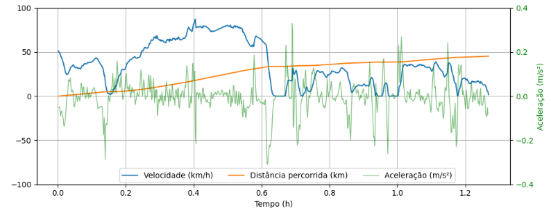

# Atividade 3: Outras aplicações do Sympy

Nos tópicos anteriores vimos a aplicação do Sympy com derivadas e integrais. Contudo, o Sympy é um biblioteca muito completa, com ela podemos diversas operações simbólicas e **mostrar todo o processo de resolução de forma detalhada** através das saídas do **IPython** ou através do **Latex**. 

Neste tópico vamos abordar algumas aplicações úteis na prática.

### Exemplo 11: Simplificações

Com o Sympy é possível **simplificar expressões matemáticas**. Uma lista mais completa com vários métodos está disponível [aqui](https://www.tutorialspoint.com/sympy/sympy_simplification.htm). Porém, vamos mostrar alguns exemplos.

#### Simplify

Função que simplifica expressões matemáticas:

> ```python
> x=sym.symbols('x')
> 
> #Criando a expresão
> expr=sym.sin(x)**2+sym.cos(x)**2
> 
> #Mostrando a saída simplificada
> Eqn(f'{sym.latex(expr)}={sym.simplify(expr)}')
> ```
>
> $$
> \sin^{2}{\left(x \right)} + \cos^{2}{\left(x \right)}=1
> $$

#### Expand

Podemos usar o `expand` expandir polinômios:

> ```python
> a, b=sym.symbols('a b')
> 
> #Criando a expresão
> expr=(a+b)**2
> 
> #Mostrando a saída expandida
> Eqn(f'{sym.latex(expr)}={sym.latex(sym.expand(expr))}')
> ```
>
> $$
> \left(a + b\right)^{2}=a^{2} + 2 a b + b^{2}
> $$

Outro exemplo:

> ```python
> a, b=sym.symbols('a b')
> 
> #Criando a expresão
> expr=(a+b)*(a-b)
> 
> #Mostrando a saída simplificada
> Eqn(f'{sym.latex(expr)}={sym.latex(sym.expand(expr))}')
> ```
>
> $$
> \left(a - b\right) \left(a + b\right)=a^{2} - b^{2}
> $$

#### Factor

A função `factor` fatora um polinônimo em fatores inrredutíveis:

> ```python
> a1, a2, g = sym.symbols('a_{\\alpha} a_{\\beta} \\vec{\\gamma}') #Observe que podemos utilizar nomes do latex
> 
> #Criando a expressão
> expr=a1**2*g + 4*a1*a2*g + 4*a2**2*g
> 
> Eqn(f'{sym.latex(expr)}={sym.latex(sym.factor(expr))}')
> ```
>
> $$
> \vec{\gamma} a_{\alpha}^{2} + 4 \vec{\gamma} a_{\alpha} a_{\beta} + 4 \vec{\gamma} a_{\beta}^{2}=\vec{\gamma} \left(a_{\alpha} + 2 a_{\beta}\right)^{2}
> $$

### Exemplo 12: Matrizes

> ```python
> # Multiplicação
> A*X
> ```
>
> $$
> \left[\begin{matrix}- 2 x - y\\- x + 2 y - z\\2 z\end{matrix}\right]
> $$
>
> ```python
> # Soma
> B+X
> ```
>
> $$
> \left[\begin{matrix}x + 3\\y + 5\\z + 7\end{matrix}\right]
> $$
>
> ```python
> # Multiplicação termo a termo
> B.multiply_elementwise(X)
> ```
>
> $$
> \left[\begin{matrix}3 x\\5 y\\7 z\end{matrix}\right]
> $$
>
> ```python
> # Inversa
> A.inv()
> ```
>
> $$
> \left[\begin{matrix}- \frac{2}{5} & - \frac{1}{5} & - \frac{1}{10}\\- \frac{1}{5} & \frac{2}{5} & \frac{1}{5}\\0 & 0 & \frac{1}{2}\end{matrix}\right]
> $$
>
> ```python
> # Determinante
> A.det()
> ```
>
> $$
> -10
> $$
>
> ```python
> # Resolvendo o sistema linear
> Eqn(f'X={sym.latex(X)}={sym.latex(A)}^{{-1}}{sym.latex(B)}={sym.latex(A.inv()*B)}')
> ```
>
> $$
> X=\left[\begin{matrix}x\\y\\z\end{matrix}\right]=\left[\begin{matrix}-2 & -1 & 0\\-1 & 2 & -1\\0 & 0 & 2\end{matrix}\right]^{-1}\left[\begin{matrix}3\\5\\7\end{matrix}\right]=\left[\begin{matrix}- \frac{29}{10}\\\frac{14}{5}\\\frac{7}{2}\end{matrix}\right]
> $$

Selecionando elementos:

> ```python
> # Primeira linha
> A.row(0)
> ```
>
> $$
> \left[\begin{matrix}-2 & -1 & 0\end{matrix}\right]
> $$
>
> ```python
> # Última coluna
> A.col(-1)
> ```
>
> $$
> \left[\begin{matrix}0\\-1\\2\end{matrix}\right]
> $$
>
> ```python
> #secionando o elemento [0,0]
> A[0,0]
> ```
>
> $$
> -2
> $$

### Equações 13: Equações

Podemos utilizar o Sympy para resolver equações comuns ou equações diferenciais.

# Atividade 4: Publicando seu Notebook

O formato nativo do Jupyter Notebook ainda não é aceito em muitos locais. Desta forma, sempre que for necessário publicar seu Notebook, seja para uma disciplina da escola ou universidade, ou simplesmente um site da Web é necessário converte-lo para um formato aceito.

### Exemplo 14: Exportando Notebook estáticos

Basicamente existem duas formas de converter um notebook estático (Entenda Notebook estático como aquele sem a interação com o usuário). Através do **menu do Jupyter**, **linha de comando** (no terminal) ou através de **código Python**.

De acordo com a [documentação](https://nbconvert.readthedocs.io/en/latest/) você pode exportar o seu Notebook para:

- **Apresentações** de informações em formatos mais familiares como PDF
- **Publicação** do seu Notebook em **artigos científicos** utilizando o LaTeX
- **Colaboração** com outros que não são familiares com o formato de Notebooks 
- **Publicação** para várias pessoas na web usando HTML

Você pode encontrar algumas opções de importação no Menu do Jupyter:

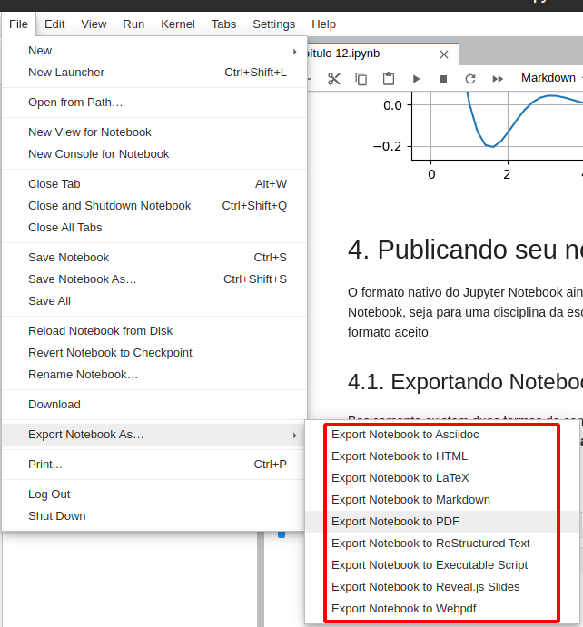

Observe que existem vários formatos de conversão, entretanto é bem provável que alguns deles **não execute sem erros**, pois ao clicar em cada um dessas opções o Jupyter rodar um script que depende de **dependências externas**. Abaixo tem-se uma tabela com os seguintes formatos que iremos abordar.

- **Script**

> Converte o Notebook em um arquivo `.py`. As células markdown são convertidas em comentários.


- **HTML**
> Formato da Web é útil quando quer transformar seu notebook é uma página web ou em um post de um blog

- **Markdown**

> Para converter o seu notebook para Markdown talvez seja necessário ter o [Pandoc](https://pandoc.org/) instalado. > Pandoc é um **conversor de documentos universal** que o Jupyter usar para converter o Notebook em formatos diversos.

- **LaTeX**
  
> Assim como no Markdown, talvez seja necessário o uso do [Pandoc](https://pandoc.org/) para fazer a conversão para do Notebook para LaTeX.

- **PDF**

> O conversor de PDF do Jupyter converte o texto primeiro para o **LaTeX** para depois fazer a conversão para PDF utilizando uma distribuição como o [Miktex](https://miktex.org/) ou [TeX Live](https://www.tug.org/texlive/). Provavelmente se você tiver as dependeências citadas tudo funcionará perfeitamente.

- **Reveal.js Slides**

> É possível converter o Notebook em slides. Iremos entrar em detalhe mais tarde.

**Não existe fórmula mágica:**

Nem sempre a conversão do Notebook irá funcionar sem erros. Muitas vezes será necessário **outras dependências** para fazer a conversão de alguns Notebooks. Por exemplo:

> Para fazer conversão de arquivos que usam SVG é necessário ter o [Inkscape](https://inkscape.org/pt-br/) instalado. Desta forma, sempre é importante **observar o console de erro** para verificar **quais dependências estão faltando e instalá-las**. Contudo, ao instalar as dependências citadas é bem provável que a conversão funcione na maioria dos casos. 

**Tarefa 2:** Exporte seu notebook para pdf pelo menu do Jupyter.

### Exemplo 15:  Utilizando a linha de comando

Uma outra forma de compartilhar seu Notebook é através do comando `nbconvert`. A vantagem de utilizar a linha de comando é que é possível **customizar** a sua conversão. Por exemplo:

- Podemos remover o código ou células específicas
- Podemos adicionar citações na saída LaTeX ou PDF
- Exportar para templates personalizados

Na prática o **Menu do Jupyter usa alguns presets do `nbconvert`**, desta forma, se houver erros tanto no menu do Jupyter quanto no `nbconvert` é interessante que você leia a documentação:

> [https://nbconvert.readthedocs.io/en/latest/](https://nbconvert.readthedocs.io/en/latest/)

Abaixo tem alguns exemplos do uso da linha de comando:

- Convertendo um notebook para Markdown:

```bash
jupyter nbconvert "cap11" --to markdown
```

- Convertendo um notebook para PDF e removendo os códigos:

```bash
jupyter nbconvert "cap11" --to pdf --TemplateExporter.exclude_input=True
```

- Convertendo um notebook para HTML usando um nome específico de saída:

```bash
jupyter nbconvert "cap11" --to html --output "post.html"
```

### Exemplo 16: Templates

O `nbconvert` fornece alguns templates que podem ser alterados através de um parâmetro na linha de comando. Ao instalar o Anaconda não existem muito templates prontos, porém você pode criar ou customizar os já existentes. 

Na versão 6 os templates estão disponíveis na pasta:

> `[Pasta do Anaconda]/share/jupyter/nbconvert/templates`

O Templates são feitos com linguagem [Jinja](https://jinja.palletsprojects.com/en/2.11.x/). Jinja é uma linguagem "server-side" que permite adicionar lógica dentro da construção de documentos (**Semelhante ao PHP, Liquid, e outros**). 

A linguagem é relativamente simples, muito provavelmente ao observar os arquivos na pasta Templates você consiguirá interpretar algumas coisas. Entretanto, a linguagem Jinja não é o foco do curso, para isso será disponibilizado 

Como este não é o foco do curso será disponibilizado o link da documentação de como adicionar suporte a novos templates:

> [https://nbconvert.readthedocs.io/en/latest/customizing.html](https://nbconvert.readthedocs.io/en/latest/customizing.html)

Contudo nada impede de customizar os templates existentes. Por exemplo, podemos **mudar o idioma para português** adicionando a seguinte linha ao arquivo `latex/base.tex.j2`:

```latex
\usepackage[portuguese]{babel}
```

Para customizações mais avançadas você pode converter diretamente para o **LaTeX**.

**Tarefa 3:** Exporte seu arquivo para PDF e esconda o código.

### Exemplo 17: Slides

É possível exportar o seu Notebook para o formato de Slides através da exportação para o RevealJS.

Para exemplificar o uso dos slides **abra o arquivo** `slides.ipynb`. Este arquivo foi configurado para apresentar na forma de Slides. Clique na engrenagem (Como mostra a Figura abaixo) e escolha o tipo de slide:

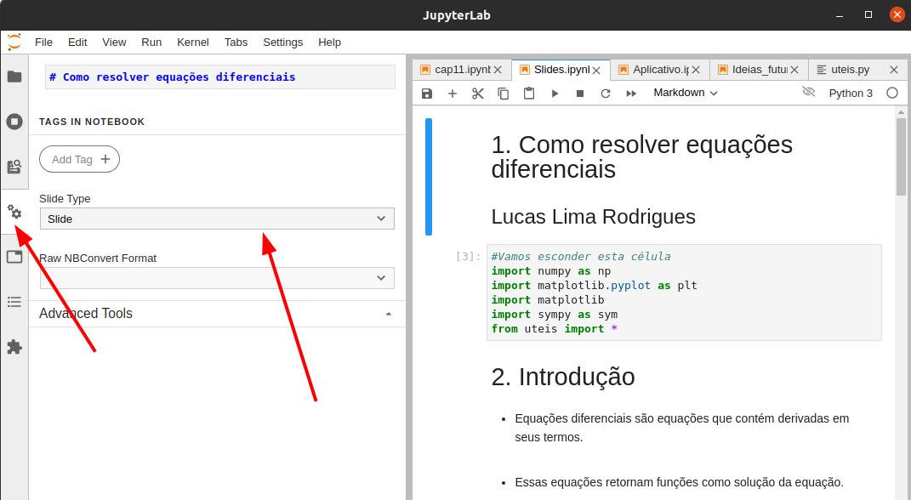

São basicamente 4 tipos de slides:

- `Slide` $\rightarrow$ Início do slide (Ou de uma seção)
- `Sub-slide` $\rightarrow$ Continuação do slide (Aparece com uma animação para baixo)
- `Fragment` $\rightarrow$ Semelhante ao `Sub-slide` só que só aparece se o usuário apertar uma tecla.
- `Hide` $\rightarrow$ Esta célula não aparece no slide
- `Notes` $\rightarrow$ Não aparece para o público (Semelhante às notas do Power Point)

Para publicar e visualizar seus slides você deve recorrer ao terminal e executar o seguinte comando com o `nbconvert`:

```bash
jupyter nbconvert "Slides"  --to slides --post serve --TemplateExporter.exclude_input=True
```

Desta forma você irá exportar o seu arquivo para `html`, esconder o código e executar um servidor para rodar as animações dos slides.

### Exemplo 18: Exportando Notebooks para Web Apps

O `nbconvert` não permite Notebooks com interação com usuário. Para isso devemos utilizar outra biblioteca como o [Voila](https://voila.readthedocs.io/en/stable/). Voala permite **transformar Notebooks em Web Aplicativos**. 

No nosso exemplo vamos adicionar mais um Slide ao nossos slides e configurá-lo como **Slide dinâmico com Widgets**.

O primeiro passo para utilizar o Voila é **fechar o Anaconda** e instalar o voila:

```bash
conda install -c conda-forge voila
```
ou
```bash
pip install voila
```

Feito isso, basta utilizar a linha de comando assim como fizemos para os outros casos do `nbconvert`:

```bash
voila App.ipynb
```

Com a extensão `@jupyter-voila/jupyterlab-preview` rodar um preview do Voilà diretamente da interface do Jupyter. Você pode instalá-la através do comando abaixo ou através da interface do Jupyter.
```bash
jupyter labextension install @jupyter-voila/jupyterlab-preview
```

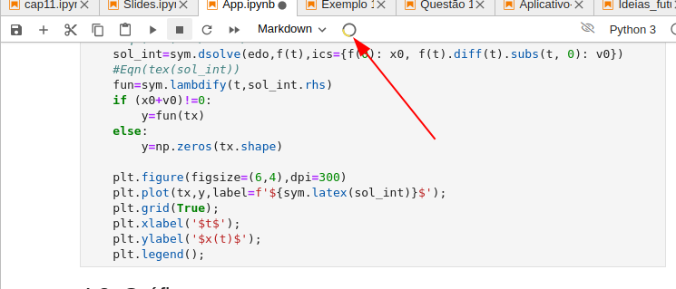

### Exemplo 19: Slides dinâmicos

É possível criar Slides com Widgets dinâmicos com o Voila. Para isso é necessário instalar outro pacote que adiciona o **template do Reveal js**. **Feche o Anaconda** e instale usando um dos comandos abaixo:

```bash
conda install -c conda-forge voila-reveal
```

ou

```
pip install voila-reveal
```

Agora é só abrir o arquivo `App.ipynb` e executar o comando comando:

```bash
voila "App.ipynb" --template=reveal
```

### Exemplo 20: Publicando o seu App na Web

**Existem diversos serviços na nuvem** que permitem upar seu Notebook Dinâmico usando o Voila. [A documentação do Voila](https://voila.readthedocs.io/en/stable/deploy.html) cita 3:

- [Binder](https://mybinder.org/) $\rightarrow$ Um dos principais serviços utilizados para compartilhar notebooks
- [Heroku](https://pythonforundergradengineers.com/deploy-jupyter-notebook-voila-heroku.html) $\rightarrow$ Serviço gratuito amplamente utilizado para Notebooks e Webapss
- [Google App Engine](https://cloud.google.com/appengine/) $\rightarrow$ Serviço pago da Google

Mais detalhes podem ser encontrados no link abaixo:

> [https://voila.readthedocs.io/en/stable/deploy.html](https://voila.readthedocs.io/en/stable/deploy.html)

> **Dica:** Ao upa o seu notebook na Nuvem você pode compartilhar **seus slides**.

