<center><div style="font-size:32px;display:inline-block;line-height:1.1;font-weight:bold;margin:0 0 15px" class="aula-title">Capítulo 3: Módulos e pacotes</div></center>

# Atividade 1: Importando um módulo

O python possui muitas funções e operadores que nativa da própria linguagem de programação  como os operadores básicos (+,-,\*,/), potenciação (\*\*) impressão de valores (`print()`,`.format()`), e etc. 

No entanto, há algumas **funcionalidades** que você irá precisar para produzir seu código, mas que **não tem nativamente** na linguagem Python, podemos então importar tais funcionalidades para o nosso trabalho como módulos. 

Agora vejam a definição de módulo segundo um trecho da a própria documentação do Python:

> Módulos são um **conjunto** de **códigos como funções, classes, variáveis, etc**. Se você estiver fazendo um programa e ele se tornar muito grande, difícil de ler e se situar nele, é uma boa prática dividi-lo em arquivos menores, para facilitar a manutenção. Também é preferível usar um arquivo separado para uma função que você escreveria em vários programas diferentes, para não copiar a definição de função em cada um deles.
>
> Para permitir isso, o Python tem uma maneira de **colocar as definições em um arquivo** e então usá-las em um script ou em uma execução interativa do interpretador. **Tal arquivo é chamado de módulo**; definições de um módulo podem ser importadas para outros módulos, ou para o módulo principal.

### Exemplo 1: Importando um módulo

Para o nosso primeiro exemplo vamos importar o módulo **math**, um módulo que extende o Python com algumas funcionalidades matemáticas.

Execute o célula abaixo:

> ```python
> import math # Nesta linha eu estou importando o módulo math
> ```

Feito isso, tente escrever o seguinte código e aperte `Tab`:

> ```python
> math.
> ```

Você verá todos as **funções** e **constantes (instâncias)** deste pacote, como mostra na Figura abaixo:

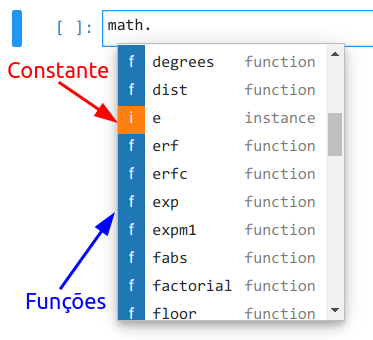

Agora apague a célula acima e vamos aprender à calcular a raiz quadrada. Para isso utilize a função `sqrt()` do módulo `math`.

> ```python
> num = int(input("Digite o número que quer calcular a raiz quadrada: "))
> raiz = math.sqrt(num) # A função sqrt() do módulo 'math' calcula a raiz quadrada 
> print("A raiz quadrada de {num} é {raiz}".format(num=num,raiz=raiz))
> ```
>
> Digite o número que quer calcular a raiz quadrada:  4  
> A raiz quadrada de 4 é 2.0

> **Dica:** Teste o exemplo acima com alguns valores, como 5, 4, 3, 2, etc.


Agora vamos arredondar o resultado da raiz utilizando a função `ceil()`.

> ```python
> num = int(input("Digite o número que quer calcular a raiz quadrada: "))
> raiz = math.sqrt(num) # A função sqrt() do módulo 'math' calcula a raiz quadrada 
> arredondar = math.ceil(raiz) # A função ceil() arredonda para cima um determinado valor
> print("A raiz quadrada (arredondada) de {num} é {raiz}".format(num=num,raiz=arredondar))
> ```
>
> Digite o número que quer calcular a raiz quadrada:  5  
> A raiz quadrada (arredondada) de 5 é 3

> **Dica:** Teste os exemplos acima com alguns valores, como 5, 4, 3, 2, etc.

Vamos praticar com uma constante. Procure a constante `pi` e execute:

> ```python
> math.pi
> ```
>
> 3.141592653589793

Agora vamos criar um programa capaz de calcular o seno de um ângulo dado em graus:

> ```python
> ang_graus = int(input("Digite um ângulo (Em graus): "))
> ang_rad = ang_graus*math.pi/180 #Observe que estamos utilizando a constante pi
> seno = math.sin(ang_rad) # A função sin() calcula o seno de um ângulo
> print("O seno de {ang_graus}° é {seno:.2g}".format(ang_graus=ang_graus,seno=seno))
> ```
>
> Digite um ângulo (Em graus):  60  
> O seno de 60° é 0.87

> **Dica:** Teste o exemplo acima com os ângulos 0, 30, 45, 60 e 90.

**Tarefa**: Crie um código que aceite um ângulo em graus como entrada, e imprima na tela o seu correspondente em radianos, o seu seno, cosseno e tangente.

> **Observação:** Utilize a função `radians()` para fazer a conversão de graus para radianos diretamente.

> **Dica:** Utilize as funções `sin()`, `cos()`, `tan()` para calcular o seno cosseno e tangente.

A saída do programa deve ser parecida com isso:

```
Digite o ângulo em graus:  45
O ângulo 0.79 rad, tem o seno 0.71, cosseno 0.71 e tangente 1
```

> **Dica:** Teste o exemplo acima com os ângulos 0, 30, 45, 60 e 90.

### Exemplo 2: Documentação do `math`

Praticamente todo módulo ou pacote do Python tem uma documentação disponível na internet. O módulo `math` é um módulo **built-in**, ou seja, ele é um módulo que já vem junto com o Python. Para estes módulos podemos olhar a própria documentação do Python. Essa documentação está disponível no menu `Help>Python Reference` ou no próprio [site do python](https://www.python.org/), na parte de **Docs**. 

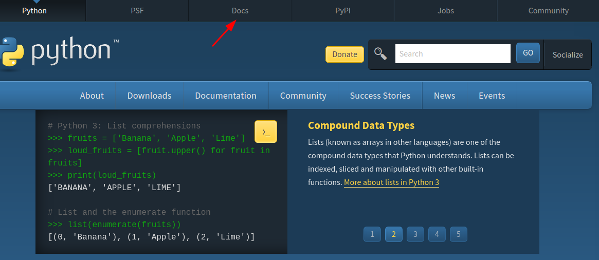

No caso do módulo de matemática, podemos utilizar o seguinte módulo direto:

https://docs.python.org/3/library/math.html

Lá podemos encontrar explicações detalhadas de todas as funções e constantes do módulo `math`.

**Tarefa 1:** Buscando na documentação do módulo `math`, crie um programa capaz de calcular as seguintes expressões:

- $e^x$
- $x!$
- $\log_{10}(x+1)$
- $(\pi+e)^x$

O usuário deve colocar como entrada o valor de $x$.

> **Observação:** Teste usar a função `pow()` no lugar do operador `**`.

A saída deve ser parecida com essa:

```
Digite o valor de x:  1
e^1=2.72
1!=1
log10(1+1)!=0.30
(pi+e)^1!=5.86
```

**Tarefa 2:** Crie um programa capaz de calcular a hipotenusa de um retângulo utilizando uma função do módulo `math`.

Sugestão de saída:

```
Digite o primeiro cateto: 3
Digite o segundo cateto: 4
A hipotenusa é 5
```

### Exemplo 3: `from` ... `import` ...

É muito chato toda vez que for utilizar alguma funcionalidade da função math, ter que escrever `math.` no início. Através da sintaxe:

```python
from [módulo] import [função1], [função2], [constante1], [etc]
```

Podemos incluir somente as funções e constantes que desejamos trabalhar e eliminamos a necessidade de utilizar `math.` no início. Veja o exemplo:

> ```python
> from math import pi
> pi
> ```
>
> 3.141592653589793

Vejamos um exemplo de como calcular o fatorial:

> ```python
> # Utilizando import
> import math 
> numero = int(input("Digite um valor: "))
> fat = math.factorial(numero)
> print("O fatorial de {} é {}.".format(numero, fat))
> ```

Percebemos agora, a maneira mais simples de importar um módulo, que é simplesmente digitando `import` e o nome do módulo logo em seguida. Na hora de chamar a função `factorial`precisamos especificar que ela pertence ao módulo em questão, por isso a chamamos com `math.factorial()`.  

Agora suponha que iremos usar apenas a função `factorial`, sem usar as outras funções do módulo de matemática, a outra forma de faze-lo é.

> ```python
> # Utilizando from import
> from math import factorial
> numero = int(input("Digite um valor: "))
> fat = factorial(numero)
> print("O fatorial de {} é {}.".format(numero, fat))
> ```

**Tarefa:** Refaça a tarefa abaixo importando todas as funções necessárias utilizando a notação `from` `ìmport`

> Crie um código que aceite um ângulo em graus como entrada, e imprima na tela o seu correspondente em radianos, o seu seno, cosseno e tangente.

### Exemplo 4: `from` ... `import` *

Caso não soubermos as funções que iremos utilizar, ou se iremos utilizar muitas funções de um determinado módulo, podemos importar todas as funções deste módulo utilizando a notação:

```python
from [módulo] import *
```

Veja o exemplo abaixo:

> ```python
> from math import *
> ang_graus = int(input("Digite um ângulo (Em graus): "))
> ang_rad = ang_graus*pi/180 #Observe que estamos utilizando a constante pi
> print("O seno de {}° é {:.2g}".format(ang_graus,sin(ang_rad)))
> ```
>
> Digite um ângulo (Em graus):  60  
> O seno de 60° é 0.87

`import *` é **prático**! Mas **tome cuidado**!

Segue alguns motivos para **não usar** o `import *`:

- Seu código não fica legível
- Não fica implícito no código da onde vem aquela função
- Caso um ou mais módulos tenham duas funções com o mesmo nome, **você não tem como escolher**, sempre será selecionada a última função importada!
- Bugs inesperados
- Etc

Isso não quer dizer que usar o `import *` é sempre ruim. Ele pode ser prático em códigos pequenos, ou em módulos que você já conhece bem e que você saiba o que está fazendo.

Para mais detalhes clique [aqui](https://www.geeksforgeeks.org/why-import-star-in-python-is-a-bad-idea).

### Exemplo 5: Outros módulos _built-in_

Além do módulo math, existem outros módulos _built-in_ e você pode encontrá-los na documentação do Python, em `Library reference` (A página tem o título `Python Library Standard `)

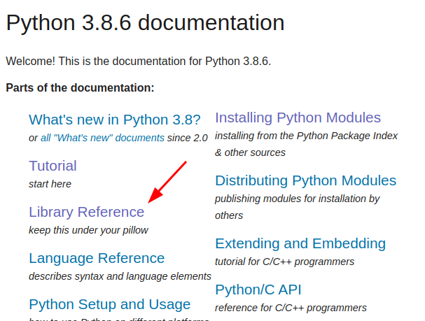

Esta página mostra diversos módulos em formas de categorias.

Para continuarmos os nossos exercícios vamos utilizar uma outro módulo de matemática, o módulo `random`. Ele está na seção `Numeric and Mathematical Modules`. Vamos ver um exemplo com a função `random()`:

> ```python
> from random import random # A função random() gera um float aleatório de 0.0 <= x < 1.0
> from math import floor # A função ceil() arredonda para baixo
> ```
>
> ```python
> aleatorio=floor(10*random()) # Gera um número aleatório de 0 a 9
> aleatorio
> ```
>
> 5

Observe que nesse exemplo para conseguir esse efeito combinamos duas funções de módulos diferentes.

**Tarefa 1:** Olhando a documentação do módulo `random` refaça o exemplo sem utilizar o módulo `math`.

**Tarefa 2:** Lendo a documentação indique quais módulos são mais adequados para:

- Trabalhar com o tempo (Horas, dias, semanas)
- Trabalhar com arquivos de audio do tipo WAV
- Criar programas com interface gráfica (GUI)
- Trabalhar com frações

### Exemplo 6: Renomeando módulos

Uma outra forma de importar módulos é renomeando-o. Observe novamente o exemplo do fatorial:

> ```python
> import math as m
> numero = int(input("Digite um valor: "))
> fat = m.factorial(numero)
> print("O fatorial de {} é {}.".format(numero, fat))
> ```
>
> Digite um valor:  5  
> O fatorial de 5 é 120.

Observe que a sintaxe `import math as m` tornou o mesmo módulo disponível agora por um nome diferente, no caso, `mat`. Dessa forma, podemos chamar uma função do módulo como `m.função`, como mostrado acima. Essa funcionalidade é particularmente útil quando o nome do módulo é grande e a tarefa de escreve-lo diversas vezes torna-se chata, como é mostrado abaixo:

> ```python
> import matplotlib.pyplot as plt # Submódulo para plotar gráficos
> ```

Sempre **prefira essa notação ao invés de `ìmport `**, pois desta forma você deixa o código legível e evita a tarefa chata de ter que escrever o nome do módulo toda vez que vai utilizar uma funcionalidade do módulo.

**Tarefa:** Considere o código abaixo, substituia o `from math import *` por `ìmport math as m`:

```python
from math import *
ang_graus = int(input("Digite um ângulo (Em graus): "))
ang_rad = ang_graus*pi/180 #Observe que estamos utilizando a constante pi
print("O seno de {}° é {:.2g}".format(ang_graus,sin(ang_rad)))
```

# Atividade 2: Pacotes do Anaconda

Como dito anteriormente, podemos ver os módulos como se fossem caixas com diversas funções úteis dentro, e que podemos acessa-las com um `import`.  

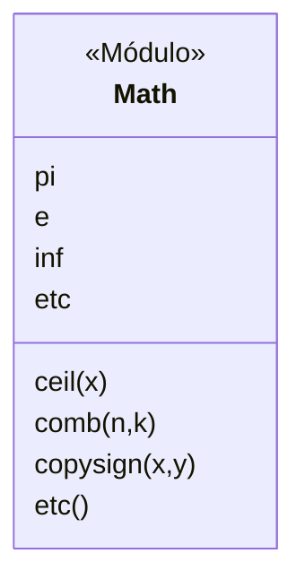

> **Figura 1:** Representação do módulo Math.

No python, também há o conceito de Pacote. Podemos ver os pacotes como módulos que contém outros módulos separados por temática. Na imagem abaixo temos o pacote `Game`. Dentro deste pacote existem outros módulos.

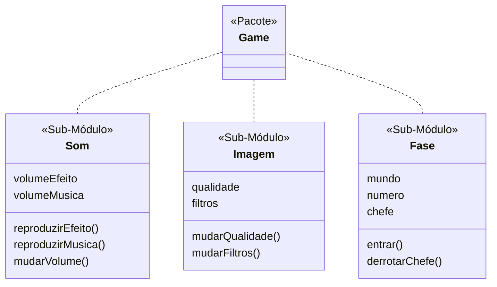

> **Figura 2:** Conceito de pacote.

O nosso pacote fictício agora possui vários sub-módulos, cada um deles com diversas funções diferentes e de modo mais organizado na visão do programador. 

Muitos dos pacotes utilizados pela comunidade Python não vem por padrão na linguagem. Por sorte o **Anaconda trás diversos pacotes úteis** para o programador Python. Desta forma não precisamos nos preocupar em instalar muitos pacotes utilizados na comunidade Python. Podemos citar alguns exemplos de pacotes que vem junto com o Anaconda:

- Numpy - Gerenciamento de arrays e matrizes
- Matplotlib - Gráficos e plotagens
- Scipy - Computação científica
- Sympy - Variáveis simbólicas
- Seaborn - Visualização de dados com estatística
- Pandas - Análise de dados
- OpenCV - Processamento de imagens
- TensorFlow - Machine learning
- Pillow - Visualização e filtragem de imagens
- Orange - Análise de dados

Pode ser que na sua máquina estes pacotes não estejam instalados. Entretanto podemos instalá-los utilizando o terminal e utilizando o comando:

> `conda install [pacote]`

O `conda` é o gerenciador de pacotes do Anaconda. Através desse comando podemos instalar, pesquisar e desinstalar pacotes. Abaixo segue alguns comandos que podemos utilizar no gerenciador de pacotes do Anaconda.

| Comando              | Função                                                   |
| -------------------- | -------------------------------------------------------- |
| `install [pacote]`   | Instala um pacote                                        |
| `--help`             | Ajuda                                                    |
| `uninstall [pacote]` | Remove um pacote                                         |
| `search [palavra]`   | Procura por um determinado pacote baseado em uma palavra |
| update               | Faz o update de todos os pacotes do Anaconda             |

### Exemplo 1: Gerenciador de pacote `conda`

**Tarefa:** Utilizando o comando `conda search` tente procurar pelos seguintes pacotes:

- Orange
- OpenCV
- Pillow

Agora **instale** o pacote **Orange**. Utilize a sequencia de comandos abaixo:

```bash
conda search orange
conda install orange3
```

Feche a abra o Anaconda. 

Verá que agora é possível abrir o Orange no Anaconda Navigator.

Finalmente, **desinstale o Orange**.

### Exemplo 2: Aplicação de um pacote

Para entender melhor o conceito de pacote vamos utilizar o exemplo de uma trajetória de um projetil.

O pacote `sympy`  permite trabalhar com variáveis simbólicas. Variáveis simbólicas são variáveis que armazenam uma incógnita, como por exemplo $t$, $x$, $y$.

> **Observação:** A documentação deste pacote pode ser encontrada no menu `Help > Sympy Reference`. Alternativamente você pode [clicar aqui](https://docs.sympy.org/latest/index.html).

A documentação dos módulos disponíveis nesse pacote pode ser encontrada [clicando aqui](https://docs.sympy.org/latest/modules/index.html). 

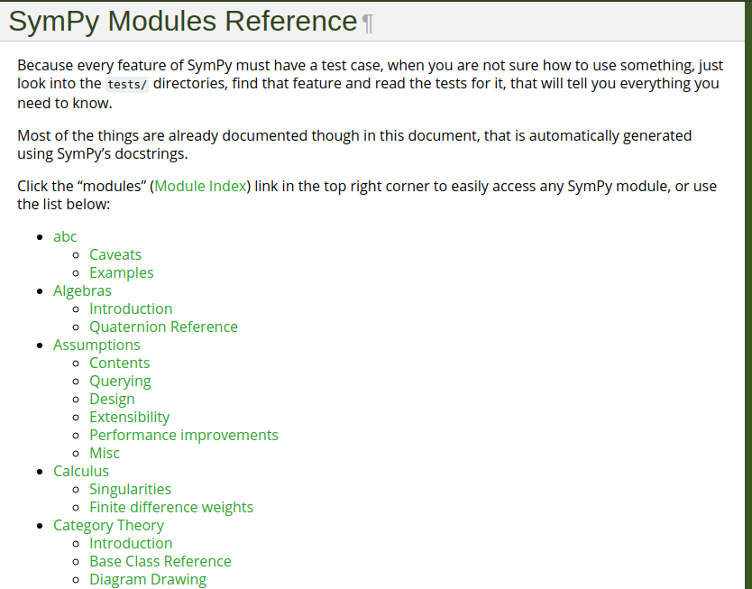

Observe que neste pacote existem muitos submódulos, que contém muitas classes e funções. Para facilitar a nossa vida, segue o diagrama abaixo que apresenta apenas funções importantes para este exemplo:

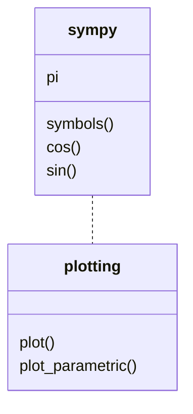

> **Figura 3:** Funções do pacote `sympy` utilizadas nessa atividade.

Agora, considere que a trajetória de um projétil lancada na superfície da terra é governada pela seguinte função:
$$
f(x)=-5x^2+20x
$$
Antes de tudo é necessário importar `sympy`.

> ```python
> import sympy
> ```

> **Observação:** Caso apareça um erro ao importar `sympy` provavelmente o pacote não está instalado na sua máquina. Use o comando:
>
> ```
> conda install sympy
> ```

Depois podemos criar a variável simbólica de $x$ usando a função `symbols()`:

> ```python
> x = sympy.symbols('x') 
> x
> ```
>
> $x$

Feito isso podemos escrever a trajetória do projétil:

> ```python
> f=-5*x**2+20*x
> f
> ```
>
> $-5x^2+20x$

Se quisermos plotar a trajetória desse projétil devemos recorrer ao submódulo `plotting` que pertence a pacote `sympy`. Observe na Figura 3 que o submódulo está em uma hierarquia abaixo de `sympy`, então devemos utilizar a notação abaixo:

```python
import [nome_do_pacote].[submodulo]
```

Importando o submódulo `plotting`:

> ```python
> import sympy.plotting #importando o submódulo plotting do pacote sympy
> ```

Agora podemos plotar a trajetória utilizando a função `plot()` neste submódulo:

> ```python
> sympy.plotting.plot(f,(x,0,4))
> ```
>
> 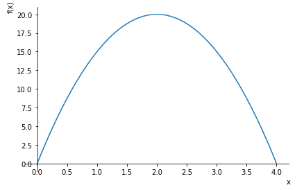

Observe que usamos a expressão `(x,0,4)` para limitarmos a plotagem entre $0$ e $4$. Se tirarmos essa opção ele vai definir o intervalo de $-10$ à $10$.

> ```python
> sympy.plotting.plot(f)
> ```
>
> 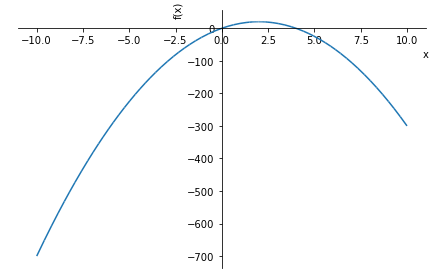

O que é fisicamente impossível, pois estamos considerando que o solo está situado em $x=0$.

Observe que para utilizar a função `plot()` tivemos que escrever o nome do submódulo inteiro. Para evitar essa tarefa chata podemos recorrer às sintaxes `from` ... `import` ... ou `import` ... `as` ... . Veja o mesmo exemplo acima reescrito:

> ```python
> from sympy import symbols
> import sympy.plotting as plt
> 
> x = symbols('x')
> f = -5*x**2+20*x
> plt.plot(f,(x,0,4))
> ```
>
> 

A notação `from` ... `import` ... também funciona com submódulos:

> ```python
> from sympy import symbols
> from sympy import plotting
> 
> x = symbols('x')
> f = -5*x**2+20*x
> plotting.plot(f,(x,0,4))
> ```
>
> 

E ainda, podemos customizar o nosso gráfico adicionando parâmetros na função `plot()`, que estão disponíveis na [documentação](https://docs.sympy.org/latest/modules/plotting.html#plot-class). Alguns destes parâmetros estão disponíveis na tabela abaixo:

| Parâmetro        |                                                             |
| ---------------- | ----------------------------------------------------------- |
| title            | Adiciona um título                                          |
| xlabel           | Adiciona um título para o eixo x                            |
| ylabel           | Adiciona um título para o eixo y                            |
| xlim             | limita o intervalo do eixo x                                |
| ylim             | limita o intervalo do eixo y                                |
| line_color = 'r' | Mudar a cor do gráfico (Utilize o nome das cores em inglês) |

> ```python
> from sympy import symbols
> from sympy.plotting import plot
> 
> x = symbols('x')
> f = -5*x**2+20*x
> plot(f,(x,0,4),
>   ylim=(0,25),
>   xlabel="Distância (m)",
>   ylabel="Altura (m)",
>   title="Trajetória de um projetil",
>   line_color = 'Red'
>  )
> ```
>
> 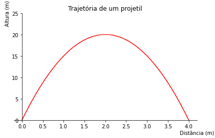

Podemos customizar um pouco mais o nosso gráfico utilizando o submódulo `style` do pacote `matplotlib`, através da função `use()`.

> ```python
> from sympy import symbols
> from sympy.plotting import plot
> from matplotlib import style
> style.use('seaborn-whitegrid')
> 
> x = symbols('x')
> f = -5*x**2+20*x
> plot(f,(x,0,4),
>   ylim=(0,25),
>   xlim=(0,4.005), #Adicionando um pouco mais de espaço para corrigir a grid
>   xlabel="Distância (m)",
>   ylabel="Altura (m)",
>   title="Trajetória de um projetil"
>  )
> ```
>
> 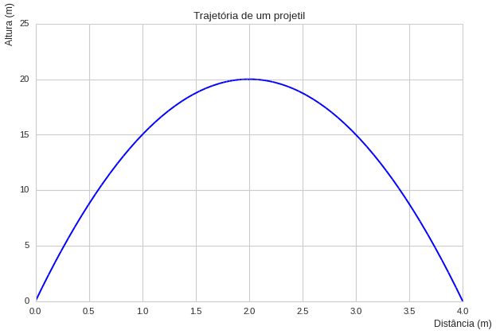

Para encontrar mais estilos você pode [clicar aqui](https://python-graph-gallery.com/199-matplotlib-style-sheets/), ou através da [documentação](https://matplotlib.org/tutorials/introductory/customizing.html) do pacote.

> **Observação:** Iremos ver o pacote `matplotlib` com mais detalhes futuramente.

**Tarefa:** A equação paramétrica de uma elipse é dada por:
$$
\begin{cases}
	x(\theta)=a\cos(\theta)\\
	y(\theta)=b\sin(\theta)
\end{cases}
$$
Construa um programa capaz de gerar uma elipse utilizando a função `plot_parametric()`. 

- O programa deve ter como entrada $a$ e $b$;

- O título do gráfico deve ter os raios $a$ e $b$;
- Os limites dos eixos x e y devem ser $\pm1,2a$ e $\pm1,2b$, respectivamente;
- Use o estilo `classic`;
- O gráfico deve ter a cor verde.

> **Dicas:** 
>
> - Use ctrl+F na documentação para encontrar esta função.
> - Todas as funções que você precisa está na Figura 3.

A saída do seu gráfico deve ser parecida com:

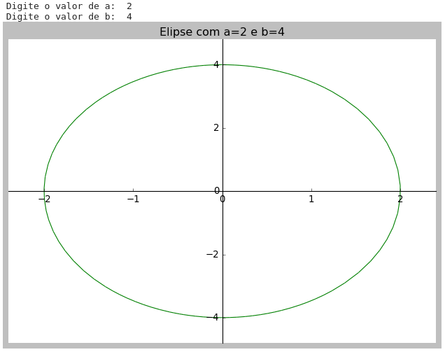

# Atividade 3: Pacotes externos

## Parte 1: Python Package Index (PyPI)

Existem outros gerenciadores de pacotes além do `conda`. O **Python Package Index (PyPI)**, ou simplesmente `pip`, é o gerenciador padrão do Python, e muitas vezes só podemos encontrar um pacote neste gerenciador. Você pode encontrar um link do site oficial do `pip` no próprio site do Python. 

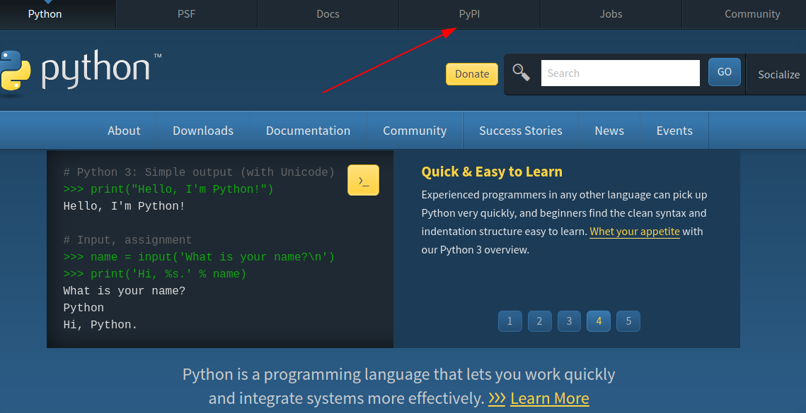

Segundo este mesmo site no momento em que este roteiro está sendo escrito existem **267182 pacotes disponíveis para instalar** através desse gerenciador. 

Você pode encontrar uma pequena descrição do pacote ao buscar dentro desta plataforma.

Geralmente os **pacotes têm seu código fonte disponível no [Github](https://github.com/)**, portanto se no site [pypi](https://pypi.org/) não tiver muita informação desse pacote, procure-o no Github, com uma simples pesquisa no Google:


> **Observação:** Inclusive este site está hospedado no Github.

Outro site muito relevante para encontrar documentação de pacotes em python é o [Read the Docs](https://readthedocs.org/), um site de documentação.

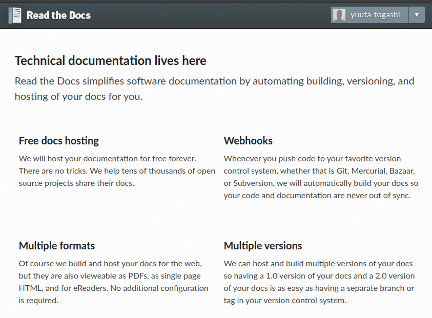

Por exemplo, o própria documentação do JupyterLab está hospedada lá:

> [https://jupyterlab.readthedocs.io/en/latest/](https://jupyterlab.readthedocs.io/en/latest/)

A sintaxe  de comando do `pip` é muito parecida com a do `conda`:

| Comando              | Função                                                   |
| -------------------- | -------------------------------------------------------- |
| `install [pacote]`   | Instala um pacote                                        |
| `--help`             | Ajuda                                                    |
| `uninstall [pacote]` | Remove um pacote                                         |
| `search [palavra]`   | Procura por um determinado pacote baseado em uma palavra |
| update               | Faz o update de todos os pacotes do Anaconda             |

Mais comandos podem ser vistos [aqui](https://dzone.com/articles/most-important-quotpipquot-commands-for-a-python-d).

### Exemplo 1: Instalando um pacote

Para exemplificar o uso `pip` vamos instalar o pacote `pyperclip`:

- Github: [https://github.com/asweigart/pyperclip](https://github.com/asweigart/pyperclip)
- Read the docs: [https://pyperclip.readthedocs.io/en/latest/](https://pyperclip.readthedocs.io/en/latest/)
- Pypi: https://pypi.org/project/pyperclip/

**Tarefa 1:** Instale o pacote `pyperclip` (Entre no Pypi e copie o link

### Exemplo 2: Exemplo de uso de um módulo

O módulo `pyperclip` é usado para trabalhar com os comandos copiar (Ctrl+C) e colar (Ctrl+V) do computador. Nele, há duas funções principais:

| Função  | Comando          |
| ------- | ---------------- |
| copy()  | Copia o conteúdo |
| paste() | Cola o conteúdo  |

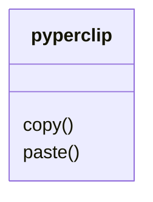

> ```python
> import pyperclip as ppc
> 
> item1 = input("Digite o nome do item 1: ")
> item2 = input("Digite o nome do item 2: ")
> item3 = input("Digite o nome do item 3: ")
> qt1 = int(input("Digite a quantidade do item 1: "))
> qt2 = int(input("Digite a quantidade do item 2: "))
> qt3 = int(input("Digite a quantidade do item 3: "))
> i1 = "Item 1: " + item1
> i2 = "Item 2: " + item2
> i3 = "Item 3: " + item3
> 
> 
> print("{:_^50}".format('Lista de estoque'))
> print("{:-<45}{}".format("Item","Quant"))
> print("{item:-<47}{quant:03d}".format(item=i1,quant=qt1))
> print("{item:-<47}{quant:03d}".format(item=i2,quant=qt2))
> print("{item:-<47}{quant:03d}".format(item=i3,quant=qt3))
> 
> lista = "{:_^50}\n".format('Lista de estoque')  + "{:-<45}{}\n".format("Item","Quant") + "{item:-<47}{quant:03d}\n".format(item=i1,quant=qt1)+"{item:-<47}{quant:03d}\n".format(item=i2,quant=qt2) + "{item:-<47}{quant:03d}\n".format(item=i3,quant=qt3)
> 
> ppc.copy(lista)
> ```
>
> Digite o nome do item 1:  Arroz  
> Digite o nome do item 2:  Feijão  
> Digite o nome do item 3:  Leite  
> Digite a quantidade do item 1:  4  
> Digite a quantidade do item 2:  1  
> Digite a quantidade do item 3:  6  
> _________________Lista de estoque_________________  
> Item--------------------------------------------------------Quant  
> Item 1: Arroz----------------------------------004  
> Item 2: Feijão---------------------------------001  
> Item 3: Leite----------------------------------006

**Tarefa:** Substitua o último `print()` pelo seu `Ctrl+C` como saída de dados do seguinte código. Cole o resultado como uma célula Raw (OBS: Não é Markdown).

> **Dica:** No modo de comando utilize a tecla `R`.

```python
print("Este programa resolve uma equação de segundo grau do tipo ax²+bx+c=0")
a=int(input("Digite o valor de a: "))
b=int(input("Digite o valor de b: "))
c=int(input("Digite o valor de c: "))
delta=b**2-4*a*c
x1=(-b+delta**(1/2))/(2*a)
x2=(-b-delta**(1/2))/(2*a)
print("As soluções da equação {:f}x²+{:f}x+{:f}=0 são: x1={:g} e x2={:g}".format(a,b,c,x1,x2))
```

## Parte 2: Exemplos de módulos e pacotes

No exemplo anterior utilizamos o pacote `pyperclip`, ele é um pacote útil para quem quer trabalhar com programas de interface que precisam de alguma forma trabalhar com a área de transferência.

Na área de Engenharia Elétrica existem uma infinidade de pacotes úteis que podem ser instalados através do `pip` (ou `conda`) ou seguindo as instruções no `github`.

> **Observação:** Estou dando dicas de pacotes da Engenharia Elétrica, porque é a área que eu trabalho.

Agora vamos mostrar dois exemplos.

### Exemplo 1: Python-control

Python Control Systems Library

**Descrição:** Permite a análise e operação de sistemas de controle.

**Documentação:** [http://python-control.readthedocs.org/](http://python-control.readthedocs.org/)

**Repositório (Github):** [https://github.com/python-control/python-control](https://github.com/python-control/python-control)

**Instalação (PyPI):** [https://pypi.org/project/control/](https://pypi.org/project/control/)

```bash
conda install -c conda-forge control slycot #Método recomendado
```

ou

```bash
pip install slycot   # optional; see below
pip install control
```

**Exemplo relevante:**

[https://github.com/python-control/python-control/blob/master/examples/bode-and-nyquist-plots.ipynb](https://github.com/python-control/python-control/blob/master/examples/bode-and-nyquist-plots.ipynb)

**Foto relevante:**

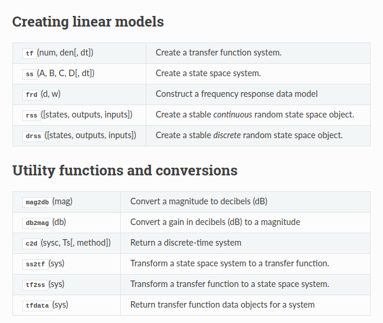

### Exemplo 2: Lcapy

**L**inear **C**ircuit **A**nalysis

**Descrição:** 

- Lcapy é um pacote para análise de circuitos lineares. 
- Usa o SymPy para a análise simbólica.
- Permite o desenho de alguns esquemáticos utilizando código Python.

**Documentação:** [http://lcapy.elec.canterbury.ac.nz/](http://lcapy.elec.canterbury.ac.nz/)

**Repositório (Github):** https://github.com/ahkab/ahkab

**Instalação (PyPI):**  https://pypi.org/project/lcapy/

```
pip install lcapy
```

**Exemplo relevante:** 

[https://github.com/mph-/lcapy/blob/master/doc/examples/notebooks/superposition1.ipynb](https://github.com/mph-/lcapy/blob/master/doc/examples/notebooks/superposition1.ipynb)

**Foto relevante:**

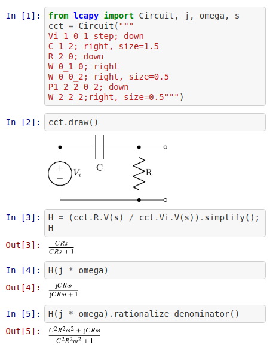

### Exemplo 3: Outros pacotes

Além dos pacotes citados nos Exemplos 1 e 2, existem muitos outros. Segue o nome de alguns:

- [pysimCoder](https://www.youtube.com/watch?v=FZcxfEIOzWs) $\rightarrow$ Editor parecido com o Simulink - Apenas Linux
- [PySpice]( https://pyspice.fabrice-salvaire.fr/) $\rightarrow$ Simulador de circuitos
- [SchemDraw](https://schemdraw.readthedocs.io/en/latest/) $\rightarrow$ Desenho de circuitos
- [py-dss-interface](https://pypi.org/project/py-dss-interface/) $\rightarrow$ Interface do Python com o OpenDSS (Não precisa instalar o OpenDSS) - Apenas Windows

**Tarefa:** Faça um resumo do Pacote `blockdiag`. Siga o formato dos exemplos 1 e 2.

Para adicionar a foto utilize a sintaxe de foto do Markdown:

```markdown

<!-- Exemplo -->

```

# Atividade 4: Para casa

## Exercício 3: Plotando um gráfico

Crie um programa capaz de plotar uma onda seinodal no formato:
$$
y(t)=Acos(\omega t+\delta)
$$
onde $A$ é a amplitude, $\delta$ é a fase da onda e $\omega=2\pi f$ é a frequência da onda.

O usuário deve entrar com $A$, $\delta$ e $f$.

Considere os seguintes parâmetros para o gráfico:

- O título do gráfico deve ter todos os parâmetros da onda;

- Os limites do eixo y deve ser $\pm1,2A$;
- O limite do eixo x deve ser de $2$ segundos;
- Use o estilo `ggplot`;
- O gráfico deve ter a cor preta.

Veja o exemplo de saída:

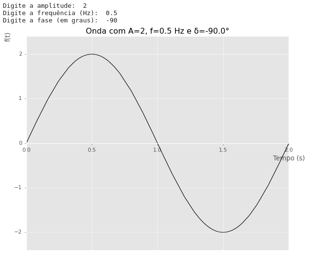

## Exercício 4: Descobrindo pacotes

Pesquise na internet um pacote de Python que seja útil na sua área e faça um resumo desse pacote. Siga o formato dos exemplos da Atividade 3, parte 2.


