<center><div style="font-size:32px;display:inline-block;line-height:1.1;font-weight:bold;margin:0 0 15px" class="aula-title">Capítulo 4: Estruturas de decisão</div></center>

# Atividade 1: Extensões do Jupyter

Enquanto os módulos e pacotes permitem adicionar funcionalidades ao Python, as extensões permitem adicionar funcionalides ao Jupyter Lab (Ou Jupyter Notebook).

Para instalar as extensões podemos ir no Menu lateral do Jupyter e clicar no ícone em formato de uma peça de quebra cabeças:

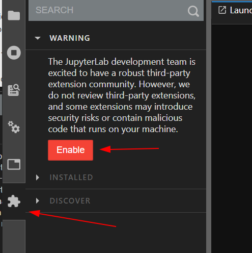 

Muito provavelmente as extensões do Jupyter estarão desativadas. Para ativá-las clique em **Enable**. Ao clicar no botão diversas extensões irão aparecer no menu **DISCOVER**, onde você pode pesquisar por novas extensões.

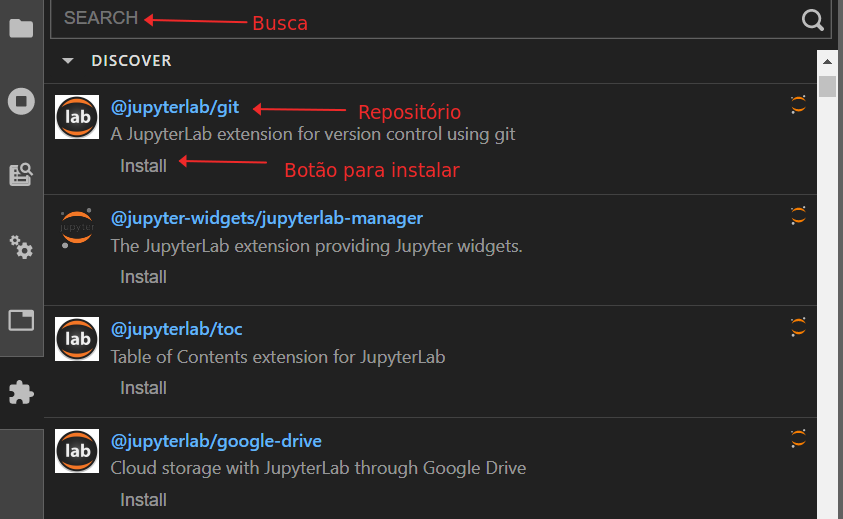

Lá você vai encontrar opções como **área de busca** para pesquisar por extensões. O Link para o repositório (Código fonte) e um botão para instalar a extensão (Botão **Install**).

Com as extensões podemos adicionar diversas funcionalidades como:

- Widgets (Várias extensões)
- Suporte ao LaTeX (`@jupyter-widgets/jupyterlab-manager`)
- Criação de diagrama de blocos (`jupyterlab-drawio`)

### Exemplo 1: Instalando a primeira extensão

Muitas extensões tem dependências, portanto, caso você não tenha todas dependências instaladas irá aparecer um aviso de erro. A Figura abaixo mostra o que acontece se você **tentar instalar a extensão `@jupyterlab/toc`**. 

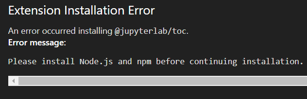

Nela basicamente diz que eu não tenho instalado na minha máquina o `Node.js`.  

**Entre no respositório da extensão `jupyterlab-toc`**:

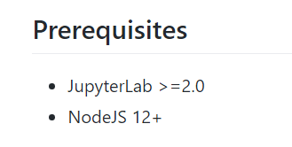

Descendo para **Prerequisitos** veremos que para essa extensão funcionar precisamos do **JupterLab** e do **NodeJS**. O JupyterLab já temos, falta o NodeJS.

Feche o Jupyter Notebook e instale a dependência `Node.js` utilizando o comando abaixo:

```bash
conda install nodejs
```

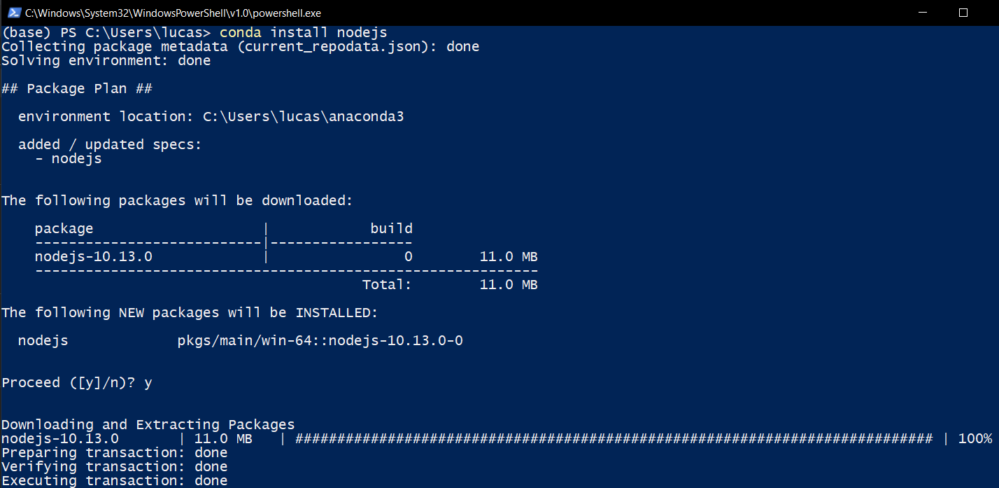

Agora podemos podemos abrir o Jupyter Lab e **instalar a extensão clicando em install**. 

Depois de instalada a extenção irá aparecer na aba **Installed** e um pop-up azul apareça perguntando se você quer reconstruir (**Rebuild**) o Jupyter. Clique neste opção.

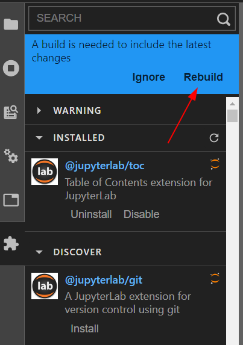

> **Observação:** Ao clicar em **Rebuild** pode ser que demore um pouco.

Feito isso irá aparecer uma caixa de mensagem perguntando se você quer reiniciar a página. Clique em **Reload**:

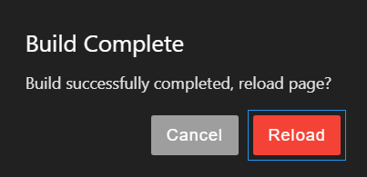

O Jupyter irá reiniciar e aparecerá um novo ícone no menu lateral. Clique nele e verá que agora o Jupyter Lab tem suporte à sumário. A Figura abaixo mostra o sumário do capítulo 3.

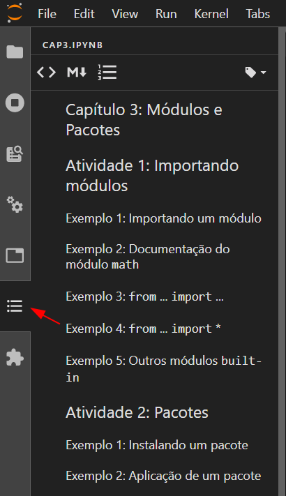

> **Observação:**  Tente sempre instalar no ambiente do Anaconda.

Alternativamente, podemos instalar uma extensão diretamente no terminal através do comando:

```bash
jupyter labextension install [nome_da_extensão]
```

Como o nome da nossa extensão é `@jupyterlab/toc`, utilizamos o comando:

```bash
jupyter labextension install @jupyterlab/toc
```

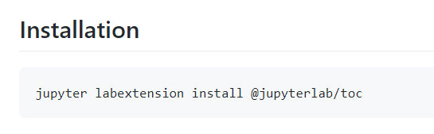

Assim como é recomendado no próprio repositório da extensão. 

**Tarefa:** Explore a extensão. Como eu faço para:

- Adicionar ou remover numeração aos títulos;
- Mostra ou esconder células de código na aba da extensão;
- Mostrar ou esconder células de Markdown na aba da extensão.

# Atividade 2: Bloco if

<!---

> Aqui Gustavo vai falar do IF

-->

Blocos de instrução são um conjunto de instrução que estão no mesmo nível de indentação. Até o momento sempre trabalhamos com instruções sem identação. No caso de instruções multi-linha, a indentação só é contada na primeira linha da instrução.

Por exemplo, neste código nenhuma instrução está indentada:

> ```python
> print("Instrução 1") #Início da instrução 1
> print( #Início da instrução 2
>   "Instrução 2"
> )
> 
> print( #Início da instrução 3
>  "Instrução 3"
> )
> ```
>
> Instrução 1  
> Instrução 2  
> Instrução 3

Os blocos de instrução constroem hierarquias e estas, podem ser reconhecidas visualmente, até porque, níveis hierarquicos diferentes, estarão a distâncias diferentes da margem esquerda do editor.

```python
#bloco principal (Nível 0)
#bloco principal (Nível 0)
#bloco principal (Nível 0)
   #bloco 1 (Nível 1)
   #bloco 1 (Nível 1)
   #bloco 1 (Nível 1)
       #bloco 2 (Nível 2)
       #bloco 2 (Nível 2)
       #bloco 2 (Nível 2)
       #bloco 2 (Nível 2)
    #bloco 3 (Nível 1)
    #bloco 3 (Nível 1)
    #bloco 3 (Nível 1)
#bloco principal (Nível 0)
#bloco principal (Nível 0)
#bloco principal (Nível 0)
```

Até agora, somente demos instruções sequenciais ao computador. Nunca pedimos ao nosso código que tome decisões, isso que aprenderemos agora. Já parou pra pensar como o seu cérebro decide se compra um saco de arroz ou não baseado no preço? O fluxograma do pensamento deve ser algo mais ou menos assim.

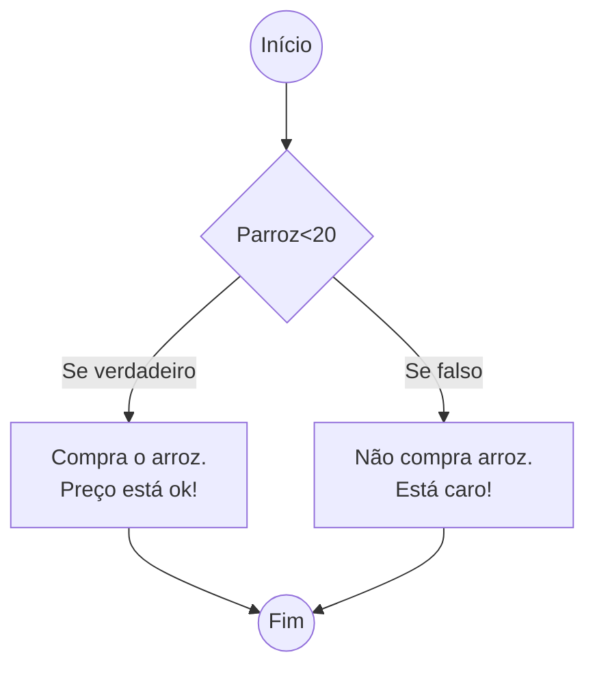

Você começa o pensamento examinando o preço do arroz, caso ele seja menor que um determinado valor, você compra, caso contrário, não compra. Nós podemos escrever um código que execute exatamente o que está no gráfico acima, veja na próxima seção.

No Python apresenta a seguinte sintaxe:

```python
if condicao:
    # Instruções do bloco IF só são executadas quando a condição é verdadeira
```

Quando a condição do `if` é verdadeira é executada uma ação dentro do bloco `if`, quando é falsa o conteúdo do bloco não é executado:

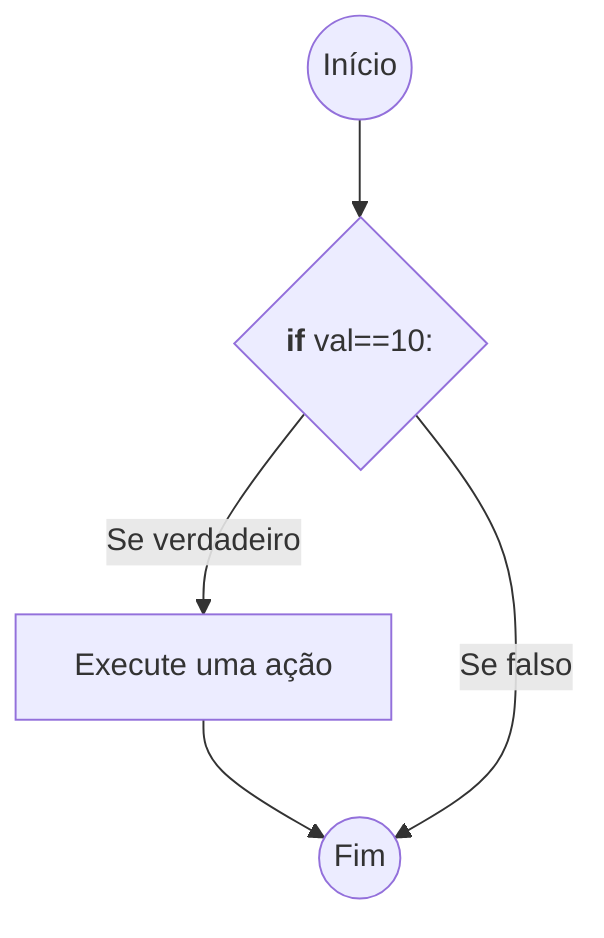


Veja o exemplo abaixo:

> ```python
> print("Nível 0. Este código está rente a margem do código.")
> 
> var = 10
> if(var == 10): # Se x é igual a 10 então faça
>     # Isto só é executado quando a condição é verdadeira
>     print("Estamos no bloco 1, isto é, a 4 espaçamentos da margem.")
>     print("Essa é a segunda linha do bloco 'if'. ")
> print("Agora, voltamos para o bloco principal do programa.")
> ```
>
> Nível 0. Este código está rente a margem do código.  
> Estamos no bloco 1, isto é, a 3 espaçamentos da margem.  
> Essa é a segunda linha do bloco 'if'.   
> Agora, voltamos para o bloco principal do programa.  

### Exemplo 1: Estrutura do `if`

> ```python
> cpf = input('Digite seu CPF: ')
> if not cpf.isdigit():
>     print('CPF inválido.')
> ```
>
> Digite seu CPF:  12312asd
> CPF inválido.

Genericamente, se uma condição for verdadeira (`True`), ele executará o bloco de código correspondente.

### Exemplo 1: Problema do arroz

Podemos utilizar mais de um bloco `if` na mesma célula, como é mostrado abaixo:

> ```python
> x = int(input("Digite o preço do arroz: "))
> if x < 20:
>       print('R${:.2f} é um bom preço. Compre o arroz.'.format(x))
> if x >= 20:
>       print('R${:.2f} está muito caro. Não compre o arroz.'.format(x))
> ```
>    
> Digite o preço do arroz:  25   
>R$25.00 está muito caro. Não compre o arroz.

Observe nos dois códigos acima que a linha logo após o `if` está espaçada um parágrafo (tab) a frente. Isso se chama **indentação** dos blocos do código. A condição que prossegue o `if`é um bloco e deve ser **indentado** um nível abaixo, caso contrário, o código resultará em erro.

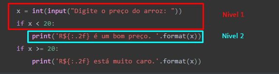

### Exemplo 3: Verificação de senha   

> ```python
> senha = input('Senha: ')
> if len(senha) < 8:
> 	print('Sua senha deve ter pelo menos 8 caracteres.')
> if len(senha) > 8 and (len(senha) < 16):
> 	print('Senha válida.')
> if len(senha) > 16:
> 	print('Sua senha deve ter menos de 16 caracteres.')
> ```

Existe ainda o `if` aninhado, que seria um bloco `if` dentro de um bloco `if` maior.

> ```python
> senha = input('SENHA: ')
> if len(senha) >= 8:
> 	if len(senha) <= 16:
> 		print('Senha válida.')
> if len(senha) < 8:
> 	print('Senha inválida.')
> ```


### Exemplo 2: `if` aninhados

Existe ainda o if aninhado, que seria um bloco if dentro de um bloco if maior.

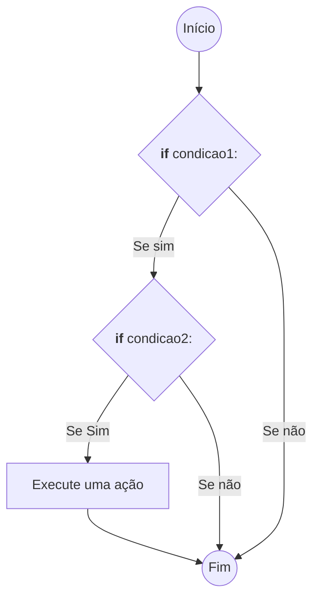

Veja um exemplo em Python:

> ```python
> senha = input('SENHA: ')
> if len(senha) >= 8:
>    if len(senha) <= 16:
>         print('Senha válida.')
> if len(senha) < 8:
>    print('Senha inválida.')
> ```

Observe a indentação dos blocos de código. O segundo `if` está no bloco abaixo do anterior, isso significa que ele está "dentro" do outro `if`.  

Podemos fazer ainda:

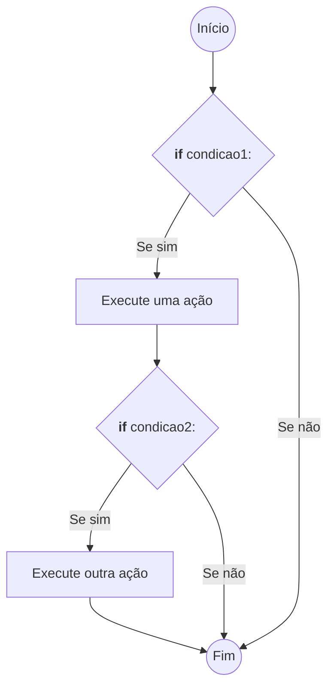

Veja um exemplo em Python

> ```python
> nome = str(input("Qual é seu nome?"))
> if nome in 'Gustavo Felipe João':
>     print("Nome masculino",end=' ')
>     if nome=='Gustavo':
>         print("e charmoso")
> ```
>
> Qual é seu nome? Gustavo  
> Nome masculino e charmoso

**Tarefa 1**: peça ao usuário uma senha. Você deve verificar se ela possui de 8 carácteres até 16 e se ela é composta por números e letras. Informe ao usuário se a senha é válida ou não.

### Exemplo 3: `if-else`

Vimos há pouco que `if` verifica se um estado lógico é `True` ou `False` e retorna o bloco de código correspondente. O `else` vem para tratar o estado lógico oposto ao anterior.

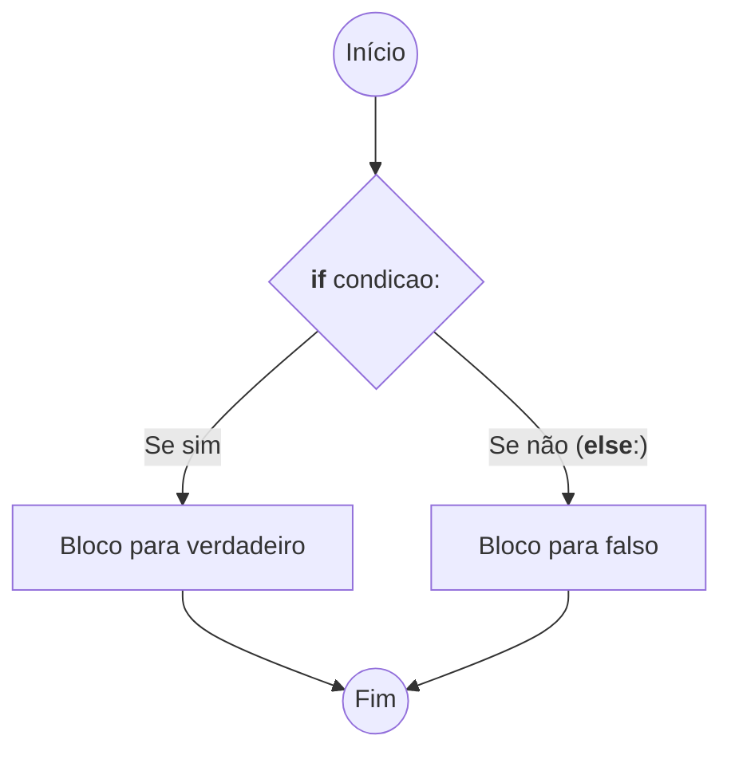


Veja um exemplo em Python:

> ```python
> senha = input('SENHA: ')
> if (len(senha) >= 8) and (len(senha) <= 16): #Se
>       print('Senha válida')
> else: #Se não
>       print('Senha inválida')
> ```
>
> SENHA:  Macarrão_com_carne   
> Senha inválida

**Tarefa 2:** Refaça o exemplo da **Tarefa 1** utilizando `else` para simplificar o código.

### Exemplo 4: `elseif`

O `elif` é a junção do bloco if e else. Ele nega a condição anterior, mas inputa uma nova condição.

<!---

Esse exemplo não foi proposital foi o exemplo do Gustavo Guanabara

--->

> ```python
> nome = str(input("Qual é seu nome?"))
> if nome == 'Gustavo': #se
>       print("Que nome bonito!")
> elif nome == 'Pedro' or nome == 'Maria' or nome == 'Paulo': #senão se
>       print("Não é tão bonito quanto Gustavo")
> elif nome in 'Ana Cláudia Jéssica Juliana': #senão se
>       print("Belo nome feminino")
> else: #senão
>       print('Se nome é normal')
> ```
>
> Qual é seu nome? Gustavo  
> Que nome bonito!

**Tarefa:** Faça um programa que faça 5 perguntas para uma pessoa sobre um crime. As perguntas são:

1. "Telefonou para a vítima?"

2. "Esteve no local do crime?"

3. "Mora perto da vítima?"

4. "Devia para a vítima?"

5. "Já trabalhou com a vítima?" 

O programa deve no final emitir uma classificação sobre a participação da pessoa no crime. 

Se a pessoa responder positivamente a 2 questões ela deve ser classificada como "Suspeita", entre 3 e 4 como "Cúmplice" e 5 como "Assassino". Caso contrário, ele será classificado como "Inocente".

### Exemplo 5: Validação de senha

Vamos criar um programa que receba uma senha do usuário e imprima na tela um texto dizendo se ela é fraca, forte ou inválida.

A senha é considerada forte se cumprir todos os requisitos:  

1. Tiver 8 ou mais caracteres  
2. Tiver letras maiúsculas e minúsculas  
3. Tiver combinações de letras e números

A senha é considerada fraca se cumprir pelo menos um dos requisitos:  

1. Tiver menos que 8 caracteres 
2. Tiver somente letras maiúsculas ou minúsculas   
3. Tiver somente letras ou somente números

A senha é considerada inválida se cumprir pelo menos um dos requisitos:

1. Tiver caracteres não alfanuméricos
2. Tiver menos que 5 caracteres

```python
psw = input('Digite uma senha')

if (len(psw) < 5) or not(psw.isalnum()): #Verificar se é inválida
    print('Senha inválida')
else:
    print('Senha válida')
    if len(psw) > 7 and not(psw.islower() or psw.isupper()) and not(psw.isalpha() or psw.isdecimal()):
        print('Senha forte')
    else:
        print('Senha fraca')
```

> **Observação:** Mostrar também os métodos islower(), isupper(), isalnum().

**Tarefa:** O Paulo é um vendedor e quer verificar se receberá bônus este ano. Existe uma tabela de bonificações de acordo com o nº de produtos vendidos. Veja abaixo:

**Bônus de 10%:**

- 100 vendas ou valor de vendas superior a R$10.000,00;

**Bônus de 20%:**

- 200 vendas ou valor de vendas superior a R$20.000,00;

**Bônus de 30%:**

- 300 vendas ou valor de vendas superior a R$30.000.

Paulo não conhece a tabela de bonificação e irá inserir no sistema o valor financeiro total de vendas realizadas e a quantidade total de vendas e quer saber quanto a mais ele irá receber. O seu salário é igual a R$2.000,00.

# Atividade 3: Para casa

### Exercício 1: Interrogatório

Faça um programa que faça 5 perguntas para uma pessoa sobre um crime. As perguntas são:

1. "Telefonou para a vítima?"

2. "Esteve no local do crime?"

3. "Mora perto da vítima?"

4. "Devia para a vítima?"

5. "Já trabalhou com a vítima?" 

O programa deve no final emitir uma classificação sobre a participação da pessoa no crime. 

Se a pessoa responder positivamente a 2 questões ela deve ser classificada como "Suspeita", entre 3 e 4 como "Cúmplice" e 5 como "Assassino". Caso contrário, ele será classificado como "Inocente".

### Exercício 2: Aumento de salário

As Organizações Tabajara resolveram dar um aumento de salário aos seus colaboradores e lhe contrataram para desenvolver o programa que calculará os reajustes.

Faça um programa que recebe o salário de um colaborador e o reajuste segundo o seguinte critério, baseado no salário atual:

- Salários até R<span>\$</span> 280,00 (incluindo): aumento de 20%;
- Salários entre R<span>\$</span> 280,00 e R<span>$</span> 700,00: aumento de 15%; 
- Salários entre R<span>\$</span> 700,00 e R<span>\$</span> 1500,00: aumento de 10%;
- Salários de R\$ 1500,00 em diante: aumento de 5%;


Após o aumento ser realizado, informe na tela:

- O salário antes do reajuste;
- O percentual de aumento aplicado;
- O valor do aumento;
- O novo salário, após o aumento.

