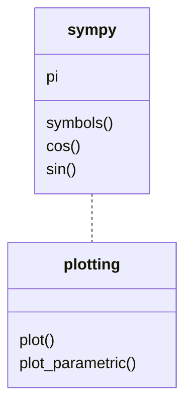
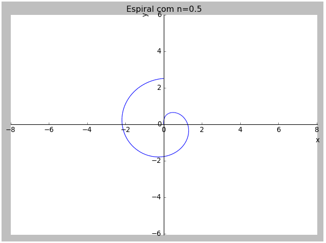
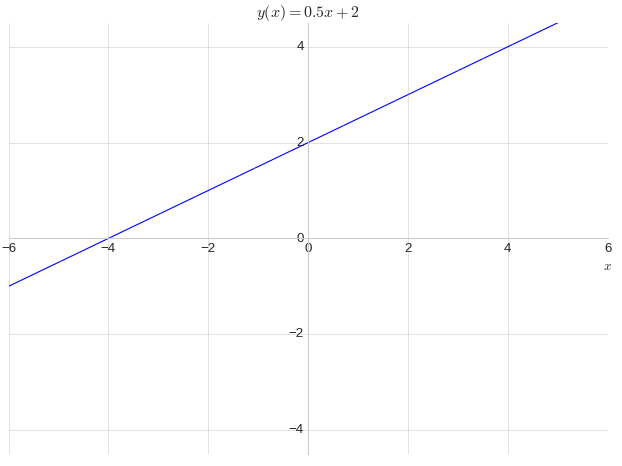
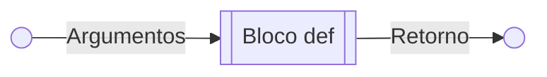

<center><div style="font-size:32px;display:inline-block;line-height:1.1;font-weight:bold;margin:0 0 15px" class="aula-title">Capítulo 4: Widgets e estruturas de controle</div></center>

# Atividade 1: Extensões do Jupyter

Enquanto os módulos e pacotes permitem adicionar funcionalidades ao Python, as extensões permitem adicionar funcionalides ao Jupyter Lab (Ou Jupyter Notebook).

Para instalar as extensões podemos ir no Menu lateral do Jupyter e clicar no ícone em formato de uma peça de quebra cabeças:

 

Muito provavelmente as extensões do Jupyter estarão desativadas. Para ativá-las clique em **Enable**. Ao clicar no botão diversas extensões irão aparecer no menu **DISCOVER**, onde você pode pesquisar por novas extensões.


Lá você vai encontrar opções como **área de busca** para pesquisar por extensões. O Link para o repositório (Código fonte) e um botão para instalar a extensão (Botão **Install**).

Com as extensões podemos adicionar diversas funcionalidades como:

- Widgets (Várias extensões)
- Suporte ao LaTeX (`@jupyter-widgets/jupyterlab-manager`)
- Criação de diagrama de blocos (`jupyterlab-drawio`)

### Exemplo 1: Instalando a primeira extensão

Muitas extensões tem dependências, portanto, caso você não tenha todas dependências instaladas irá aparecer um aviso de erro. A Figura abaixo mostra o que acontece se você **tentar instalar a extensão `@jupyterlab/toc`**. 


Nela basicamente diz que eu não tenho instalado na minha máquina o `Node.js`.  

**Entre no respositório da extensão `jupyterlab-toc`**:


Descendo para **Prerequisitos** veremos que para essa extensão funcionar precisamos do **JupterLab** e do **NodeJS**. O JupyterLab já temos, falta o NodeJS.

Feche o Jupyter Notebook e instale a dependência `Node.js` utilizando o comando abaixo:

```bash
conda install nodejs
```


Agora podemos podemos abrir o Jupyter Lab e **instalar a extensão clicando em install**. 

Depois de instalada a extenção irá aparecer na aba **Installed** e um pop-up azul apareça perguntando se você quer reconstruir (**Rebuild**) o Jupyter. Clique neste opção.


> **Observação:** Ao clicar em **Rebuild** pode ser que demore um pouco.

Feito isso irá aparecer uma caixa de mensagem perguntando se você quer reiniciar a página. Clique em **Reload**:


O Jupyter irá reiniciar e aparecerá um novo ícone no menu lateral. Clique nele e verá que agora o Jupyter Lab tem suporte à sumário. A Figura abaixo mostra o sumário do capítulo 3.


> **Observação:**  Tente sempre instalar no ambiente do Anaconda.

Alternativamente, podemos instalar uma extensão diretamente no terminal através do comando:

```bash
jupyter labextension install [nome_da_extensão]
```

Como o nome da nossa extensão é `@jupyterlab/toc`, utilizamos o comando:

```bash
jupyter labextension install @jupyterlab/toc
```


Assim como é recomendado no próprio repositório da extensão. 

**Tarefa:** Explore a extensão. Como eu faço para:

- Adicionar ou remover numeração aos títulos;
- Mostra ou esconder células de código na aba da extensão;
- Mostrar ou esconder células de Markdown na aba da extensão.

### Exemplo 2: Adicionando suporte à Widgets

Até o momento vimos como entrada de dados a função `input()`. Contudo existem outras formas de entrada mais elegantes, como através do uso de Widgets. 

Para adicionar suporte ao Widgets vamos recorrer ao pacote `ipywidgets`, cujo a documentação é apresentada em: 

> [https://ipywidgets.readthedocs.io/](https://ipywidgets.readthedocs.io/)

Para apresentar os widgets vamos começar adicionando um `IntSlider()`.

> ```python
> import ipywidgets as widget #Importando o pacote com o apelido de widgets
> widget.IntSlider() #Adicionando um slider de inteiros através da função intSlider
> ```
>
> IntSlider(value=0)

Contudo, ao executar esse código irá aparecer apenas um texto. Desta forma, **a inclusão do pacote no código não é suficiente para adicionar o suporte a Widgets**. Vamos resolver isso instando os **Jupyter Widgets:**


Siga o mesmo precedimento para instalar a extensão **Table of Contents**, e execute o código novamente:

> ```python
> import ipywidgets as widget #Importando o pacote com o apelido de widgets
> widget.IntSlider() #Inicializando um IntSlider
> ```
>
> <p>
>   <input type="range" min="0" max="100" value="0" class="slider" id="slider-1">
>   <span id="val-1"></span>
> </p>
> <script>
>     var slider1 = document.getElementById("slider-1");
>     var output1 = document.getElementById("val-1");
>     output1.innerHTML = slider1.value;
>     slider1.oninput = function() {
>       output1.innerHTML = this.value;
>     }
> </script>

Verá que irá aparecer um `Slider` de inteiro.

Alternativamente, podemos mostrar sliders através da função `display()`, do módulo `IPython.display`:

> ```python
> from ipywidgets import IntSlider #Importando a função IntSlider
> from IPython.display import display #Importando a função display
> 
> slider=IntSlider() #Inicializando o IntSlider
> display(slider) #Mostra o slider
> ```
>
> <p>
>   <input type="range" min="0" max="100" value="0" class="slider" id="slider-2">
>   <span id="val-2"></span>
> </p>
> <script>
>     var slider2 = document.getElementById("slider-2");
>     var output2 = document.getElementById("val-2");
>     output2.innerHTML = slider2.value;
>     slider2.oninput = function() {
>       output2.innerHTML = this.value;
>     }
> </script>

Provavelmente não será necessário importar a função display, pois ela já é carregada no Jupyter. Desta forma o código acima simplifica em:

> ```python
> from ipywidgets import IntSlider #Importando a função IntSlider
> 
> slider=IntSlider() #Inicializando o IntSlider
> ```
>
> ```python
> display(slider) #Mostra o slider
> slider.value
> ```
>
> <p>
> <input type="range" min="0" max="100" value="0" class="slider" id="slider-3">
> <span id="val-3"></span>
> </p>
> <script>
>  var slider3 = document.getElementById("slider-3");
>  var output3 = document.getElementById("val-3");
>  output3.innerHTML = slider3.value;
>  slider3.oninput = function() {
>    output3.innerHTML = this.value;
>  }
> </script>

**Tarefa:** Além do `IntSlider` existe uma extensa lista de Widgets que podem ser vista. Tente inicializar e mostrar os seguintes Widgets:

- Text
- Checkbox
- FloatSlider

### Exemplo 3: Customizando os Widgets

De forma similar aos gráficos que aprendemos a plotar no capítulo anterior, os Widgets também são customizáveis. 

Todas as opções de customizações de todos os tipos de sliders podem ser vistos na [documentação](https://ipywidgets.readthedocs.io/en/latest/examples/Widget%20List.html#). Porém, abaixo segue o exemplo com algumas opções de alguns Widgets que utilizaremos neste capítulo. Tentem executar todos os códigos:

- `IntSlider` retorna inteiros:

> ```python
> widget.IntSlider(
>      value=5, # Valor inicial
>      min=0, # Valor mínimo
>      max=10, # Valor máximo
>      step=1, # Passo
>      description='Número:' #Descrição
> )
> ```
>
> <p>
> Número:  
> <input type="range" min="0" max="10" value="5" class="slider" id="slider-6">
> <span id="val-6"></span>
> </p>
> <script>
>  var slider6 = document.getElementById("slider-6");
>  var output6 = document.getElementById("val-6");
>  output6.innerHTML = slider6.value;
>  slider6.oninput = function() {
>    output6.innerHTML = (this.value).toString();
>  }
> </script>

- `FloatSlider` retorna ponto flutuante:

> ```python
> widget.FloatSlider(
>      value=5.5, # Valor inicial
>      min=-10.0, # Valor mínimo
>      max=10.0, # Valor máximo
>      step=0.5, # Passo
>      description='Decimal:' #Descrição
> )
> ```
>
> <p>
> Decimal:  
> <input type="range" min="-100" max="100" value="55" step="5" class="slider" id="slider-7">
> <span id="val-7"></span>
> </p>
> <script>
>  var slider7 = document.getElementById("slider-7");
>  var output7 = document.getElementById("val-7");
>  output7.innerHTML = (slider7.value/10).toFixed(2);
>  slider7.oninput = function() {
>    output7.innerHTML = (this.value/10).toFixed(2);
>  }
> </script>

- `Checkbox` retorna booleano (Verdadeiro ou falso):

> ```python
> widget.Checkbox(
>      value=False, # Valor inicial
>      description='Booleano', # Descrição
>      indent=False # Indentação
> )
> ```
>
> <p>
> Booleano: 
> <input type="checkbox" class="check">
> </p>

- `Text` retorna uma string:

> ```python
> widget.Text(
>      value='', # Valor inicial
>      placeholder='Digite seu nome', #Nome que aparece quando não escreve nada
>      description='Nome: ' # Descrição
> )
> ```
>
> <p>
>     Nome: 
>     <input type="text" placeholder="Digite seu nome">
> </p>
>
> 

### Exemplo 4: Acessando os valores dos Widgets

Toda vez que declaramos um Widget ele inicializa com um valor inicial no parâmetro `value`. 

Por exemplo, digamos que queremos criar um slider chamado em uma célula:

> ```python
> # Célula 1: Declarando o widget chamado Peso
> Peso = widget.FloatSlider(
>     value=5, # Valor inicial
>     min=30, # Valor mínimo
>     max=100, # Valor máximo
>     step=0.1, # Passo
>     description='Peso (kg):' # Descrição
> )
> ```

E em outra célula mostramos o widget (através da função `display()`):

> ```python
> # Célula 2: Mostrando o widget
> display(Peso)
> ```

E na última célula mostramos o resultado:

> ```python
> # Célula 3: Mostrando o valor do Peso
> print("O valor do peso é {} kg.".format(Peso.value))
> ```

No final o conjunto das três células é a seguinte:

> ```python
> # Célula 1: Declarando o widget chamado Peso
> Peso = widget.FloatSlider(
> value=5, # Valor inicial
> min=30, # Valor mínimo
> max=100, # Valor máximo
> step=0.1, # Passo
> description='Peso (kg):' # Descrição
> )
> ```
>
> ```python
> # Célula 2: Mostrando o widget
> display(Peso)
> ```
>
> <p>
> Peso (kg): 
> <input type="range" min="300" max="1000" value="429" step="1" class="slider" id="slider-5">
> <span id="val-5"></span>
> </p>
> <script>
> var slider5 = document.getElementById("slider-5");
> var output5 = document.getElementById("val-5");
> output5.innerHTML = (slider5.value/10).toFixed(2);
> slider5.oninput = function() {
> output5.innerHTML = (this.value/10).toFixed(2);
> }
> </script>
>
> 
>
> ```python
> # Célula 3: Mostrando o valor do Peso
> print("O valor do peso é {} kg.".format(Peso.value))
> ```
>
> O valor do peso é 42.9 kg.

Observe que **declaramos o widget em uma célula** e **mostramos o widget em outra célula**. Isso é necessário pois **toda vez que você declara um Widget ele sempre inicializa com o valor padrão**, desta forma caso o `display()` esteja na mesma célula toda iteração sera perdida ao executar esta célula novamente.

### Exemplo 5: Utilizando Widgets em problemas práticos

Para exemplificar o uso dos Widgets vamos apresentar um problema prático de plotagem de gráfico.

<!---

> Gustavo dá uma aula sobre Espiriais e equações paramétricas​ (Pode dá o exemplo da elipse)

--->

Em coordenadas cartesianas as espirais devem utilizar equações paramétricas. A forma geral das espirais no plano cartesiano é:
$$
h(\theta)=\begin{cases}
	x(\theta)=\theta^n\cdot \cos(\theta)\\
	y(\theta)=\theta^n\cdot \sin(\theta)
\end{cases}
$$
Vamos plotar o gráfico de $h(\theta)$ utilizando a função `plot_parametric()` do pacote `sympy` (Figura 1):



> **Figura 1:** Funções do pacote `sympy`.

O programa deve ter as seguintes entrada:

- $n$: `FloatSlider` com os seguintes parâmetros:
  - Valor mínimo: $-0,5$;
  - Valor máximo: $1;$
  - Passo: $0,5$.

- O título do gráfico deve ter o valor de $n$;
- O título dos eixos x e y devem ser $x$ e $y$, respectivamente;
- Os limites dos eixos x e y devem ser $\pm8$ e $\pm(8\times(3/4))$, respectivamente. Desta forma mantemos a proporção dos eixos iguais.
- Use o estilo `seaborn-whitegrid`.

> ```python
> # Célula 1: Definindo os sliders
> n = widget.FloatSlider(
>  description = "n:",
>  value = 1,
>  min = -0.5,
>  max = 1,
>  step = 0.5
> )
> ```
>
> ```python
> # Célula 2: Mostrando os Sliders
> display(n)
> ```
>
> <p>
> n: 
> <input type="range" min="-5" max="10" value="5" step="5" class="slider" id="slider-A">
> <span id="val-A"></span>
> </p>
> <script>
> var sliderA = document.getElementById("slider-A");
> var outputA = document.getElementById("val-A");
> outputA.innerHTML = (sliderA.value/10).toFixed(2);
> sliderA.oninput = function() {
> outputA.innerHTML = (this.value/10).toFixed(2);
> }
> </script>
>
> ```python
> # Célula 3: Plotando o gráfico
> from sympy import symbols, sin, cos, pi
> from sympy.plotting import plot_parametric
> from matplotlib import style
> style.use('classic')
> 
> theta = symbols('θ')
> x = theta**n.value*sin(theta)
> y = theta**n.value*cos(theta)
> 
> plot_parametric(x,y,(theta,0,2*pi),
>              xlim=(-8,8.04),
>              ylim=(-8.06*3/4,8*3/4),
>              title="Espiral com n={}".format(n.value),
>              xlabel="x",
>              ylabel="y")
> ```
>
> 


**Tarefa:** Uma reta é dada por:
$$
y(x)=ax+b
$$

- $a$: `FloatSlider` com os seguintes parâmetros:
  - Valor mínimo: $-3;$
  - Valor máximo: $3$;
  - Valor inicial: $1$;
  - Passo: $0,5$.
- $b$: `IntSlider` com os seguintes parâmetros:
  - Valor mínimo: $-4$;
  - Valor máximo: $4$;
  - Valor inicial: $0$;
  - Passo: $2$.
- O título do gráfico deve ter a equação da reta `$y(x)=[a]x+[b]$`;
- O título do eixo x deve ser $x$;
- O eixo $y$ não deve ter título;
- Os limites dos eixos x e y devem ser $\pm4$ e $\pm(4\times 9/16)$, respectivamente;
- Use o estilo `seaborn-whitegrid`.



# Atividade 2: Usando `interact()`

Blocos de instrução são um conjunto de instrução que estão no mesmo nível de indentação. 

Até o momento sempre trabalhamos com instruções sem identação. No caso de instruções multi-linha, a indentação só é contada na primeira linha da instrução.

Por exemplo, neste código nenhuma instrução está indentada:

> ```python
> print("Instrução 1") #Início da instrução 1
> print( #Início da instrução 2
>     "Instrução 2"
> )
> 
> print( #Início da instrução 3
> "Instrução 3"
> )
> ```
>
> Instrução 1  
> Instrução 2  
> Instrução 3

Os blocos de instrução constroem hierarquias e estas, podem ser reconhecidas visualmente, até porque, níveis hierarquicos diferentes, estarão a distâncias diferentes da margem esquerda do editor.

```python
#bloco principal (Nível 0)
#bloco principal (Nível 0)
#bloco principal (Nível 0)
   #bloco 1 (Nível 1)
   #bloco 1 (Nível 1)
   #bloco 1 (Nível 1)
       #bloco 2 (Nível 2)
       #bloco 2 (Nível 2)
       #bloco 2 (Nível 2)
       #bloco 2 (Nível 2)
#bloco principal (Nível 3)
#bloco principal (Nível 3)
#bloco principal (Nível 3)
```

No Python existem blocos específicos que iremos aprender durante o curso, porém vamos começar apresentando um bloco chamado `def`. Este é o bloco utilizado para construir funções, mas **a principio utilizaremos apenas no conceito de Widgets**.

<!---

Aqui Gustavo vai falar do conceito de funções de forma bem básica

-->

As funções são trechos de códigos que tem entrada e saída:

- As entradas são chamadas de argumentos;
- A instrução de saída é chamada de retorno.

Na prática a função funciona como uma "caixa preta" que tem como entrada os argumentos e como saída o retorno (ou instrução de retorno) da função:



O bloco `def` é utilizado para **definir as funções** e tem o seguinte formato:

```python
def nome_da_função(argumento1,argumento2,argumento3,etc):
   """
   Instruções da função
   """
   return saida
```

### Exemplo 1: Introdução ao `interact`

Na atividade anterior aprendemos o conceito de Widgets e vimos como eles são úteis para construção de entradas mais elegantes. Porém **da maneira que utilizamos o uso de Widgets requerer a criação de três células**, e ainda, não é nada eficiente modificar o Widget e ter que executar a célula seguinte.

A função interact permite a criação de widgets de forma muito mais simples do que vimos anteriormente. Além disso, com este método é possível executar o código ao interagir com o widget. 

Para trabalhar com o interact é necessário definir uma função, vamos começar com uma função que retorna o valor de entrada:

> ```python
> # Bloco principal (Nível 0)
> from ipywidgets import interact
> def f(x):
>      # Bloco 1 (Nível 1)
>      return print("O valor de x é {:d}".format(x))
> # Bloco principal (Nível 1)
> interact(f,#Nome da função
>       x=5 #Variável ou widget
>      )
> ```
>
> <p>
> x  
> <input type="range" min="-5" max="15" value="5" class="slider" id="slider-B">
> <span id="val-B"></span><br>
> O valor de x é -5<br>
> <function __main__.f(x)>
> </p>
> <script>
> var sliderB = document.getElementById("slider-B");
> var outputB = document.getElementById("val-B");
> outputB.innerHTML = sliderB.value;
> sliderB.oninput = function() {
> outputB.innerHTML = (this.value).toString();
> }
> </script>
>
> 

A partir deste exemplo podemos concluir que a sintaxe básica do `ìnteract` é:

```python
interact(nome_da_funcao,valor)
```

Toda vez que você executa um widget ele executa tudo que está dentro da função (bloco `def`) e retorna a instrução da linha `return`.

Observe também foi imprimido um valor indesejado:

```
<function __main__.f(x)>
```

Isso aconteceu porque a função interact retorna o tipo da função `<function __main__.f(x)>`, desta forma a função foi salva na variável `_` e imprimida na tela. Veja o que acontece quando mandamos imprimir `_`

> ```python
> _
> ```
>
> <function \_\_main\_\_.f(x)>

Podemos remover essa saída adicionando `;` ao final da instrução `ìnteract()`, assim suprimimos a saída.

> ```python
> # Bloco principal (Nível 0)
> from ipywidgets import interact
> def f(x):
>      # Bloco 1 (Nível 0)
>      return print("O valor de x é {}".format(x))
> # Bloco principal (Nível 0)
> interact(f,x=5);
> ```
>
> <p>
> x  
> <input type="range" min="-5" max="15" value="5" class="slider" id="slider-C">
> <span id="val-C"></span><br>
> O valor de x é 5
> </p>
>
> <script>
> var sliderC = document.getElementById("slider-C");
> var outputC = document.getElementById("val-C");
> outputC.innerHTML = sliderC.value;
> sliderC.oninput = function() {
> outputC.innerHTML = (this.value).toString();
> }
> </script>

**Tarefa:** O tipo de Widget criado pela função `ìnteract()` depende do tipo de entrada. Repita o exemplo anterior considerando:

- `x=2.0`
- `x=1`
- `x=True`
- `x=""`
- `x="Digite o seu nome"`

### Exemplo 2: Abreveação  de Widgets

Quando você passa um argumento inteiro, como `5` (`x=5`) para o interact. A função cria um slider de inteiro no intervalo de $x\in[-5;3\cdot5]$. Neste caso `5` é abreviação de:

```python
IntSlider(min=-5, max=15, step=1, value=5)
```

De fato, conseguimos o mesmo resultado quando passamos o próprio `IntSlider` como valor de `x`:

> ```python
> # Bloco principal (Nível 0)
> from ipywidgets import interact
> def f(x):
>       # Bloco 1 (Nível 0)
>       return print("O valor de x é {}".format(x))
> # Bloco principal (Nível 0)
> interact(f,x=widget.IntSlider(min=-5, max=15, step=1, value=5));
> ```
>
> <p>
> x  
> <input type="range" min="-5" max="15" value="5" class="slider" id="slider-D">
> <span id="val-D"></span><br>
> O valor de x é 5
> </p>
>
>
> <script>
> var sliderD = document.getElementById("slider-D");
> var outputD = document.getElementById("val-D");
> outputD.innerHTML = sliderD.value;
> sliderD.oninput = function() {
> outputD.innerHTML = (this.value).toString();
> }
> </script>

A tabela abaixo mostra os diferentes tipos de argumentos:

| Argumento                                                  | Widget      |
| ---------------------------------------------------------- | ----------- |
| Valor booleano: `True` ou `False`                          | Checkbox    |
| String: `"Uma frase"` ou `""`                              | Text        |
| Inteiro: `valor`, `(min,max)` ou `(min,max,passo)`         | IntSlider   |
| Ponto flutuante: `valor`, `(min,max)` ou `(min,max,passo)` | FloatSlider |

Se o segundo parâmetro de `interact()` for passado como `x=(min,max)`  é produzido um slider com um valor mínimo e máximo com os respectivos valores de `min` e `max`. O valor do passo é por padrão `1` e o valor inicial é o meio do intervalo (Considerando o passo).

Por exemplo:

> ```python
> # Bloco principal (Nível 0)
> from ipywidgets import interact
> def f(x):
>       # Bloco 1 (Nível 0)
>       return print("O valor de x é {}".format(x))
> # Bloco principal (Nível 0)
> interact(f,x=(0,10)); #widget.IntSlider(min=0, max=10)
> ```
>
> <p>
> x  
> <input type="range" min="0" max="10" value="5" class="slider" id="slider-F">
> <span id="val-F"></span><br>
> O valor de x é 5
> </p>
>
> <script>
> var sliderF = document.getElementById("slider-F");
> var outputF = document.getElementById("val-F");
> outputF.innerHTML = sliderF.value;
> sliderF.oninput = function() {
> outputF.innerHTML = (this.value).toString();
> }
> </script>

E se o segundo parâmetro for passado como `x=(min,max,passo)` irá produzir um slider com o valor mínimo, máximo e o passo definido:

> ```python
> # Bloco principal (Nível 0)
> from ipywidgets import interact
> def f(x):
>    # Bloco 1 (Nível 0)
>    return print("O valor de x é {}".format(x))
> # Bloco principal (Nível 0)
> interact(f,x=(0.0,10.0,0.5)); #widget.FloatSlider(min=0.0, max=10.0,step=0.5)
> ```
>
> <p>
> x  
> <input type="range" min="0" max="10" value="5" class="slider" id="slider-H">
> <span id="val-H"></span><br>
> O valor de x é 5.0
> </p>
> <script>
> var sliderH = document.getElementById("slider-H");
> var outputH = document.getElementById("val-H");
> outputH.innerHTML = sliderH.value;
> sliderH.oninput = function() {
> outputH.innerHTML = (this.value).toString();
> }
> </script>

**Tarefa:** Crie um programa capaz de calcular a área, $A$, e o volume, $V$ de uma esfera. Considere as equações abaixo para fazer o cálculo:
$$
A=4\pi r^2
$$

$$
V=\frac{4}{3}\pi r^3
$$

O programa deve ter como entrada o raio $r$, que deve ser representado na forma de FloatSlider com valor mínimo de 1, máximo de 10 e passo de 0,1.

### Exemplo 3: Widgets e gráficos


# Atividade 3: Condicionais

