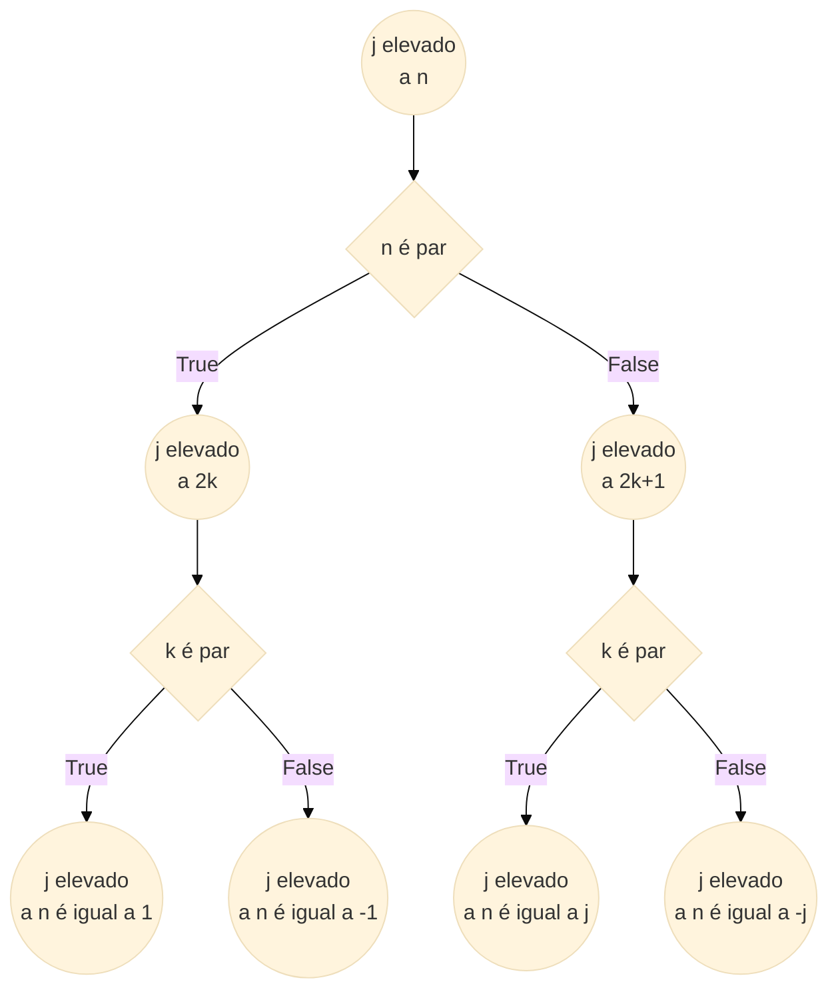

<center><div style="font-size:32px;display:inline-block;line-height:1.1;font-weight:bold;margin:0 0 15px" class="aula-title">Capítulo 5: Laço de repetição while</div></center>

# Atividade 1: while

O `while` é uma estrutura de repetição comum em quase todas as linguagens de programação, assim como o `if` (já visto anteriormente). Estas duas estruturas possuem semelhanças: ambas possuem uma condição e o passo que deve ser executado deve estar devidamente **identado**.

Para facilitar a compreensão, imagine o `while` como uma estrutura `if` que executa um bloco de código **enquanto** a condição for verdadeira ou o laço seja explicitamente encerrado com `break`. Caso ela seja falsa, executa outro bloco de instrução. 

Contudo, existe uma observação a ser feita em laços como o `while` e o `for` (será visto posteriormente). Acima foi dito que um determinado bloco de código será executado **enquanto** uma condição for verdadeira. Você consegue identificar o problema que pode ser causado para a máquina?

Veja o fluxograma abaixo:


### Exemplo 1: Contador de 1 a 10.

Imprima os valores de 1 a 10 utilizando `while`:

<div style="margin: -80px"></div>


<div style="margin: -70px"></div>

> ```python
> count = 1
> while count <= 10:
>  	print(count)
>  	count += 1
> ```
>
> 1  
> 2  
> 3  
> 4  
> 5  
> 6  
> 7  
> 8  
> 9  
> 10

### Exemplo 2: Investimento

Paulo quer começar a investir, mas apenas quando tiver R<span>\$</span> 20.000,00. Todos os anos, ele recebe um bônus líquido de R<span>\$</span> 2.000,00 e guarda em seu cofre. No momento, ele tem apenas R<span>\$</span> 4.000,00. Utilizando `while`, informe ao Paulo quando ele poderá, finalmente, começar a aplicar o seu patrimônio.

> ```python
> saldo_atual = 4000
> bonus_anual = 2000
> count = 0  # contador
> 
> while saldo_atual < 20000:
>  	print("Lamento, Paulo. Ainda não possui {saldo_desejado}. Você possui apenas R$ 	{saldo_atual}.".format(saldo_desejado=20000, saldo_atual=saldo_atual))
>  	saldo_atual += bonus_anual  # saldo_atual = saldo_atual + bonus_atual
>  	count += 1  # count = count + 1
>  
> if saldo_atual >= 20000:
>  	print("{} conseguiu em {} anos!".format("Paulo", count))
> ```
>
> Lamento, Paulo. Ainda não possui 20000. Você possui apenas R<span>\$</span> 4000.  
> Lamento, Paulo. Ainda não possui 20000. Você possui apenas R<span>\$</span> 6000.   
> Lamento, Paulo. Ainda não possui 20000. Você possui apenas R<span>\$</span> 8000.  
> Lamento, Paulo. Ainda não possui 20000. Você possui apenas R<span>\$</span> 10000.  
> Lamento, Paulo. Ainda não possui 20000. Você possui apenas R<span>\$</span> 12000.  
> Lamento, Paulo. Ainda não possui 20000. Você possui apenas R<span>\$</span> 14000.  
> Lamento, Paulo. Ainda não possui 20000. Você possui apenas R<span>\$</span> 16000.  
> Lamento, Paulo. Ainda não possui 20000. Você possui apenas R<span>\$</span> 18000.  
> Paulo conseguiu em 8 anos!

### Exemplo 3: `def` e Fibonacci.

A palavra reservada `def` é para a criação de funções em python. Não é objetivo deste capítulo aprofundar-se sobre as funções, porém é necessário, à primeira vista, entender a sua importância.
    
Imagine que você queira fazer um pequeno programa em python que simule uma calculadora. Pense a nível de projeto:
    
- Funcionalidades de uma calculadora: "quais operações eu quero que ela realize?"
  
- Interações com o usuário: ler os valores fornecidos pelo usuário, retornar para ele o resultado.
  

Por cima descrevemos o que seria o projeto de uma calculadora. Agora imagine tudo isso em um arquivo em código "contínuo". Ficaria imenso!
    
Você decide compartilhar o seu código com o seu amigo e quando ele vê aquele código imenso, já até sente preguiça de continuar a leitura.
    
Isso é bastante desagradável, porém utilizar funções para "enxutar" o seu código ajuda muito. Veja que, em termos de tamanho, não deve mudar muita coisa. Contudo, em termos de legibilidade (acredite, isso importa muito!) influencia.
    
Sem mais delongas, vamos ver a sintaxe para criar uma função através do exemplo abaixo, em que queremos retornar ao usuário a série de Fibonacci.
    
Escrevendo uma série de Fibonacci até um valor delimitador.

> ```python
> # def e fibonacci
> def fibonacci(n):  # funcao fibonacci limitado ao parametro n
>     a, b = 0, 1  # a = 0, b = 1
>     while a < n:
>         print(a, end = ' ')
>         a, b = b, a+b  # a = b, b = a + b
>     	print()
> 
> # chamando a funcao criada acima
> fibonacci(10)
> ```
>
> 0 1 1 2 3 5 8

> __Links úteis:__
>
> - [panda.ime.usp.br](https://panda.ime.usp.br/pensepy/static/pensepy/05-Funcoes/funcoes.html);
>
> - [Dev Fúria](http://devfuria.com.br/python/functions/);
> - [Documentação funçoes](https://docs.python.org/2.0/ref/function.html).

### Exemplo 4: `break`

O `break` é um comando que encerra o loop imediatamente, sem se importar com as instruções seguintes. É muito útil para o que podemos chamar de "erros críticos". Vamos abstrair em um exemplo: pense que você está dirigindo um carro e o semáforo sinaliza amarelo e, em poucos segundos, altera para o vermelho. Não importa se vem carros ou não, você deve **parar**. O que chamamos de "erro crítico", nesse caso, seria avançar o sinal.

Para exercitar tente fazer a tarefa abaixo:

**Tarefa 1:** Veja o código abaixo e faça o que se pede:

- Existe algum problema neste código?
- Se sim, qual é o problema? Corrija-o.
- Faça um fluxograma deste código.

```python
qtd_operacoes = 1

while qtd_operacoes <= 3:
    x = float(input("x = "))
    y = float(input("y = "))
    
    if y == 0:
        break # Este comando para o loop
    else:
        print("{} / {} = {:.2f}".format(x, y, x/y))
```

**Tarefa 2:** Faça uma calculadora de soma e subtração. Utilize `def` e `while`.

# Atividade 2: while-else

Você viu anteriormente que o `while` trata de executar um bloco de código enquanto uma condição é verdadeira. Se você incluir um `else` será possível executar uma "contra ação", isto é, executar outro bloco de código caso a condição seja falsa.

### Exemplo 5: Números pares

Imprimir os números pares de 0 a 10.

> ```python
> numerospares = 0
> 
> while numerospares <= 10:
>    	print(numerospares)
>    	numerospares += 2 # numerospares=numerospares + 2
> else:
>    	print('O intervalo foi ultrapassado.')
> ```
>
> 0   
> 2  
> 4  
> 6  
> 8  
> 10  
> O intervalo foi ultrapassado.

### Exemplo 6: Digitando uma senha

Peça ao usuário para que ele digite uma senha. Esta senha não pode iniciar com um número decimal. Utilizando `While`, faça uma verificação para que todas as vezes que o usuário entre com uma senha inválida, mostre uma mensagem e peça para ele repetir até que seja uma senha aceitável.

> ```python
> senha_usuario = input('Senha: ')
> while senha_usuario[0].isdecimal():
>    	print('Senha inválida. Tente novamente!')
>    	print('-'*50)
>    	senha_usuario = input('Outra senha: ')
> else:
>    	print("Senha válida!")
> print('FIM')
> ```
>
> Senha:  1MinhaSenha  
> Senha inválida. Tente novamente!  
> \-\-\-\-\-\-\-\-\-\-\-\-\-\-\-\-\-\-\-\-\-\-\-\-\-\-\-\-\-\-\-\-\-\-\-\-\-\-\-\-\-\-\-\-\-\-\-\-\-\-  
> Outra senha:  MinhaSenha  
> Senha válida!  
> FIM

# Atividade 3: while-continue

Além do **break**, temos também o **continue**, que é o seu oposto. Enquanto o primeiro para o código totalmente, sem se importar com o que vem depois; o continue ignora as próximas instruções e passa para a próxima iteração.

### Exemplo 7: Classificando números

Neste exemplo vamos imprimir todos os números e dizendo se é par ou ímpar, em um intervalo de 0 a 10.

> ```python
> num = 0											# inicializa a variavel num
> while num <= 10:								# itera sobre num
>    	num += 1									# adiciona sempre 1 passo
>    	if num % 2 == 0:							# para verificar se é par ou nao
>            print('{} é par.'.format(num))			# imprime se for par
>         	continue								# aqui ele continua a iteracao
>     	print('{} é ímpar.'.format(num))			# imprime se for ímpar
> print('FIM.')									# fim do codigo
> ```
>
> 1 é ímpar.  
> 2 é par.  
> 3 é ímpar.  
> 4 é par.  
> 5 é ímpar.  
> 6 é par.  
> 7 é ímpar.  
> 8 é par.  
> 9 é ímpar.  
> 10 é par.  
> 11 é ímpar.  
> FIM.

**Tarefa 3:** Faça um programa que leia e valide as seguintes informações:

- Nome do usuário: maior que 3 caracteres;
- Idade do usuário: entre 0 e 150;
- Salario do usuário: maior que 0;
- Estado civil do usuário: solteiro, casado, viúvo e divorciado.

**Tarefa 4:** Faça um programa que calcule as raízes de uma equação do 2º grau enquanto o usuário desejar. Utilize `def` e `while`.

**Tarefa 5:** Um número complexo é composto pela parte real e parte imaginária. Considere z um número complexo da forma:
$$
z = a + jb
$$
em que:
$$
j = \sqrt{-1} \rightarrow j^{2} = -1 
$$
Veja o fluxograma abaixo para saber o valor de j elevado a qualquer expoente.
<div style="margin: -130px"></div>

<div style="margin: -120px"></div>


**Pratique com j elevado 1000 e com j elevado a 1001.**

Agora que você já sabe como descobrir o valor de j elevado a qualquer expoente, **faça um programa que peça ao usuário o valor do expoente três vezes e, utilizando `while`, retorne para ele o resultado. Faça apenas para expoentes pares.**

---

# Atividades 4: Para casa

### Exercício 1: Expoente ímpares

Aprimore a **Tarefa 5** para expoentes ímpares.

> **Dica:** reutilize o código.

### Exercício 2: Calculando fatorial

Faça um programa que calcule o fatorial de um número mostrando as suas multiplicações para o usuário. Também imprima o valor final.

> **Dica:** por definição, o fatorial de um número n é: n! = 1 x 2 x 3 x ... x (n - 1) x n. Exemplo: 3! = 3 x 2 x 1; 5! = 5 x 4 x 3 x 2 x 1.

### Exercício 3: Lista de compras

Paulo tem apenas R<span>\$</span> 200,00 e decide ir ao supermercado. Ele pede para que você faça um programa simples que adiciona produtos em sua cesta enquanto o valor total não ultrapassar o que tem em mãos. 

| Produto             | Valor                     | Quantidade desejada |
| ------------------- | ------------------------- | ------------------- |
| Sabão em pó         | R<span>\$</span> 5,00     | 2                   |
| Arroz               | R<span>\$</span> 40,00/kg | 2                   |
| Energético          | R<span>\$</span> 8,00     | 5                   |
| Produtos de limpeza | R<span>\$</span> 55,00    | 1                   |
| Picanha             | R<span>\$</span> 70,00/kg | 2,5                 |

Imprima para o Paulo o que você conseguiu colocar e diga o valor total. 

> **Observação:** Embora ele tenha R$ 200,00, talvez ele não queira gastar tudo. Crie a cesta dele de acordo com as suas preferências, mas lembre-se que não pode ultrapassar o saldo.

### Exercício 4: Imprimindo números

Imprima todos os números sejam menores que 100 quando elevados ao quadrado.

> **Sugestão:** Utilize `def`

### Exercício 5: Fluxogramas

Crie fluxogramas que representem esses dois códigos.

> **Dica:** Você pode utilizar o `mermaid` em uma célula Markdown que é habilitado através da extensão `@agoose77/jupyterlab-markup` (Ver capítulo 4). A documentação do `mermaid` está disponível [aqui](https://mermaid-js.github.io/mermaid/diagrams-and-syntax-and-examples/flowchart.html), e existe um editor online disponível [aqui](https://mermaid-js.github.io/mermaid-live-editor/).

**Código 1:**

```python
i = 0
j = 10
n = 0
while i < j :
	i = i + 1
	j = j − 1
	n = n + 1
```

**Código 2:**

```python
i = 0
j = 10
n = 0
while i != j :
	i = i + 2
	j = j – 2
	n = n + 1
```

