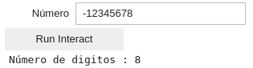

<center><div style="font-size:32px;display:inline-block;line-height:1.1;font-weight:bold;margin:0 0 15px" class="aula-title">Capítulo 6: Widgets</div></center>

# Atividade 1: Introdução aos Widgets

Até o momento vimos como entrada de dados a função `input()`.  Contudo existem outras formas de entrada mais elegantes, como através do uso de **pacotes e extensões do IPython**.  

O IPython é o backend do Jupyter e ele traz suporte a diversos itens de iteratividade que pode ser adicionados através de pacotes e extensões para o Jupyter. Um desses itens são os **Widgets**, que adiciona o suporte de entrada de dados de forma interativa.

### Exemplo 1: Adicionando suporte à Widgets

Para adicionar suporte ao Widgets vamos recorrer ao pacote `ipywidgets`, cuja a documentação é apresentada em: 

> [https://ipywidgets.readthedocs.io/](https://ipywidgets.readthedocs.io/)

Para apresentar os widgets vamos começar adicionando um `IntSlider()`.

> ```python
> import ipywidgets as widget #Importando o pacote com o apelido de widgets
> widget.IntSlider() #Inicializando um IntSlider
> ```
>
> IntSlider(value=0)

Contudo, ao executar esse código irá aparecer apenas um texto. Desta forma, **a inclusão do pacote no código não é suficiente para adicionar o suporte a Widgets**. Vamos resolver isso instando os **Jupyter Widgets:**


> **Observação:** A instalação do Jupyter foi passada como tarefa para casa do capítulo 4. Se ainda não instalou, instale agora. Pode ser que demore um pouco a instalação.

Após a instalação execute o código novamente:

> ```python
> import ipywidgets as widget #Importando o pacote com o apelido de widgets
> widget.IntSlider() #Inicializando um IntSlider
> ```
>
> <p>
>   <input type="range" min="0" max="100" value="0" class="slider" id="slider-1">
>   <span id="val-1"></span>
> </p>
> <script>
>     var slider1 = document.getElementById("slider-1");
>     var output1 = document.getElementById("val-1");
>     output1.innerHTML = slider1.value;
>     slider1.oninput = function() {
>       output1.innerHTML = this.value;
>     }
> </script>

Verá que irá aparecer um `Slider` de inteiro.

Alternativamente, podemos mostrar sliders através da função `display()`, do módulo `IPython.display`:

> ```python
> from ipywidgets import IntSlider #Importando a função IntSlider
> from IPython.display import display #Importando a função display
> 
> slider=IntSlider() #Inicializando o IntSlider
> display(slider) #Mostra o slider
> ```
>
> <p>
>   <input type="range" min="0" max="100" value="0" class="slider" id="slider-2">
>   <span id="val-2"></span>
> </p>
> <script>
>     var slider2 = document.getElementById("slider-2");
>     var output2 = document.getElementById("val-2");
>     output2.innerHTML = slider2.value;
>     slider2.oninput = function() {
>       output2.innerHTML = this.value;
>     }
> </script>

Provavelmente não será necessário importar a função display, pois ela já é carregada no Jupyter. Desta forma o código acima simplifica em:

> ```python
> from ipywidgets import IntSlider #Importando a função IntSlider
> 
> slider=IntSlider() #Inicializando o IntSlider
> display(slider) #Mostra o slider
>```
> 
> <p>
> <input type="range" min="0" max="100" value="0" class="slider" id="slider-3">
> <span id="val-3"></span>
></p>
> <script>
> var slider3 = document.getElementById("slider-3");
> var output3 = document.getElementById("val-3");
> output3.innerHTML = slider3.value;
> slider3.oninput = function() {
>  output3.innerHTML = this.value;
>  }
>  </script>

> **Observação:** Reinicie o Kernel e teste.

**Tarefa 1:** Além do `IntSlider` existe uma extensa lista de Widgets que podem ser vista. Tente inicializar e mostrar os seguintes Widgets:

- Text
- Checkbox
- FloatSlider

### Exemplo 2: Customizando os Widgets

De forma similar aos gráficos que aprendemos a plotar no capítulo anterior, os Widgets também são customizáveis. 

Todas as opções de customizações de todos os tipos de sliders podem ser vistos na [documentação](https://ipywidgets.readthedocs.io/en/latest/examples/Widget%20List.html#). Porém, abaixo segue o exemplo com algumas opções de alguns Widgets que utilizaremos neste capítulo. Tentem executar todos os códigos:

- `IntSlider` retorna inteiros:

> ```python
> widget.IntSlider(
>     value=5, # Valor inicial
>        min=0, # Valor mínimo
>        max=10, # Valor máximo
>        step=1, # Passo
>        description='Número:' #Descrição
>    )
> ```
> 
><p>
> Número:  
> <input type="range" min="0" max="10" value="5" class="slider" id="slider-6">
> <span id="val-6"></span>
> </p>
> <script>
> var slider6 = document.getElementById("slider-6");
> var output6 = document.getElementById("val-6");
> output6.innerHTML = slider6.value;
> slider6.oninput = function() {
> output6.innerHTML = (this.value).toString();
> }
> </script>

- `FloatSlider` retorna ponto flutuante:

> ```python
> widget.FloatSlider(
>        value=5.5, # Valor inicial
>        min=-10.0, # Valor mínimo
>        max=10.0, # Valor máximo
>        step=0.5, # Passo
>        description='Decimal:' #Descrição
> )
> ```
>
> <p>
> Decimal:  
> <input type="range" min="-100" max="100" value="55" step="5" class="slider" id="slider-7">
> <span id="val-7"></span>
> </p>
> <script>
>  var slider7 = document.getElementById("slider-7");
>  var output7 = document.getElementById("val-7");
>  output7.innerHTML = (slider7.value/10).toFixed(2);
>  slider7.oninput = function() {
>    output7.innerHTML = (this.value/10).toFixed(2);
>  }
> </script>

- `Checkbox` retorna booleano (Verdadeiro ou falso):

> ```python
> widget.Checkbox(
>        value=False, # Valor inicial
>        description='Booleano', # Descrição
>        indent=False # Indentação
> )
> ```
>
> <p>
> Booleano: 
> <input type="checkbox" class="check">
> </p>

- `Text` retorna uma string:

> ```python
> widget.Text(
>        value='', # Valor inicial
>        placeholder='Digite seu nome', #Nome que aparece quando não escreve nada
>        description='Nome: ' # Descrição
> )
> ```
>
> <p>
>     Nome: 
>     <input type="text" placeholder="Digite seu nome">
> </p>

### Exemplo 3: Acessando os valores dos Widgets

Toda vez que declaramos um Widget ele inicializa com um valor inicial no parâmetro `value`. 

Por exemplo, digamos que queremos criar um slider chamado em uma célula:

> ```python
> # Célula 1: Declarando o widget chamado Peso
> Peso = widget.FloatSlider(
>        value=5, # Valor inicial
>        min=30, # Valor mínimo
>        max=100, # Valor máximo
>        step=0.1, # Passo
>        description='Peso (kg):' # Descrição
> )
> ```

E em outra célula mostramos o widget (através da função `display()`):

> ```python
> # Célula 2: Mostrando o widget
> display(Peso)
> ```

E na última célula mostramos o resultado:

> ```python
> # Célula 3: Mostrando o valor do Peso
> print("O valor do peso é {} kg.".format(Peso.value))
> ```

No final o conjunto das três células é a seguinte:

> ```python
> # Célula 1: Declarando o widget chamado Peso
> Peso = widget.FloatSlider(
>     value=5, # Valor inicial
>     min=30, # Valor mínimo
>     max=100, # Valor máximo
>     step=0.1, # Passo
>     description='Peso (kg):' # Descrição
> )
> ```
>
> ```python
> # Célula 2: Mostrando o widget
> display(Peso)
> ```
>
> <p>
> Peso (kg): 
> <input type="range" min="300" max="1000" value="429" step="1" class="slider" id="slider-5">
> <span id="val-5"></span>
> </p>
> <script>
> var slider5 = document.getElementById("slider-5");
> var output5 = document.getElementById("val-5");
> output5.innerHTML = (slider5.value/10).toFixed(2);
> slider5.oninput = function() {
> output5.innerHTML = (this.value/10).toFixed(2);
> }
> </script>
>
> ```python
># Célula 3: Mostrando o valor do Peso
> print("O valor do peso é {} kg.".format(Peso.value))
> ```
> 
> O valor do peso é 42.9 kg.

Observe que **declaramos o widget em uma célula** e **mostramos o widget em outra célula**. Isso é necessário pois **toda vez que você declara um Widget ele sempre inicializa com o valor padrão**, desta forma caso o `display()` esteja na mesma célula toda iteração sera perdida ao executar esta célula novamente.

# Atividade 2: Usando Interact

### Exemplo 4: Introdução ao `interact`

Na atividade anterior aprendemos o conceito de Widgets e vimos como eles são úteis para construção de entradas mais elegantes. Porém, **a maneira que utilizamos não é eficiente, pois precisavamos interagir o widget e executar a célula seguinte separadamente**.

A função `interact()` permite a criação de widgets de forma muito mais simples do que vimos anteriormente. Além disso, com este método é possível executar o código ao interagir com o widget. 

Para trabalhar com o `interact()` precisamos utilizar os blocos `def`. No contexto do `interact()`, **os blocos `def` são um conjunto de instruções que são executadas toda vez que se interage com um widgets**.

Os blocos `def` são trechos de códigos que tem como entrada os argumentos:

```python
def nome_do_bloco(argumento1,argumento2,argumento3,...):
   """
   Instruções do bloco
   """
```

O `interact()` associado à este bloco `def` tem a seguinte notação:

```python
def bloco_def_associado(argumento1,argumento2,argumento3,...):
   # Bloco 1 (Nível 1)
   """
   Instruções do bloco
   """
# Bloco principal (Nível 0)
interact(bloco_def_associado,argumento1=val1,argumento2=val2,...)
```

Observe que o `ìnteract()` está no nível 0 e o conteúdo do bloco `def` está no nível 1.

Para exemplificar o conceito de `interact()` e blocos `def` veja o exemplo abaixo:

> ```python
> # Bloco principal (Nível 0)
> from ipywidgets import interact
> def f(x):
>        # Bloco 1 (Nível 0)
>        print("O valor de x é {:d}".format(x))
> # Bloco principal (Nível 0)
> interact(f,#Bloco def que se deseja associar
>             x=5 #Variável ou widget
>            )
> ```
>
> <p>
> x  
> <input type="range" min="-5" max="15" value="5" class="slider" id="slider-B">
> <span id="val-B"></span><br>
> O valor de x é 5<br>
> &lt;function __main__.f(x)&gt;
> </p>
> <script>
> var sliderB = document.getElementById("slider-B");
> var outputB = document.getElementById("val-B");
> outputB.innerHTML = sliderB.value;
> sliderB.oninput = function() {
> outputB.innerHTML = (this.value).toString();
> }
> </script>

Observe também foi imprimido um valor indesejado:

```
<function __main__.f(x)>
```

Isso aconteceu porque a função interact retorna o tipo da função `<function __main__.f(x)>`. Desta forma, a função foi salva na variável `_` e imprimida na tela. Veja o que acontece quando mandamos imprimir `_`

> ```python
> _
> ```
>
> <function \_\_main\_\_.f(x)>

Podemos remover essa saída adicionando `;` ao final da instrução `ìnteract()`, assim suprimimos a saída.

> ```python
> # Bloco principal (Nível 0)
> from ipywidgets import interact
> def f(x):
>        # Bloco 1 (Nível 0)
>        print("O valor de x é {}".format(x))
> # Bloco principal (Nível 0)
> interact(f,x=5);
> ```
>
> <p>
> x  
> <input type="range" min="-5" max="15" value="5" class="slider" id="slider-C">
> <span id="val-C"></span><br>
> O valor de x é 5
> </p>
>
> <script>
> var sliderC = document.getElementById("slider-C");
> var outputC = document.getElementById("val-C");
> outputC.innerHTML = sliderC.value;
> sliderC.oninput = function() {
> outputC.innerHTML = (this.value).toString();
> }
> </script>

**Tarefa 2:** O tipo de Widget criado pela função `ìnteract()` depende do tipo de entrada. Repita o exemplo anterior considerando:

- `x=2.0`
- `x=1`
- `x=True`
- `x=""`
- `x="Digite o seu nome"`

### Exemplo 5: Usando a notação `@interact`

Utilizando a notação `@interact` podemos simplificar mais ainda o uso dos Widgets, veja o exemplo abaixo:

> ```python
> @interact(x=5)
> def f(x):
>     return print("O valor de x é {}.".format(x))
>    ```
> 
><p>
> x  
> <input type="range" min="-5" max="15" value="5" class="slider" id="slider-DW">
> <span id="val-DW"></span><br>
> O valor de x é 5
> </p>
> 
><script>
> var sliderDW = document.getElementById("slider-DW");
> var outputDW = document.getElementById("val-DW");
> outputDW.innerHTML = sliderDW.value;
> sliderDW.oninput = function() {
> outputDW.innerHTML = (this.value).toString();
> }
> </script>

### Exemplo 6: Abreviações de Widgets

Quando você passa um argumento inteiro, como `5` (`x=5`) para o interact. A função cria um slider de inteiro no intervalo de $x\in[-5;3\cdot5]$. Neste caso `5` é abreviação de:

```python
IntSlider(min=-5, max=15, step=1, value=5)
```

De fato, conseguimos o mesmo resultado quando passamos o próprio `IntSlider` como valor de `x`:

> ```python
> def f(x):
>     print("O valor de x é {}".format(x))
>    interact(f,x=widget.IntSlider(min=-5, max=15, step=1, value=5));
>    ```
>    
> <p>
> x  
> <input type="range" min="-5" max="15" value="5" class="slider" id="slider-D">
><span id="val-D"></span><br>
> O valor de x é 5
> </p>
> <script>
> var sliderD = document.getElementById("slider-D");
> var outputD = document.getElementById("val-D");
> outputD.innerHTML = sliderD.value;
>sliderD.oninput = function() {
>outputD.innerHTML = (this.value).toString();
> }
> </script>

Ou ainda:

> ```python
> @interact(x=widget.IntSlider(min=-5, max=15, step=1, value=5))
> def f(x):
>     print("O valor de x é {}".format(x))
>    ```
> 
><p>
> x  
> <input type="range" min="-5" max="15" value="5" class="slider" id="slider-DN">
> <span id="val-DN"></span><br>
> O valor de x é 5
> </p>
> 
><script>
> var sliderDN = document.getElementById("slider-DN");
> var outputDN = document.getElementById("val-DN");
> outputDN.innerHTML = sliderDN.value;
> sliderDN.oninput = function() {
> outputDN.innerHTML = (this.value).toString();
> }
> </script>

A tabela abaixo mostra os diferentes tipos de argumentos:

| Argumento                                                  | Widget      |
| ---------------------------------------------------------- | ----------- |
| Valor booleano: `True` ou `False`                          | Checkbox    |
| String: `"Uma frase"` ou `""`                              | Text        |
| Inteiro: `valor`, `(min,max)` ou `(min,max,passo)`         | IntSlider   |
| Ponto flutuante: `valor`, `(min,max)` ou `(min,max,passo)` | FloatSlider |

Se o segundo parâmetro de `interact()` for passado como `x=(min,max)`  é produzido um slider com um valor mínimo e máximo com os respectivos valores de `min` e `max`. O valor do passo é por padrão `1` e o valor inicial é o meio do intervalo (Considerando o passo).

Por exemplo:

> ```python
> @interact(x=(0,10)) #widget.IntSlider(min=0, max=10)
> def f(x):
>     print("O valor de x é {}".format(x))
>    ```
>    
> <p>
> x  
> <input type="range" min="0" max="10" value="5" class="slider" id="slider-F">
><span id="val-F"></span><br>
> O valor de x é 5
> </p>
> 
> <script>
> var sliderF = document.getElementById("slider-F");
> var outputF = document.getElementById("val-F");
>outputF.innerHTML = sliderF.value;
> sliderF.oninput = function() {
> outputF.innerHTML = (this.value).toString();
> }
> </script>

E se o terceiro parâmetro for passado como `x=(min,max,passo)` irá produzir um slider com o valor mínimo, máximo e o passo definido:

> ```python
> @interact(x=(0.0,10.0,0.5))
> def f(x):
>     print("O valor de x é {}".format(x))
>    ```
>    
> <p>
> x  
> <input type="range" min="0" max="100" value="50" class="slider" id="slider-H">
><span id="val-H"></span><br>
> O valor de x é 5.0
> </p>
> 
> <script>
> var sliderH = document.getElementById("slider-H");
> var outputH = document.getElementById("val-H");
>outputH.innerHTML = (sliderH.value/10).toFixed(2);
> sliderH.oninput = function() {
> outputH.innerHTML = ((this.value)/10).toFixed(2);
> }
> </script>

**Tarefa 3:** Crie um programa capaz de calcular a área, $A$, e o volume, $V$ de uma esfera. Considere as equações abaixo para fazer o cálculo:
$$
A=4\pi r^2
$$

$$
V=\frac{4}{3}\pi r^3
$$

O programa deve ter como entrada o raio $r$, que deve ser representado na forma de FloatSlider com valor mínimo de 1, máximo de 10 e passo de 0,1.

A saída deve ser:

<p>
r  
<input type="range" min="0" max="100" value="50" class="slider" id="slider-W">
<span id="val-W"></span><br>
Com o raio de 5 m a área da esfera é 314.16 m² e o volume é 523.60 m³.
</p>
<script>
var sliderW = document.getElementById("slider-W");
var outputW = document.getElementById("val-W");
outputW.innerHTML = (sliderW.value/10).toFixed(2);
sliderW.oninput = function() {
outputW.innerHTML = (this.value/10).toFixed(2);
}
</script>

### Exemplo 7: Widgets e gráficos

Para exemplificar o uso dos Widgets vamos apresentar um problema prático de plotagem de gráfico.

<!---

> Gustavo dá uma aula sobre Espiriais e equações paramétricas​ (Pode dá o exemplo da elipse)

--->

Em coordenadas cartesianas as espirais devem utilizar equações paramétricas. A forma geral das espirais no plano cartesiano é:
$$
h(\theta)=\begin{cases}
	x(\theta)=\theta^n\cdot \cos(\theta)\\
	y(\theta)=\theta^n\cdot \sin(\theta)
\end{cases}
$$
Vamos plotar o gráfico de $h(\theta)$ utilizando a função `plot_parametric()` do pacote `sympy` (Figura 1):


> **Figura 1:** Funções do pacote `sympy`.

O programa vai ter como entrada um `Floatslider` com $n\in[-2,2]$ e passo $0,1$.

> ```python
> from sympy import symbols, sin, cos, pi #Importando symbols, sin, cos e pi
> from sympy.plotting import plot_parametric #Importando plot_parametric
> 
> # Definindo um estilo para o gráfico
> from matplotlib import style 
> style.use('seaborn-whitegrid')
> 
> 
> @interact(n=(-2.0,2.0,0.1)) # FloatSlider(min=-2.0,max=2.0,step=0.1)
> def plotando_espiral(n):
>        theta = symbols('θ')
>        x = theta**n*sin(theta)
>        y = theta**n*cos(theta)
>        plot_parametric(x,y,(theta,0,10*pi),
>              xlim=(-8,8.04),
>              ylim=(-8.06*15/23,8*15/23), #Multiplicado por 15/23 para manter a mesma proporção
>              title="Espiral com n={:.2f}".format(n),
>              xlabel="",
>              ylabel="")
> ```
>
> 

Observe que quando $n=0$ a espiral se reduz à um círculo. Precisamos adicionar este detalhe no nosso programa com ajuda de um `if`.

> ```python
> @interact(n=(-2,2.0,0.1))
> def plotando_espiral(n):
>     theta = symbols('θ')
>     x = theta**n*sin(theta)
>     y = theta**n*cos(theta)
>     if n==0:
>         título="Círculo"
>        else:
>            título="Espiral com n={:.2f}".format(n)
>        plot_parametric(x,y,(theta,0,10*pi),
>              xlim=(-8,8.04),
>              ylim=(-8.06*15/23,8*15/23), #Multiplicado por 15/23 para manter a mesma proporção
>              title=título,
>              xlabel="",
>              ylabel="")
>    ```
>    
>    

**Tarefa 4:** Inclinação da reta

Uma reta fixada na origem tem a seguinte notação:

$$
f(x)=ax
$$

Crie um programa capaz de criar uma reta baseando-se no seu ângulo de inclinação $u$. Para criar a reta utilize a definição de $u$:

$$
u=\tan^{-1}(a)
$$

ou ainda:
$$
a=\tan(u)
$$
Ou resultado da seu código deve ser algo parecido com a Figura abaixo:


### Exemplo 8: Múltiplos argumentos

A função `interact()` permite trabalhar com múltiplos argumentos, para isto basta associar o bloco `def` com mais de argumento e adicionar estes argumentos ao `interact()`.  Veja o exemplo abaixo:

> ```python
> @interact(x=(0.0,0.9,0.1),y=(0,3))
>    def soma(x,y):
>        s=x+y
>     print("A soma de {} + {} vale {}".format(x,y,s))
> ```
>
> <p>
> x  
> <input type="range" min="0" max="9" value="4" class="slider" id="slider-xx">
> <span id="val-xx"></span><br>
> <script>
> var sliderxx = document.getElementById("slider-xx");
> var outputxx = document.getElementById("val-xx");
> outputxx.innerHTML = (sliderxx.value/10).toFixed(2);
> sliderxx.oninput = function() {
> outputxx.innerHTML = (this.value/10).toFixed(2);
> }
> </script>
> y  
> <input type="range" min="0" max="3" value="1" class="slider" id="slider-yy">
> <span id="val-yy"></span><br>
> <script>
> var slideryy = document.getElementById("slider-yy");
> var outputyy = document.getElementById("val-yy");
> outputyy.innerHTML = (slideryy.value);
> slideryy.oninput = function() {
> outputyy.innerHTML = (this.value);
> }
> </script>
> A soma de 0.4 + 1 vale 1.4
> </p>

### Exemplo 9: Equação da reta

Considerando um exemplo prático, vamos um programa capaz de plotar e escrever a equação da reta no título do gráfico.

> ```python
> @interact(
>     a=widget.FloatSlider(min=-6,max=6,step=0.1,value=1),
>     b=(-6,6,0.1) 
> )
> def eq_reta(a,b):
>     x = symbols('x')
>     y = a*x+b
>     plot(y,(x,-10,10),
>                 xlim=(-6,6),
>                    ylim=(-6*3/4,6*3/4),
>                    title='$y(x)={:.2g}x{:+.2g}$'.format(a,b),
>                 xlabel="$x$",
>                 ylabel=""
>                   )
>    ```
>    
>    

A equação não é mostrada adequadamente. Vamos corrigí-la utilizando `if` e concatenação de `strings`.

A principio vamos seguir as seguintes regras:

   - Quando $a=0$ e $b=0$ deve-se $y(x)=0$
   - Quando $a=0$ ou $a=1$ deve-se omitir o $a$ na equação
   - Quando $a=0$ deve-se omitir $x$ da equação
   - Quando $b=0$ deve-se omitir o valor de $b$ na equação
   - Quando $a\neq 0$ e $b\neq 0$ deve-se incluir o sinal de $b$

> ```python
> @interact(
>     a=widget.FloatSlider(min=-6,max=6,step=0.1,value=1),
>     b=(-6,6,0.1)   
> )
> def eq_reta(a,b):
>     x = symbols('x')
>     y = a*x+b
>     
>     # PARCELA 'a'
>     if a==1 or a==0:
>         a_str = ''
>     else:
>         a_str = '{:.2g}'.format(a)
>          
>     # PARCELA 'x'
>     if a==0:
>         x_str = ''
>     else:
>         x_str = 'x'
>                
>     # PARCELA 'b'
>     if b==0:
>         if a==0:
>             b_str = '0'
>         else:
>             b_str = ''
>     elif a!=0: #Quando a é diferente de zero deve-se incluir o '+'
>         b_str = '{:+.2g}'.format(b)
>     else: #Quando a é zero não é necessário incluir o '+'
>         b_str = '{:.2g}'.format(b)
>     
>     # Escrevendo a equação
>     t = '$y(x)=' + a_str + x_str + b_str +'$'
>     
>     plot(y,(x,-10,10),
>                 xlim=(-6,6),
>                 ylim=(-6*3/4,6*3/4),
>                 title=t,
>                 xlabel="$x$",
>                 ylabel=""
>                )
> ```
>
> 

Podemos simplificar um pouco o nosso programa se utilizarmos a variavel $t$ como um acomulador:

> ```python
> @interact(
>     a=widget.FloatSlider(min=-6,max=6,step=0.1,value=1),
>     b=(-6,6,0.1)
> )
> def eq_reta(a,b):
>     x = symbols('x')
>     y = a*x+b
>     t = '$y(x)='
>     
>     # PARCELA 'a'
>     if a!=1 and a!=0:
>         t+= '{:.2g}'.format(a) #t=t+'{:.2g}'.format(a)
>          
>     # PARCELA 'x'
>     if a!=0: 
>         t+= 'x' #t=t+x
>                
>     # PARCELA 'b'
>     if b==0:
>         if a==0:
>             t+= '0'
>     elif a!=0:
>         t+= '{:+.2g}'.format(b)
>     else:
>         t+= '{:.2g}'.format(b)  
>     
>     # Finalizando
>     t += '$'
>     
>     plot(y,(x,-10,10),
>                 xlim=(-6,6),
>                 ylim=(-6*3/4,6*3/4),
>                 title=t,
>                 xlabel="$x$",
>                 ylabel=""
>                )
> ```
>
>

Finalmente, vamos adicionar a posssiblidade do usuário mostrar ou esconder a equação (o título):

> ```python
> @interact(
>     a=widget.FloatSlider(min=-6,max=6,step=0.1,value=1),
>     b=(-6,6,0.1),
>     Título=True 
> )
> def eq_reta(a,b,Título):
>     x = symbols('x')
>     y = a*x+b
>     t = '' #Inicio o t como uma string vazia
>     
>     #Vou adicionando termos às strings a medida que passa pelos ifs
>     if Título:
>         t += '$y(x)=' 
> 
>         # PARCELA 'a'
>         if a!=1 and a!=0:
>             t+= '{:.2g}'.format(a)
> 
>         # PARCELA 'x'
>         if a!=0: 
>             t+= 'x'
> 
>         # PARCELA 'b'
>         if b==0:
>             if a==0:
>                 t+= '0'
>         elif a!=0:
>             t+= '{:+.2g}'.format(b)
>         else:
>             t+= '{:.2g}'.format(b)  
> 
>         # Finalizando
>         t += '$'
>     
>     plot(y,(x,-10,10),
>                 xlim=(-6,6),
>                 ylim=(-6*3/4,6*3/4),
>                 title=t,
>                 xlabel="$x$",
>                 ylabel=""
>                )
> ```
>
> 

**Tarefa 5:** Modifique o exemplo da espiral considerando as seguintes premissas:

- Adicione a possiblidade de mostrar e ocultar o **título** e os **eixos**;
- Nomei os eixos como `$x$` e `$y$`;
- Adicione a possibilidade de escolher a cor do gráfico utilizando o Widget `ColorPicker`.  Utilize os parâmetros `description="Cor:"` e `value="green"` (Veja a [documentação](https://ipywidgets.readthedocs.io/en/latest/examples/Widget%20List.html#Color-picker));
- Use o parâmetro `line_color` (Na função print) para alterar a cor do gráfico.

A sua saída do programa deve ser parecida com essa:


### Exemplo 10: Widgets e configurações de plotagem

Por padrão o módulo `sympy.plotting` utiliza o algoritmo adaptativo para calcular o número de pontos do gráfico. Este algoritmo calcula o número de pontos de cada área do gráfico de forma ter um gráfico sem 'defeitos',entretanto este algoritmo não é preciso para algumas funções. Neste caso, é interessante selecionar o número de pontos manualmente através do atributo `nb_of_points`. O parâmetro `adaptive` determina se o algoritmo adaptativo é utilizado ou não:

- `adaptive=True` $\rightarrow$ O algoritmo adaptativo é ativado (Valor padrão)
- `adaptive=False` $\rightarrow$ Utiliza um determinado número de pontos igualmente espaçados. Este número é determinado pelo parâmetro `nb_of_points`

Para exemplificar o uso deste dois parâmetros de configuração de plotagem vamos considerar um exemplo de uma onda seinodal:

$$
y(t)=2\cos(2\pi f t)
$$

onde o usuário controla a frequência da onda $f$. 

Além disso, vamos adicionar a possiblidade de o usuário escolher o algoritmo de plotagem (`adaptive` True ou False) e o número de pontos do gráfico, caso o algoritmo adaptativo esteja desativado.

Inicialmente vamos construir o gráfico da onda sem essa possibilidade de customização de plotagem.

> ```python
> @interact(
>     # Frequência variando entre 0,2 e 20 Hz 
>     f=widget.FloatSlider(min=0.5,max=20,step=0.5,value=1,description='f (Hz)'),
>     # Fase variando entre 0 e 90°
>     d=widget.IntSlider(min=0,max=90,step=15,description="$\delta$ (Graus)")
> ) 
> def plot_onda(f,d):
>     t=symbols('t')
>     y=2*cos(2*pi*f*t+radians(d))
>     plot(y,(t,0,2*pi),
>          ylim=(-3,3),
>          xlim=(0,1),
>          ylabel='y(t)'
>         )
> ```
>
> 

Observe que a precisão de plotagem diminui quando a frequência da onda aumenta. Isso acontece pois o número de pontos (ou amostras) não são o suficiente para representar o gráfico com fidelidade. Podemos corrigir isso através configurando o número de pontos manualmente.

Agora vamos adicionar a possiblidade do usuário escolher a configuração de plotagem de acordo com as regras abaixo:

- `adaptive=True` $\rightarrow$ O algoritmo adaptativo é ativado (Valor padrão)
- `adaptive=False` $\rightarrow$ Utiliza um determinado número de pontos igualmente espaçados. Este número é determinado pelo parâmetro `nb_of_points`

> ```python
> @interact(
>     # Frequência variando entre 0,2 e 20 Hz 
>     f=widget.FloatSlider(min=0.5,max=20,step=0.5,value=1,description='f (Hz)'),
>     # Fase variando entre 0 e 90°
>     d=widget.IntSlider(min=0,max=90,step=15,description="$\delta$ (Graus)"),
>     alg=widget.Checkbox(description='Alg. Adaptativo',value=False),
>     
>     #Vamos utilizar o FloatLogSlider
>     pts=widget.FloatLogSlider(
>         description='No. Pontos',
>         min=1, #Expoente mínimo
>         max=4, #Expoente máximo
>         value=1e2, #Valor inicial
>         base=10, #Base (O número dobra a cada passo)
>         step=1, #Passo
>         readout_format='d' #Mostrando a saída na forma de inteiro
>     )
> ) 
> def plot_onda(f,d,alg,pts):
>     t=symbols('t')
>     y=2*cos(2*pi*f*t+radians(d))
>     plot(y,(t,0,2*pi),
>          ylim=(-3,3),
>          xlim=(0,1),
>          ylabel='y(t)',
>          adaptive=alg,
>          nb_of_points=int(pts)
>         )
> ```
>
> 

Quando o algoritmo adaptativo está habilitado o número de ponto não tem efeitos. Sendo assim, **vamos desativar o widget que controla o número de pontos**:

> ```python
> ptWidget=widget.FloatLogSlider(
>         description='No. Pontos',
>         min=1, #Expoente mínimo
>         max=4, #Expoente máximo
>         value=1e2, #Valor inicial
>         base=10, #Base (O número dobra a cada passo)
>         step=1, #Passo
>         readout_format='d' #Mostrando a saída na forma de inteiro
> )
> ```
>
> ```python
> @interact(
>     # Frequência variando entre 0,2 e 20 Hz 
>     f=widget.FloatSlider(min=0.5,max=20,step=0.5,value=1,description='f (Hz)'),
>     # Fase variando entre 0 e 90°
>     d=widget.IntSlider(min=0,max=90,step=15,description="$\delta$ (Graus)"),
>     alg=widget.Checkbox(description='Alg. Adaptativo',value=False),
>     #Vamos utilizar o FloatLogSlider
>     pts=ptWidget
> ) 
> def plot_onda(f,d,alg,pts):
>     t=symbols('t')
>     y=2*cos(2*pi*f*t+radians(d))
>     ptWidget.disabled=alg # Se o método adataptativo estiver ativado desativa o widget
>     plot(y,(t,0,2*pi),
>          ylim=(-3,3),
>          xlim=(0,1),
>          ylabel='y(t)',
>          adaptive=alg,
>          nb_of_points=int(pts)
>         )
> ```
>
> 

# Atividade 3: Interact_manual()

O `interact_manual()` é uma variação do interact que permite a execução do código apenas quando se clica em um determinado botão. Isso é especialmente útil quando o bloco `def` tem instruções muito demoradas ou quando o você não quer executar o bloco `def` imediatamente após a iteração do widget. Para exemplificar refazemos o exemplo da soma usando o `ìnteract_manual()`:

> ```python
> from ipywidgets import interact_manual
> @interact_manual(x=(0.0,0.9,0.1),y=(0,3))
> def soma(x,y):
>     s=x+y
>     print("A soma de {} + {} vale {}".format(x,y,s))
> ```
>

Agora vamos para um exemplo prático.

### Exemplo 10: Número Primo

Um número é primo quando ele somente é divisível por um e por ele mesmo. Podemos criar um algoritmo que utiliza a **força bruta** para encontrar números primos. Neste programa vamos dividir o número por todos os divisores possíveis entre 2 e o "Número/2".

> **Observação:** Acima de "Número/2" não há divisores para este número, por isso buscar por divisores acima disso é um desperdício de energia.


Para testar o nosso programa podemos utilizar alguns números primos da lista abaixo:

> Os primeiros 25 números primos são:
> > 2, 3, 5, 7, 11, 13, 17, 19, 23, 29, 31, 37, 41, 43, 47, 53, 59, 61, 67, 71, 73, 79, 83, 89, 97 
>
> Números primos grandes:   
>
> > 7919, 27644437

> ```python
> @interact_manual(Número="")
> def checar_primo(Número):
>     if not(Número.isdigit()):
>         print("Por favor digite um número inteiro e positivo!")      
>     else:
>         Número=int(Número) # Converte o número para inteiro          
>         divisor = 2
>         primo = True # Iniciamos com a suposição que o número é primo
>         
>         while (divisor<= Número/2):
>             if (Número % divisor == 0): # Se o resto for 0 ele é divisível
>                 primo=False # Se ele for divisível ele não é primo
>                 break # Saia do loop para economizar processamento
>             divisor+=1 # Essa expressão tem o mesmo valor que divisor = divisor +1
>          
>         if primo:
>             print("O número {} é primo.".format(Número))
>         else:
>             print("O número {} não é primo, pois é divisível por {}.".format(Número,divisor))
> ```
> 

> **Observação:** A tarefa de encontrar números primos grandes é demasiadamente demorada, este é um exemplo perfeito para a utilização do `interact_manual()`.

No exemplo acima conseguimos garantir que o número digitado seja primo utilizando o método `.isdigit()`. Contudo, podemos resolver este problema apenas com os Widgets. 

Existem Widgets de texto que permitem trabalharmos somente com números. Alguns deles permitem limitar os intervalos. São eles:

| Widget           | Função                          |
| ---------------- | ------------------------------- |
| IntText          | Inteiro (Sem limitação)         |
| FloatText        | Ponto flutuante (Sem limitação) |
| BoundedIntText   | Inteiro (Limitado)              |
| BoundedFloatText | Ponto flutuante (Sem limitação) |


No nosso caso iremos utilizar o Widget `BoundedIntText` que permite somente números inteiros, limitados a um intervalo.

> ```python
> @interact_manual(Número=widget.BoundedIntText(min=0,max=27644437))
> def checar_primo(Número):     
>     divisor = 2
>     primo = True # Iniciamos com a suposição que o número é primo
>       
>     while (divisor<= Número/2):
>         if (Número % divisor == 0): # Se o resto for 0 ele é divisível
>             primo=False # Se ele for divisível ele não é primo
>             break # Saia do loop para economizar processamento
>         divisor+=1 # Essa expressão tem o mesmo valor que divisor = divisor +1
>          
>     if primo:
>         print("O número {} é primo.".format(Número))
>     else:
>         print("O número {} não é primo, pois é divisível por {}.".format(Número,divisor))
> ```
>
> 

Consideramos incluir as exceções a regra:

- O número 1 não é primo, pois tem um único divisor;
- 0 não é primo, pois um número divido por zero é indeterminado;

> ```python
> @interact_manual(Número=widget.BoundedIntText(min=0,max=27644437))
> def checar_primo(Número):  
>        if(Número>1):
>            divisor = 2
>            primo = True # Iniciamos com a suposição que o número é primo
>    
>            while (divisor<= Número/2):
>                if (Número % divisor == 0): # Se o resto for 0 ele é divisível
>                    primo=False # Se ele for divisível ele não é primo
>                    break # Saia do loop para economizar processamento
>                divisor+=1 # Essa expressão tem o mesmo valor que divisor = divisor +1
>    
>            if primo:
>                print("O número {} é primo.".format(Número))
>            else:
>                print("O número {} não é primo, pois é divisível por {}.".format(Número,divisor))
>        elif (Número==1):
>            print("O número 1 não é primo, pois tem apenas um único divisor.")
>        else:
>            print("O número 0 não é primo, pois divisão por 0 é indeterminada.")
>    ```
>    
>    

**Tarefa 6:** Crie um programa capaz de reverter a ordem de impressão de um número:

- Use um widget de campo de texto como entrada;  
- O programa deve aceitar somente números inteiros e positivos;  
- Você deve trabalhar com o número (E não com a string).

Se precisar, você pode copiar e colar o seguinte diagrama numa célula Markdown para te ajudar.

```markdown
​```mermaid
flowchart TB
    idi((Início)) --> id1["Assuma que <b>NumRevertido</b> é 0"] --> idp
    idp{"<b>Número</b> == 0?"} -- False --> id3
    id3["Calcule o <b>Resto</b> do <b>Número</b> dividido por 10"] --> id4
    id4[Multiplique <b>NumRevertido</b> por 10 e some com o <b>Resto</b>] --> id5
    id5[Divisão inteira do <b>Número</b> por 10] --> idp
    idp -- True --> idf((Fim))
​```
```
# Atividade 4: Para casa

### Exercício 1: Parábola

Uma parábola tem a sua função dada por:

$$
f(x)=ax^2+bx+c
$$

De forma similar à tarefa da equação da reta crie um programa capaz de criar um gráfico de uma equação do segundo grau. Considere as seguintes premissas:

- Os valores de $a$, $b$ e $c$ devem ser entradas do programa na forma de Sliders;
- Os sliders devem ter os seguintes parâmetros:

| Slider | Min   | Max  | Passo | Val. Inicial |
| ------ | ----- | ---- | ----- | ------------ |
| a      | -2.0  | 2.0  | 0.05  | 0.25         |
| b      | -20.0 | 20.0 | 0.5   | 0.0          |
| c      | -45.0 | 45.0 | 0.5   | 0.0          |

- O título do gráfico deve mostrar a equação da parábola (Considere mostrar a equação correntamente, considerando as situações que $a$, $b$ e/ou $c$ podem ser zero ou que $a$ e/ou $b$ podem ser 1);
- O usuário poderá alterar a cor do gráfico através de um Widget;
- Os limites do gráfico devem ser $x\in[-100,100]$ e $f(x)\in[-200,200]$;
- O usuário pode mostrar ou ocultar o título;
- O usuário pode escolher o algoritmo de plotagem (Uso do algoritmo adaptativo);
- Caso o usuário não escolha o algoritmo adaptativo, o mesmo poderá escolher a quantidade de pontos através de um `FloatLogSlider`:

| Características | Valor       |
| --------------- | ----------- |
| base            | 2           |
| min             | 64 pontos   |
| max             | 4096 pontos |

- Você deve utilizar $x$ como variável simbólica;
- O gráfico deve ser plotado com a função `plot()` do pacote `sympy`.

O resultado do seu programa deve ser parecido com a imagem abaixo:


### Exemplo 2: Dissecando uma string

Faça um programa que tenha como entrada uma caixa de texto (o Widget `Textarea`). O programa deve analisar o conteúdo da caixa de texto e verificar se:

- O texto só tem espaços;
- O texto está vazio;
- O texto é numérico;
- O texto é alfabético;
- O texto é alfanumérico;
- O texto pode ser utilizado como um identificador padrão do Python;
- O texto está em maiúsculas;
- O texto está na forma de título;
- O texto está em minúsculas.

Você deve pesquisar sobre o Widget `Textarea` na documentação.

A análise do texto deve ser feita em tempo real.

O resultado do seu programa deve ser parecido com a imagem abaixo:


### Exemplo 3: Contando dígitos

Crie um programa capaz de contar a quantidade de dígitos de um número inteiro.

- Use um widget de campo de texto como entrada;
- O programa deve aceitar qualquer número inteiro (Positivos e negativos).



### Exemplo 4: Divisores de um número

Crie um programa capaz de encontrar todos os divisores de um número.

- Use um widget de campo de texto como entrada;  
- O programa deve aceitar somente números inteiros entre 0 e 500.

O usuário deve clicar num botão para fazer a análise do número (Use o `interact_manual`).

O resultado do seu programa deve ser parecido com a imagem abaixo:


### Exemplo 5: Formulário

Crie um programa que capaz de fazer a inscrição de um determinado usuário. O formulário deve ter como entrada:

- Nome (Só aceita se a string for na forma de título e não for na forma alfanumérica)
- Nome do usuário (Só aceita se aceita se a string for um identificador padrão do Python)
- Data de nascimento (Só aceita se o usuário for maior de 18 anos) (Utilize o widget `DatePicker`)

Para aceitar a inscrição o usuário deve clicar num botão (Use o `interact_manual`).

Caso a inscrição for inválida o programa deve indicar a causa do erro. Caso a inscrição seja válida o programa deve imprimir:

> Inscrição validada com sucesso!

Use o módulo `datetime` e a função abaixo para te ajudar a construir o seu programa:

```python
from datetime import date

def calcularIdade(dataNascimento):
    """
    Esta função retorna a sua idade de acordo com a data de nascimento
    A função retorna 'Erro' caso a data de nascimento não for definida
    """
    try:
        hoje = date.today() #Captura a data de hoje
    
        # Calcula a sua idade baseando-se na:

        ## Diferença dos anos
        idade = hoje.year - dataNascimento.year

        ## Diferença entre os meses de aniversário
        if (hoje.month, hoje.day) < (dataNascimento.month, dataNascimento.day):
            idade -= 1

        return idade #Retorna a sua idade como valor de saída
    except:
        return "Erro" #Em caso de erro retorna 'Erro'
```

O resultado do seu programa deve ser parecido com as imagens abaixo:


