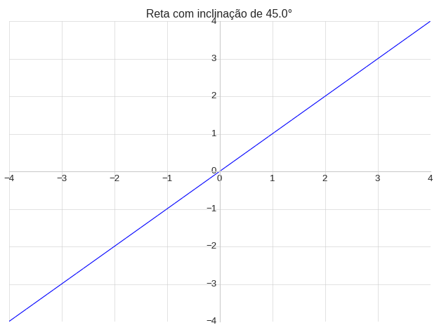
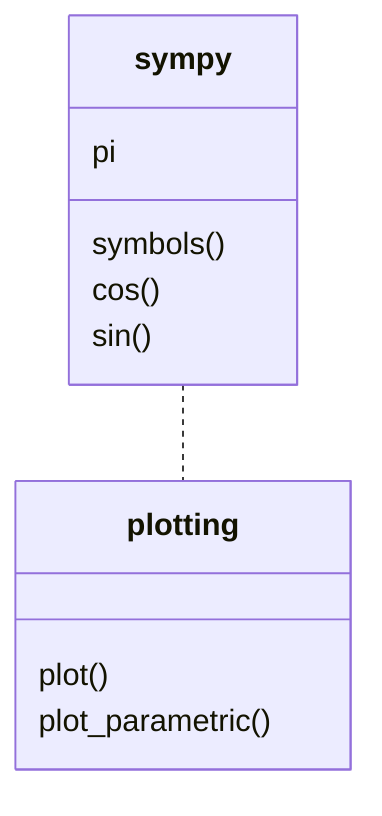

Ao utilizar o `iteract()` podemos criar gráficos que atualizam em tempo real. Inicialmente vamos considerar a seguinte função:
$$
f(x)=ax
$$
Vamos criar um programa capaz de variar a inclinação da reta, $u$, variando o parâmetro $a$. O ângulo de inclinação pode ser calculado por:
$$
u=\tan^{-1}(a)
$$

> ```python
> from sympy.plotting import plot #importando a função plot
> from sympy import tan, symbols #importando tan e symbols
> from ipywidgets import interact #importando interact
> from math import radians #importando radians
> from matplotlib import style
> style.use('seaborn-whitegrid')
> 
> def reta_tangente(u):
>    x=symbols("x") #Definindo a variável simbólica
>    a=tan(radians(u)) #
>    f=a*x
>    plot(f,(x,-4,4),
>          title="Reta com inclinação de {:.1f}°".format(u),
>          xlim=(-4,4),
>          ylim=(-4,4),
>          ylabel="",
>          xlabel=""
>      )
>  
> interact(reta_tangente,u=(0.1,90,0.1));
> ```
>
> <p>
> x  
> <input type="range" min="1" max="900" value="450" class="slider" id="slider-Y">
> <span id="val-Y"></span><br>
> 
> </p>
> <script>
> var sliderY = document.getElementById("slider-Y");
> var outputY = document.getElementById("val-Y");
> outputY.innerHTML = (sliderY.value/10).toFixed(2);
> sliderY.oninput = function() {
> outputY.innerHTML = (this.value/10).toFixed(2);
> }
> </script>

**Tarefa:** Refaça o exemplo da espiral utilizando a função `iteract()`. Considere $n \in [-2,2]$ com o passo de $n=0,1$.

### 


### Exemplo 4: Utilizando Widgets em problemas práticos

Para exemplificar o uso dos Widgets vamos apresentar um problema prático de plotagem de gráfico.

<!---

> Gustavo dá uma aula sobre Espiriais e equações paramétricas​ (Pode dá o exemplo da elipse)

--->

Em coordenadas cartesianas as espirais devem utilizar equações paramétricas. A forma geral das espirais no plano cartesiano é:
$$
h(\theta)=\begin{cases}
	x(\theta)=\theta^n\cdot \cos(\theta)\\
	y(\theta)=\theta^n\cdot \sin(\theta)
\end{cases}
$$
Vamos plotar o gráfico de $h(\theta)$ utilizando a função `plot_parametric()` do pacote `sympy` (Figura 1):



> **Figura 1:** Funções do pacote `sympy`.

O programa vai ter a seguinte entrada:

- $n$: `FloatSlider` com os seguintes parâmetros:
  - Valor mínimo: $-0,5$;
  - Valor máximo: $1;$
  - Passo: $0,5$.


> ```python
> # Célula 1: Definindo os sliders
> n = widget.FloatSlider(
> description = "n:",
> value = 1,
> min = -0.5,
> max = 1,
> step = 0.5
> )
> ```
>
> ```python
> # Célula 2: Mostrando os Sliders
> display(n)
> ```
>
> <p>
> n: 
> <input type="range" min="-5" max="10" value="5" step="5" class="slider" id="slider-A">
> <span id="val-A"></span>
> </p>
> <script>
> var sliderA = document.getElementById("slider-A");
> var outputA = document.getElementById("val-A");
> outputA.innerHTML = (sliderA.value/10).toFixed(2);
> sliderA.oninput = function() {
> outputA.innerHTML = (this.value/10).toFixed(2);
> }
> </script>
>
>
> ```python
> # Célula 3: Plotando o gráfico
> from sympy import symbols, sin, cos, pi
> from sympy.plotting import plot_parametric
> from matplotlib import style
> style.use('classic')
> 
> theta = symbols('θ')
> x = theta**n.value*sin(theta)
> y = theta**n.value*cos(theta)
> 
> plot_parametric(x,y,(theta,0,10*pi),
>              xlim=(-8,8.04),
>              ylim=(-8.06*3/4,8*3/4),
>              title="Espiral com n={}".format(n.value),
>              xlabel="",
>              ylabel=""
>             )
> ```
>
> 