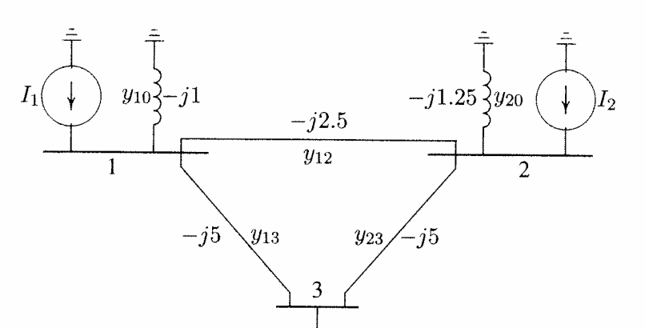

<center><div style="font-size:32px;display:inline-block;line-height:1.1;font-weight:bold;margin:0 0 15px" class="aula-title">Capítulo 7: Listas</div></center>

# Atividade 1: Listas

**Definição de lista:**

Nos capítulos anteriores, além de várias funções úteis, estudamos diversos tipos de dados que podemos utilizar em nossos programas, como números inteiros (`int`), números reais (`float`), números complexos (`complex`), texto (`string`), variáveis Booleanas (`bool`), e muitas outras já conhecidas.   
Para armazenar tais dados, utilizamos variáveis, como sempre fizemos. No entanto, não temos uma maneira eficiente de guardar muitos dados. Em um código que isso seja necessário, ele se torna muito grande, por exemplo, no programa de lista de compras, apresentado no capítulo 2, tivemos que salvar o nome de três objetos em três variáveis distintas. 

>```python
>#Resposta
>
>item1 = input("Digite o nome do item 1 ")
>item2 = input("Digite o nome do item 2 ")
>item3 = input("Digite o nome do item 3 ")
>qt1 = int(input("Digite a quantidade do item 1"))
>qt2 = int(input("Digite a quantidade do item 2"))
>qt3 = int(input("Digite a quantidade do item 3"))
>i1 = "Item 1: " + item1
>i2 = "Item 2: " + item2
>i3 = "Item 3: " + item3
>
>
>
>print("{:_^50}".format('Lista de estoque'))
>print("{:-<45}{}".format("Item","Quant"))
>print("{item:-<47}{quant:03d}".format(item=i1,quant=qt1))
>print("{item:-<47}{quant:03d}".format(item=i2,quant=qt2))
>print("{item:-<47}{quant:03d}".format(item=i3,quant=qt3))
>```
>
>\_\_\_\_\_\_Lista de estoque\_\_\_\_\_\_   
>Item-------------------------------------------------------Quant   
>Item 1: abacaxi-----------------------------001   
>Item 2: melao----------------------------------002   
>Item 3: arroz----------------------------------003

Agora, imagine que precisássemos salvar os nomes de 15 itens no código, ele ficaria assim.

>```python
>item1 = input("Digite o nome do item 1 ")
>item2 = input("Digite o nome do item 2 ")
>item3 = input("Digite o nome do item 3 ")
>item4 = input("Digite o nome do item 4 ")
>item5 = input("Digite o nome do item 5 ")
>item6 = input("Digite o nome do item 6 ")
>item7 = input("Digite o nome do item 7 ")
>item8 = input("Digite o nome do item 8 ")
>item9 = input("Digite o nome do item 9 ")
>item10 = input("Digite o nome do item 10 ")
>item11 = input("Digite o nome do item 11 ")
>item12 = input("Digite o nome do item 12 ")
>item13 = input("Digite o nome do item 13 ")
>item14 = input("Digite o nome do item 14 ")
>item15 = input("Digite o nome do item 15 ")
>...
>```

Ou ainda se formos guardar quantos valores quiséssemos, nosso código ficaria ainda mais complexo, difícil de ler e de modificar. No entanto, no Python, nós temos um `data type` chamado lista (`list`), que é uma forma de guardar vários dados diferentes em uma única variável.  Você pode iniciar uma lista com os colchetes ([]), como mostrado no seguinte exemplo.

### Exemplo 1: Criando uma lista

>```python
>item1 = 'arroz'
>item2 = 'feijão'
>item3 = 'carne'
>   
>lista_item = ['arroz','feijão','carne']
>```

Podemos guardar todos os tipos de dados em uma lista, como números, strings, Booleanos e até mesmo outras listas

>```python
>a = [1,2,3]
>b = ['Olá', 3.1415, True, None, 42]
>c = [['Gustavo','Lucas','Leo'], [14,15,16], True]
>```

### Exemplo 2: Indexando elementos de listas

Os valores da lista tem "endereços", e através deles, podemos acessa-los, esse processo chama-se indexação, veja o seguinte exemplo.

>```python
>lista = ["João","Lucas","Pedro","Tiago","Gustavo","Ana","Heithor"]
>#          0       1       2       3        4       5       6
>```

>```python
>lista[0]
>```
>
> 'João'

> ```python
>lista[2]
> ```
>
>   'Pedro'

>```python
>lista[-2]
>```
>
>   'Ana'

>```python
>'Olá, ' + lista[2]
>```
>
>   'Olá, Pedro'

>```python
>lista1 = [[1,2],['Gustavo','Lucas'],'Beatriz']
>lista1
>```
>
>[1, 2]

### Exemplo 3: Indexando "slices" de listas

Podemos também indexar pedaços, também chamado de "slices" de uma lista que também são listas, veja o exemplo

>```python
>lista = ["João","Lucas","Pedro","Tiago","Gustavo","Ana","Heithor"]
>lista[1:4] #A lista resultante não incluirá o elemento 4, somente do 0 ao 3
> ```
>
>['Lucas', 'Pedro', 'Tiago']

>```python
>lista[:3]
>```
>
>['João', 'Lucas', 'Pedro']

>```python
>lista[1:]
>```
>
>['Lucas', 'Pedro', 'Tiago', 'Gustavo', 'Ana', 'Heithor']

### Exemplo 4: Mudando valores na lista

>```python
>lista2 = ["João","Lucas","Pedro","Tiago","Gustavo","Ana","Heithor"]
>print(lista2)
>```
>['João', 'Lucas', 'Pedro', 'Tiago', 'Gustavo', 'Ana', 'Heithor']
>```python
>lista2[1] = "José"
>print(lista2)
>```
>lista2 = ["João","Lucas","Pedro","Tiago","Gustavo","Ana","Heithor"]

### Exemplo 5: Concatenação e replicação de listas

De modo similar a strings, podemos concatenar e replicar listas usando os operadores matemáticos `+`e `*`.

>```python
>a = [1,2,3]
>b = ['a','b','c']
>c = a + b
>print(c)
>```
>
>[1, 2, 3, 'a', 'b', 'c']
>
>```python
>a*3
>```
>
>[1, 2, 3, 1, 2, 3, 1, 2, 3]

### Exemplo 6: loop for

O `for`é uma das estruturas de controle mais importantes no Python, bem como em diversas linguagens de programação. Ele é uma estrutura que executa um número específico de **iterações**. Veja sintaxe

Existe a palavra `for`, seguida do `elemento` a ser operado e quais valores este elemento assumirá, ou seja, uma `lista`. A função `range()`gera uma lista de valores inteiros.

Perceba que a operação a ser executada é um bloco com indentação um nível acima.

>   ```python
>   for elemento in lista:
>       operação  
>   ```

Neste exemplo, iremos imprimir os valores inteiros de 0 até 5.

>   ```python
>   for i in range(6):
>       print(i)
>   ```
>
>  0
>   1
>   2
>   3
>   4
>   5

Também podemos especificar o início e fim da operação.

>   ```python
>   for i in range(10,21):
>      print(i)
>   ```
>
>   10
>   11
>   12
>   13
>   14
>   15
>   16
>   17
>   18
>   19
>   20

### Exemplo 7: Iterando sobre os valores de uma lista 

Em aulas passadas, vimos a função `len`(), que nos retornava o comprimento de uma string. Essa função também pode ser usada em listas para obter a quantidade de elementos nela. Vejamos no seguinte exemplo como iterar sobre cada elemento de uma lista utilizando essa função juntamente com o `while` 

>```python
>lista = [1,2,3,4,5]
>i=0
>while i < len(lista):
>    print(lista[i])
>    i += 1
>```
>
>1
>2
>3
>4
>5

Outra maneira de iterar sobre uma lista é utilizando o `for`, veja o exemplo.

>   ```python
>   lista = [0,1,2,3,4,5]
>   for i in lista:
>       print(i)
>   ```
>
>   0
>   1
>   2
>   3
>   4
>   5

### **Tarefa**: Separação de valores pares e ímpares

Faça um Programa que leia 20 números inteiros e armazene-os num vetor. Armazene os números pares no vetor PAR e os números IMPARES no vetor impar. Imprima os três vetores.  Pode utilizar a seguinte lista.

```python
lista = [18,13,14,23,27,2,33,8,10,56,43,78,15,5,64,42,26,1,16,65]
```

### Exemplo 8: Removendo valores da lista

Podemos remover um valor da lista de duas formas, uma delas é usando a função `del`,  que deleta utilizando o índice do elemento.

>```python
>lista2 = ["João","Lucas","Pedro","Tiago","Gustavo","Ana","Heithor"]
>del lista2[2]
>print(lista2)
>```
>
>['João', 'Lucas', 'Tiago', 'Gustavo', 'Ana', 'Heithor']

### Exemplo 9: Lista de estoque 2.0

Crie um código que faça duas listas, uma com uma lista de itens disponíveis em um estoque e a segunda com seus respectivos preços. O i-ésimo elemento da lista de itens deve corresponder ao i-ésimo elemento da lista de preços. Ambas as listas deverão ter o tamanho que o usuário quiser (embora seja o mesmo).
Crie o código de modo que o usuário entre com os elementos e pare quando quiser.

Dica: O usuário deverá digitar os elementos da lista, e digitar uma string vazia para parar `''`. Utilize o que foi aprendido na aula de `while`

>```python
>estoque = []
>preço = []
>while True:
>    print('Digite o nome do produto {}. Não digite nada para concluir'.format(len(estoque)+1))
>    produto = input()
>    if produto == '':
>          break
>    estoque = estoque + [produto]
>
>
>while True:
>    if len(preço) == len(estoque):
>        break
>       print("Digite o preço do produto: {}".format(estoque[len(preço)]))
>    preço_prod = input()
> 
>    preço = preço + [preço_prod]
>
>  print(estoque)    
>print(preço)
>```
>
>
>Digite o nome do produto 1. Não digite nada para concluir    
>Arroz   
>Digite o nome do produto 2. Não digite nada para concluir   
>Feijão   
>Digite o nome do produto 3. Não digite nada para concluir   
>Carne    
>Digite o nome do produto 4. Não digite nada para concluir   
>Refrigerante   
>Digite o nome do produto 5. Não digite nada para concluir   
>Digite o preço do produto: Arroz   
>20
>Digite o preço do produto: Feijão   
>14
>Digite o preço do produto: Carne   
>19
>Digite o preço do produto: Refrigerante   
>8     
>['Arroz', 'Feijão', 'Carne', 'Refrigerante']   
>['20', '14', '19', '8']   

### **Tarefa**: Imprimir a saída de lista de estoque 2.0

Complete o código acima com uma seção que imprima na tela cada item e seu respectivo preço.

Um exemplo de saída esperada é:

```
O preço do produto: Arroz é R$ 20.00
O preço do produto: Feijão é R$ 14.00
O preço do produto: Bife é R$ 7.00
```

### Exemplo 10: Usando o enumerate

Uma forma de obtermos dentro do `for`o índice e o item de uma lista. Veja o exemplo.

>   ```python
>   lista = ['item 1','item 2', 'item 3']
>   for i in range(len(lista)):
>       print(i,lista[i])
>   ```
>
>   0 item 1
>   1 item 2
>   2 item 3

Esse código pode ser simplificado da seguinte forma.

>   ```python
>   lista = ['item 1','item 2', 'item 3']
>   for index,item in enumerate(lista):
>       print(index,item)
>   ```
>
>   0 item 1
>   1 item 2
>   2 item 3

Podemos incluir na tarefa anterior a saída do código junto com o número do item, veja o exemplo.

>   ```python
>   estoque = []
>   while True:
>       print('Digite o nome do produto {}. Não digite nada para concluir'.format(len(estoque)+1))
>       produto = input()
>       if produto == '':
>           break
>       estoque = estoque + [produto]
>   
>   
>   preço = []
>   while len(preço) < len(estoque):
>       print("Digite o preço do produto: {}".format(estoque[len(preço)]))
>       preço_prod = float(input())
>       preço = preço + [preço_prod]
>       
>   for index,item in enumerate(estoque):
>       print("Produto nº {}: {} custa R$ {:.2f}".format(index+1,item,preço[index]))
>       
>   ```
>
>  Digite o nome do produto 1. Não digite nada para concluir
>   Arroz
>    Digite o nome do produto 2. Não digite nada para concluir
>   Feijão
>    Digite o nome do produto 3. Não digite nada para concluir
>   
>   Digite o preço do produto: Arroz
>   1
>    Digite o preço do produto: Feijão
>   2
>    Produto nº 1: Arroz custa R\$ 1.00
>   Produto nº 2: Feijão custa R​\$ 2.00

### Exemplo 11: Geração de matriz de admitância - Trabalhando com matrizes



Sabemos que em um sistema elétrico existem diversas admitâncias que ligam diversas barras. 

A matriz admitância (Y) é uma matriz de ordem ($nb \times nb$) onde $nb$ é o número de barras em um sistema. E ela é formada usando a seguinte definição

Elementos na diagonal principal: Soma das admitâncias conectadas à barra $i$

$$ Y_{ii} = \sum_{j=0}^{n} y_{ij}$$

Elementos fora da diagonal principal: Negativo da admitância entre a barra $i$ e $j$

$$ Y_{ij} = Y_{ji} = -y_{ij}$$

Construa um código que calcule a matriz admitância $Y$ no sistema da figura acima, considerando os dados na seguinte forma. 

$$ y = \begin{bmatrix}
-1j & -2.5j  & -5j \\ 
-2.5j & -1.25j & -5j\\ 
-5j & -5j  & 0 
\end{bmatrix}$$

```python
y1 = [-1j, -2.5j,-5j]
y2 = [-2.5j, -1.25j, -5j]
y3 = [-5j,-5j,0]
yy = [y1,y2,y3]
```

A matriz $Y$ deverá ser

$$ Y = \begin{bmatrix}
 -8.5j&2.5j  &5j \\ 
2.5j & -8.75j &5j \\ 
 5j& 5j & -10j
\end{bmatrix}$$

>```python
>y1 = [-1j, -2.5j,-5j]
>y2 = [-2.5j, -1.25j, -5j]
>y3 = [-5j,-5j,0]
>yy = [y1,y2,y3]
>nb = len(y1)
>y = []
>for i in range(nb): # Criação de uma matriz de zeros de 3 por 3
>    y.append([0]*nb)
>       
>for i in range(nb): #Itera em cada linha
>    for j in range(nb): #Itera em cada coluna 
>        if i == j: #Definição dos elementos da diagonal principal
>           diag = sum(yy[i])
>           y[i][i] = diag            
>        else: #Definição dos elementos fora da diagonal principal
>            y[i][j] = - yy[i][j]
>print(y[0])
>print(y[1])
>print(y[2])
>```
>
>   

### Exemplo 12: Verificando a existência (ou falta) de um valor em uma lista

Podemos verificar se um valor existe ou não existe em uma lista com as funções `in`e `not in `, que retornam as variáveis Booleanas `True` ou `False`. Veja o exemplo a seguir.

>```python
>lista2 = ["João","Lucas","Pedro","Tiago","Gustavo","Ana","Heithor"]
>'José' in lista2
>```
>
>False

### Exemplo 13: Métodos de listas

Nessa seção, iremos apresentar diversos métodos muito úteis quando trabalhamos com listas.

#### .index()

Retorna o índice de um elemento específico

>```python
>## .index()
>   
>lista2 = ["João","Lucas","Pedro","Tiago","Gustavo","Ana","Heithor"]
>#           0       1       2       3        4       5       6
>lista2.index('Tiago')
>```
>
>3

#### .append()

Adiciona um elemento ao final da lista

>```python
>## .append()
>lista2 = ["João","Lucas","Pedro","Tiago","Gustavo","Ana","Heithor"]
>lista2.append('Gabriel')
>lista2
>```
>
>['João', 'Lucas', 'Pedro', 'Tiago', 'Gustavo', 'Ana', 'Heithor', 'Gabriel']

#### .insert()

Insere um elemento em uma posição específica

>```python
>## .insert()
>lista2 = ["João","Lucas","Pedro","Tiago","Gustavo","Ana","Heithor"]
>lista2.insert(1,'John')
>lista2
>```
>
>['João', 'John', 'Lucas', 'Pedro', 'Tiago', 'Gustavo', 'Ana', 'Heithor']

#### .remove()

Remove um elemento específico

>```python
>## .remove()
>lista2 = ["João","Lucas","Pedro","Tiago","Gustavo","Ana","Heithor"]
>lista2.remove('Gustavo')
>lista2
>```
>
>['João', 'Lucas', 'Pedro', 'Tiago', 'Ana', 'Heithor']

#### .sort()

Ordena a lista de maneira alfabética

>```python
>lista2 = ["João","Lucas","Pedro","Tiago","Gustavo","Ana","Heithor"]
>lista2.sort()
>lista2
>```
>
>['Ana', 'Gustavo', 'Heithor', 'João', 'Lucas', 'Pedro', 'Tiago']

Pode também ordenar uma listas de números de forma crescente

>```python
>numeros = [18,13,14,23,27,2,33,8,10,56,43,78,15,5,64,42,26,1,16,65]
>numeros.sort()
>numeros
>```
>
>[1, 2, 5, 8, 10, 13, 14, 15, 16, 18, 23, 26, 27, 33, 42, 43, 56, 64, 65, 78]

Perceba que, quando usada em uma lista com elementos de diferentes tipos, a ordenação resultará em um erro

>```python
>lista3 = [1,2,3,'batata']
>lista3.sort()
>lista3
>```
>
>```java
>---------------------------------------------------------------------------
>TypeError                                 Traceback (most recent call last)
><ipython-input-9-e553841dd643> in <module>
>      1 ## .sort() ==> Com strings mistas
>      2 lista3 = [1,2,3,'batata']
>----> 3 lista3.sort()
>      4 lista3
>   
>TypeError: '<' not supported between instances of 'str' and 'int'
>```

A função usa a ordem "ASCIIbética" em vez da ordem alfabética comum, isso significa que a letra "a" minúscula vem **depois** da letra Z maiúscula, veja um exemplo.

>```python
>lista4 = ['Ana','ana','Lucas','leonardo','beatriz','Gustavo']
>lista4.sort()
>lista4
>```
>
>['Ana', 'Gustavo', 'Lucas', 'ana', 'beatriz', 'leonardo']

Para corrigir esse erro, e usarmos a ordem alfabética padrão, podemos usar um argumento como segue no exemplo

>```python
>lista4.sort(key=str.lower)
>lista4
>```
>
>['Ana', 'ana', 'beatriz', 'Gustavo', 'leonardo', 'Lucas']

### **Tarefa**: Disponibilidade no estoque

Crie um código que receba uma lista de produtos e de preços, conforme feito na Lista de estoque 2.0, e que o cliente possa consultar a disponibilidade deste produto. O código deverá informar o preço, caso disponível.

### Exemplo 14: Referências na memória e cópia de listas

Normalmente, falamos que as variáveis guardam valores, mas essa explicação é uma simplificação do que o Python realmente faz. Tecnicamente, variáveis guardam **referências** da memória do computador onde os valores estão realmente guardados.

>```python
>a = 42
>b = a
>b = 54
>print(a)
>print(b)
>```
>
>42   
>54

Percebemos que o código se comportou como deveria, inteiros são tipos de dados **imutáveis**, e quando mudamos a variável que guardava o inteiro, o computador buscou outra referência de memória onde aquele número estava guardado.

No entanto, listas não funcionam dessa maneira. Listas são tipos de dados **mutáveis**. Veja como se comporta o mesmo código quando usado em uma lista.

>```python
>a = [1,2,3,4]
>b = a
>b[1] = 'batata'
>print(a)
>```
>
>[1, 'batata', 3, 4]

Esse comportamento pode parecer estranho, o código mudou somente a variável `b`, mas a variável `a`também foi alterada. 

Quando você cria uma lista, o computador cria uma referência para ela na memória. A próxima linha (`b = a `) copia somente a referência, e não os valores propriamente ditos. Isso significa que os valores em `a`e `b`, correspondem à mesma lista. 

O Python tem um módulo chamado `copy`, que tem duas funções (`copy()`e `deepcopy()`) para fazer cópias de listas de maneira apropriada. Veja o exemplo.

>```python
>#Copiando uma lista apropriadamente
>import copy
>a = ['a','b','c','d']
>b = copy.copy(a)
>b[0] = '32'
>print(b)
>print(a)
>```
>
>['32', 'b', 'c', 'd']
>['a', 'b', 'c', 'd']

Se o seu programa tiver que copiar listas que contenham outras listas, você deverá usar a função `copy.deepcopy()`.

### Desafio

**Tarefa:** Faça um código que receba as duas listas do **Exemplo 9: Lista de estoque 2.0** (produtos e preços), e retorne outras duas listas com os produtos ordenados por preço ascendente. O código deverá imprimir na tela o produto e o seu respectivo preço. 

Lembre-se que o i-ésimo número da lista de preço corresponde ao i-ésimo elemento da lista de produtos.

> **Dica:** Para testar, utilize as seguintes listas, depois de pronto, junte ao programa anterior.

>```python
>estoque = ['Arroz', 'Feijão','Carne','Refrigerante', 'Fruta']
>preço =   [20,         14,      18,       20,           14]
>```

Saída esperada:

>```python
>['Feijão', 'Fruta', 'Carne', 'Arroz', 'Refrigerante']
>[14,          14,      18,      20,          20]
>```

> **Dica:** Use os métodos de listas estudados anteriormente

### Exemplo 15: List comprehension

Suponha que você queira criar uma lista dos n primeiros quadrados perfeitos, usando o que foi aprendido até agora, o código seria feito da seguinte forma.

>```python
>n = int(input('Digite quantos quadrados perfeitos a lista terá '))
>lista = []
>for i in range(1,n+1):
>    lista.append(i**2)    
>print(lista)
>```
>
>Digite quantos quadrados perfeitos a lista terá  5
>[1, 4, 9, 16, 25]

O método chamado *List comprehension* é uma forma de criar uma lista usando um loop iterativo, porém de uma forma mais minimalista e elegante. A sua sintaxe é 

>```python
>[expressão for item in lista]
>```

Dessa forma, o mesmo exemplos dos n primeiros quadrados perfeitos é.

>```python
>n = int(input('Digite quantos quadrados perfeitos a lista terá '))
>lista = [x**2 for x in range(1,n+1)]
>print(lista)
>```
>
>Digite quantos quadrados perfeitos a lista terá  5
>[1, 4, 9, 16, 25]

Perceba que há uma expressão, que dita os elementos da lista e um loop `for`na mesma linha que especifica a iteração a ser feita.

Nessa mesma linha também pode-se adicionar uma condicional, veja por exemplo, como podemos obter uma lista dos n primeiros quadrados perfeitos somente dos números pares.

>```python
>#Só quadrados perfeitos dos números pares
>n = int(input('Digite quantos quadrados perfeitos a lista terá '))
>lista = [x ** 2 for x in range(1,2*n+1) if x % 2 == 0]
>print(lista)
>```
>
>Digite quantos quadrados perfeitos a lista terá  5
>[4, 16, 36, 64, 100]

### **Tarefa:** Contagem de pares e ímpares

Faça um Programa que leia 20 números inteiros e armazene-os num vetor. Armazene os números pares no vetor PAR e os números IMPARES no vetor impar. Imprima os três vetores.  Pode utilizar a seguinte lista.

>```python
>lista = [18,13,14,23,27,2,33,8,10,56,43,78,15,5,64,42,26,1,16,65]
>```

**Dica**: Agora use list comprehension

### **Tarefa:** Conte o número de espaços em uma string 

Utilize list comprehension 
```python
texto = "Conte o número de espaços neste texto aqui."
```

# Atividade 2: Para casa

### Exercício 1: Temperaturas nos meses do ano 

Faça um programa que receba a temperatura média de cada mês do ano e armazene-as em uma lista. Após isto, calcule a média anual das temperaturas, o desvio padrão e o intervalo de confiança, mostre todas as temperaturas acima da média anual, e em que mês elas ocorreram (mostrar o mês por extenso: 1 – Janeiro, 2 – Fevereiro, . . . ).

> **Dica:** O intervalo de confiança é compreendido entre $\bar{x}-x_\text{std}$ e $\bar{x}+x_\text{std}$, onde $\bar{x}$ é a temperatura média e $x_\text{std}$ é o desvio padrão das temperaturas.

### Exercício 2: Notas

Faça um Programa que peça as quatro notas de 5 alunos, calcule e armazene num vetor a média de cada aluno, imprima o número de alunos com média maior ou igual a 7.0.