<center><div style="font-size:32px;display:inline-block;line-height:1.1;font-weight:bold;margin:0 0 15px" class="aula-title">Capítulo 8: Saídas do IPython</div></center>

# Atividade 1: Introdução às Saídas do IPython

Nos capítulos anteriores vimos que o `print()` é a principal função de impressão do Python, mas não é a única. Neste capítulo será introduzido as saídas do **IPython**.

A saída IPython é muito rica, com ela podemos mostrar:

- Audio
- Videos (Inclusive do Youtube)
- Videos do Youtube
- LaTeX
- Equações
- HTML (E código JavaScript)
- Figuras
- Sites (IFrame)
- Markdown
- Dentre outros

Mais detalhes podem ser vistos na [documentação](https://ipython.org/ipython-doc/dev/api/generated/IPython.display.html).

### Exemplo 1: Saídas do Ipython

Veja alguns exemplos:

> ```python
> # Importando o IPython.display
> import IPython.display as ipy
> ```

**Audio:**

>```python
># Posso reproduzir um audio qualquer no meu notebook
>ipy.Audio(url="http://www.w3schools.com/html/horse.ogg")
>```
>
><p>
><audio controls>  
><source src="http://www.w3schools.com/html/horse.ogg" type="audio/ogg">
></audio>
>    </p>


**Imagem:**

> ```python
> # Posso mostrar imagens no meu notebook
> ipy.Image(url='http://www.google.fr/images/srpr/logo3w.png')
> ```
>
> <p></p>

**Youtube:**

> ```python
> # Para colocar um vídeo basta colocar o código do vídeo
> ipy.YouTubeVideo('4Ifma_3ZB24')
> ```
>
> <p>
> <iframe width="400" height="300" src="https://www.youtube.com/embed/4Ifma_3ZB24" frameborder="0" allow="accelerometer; autoplay; clipboard-write; encrypted-media; gyroscope; picture-in-picture" allowfullscreen></iframe> 
> </p>

**Código HTML (Linguagem da Web):**

> ```python
> ipy.HTML('<p style="color:blue">Um texto azul em HTML.</p>')
> ```
> 
> <p style="color:blue">Um texto azul em HTML</p>

**Um site (IFrame):**

> ```python
> # Podemos colocar um IFrame, que de forma simplificada é uma página web incorporada ao Notebook
> ipy.IFrame(src="https://cursopythonufac.github.io/", width=400, height=300)
> ```
>
> <p><iframe src="https://cursopythonufac.github.io/" width=400 height=300></iframe></p>

### Exemplo 2: Função Markdown

Embora o IPython tenha várias saídas, neste capítulo vamos focar na saída Markdown. Afinal o Markdown permite inserir vários elementos, como imagens, tabelas, equações, código HTML, e você já está acostumado com a notação desta linguagem. Vamos começar com um exemplo simples:

> ```python
> TextoEmMarkdown="Este texto está em _itálico_ e este em **negrito**."
> 
> ipy.Markdown(TextoEmMarkdown)
> ```
>
> Este texto está em *itálico* e este em **negrito**.

Observe que todas as vezes que digitamos as saídas Markdown sempre apareceu aquele número em colchetes que fica do lado esquerdo da célula (Exemplo `[12]:`). Para eliminar isso basta chamar a função `ipy.Markdown()` dentro da função `display()`. Veja abaixo:

> ```python
> TextoEmMarkdown="Este texto está em _itálico_ e este em **negrito**."
> 
> display(ipy.Markdown(TextoEmMarkdown))
> ```
>
> Este texto está em *itálico* e este em **negrito**.

Ao invés de digitar `display(ipy.Markdown(TextoEmMarkdown))` toda vez que queremos executar um código em Markdown, podemos simplificar tudo através da função abaixo:

> ```python
> ## Função md
> 
> def md(Texto):
>     display(ipy.Markdown(Texto))
> ```
>
> ```python
> # Código
> md(TextoEmMarkdown)
> ```
>
> Este texto está em *itálico* e este em **negrito**.

Agora só precisaremos utilizar a função `md()` para executar qualquer coisa em Markdown.

### Exemplo 3: Markdown com multi-linha

Vimos nos primeiros capítulos como escrever strings multi-linhas. Quando queremos escrever textos longos  através da saída do IPython utilizar a notação multi-linha é util. Veja como podemos fazer uma lista de compras em Markdown:

> ```python
> md("""
> **Lista de compras:**
> 
> - Maça
> - Banana
> - Leite
> - Queijo
> """)
> ```
>
> **Lista de compras:**
>
> <ul style="margin-left:40px;margin-top:-20px">  
>        <li>Maça</li> 
>        <li>Banana</li> 
>        <li>Leite</li> 
>        <li>Queijo</li> 
> </ul>

### Exemplo 4: Markdown e interação com o usuário

Podemos combinar os poderosos Widgets com a saída Markdown para criar exemplos mais interessantes. Primeiramente vamos importar as bibliotecas necessárias:

> ```python
> # Importando os módulos de widgets
> import ipywidgets as widget
> import ipywidgets as widgets
> from ipywidgets import interact
> ```

Agora vamos **praticar** os **métodos de string** . A maioria dos métodos de string que utilizamos está no:

> [https://www.w3schools.com/python/python_ref_string.asp](https://www.w3schools.com/python/python_ref_string.asp)

Não se esqueça de conferir esta referência caso tenha alguma dúvida.

O primeiro deles é o método `.splitlines()` . Ele quebra cada linha de uma string em um elemento de uma lista. Para entender como funciona veja o exemplo abaixo:

> ```python
> md("Escreva a sua lista de compras abaixo:")
> @interact(Lista=widget.Textarea(
>     description="Lista: ",             
>     placeholder='Separe os itens por quebra linha.')
> )
> def Lista_Saída(Lista):
>     if Lista: #Verifica se a string não é vazia 
>         ListaVec=Lista.splitlines() # Quebrando a string por linha (Lista.split('\n'))
>         display(ListaVec)
> ```
>
> 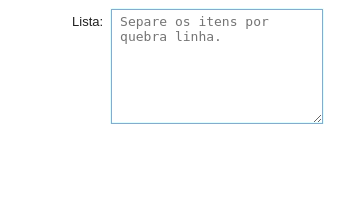

Vamos substituir a linha `display(ListaVec)` por uma saída Markdown de lista não ordenada. Desta vez, **toda vez que o usuário digitar algo alfabético (excluindo os espaços)** o programa irá considerar como um item da lista. 

Para remover os espaços vamos utilizar **o método `.replace(' ','')`** que remove os espaços da linha.

> ```python
> md("Escreva a sua lista de compras abaixo:")
> @interact(Lista=widget.Textarea(
>     description="Lista: ",             
>     placeholder='Separe os itens por quebra linha.')
> )
> def Lista_Saída(Lista):
>     if Lista: #Verifica se a string não é vazia
>         ListaVec=Lista.splitlines() # Quebrando a string em uma lista
> 
>         saídaLista="Saída da lista de compras:\n" # Criando um acomulador:
>         for Item in ListaVec:
>             # Verifica se o item que o usuário digitou é alfabético (Sem espaços)
>             if Item.replace(' ','').isalpha():
>                 saídaLista+='- {}\n'.format(Item)  
>         md(saídaLista)
> ```
>
> 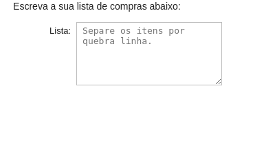

Vamos permitir que o usuário possa digitar o preço da mercadoria através da seguinte notação

> `Item - preço`

Para isso vamos quebrar cada linha utilizando o **método `.split()`** . Veja o que acontece quando utilizamos este método:

> ```python
> md("Escreva a sua lista de compras abaixo:")
> @interact(Lista=widget.Textarea(
>     description="Lista: ",             
>     placeholder='Escreva Item - Preço.')
> )
> def Lista_Saída(Lista):
>     if Lista:
>         ListaVec=Lista.splitlines()
>         for Item in ListaVec:
>             #Utilizando o método split quebramos cada linha em duas partes
>             Item = Item.split(' - ') 
>             display(Item)
> ```
>
> 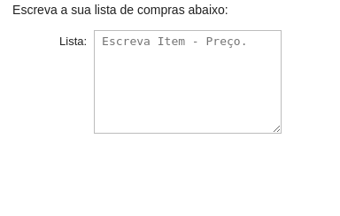

Vamos modificar a lista resultante do método `split()` e transformá-la numa saída markdown.

> ```python
> md("Escreva a sua lista de compras abaixo:")
> @interact(Lista=widget.Textarea(
>     description="Lista: ",             
>     placeholder='Escreva Item - Preço.')
> )
> def Lista_Saída(Lista):
>     if Lista: #Verifica se a string não é vazia
>         ListaVec=Lista.splitlines() # Quebrando a string em uma lista
>         saídaLista="Saída da lista de compras:\n"
>         for Item in ListaVec:
>             Item = Item.split(' - ')
>             #display(Item)
>             if len(Item)==2:
>                 if Item[0].replace(' ','').isalpha():
>                     saídaLista+='- {} - R\${:.2f}\n'.format(Item[0],float(Item[1]))  
>         md(saídaLista)
> ```
>
> 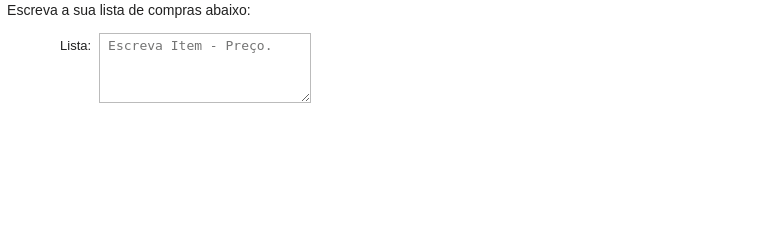

Observe que enquanto digitamos ocorria um erro. Isto acontecia porque **não existe um método para verificar se o item é um `float()`** . Vamos corrigir isso criando a função `isfloat()`:

> ```python
> # Criando uma função que verifica se o número é float:
> def isfloat(value):
>     try: # Tente executar 'float(value)'
>         float(value)
>         return True #Caso a execução seja bem sucedida retorne Verdadeiro
>     except ValueError: # Caso a operação não for bem sucedida retorne falso
>         return False
> ```

E adicionando esta função para verificar se o número é um `float` antes de converté-lo.

> ```python
> md("Escreva a sua lista de compras abaixo:")
> @interact(Lista=widget.Textarea(
>     description="Lista: ",             
>     placeholder='Escreva Item - Preço.')
> )
> def Lista_Saída(Lista):
>     if Lista: #Verifica se a string não é vazia
>         ListaVec=Lista.splitlines() # Quebrando a string em uma lista
>         saídaLista="Saída da lista de compras:\n"
>         for Item in ListaVec:
>             Item = Item.split(' - ')
> 
>             if len(Item)==2:
>                 if Item[0].replace(' ','').isalpha() and isfloat(Item[1]): # Verifica se o item que o usuário digitou é alfabético
>                     saídaLista+='- {} - R\$ {:.2f}\n'.format(Item[0],float(Item[1]))  
>         md(saídaLista)
> ```
>
> 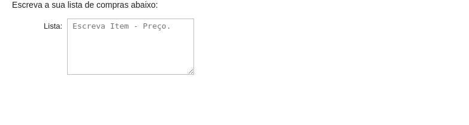

Vamos aproveitar e adicionar a possibilidade do usuário digitar um número com vírgula (Ao invés do padrão inglês com ponto). Para isso vamos **substituir `,` pelo `.`** no número com o método `.replace()`.

> ```python
> md("Escreva a sua lista de compras abaixo:")
> @interact(Lista=widget.Textarea(
>     description="Lista: ",             
>     placeholder='Escreva Item - Preço.')
> )
> def Lista_Saída(Lista):
>     if Lista: #Verifica se a string não é vazia
>         ListaVec=Lista.splitlines() # Quebrando a string em uma lista
>         saídaLista="Saída da lista de compras:\n"
>         for Item in ListaVec:
>             Item = Item.split(' - ')
>             
>             if len(Item)==2:
>                 Item[1] = Item[1] #Item[1] é a variável preço
>                 Preço = Item[1].replace(",",'.')
>                 
>                 if Item[0].replace(' ','').isalpha() and isfloat(Preço): # Verifica se o item que o usuário digitou é alfabético
>                     saídaLista+='- {} - R\$ {:.2f}\n'.format(Item[0],float(Preço))  
>         md(saídaLista)
> ```
>
> 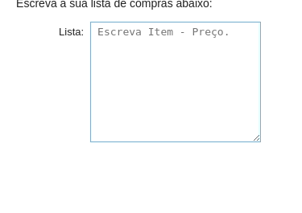

Podemos utilizar a mesma função para colocar o preço em português. Vamos definir uma função que converte **preço**:

> ```python
> #Definindo a função que converte um float em um preço
> def conv_Preço(Preço):
>     return 'R\$ {:.2f}'.format(float(Preço)).replace('.',',')
> ```

E incluí-la no código:

> ```python
> # Substituindo a função no programa
> md("Escreva a sua lista de compras abaixo:")
> @interact(Lista=widget.Textarea(
>     description="Lista: ",             
>     placeholder='Escreva Item - Preço.')
> )
> def Lista_Saída(Lista):
>     if Lista: #Verifica se a string não é vazia
>         ListaVec=Lista.splitlines() # Quebrando a string em uma lista
>         saídaLista="Saída da lista de compras:\n"
>         for Item in ListaVec:
>             Item = Item.split(' - ')
>             
>             if len(Item)==2:
>                 Preço = Item[1].replace(",",'.')
>                 
>                 if Item[0].replace(' ','').isalpha() and isfloat(Preço): # Verifica se o item que o usuário digitou é alfabético
>                     saídaLista+='- {} - {}\n'.format(Item[0],conv_Preço(Preço))  
>         md(saídaLista)
> ```
>
> 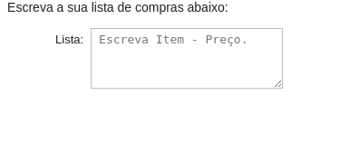

Finalmente, vamos utilizar o método **`.strip()`** para **remover todos os espaços laterais da string**. Assim podemos escrever a nossa lista de forma mais flexivel.

> ```python
> # Substituindo a função no programa
> md("Escreva a sua lista de compras abaixo:")
> @interact(Lista=widget.Textarea(
>     description="Lista: ",             
>     placeholder='Escreva Item - Preço.')
> )
> def Lista_Saída(Lista):
>     if Lista:
>         ListaVec=Lista.splitlines()
>         saídaLista="Saída da lista de compras:\n"
>         for Item in ListaVec:
>             Item = Item.split('-')
>             
>             #Removendo espaço das bordas
>             Item[0]=Item[0].strip()
>             
>             #Verificando se o nome do item é válido
>             if Item[0].replace(' ','').isalpha():
>                 saídaLista+='- {} '.format(Item[0])
>             
>                 #Verificando se o preço foi adicionado
>                 if len(Item)==2:
>                     Preço = Item[1].strip() #Removendo espaço das bordas
>                     Preço = Preço.replace(",",'.') #Convertendo para inglês
>                     if isfloat(Preço):
>                         saídaLista+=' - ' + conv_Preço(Preço)
>                 saídaLista+='\n'
>         md(saídaLista)
> ```
>
> 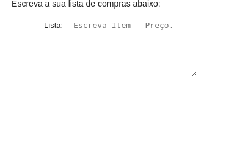

**Tarefa 1:** Adicione ao Exemplo 1:

- Suporte a quantidade de itens
- Cálculo do gasto total com as compras.

A entrada de um item na lista do usuário deve ser da seguinte forma:

> `[Item] - [Preço] - [Quantidade]`

E ainda:
- Se o usuário não digitar o preço o preço deve ser considerado nulo.
- Se o usuário não digitar a quantidade a quantidade deverá ser consideradada como 1.

> **Dica:** Use um List Comprehension como `[i.strip() for i in Item]` para simplificar seu código.

**Solução:**

```python
md('Escreva a sua lista de compras abaixo:')
@interact(Lista=widget.Textarea(description="Lista: ",
                                placeholder='Escreva Item - Preço - Qtd'))
def Lista_Saída(Lista):
    if Lista:
        ListaVec=Lista.splitlines() #Lista.split('\n')

        saídaLista='Saída da lista de compras:\n'

        Total = 0
        for Item in ListaVec:
            Item = Item.split('-')
        
            Item = [i.strip() for i in Item]
            #Verificando se o nome do item é válido
            if Item[0].replace(' ','').isalpha():
                saídaLista+='- {}'.format(Item[0])

                Preço = 0 # Supõe que o preço é nulo
                if len(Item)>=2:
                    Item[1] = Item[1].replace(',','.')
                    if isfloat(Item[1]): #Se for um preço válido, atualizo o preço
                        Preço = float(Item[1])

                saídaLista+=' - '+ conv_Preço(Preço)

                Qtd = 1 #Supõe que a quantidade é 1
                if len(Item)==3:
                    if Item[2].isdigit(): #Se a quantidade for válida, atualiza a quantidade
                        Qtd = int(Item[2])

                saídaLista+=' - Qtd. ' + str(Qtd)

                saídaLista+='\n'

                Total += Preço*Qtd

        
        md(saídaLista)
        md('**Total:** {}'.format(conv_Preço(Total)))
```

# Atividade 2: Tabelas no Markdown

### Exemplo 5: Trabalhando com tabelas

Para criar Tabelas no Markdown é muito simples. Veja o exemplo abaixo:

> **%Jup%**
>
> ```markdown
> |A esquerda (Padrão)|Centralizado|A direita|A esquerda|
> |-------------------|:----------:|--------:|:---------|
> | Valor 1           |Valor 2     |Valor 3  |   Valor 4|
> ```
>
> > | A esquerda (Padrão) | Centralizado | A direita | A esquerda |
> > | ------------------- | :----------: | --------: | :--------- |
> > | Valor 1             |   Valor 2    |   Valor 3 | Valor 4    |

Ou ainda:

> **%Jup%**
>
> ```markdown
> |A esquerda (Padrão)|Centralizado|A direita|A esquerda|
> |-|:-:|-:|:-|
> |Valor 1|Valor 2|Valor 3|Valor 4|
> ```
>
> > | A esquerda (Padrão) | Centralizado | A direita | A esquerda |
> > | ------------------- | :----------: | --------: | :--------- |
> > | Valor 1             |   Valor 2    |   Valor 3 | Valor 4    |

Você pode usar o site abaixo para criar tabelas facilmente:

> [https://www.tablesgenerator.com/markdown_tables](https://www.tablesgenerator.com/markdown_tables)

### Exemplo 6: Trabalhando com arquivos

Em problemas práticos geralmente obtemos uma base de dados de algum arquivo externo, como o `.csv`. CSV vem do acrônimo `Comma Separated Value`. Isto é, **valores separado por vírgulas**, este tipo de arquivo é muito utilizado para representar base de dados. E sua estrutura é muito simples. Por exemplo, o arquivo `pessoas.csv` disponível neste capítulo tem a seguinte estrutura:

```
André,M,45,1.70,80.1
Mariana,F,32,1.53,40.7
João,M,37,1.75,64.2
Pedro,M,65,1.60,61.4
José,M,93,1.70,59.3
Bianca,F,40,1.57,49.8
Carlos,F,44,1.67,82.7
```

Vamos imprimir os dados de uma base de dados disponível no arquivo `pessoas.csv` utilizando **métodos de string**. Para isso vamos utilizar a função `open()` para abrir o arquivo e a função `close()` para fechar o arquivo. 

> **Observação:** Quando trabalhando com arquivos estamos usando **recursos** do sistema operacional, portanto é **imprescindível** que o arquivo seja **fechado antes da finalização do programa**.

> ```python
> arquivo = open('pessoas.csv') #Abrindo o arquivo
> dados = arquivo.read() #Salvando os dados do arquivo na memória
> arquivo.close() #Toda vez que abrimos o arquivo é necessário fechá-lo.
> 
> #Imprimindo os dados na forma de tabela
> saída='|Nome|Sexo|Idade|Altura|Peso|\n|:-:|:-:|:-:|:-:|:-:|\n'
> for pessoa in dados.splitlines():
>     pessoa = pessoa.split(',')
> 
>     saída+='|{}|{}|{}|{} m|{} kg|\n'.format(pessoa[0],pessoa[1],pessoa[2],pessoa[3],pessoa[4])
>     
> md(saída)
> ```
>
> |  Nome   | Sexo | Idade | Altura |  Peso   |
> | :-----: | :--: | :---: | :----: | :-----: |
> |  André  |  M   |  45   | 1.70 m | 80.1 kg |
> | Mariana |  F   |  32   | 1.53 m | 40.7 kg |
> |  João   |  M   |  37   | 1.75 m | 64.2 kg |
> |  Pedro  |  M   |  65   | 1.60 m | 61.4 kg |
> |  José   |  M   |  93   | 1.70 m | 59.3 kg |
> | Bianca  |  F   |  40   | 1.57 m | 49.8 kg |
> | Carlos  |  F   |  44   | 1.67 m | 82.7 kg |

> **Observação:** Se a saída do arquivo estiver estranha utilize a opção `encoding='latin1'`

Observe que tivemos que escrever todos os elementos do vetor para imprimir os dados da nossa tabela. Vamos simplificar isso através do **operador `*`**. Este operador permite **desempacotar** uma lista dentro de uma função. Veja como ficaria o nosso programa utilizando este operador:

> ```python
> #Imprimindo os dados na forma de tabela
> saída='|Nome|Sexo|Idade|Altura|Peso|\n|:-:|:-:|:-:|:-:|:-:|\n'
> for pessoa in dados.splitlines():
>     pessoa=pessoa.split(',')
>     saída+='|{}|{}|{}|{} m|{} kg|\n'.format(*pessoa)
>     
> md(saída)
> ```
>
> |  Nome   | Sexo | Idade | Altura |  Peso   |
> | :-----: | :--: | :---: | :----: | :-----: |
> |  André  |  M   |  45   | 1.70 m | 80.1 kg |
> | Mariana |  F   |  32   | 1.53 m | 40.7 kg |
> |  João   |  M   |  37   | 1.75 m | 64.2 kg |
> |  Pedro  |  M   |  65   | 1.60 m | 61.4 kg |
> |  José   |  M   |  93   | 1.70 m | 59.3 kg |
> | Bianca  |  F   |  40   | 1.57 m | 49.8 kg |
> | Carlos  |  F   |  44   | 1.67 m | 82.7 kg |

**Leitura stream**

Ler a tabela inteira e salvar na memória não é interessante quando estamos falando de arquivos muito grandes. Uma maneira mais elegante de ler um arquivo é ler linha a linha através fazendo um **streamming** das linhas da tabela.

> ```python
> dados = open('pessoas.csv') #Abrindo o arquivo
> 
> saída='|Nome|Sexo|Idade|Altura|Peso|\n|:-:|:-:|:-:|:-:|:-:|\n'
> for pessoa in dados: #Carregamos o arquivo diretamente
>     pessoa=pessoa.split(',')
>     saída+='|{}|{}|{}|{} m|{} kg|\n'.format(*pessoa)
>     
> md(saída)
> dados.close() #Fecha o arquivo
> ```
>
> |Nome|Sexo|Idade|Altura|Peso|
> |:-:|:-:|:-:|:-:|:-:|
> |André|M|45|1.70 m|80.1
>  kg|
> |Mariana|F|32|1.53 m|40.7
>  kg|
> |João|M|37|1.75 m|64.2
>  kg|
> |Pedro|M|65|1.60 m|61.4
>  kg|
> |José|M|93|1.70 m|59.3
>  kg|
> |Bianca|F|40|1.57 m|49.8
>  kg|
> |Carlos|F|44|1.67 m|82.7
>  kg|
> 

Observe que ocorreu algo indesejado devido a presença do **quebra linha** `\n` no final de cada linha do arquivo. Vamos corrigir isso através do método `strip()`.

> ```python
> dados = open('pessoas.csv') #Abrindo o arquivo
> 
> with open('pessoas.csv') as dados:
>     saída='|Nome|Sexo|Idade|Altura|Peso|\n|:-:|:-:|:-:|:-:|:-:|\n'
>     for pessoa in dados: #Carregamos o arquivo diretamente
>         pessoa=pessoa.strip().split(',')
>         saída+='|{}|{}|{}|{} m|{} kg|\n'.format(*pessoa)
> 
>     md(saída)
> ```
>
> |  Nome   | Sexo | Idade | Altura |  Peso   |
> | :-----: | :--: | :---: | :----: | :-----: |
> |  André  |  M   |  45   | 1.70 m | 80.1 kg |
> | Mariana |  F   |  32   | 1.53 m | 40.7 kg |
> |  João   |  M   |  37   | 1.75 m | 64.2 kg |
> |  Pedro  |  M   |  65   | 1.60 m | 61.4 kg |
> |  José   |  M   |  93   | 1.70 m | 59.3 kg |
> | Bianca  |  F   |  40   | 1.57 m | 49.8 kg |
> | Carlos  |  F   |  44   | 1.67 m | 82.7 kg |

**Utilizando o módulo `csv`**

Para simplificar mais ainda o nosso programa podemos utilizar o módulo `csv`. O módulo `csv` permite trabalhar diretamente com os arquivos `csv`, você pode encontrar mais detalhes de como utilizar este módulo [aqui](https://docs.python.org/pt-br/3/library/csv.html).

> ```python
> import csv #Lendo um arquivo CSV
> 
> with open('pessoas.csv') as dados:
>     saída='|Nome|Sexo|Idade|Altura|Peso|\n|:-:|:-:|:-:|:-:|:-:|\n'
>     for pessoa in csv.reader(dados): #Vamos criar um objeto reader para ler os dados
>         saída+='|{}|{}|{}|{} m|{} kg|\n'.format(*pessoa)
> 
>     md(saída)
> ```
>
> |  Nome   | Sexo | Idade | Altura |  Peso   |
> | :-----: | :--: | :---: | :----: | :-----: |
> |  André  |  M   |  45   | 1.70 m | 80.1 kg |
> | Mariana |  F   |  32   | 1.53 m | 40.7 kg |
> |  João   |  M   |  37   | 1.75 m | 64.2 kg |
> |  Pedro  |  M   |  65   | 1.60 m | 61.4 kg |
> |  José   |  M   |  93   | 1.70 m | 59.3 kg |
> | Bianca  |  F   |  40   | 1.57 m | 49.8 kg |
> | Carlos  |  F   |  44   | 1.67 m | 82.7 kg |

Observe que com este módulo não precisamos utilizar os métodos de string, o próprio módulo se encarrega de fazer o tratamento do arquivo csv.

**Traduzindo para português:**

O Python nos permite trabalhar com formatos numéricos de outros países (Além do padrão Americano). Para isso é necessário utilizar o **módulo `locale`**. Vamos importá-lo e configurá-lo para trabalhar com o suporte ao português brasileiro (`pt_BR.utf8`):

> ```python
> #Importando o módulo locale
> import locale
> locale.setlocale(locale.LC_ALL,'pt_BR.utf8'); #Localização pt_BR.utf8
> ```

Através do comando `locale.setlocale()` configuramos a nossa saída para o português brasileiro. Para que o número saia nesse formato precisamos utilizar **a formatação `n`.**

> ```python
> with open('pessoas.csv') as dados:
>     saída='|Nome|Sexo|Idade|Altura|Peso|\n|:-:|:-:|:-:|:-:|:-:|\n'
>     for pessoa in csv.reader(dados):
>         # Converte três últimos valores para 'float' 
>         pessoa[2:]=[float(num) for num in pessoa[2:]]
>         saída+='|{}|{}|{:n}|{:.3n} m|{:.4n} kg|\n'.format(*pessoa)
> 
>     md(saída)
> ```
>
> |  Nome   | Sexo | Idade | Altura |  Peso   |
> | :-----: | :--: | :---: | :----: | :-----: |
> |  André  |  M   |  45   | 1,7 m  | 80,1 kg |
> | Mariana |  F   |  32   | 1,53 m | 40,7 kg |
> |  João   |  M   |  37   | 1,75 m | 64,2 kg |
> |  Pedro  |  M   |  65   | 1,6 m  | 61,4 kg |
> |  José   |  M   |  93   | 1,7 m  | 59,3 kg |
> | Bianca  |  F   |  40   | 1,57 m | 49,8 kg |
> | Carlos  |  F   |  44   | 1,67 m | 82,7 kg |

Observe que para imprimir neste formato precisamos converter o número que inicialmente era uma **string** em um **float**. Para fazer a conversão de vários elementos de uma única vez recorremos ao **List Generator**.

**Adicionando cor a tabela:**

O Markdown não suporta nativamente cores, mas **podemos utilizar HTML** para isso. O código que permite adicionar cor no Markdown é apresentado abaixo:

```html
<span style="color:blue">Texto *azul*</span>
```
<span style="color:blue">Texto *azul*</span>

Você pode procurar as cores no site na Wikipedia:

> [https://en.wikipedia.org/wiki/Web_colors](https://en.wikipedia.org/wiki/Web_colors)


Caso queira uma customização ainda maior. Você pode recorrer às cores Hexadecimais:

> [https://www.w3schools.com/colors/colors_picker.asp](https://www.w3schools.com/colors/colors_picker.asp)

> **Observação:** Além da cor, é possível utilizar o HTML para a customização de qualquer outro elemento, como a <span style="color:white;background-color:green">cor de fundo</span>, por exemplo.

Vamos colorir nossa tabela. Utilizaremos a notação parecida com o List Generator:

> `valor_verdadeiro if condição else valor_falso`

> ```python
> with open('pessoas.csv') as dados:
>     saída='|Nome|Sexo|Idade|Altura|Peso|\n|:-:|:-:|:-:|:-:|:-:|\n'
>     for pessoa in csv.reader(dados):
>         #Alteramos a cor aqui com código HTML
>         pessoa[1]='<span style="color:{}">{}</span>'.format('Fuchsia' if pessoa[1]=='F' else 'Teal',pessoa[1])
>         pessoa[2:]=[float(num) for num in pessoa[2:]]
>         saída+='|{}|{}|{:n}|{:.3n} m|{:.4n} kg|\n'.format(*pessoa)
> 
>     md(saída)
> ```
>
> |  Nome   |                 Sexo                 | Idade | Altura |  Peso   |
> | :-----: | :----------------------------------: | :---: | :----: | :-----: |
> |  André  |  <span style="color:Teal">M</span>   |  45   | 1,7 m  | 80,1 kg |
> | Mariana | <span style="color:Fuchsia">F</span> |  32   | 1,53 m | 40,7 kg |
> |  João   |  <span style="color:Teal">M</span>   |  37   | 1,75 m | 64,2 kg |
> |  Pedro  |  <span style="color:Teal">M</span>   |  65   | 1,6 m  | 61,4 kg |
> |  José   |  <span style="color:Teal">M</span>   |  93   | 1,7 m  | 59,3 kg |
> | Bianca  | <span style="color:Fuchsia">F</span> |  40   | 1,57 m | 49,8 kg |
> | Carlos  | <span style="color:Fuchsia">F</span> |  44   | 1,67 m | 82,7 kg |

**Tarefa 2:** Modifique o resultado final do Exemplo 3:

- Adicione uma coluna na tabela que cálcule do Índice de Massa Corporal (IMC) da base de dados. A fórmula do IMC é dada abaixo:

$$
\text{IMC}=\frac{\text{Peso}}{\text{Altura}^2}
$$

- Adicione uma coluna que indica o resultado qualitativo do IMC conforme a Tabela abaixo:

|        IMC        |  Qualitativo   |
| :---------------: | :------------: |
|  Menor que 18,5   | Abaixo do peso |
| Entre 18,5 e 24,9 |  Peso normal   |
|  Maior que 24,9   |   Sobrepeso    |

- Adicione cor na coluna no Qualitativo:
   - `Orange` para abaixo do peso
   - `Green` para peso normal
   - `Red` para sobrepeso

A sua solução deve ser parecida com:

|  Nome   |                 Sexo                 | Idade | Altura |  Peso   |  IMC  |                    Qualitativo                    |
| :-----: | :----------------------------------: | :---: | :----: | :-----: | :---: | :-----------------------------------------------: |
|  André  |  <span style="color:Teal">M</span>   |  45   | 1,7 m  | 80,1 kg | 27,72 |     <span style="color:Red">Sobrepeso</span>      |
| Mariana | <span style="color:Fuchsia">F</span> |  32   | 1,53 m | 40,7 kg | 17,39 | <span style="color:#ff8000">Abaixo do peso</span> |
|  João   |  <span style="color:Teal">M</span>   |  37   | 1,75 m | 64,2 kg | 20,96 |   <span style="color:Green">Peso normal</span>    |
|  Pedro  |  <span style="color:Teal">M</span>   |  65   | 1,6 m  | 61,4 kg | 23,98 |   <span style="color:Green">Peso normal</span>    |
|  José   |  <span style="color:Teal">M</span>   |  93   | 1,7 m  | 59,3 kg | 20,52 |   <span style="color:Green">Peso normal</span>    |
| Bianca  | <span style="color:Fuchsia">F</span> |  40   | 1,57 m | 49,8 kg | 20,2  |   <span style="color:Green">Peso normal</span>    |
| Carlos  | <span style="color:Fuchsia">F</span> |  44   | 1,67 m | 82,7 kg | 29,65 |     <span style="color:Red">Sobrepeso</span>      |

**Solução:**

```python
with open('pessoas.csv') as dados:
    saída='|Nome|Sexo|Idade|Altura|Peso|IMC|Qualitativo|\n|:-:|:-:|:-:|:-:|:-:|:-:|:-:|\n'
    for pessoa in csv.reader(dados):
        pessoa[1]='<span style="color:{}">{}</span>'.format('Fuchsia' if pessoa[1]=='F' else 'Teal',pessoa[1])
        
        #Convertendo minha string para valores numéricos (float)
        pessoa[2:]=[float(num) for num in pessoa[2:]]
        
        pessoa.append(pessoa[-1]/pessoa[-2]**2) # Calcular o IMC
        
        if pessoa[-1] < 18.5:
            pessoa.append('<span style="color:Orange">Abaixo peso</span>')
        elif pessoa[-1] > 24.9:
            pessoa.append('<span style="color:Green">Peso normal</span>')
        else:
            pessoa.append('<span style="color:Red">Sobrepeso</span>')
            
        saída+='|{}|{}|{:n}|{:.2n} m|{:.3n} kg|{:.4n}|{}|\n'.format(*pessoa)
    md(saída)
```

### Exemplo 7: Tabelas dinâmicas

Podemos **combinar as saídas do IPython** com as **entradas do IPython** (IPywidgets) para criar Tabelas dinâmicas e desta forma poder visualizar os dados com mais clareza. Vamos aproveitar para apresentar novos Widgets, vamos apresentar uns novos widgets.

**Widget dropdown**: 

O widget dropdown é um **widget de seleção** que pode ser criado através de uma **abreviação de lista**:

> ```python
> @interact(Fruta=['Maça','Laranja'])
> def f(Fruta):
>     print(Fruta)
> ```
>
> <p>
> <select name="Fruta" id="Fruta">
>   <option value="Maça">Maça</option>
>   <option value="Laranja">Laranja</option>
> </select>
> <br>Maça
> </p>

A sua pode ser encontrada [aqui](https://ipywidgets.readthedocs.io/en/latest/examples/Widget%20List.html#Dropdown).

Uma outra forma de trabalhar com o dropdown é através da abreviação de **lista de tuplas**. Desta forma podemos **atribuir um valor cara cada item do seletor**.

> ```python
> @interact(x=[('Maça',4.50),('Laranja',1.25)])
> def f(x):
>     print("O preço é {}.".format(
>         locale.currency(x) # A função currency traduz um valor na moeda local
>                                 ))
> ```
>
> <p>
> <select name="Fruta" id="Fruta">
>   <option value="4.50">Maça</option>
>   <option value="1.25">Laranja</option>
> </select>
> <br>O preço é R$ 4,50.
> </p>

Observe que no exemplo aproveitamos para mostrar mais uma funcionalidade do módulo **locale**. Além da função **locale.currency()** que traduz um número para valores da moeda local, existem muitas outras. Vale a pena olhar a documentação [aqui](https://docs.python.org/3/library/locale.html) e uma explicação mais completa [aqui](https://pymotw.com/3/locale/). Se possível dê uma investigada na função **locale.format_string()**.

**Dropdown e tabelas:**

Finalmente vamos utilizar os conceitos que aprendemos para customizar a nossa tabela.

> ```python
> @interact(Sexo=[('Todos','MF'),('Masculino','M'),('Feminino','F')])
> def imprimirTabela(Sexo):
>     with open('pessoas.csv') as dados:
>         saída='|Nome|Sexo|Idade|Altura|Peso|\n|:-:|:-:|:-:|:-:|:-:|\n'
>         for pessoa in csv.reader(dados):
>             
>             if pessoa[1] not in Sexo: 
>                 continue #Volte para o início do loop
>             
>             pessoa[1]='<span style="color:{}">{}</span>'.format('Fuchsia' if pessoa[1]=='F' else 'Teal',pessoa[1])
>             pessoa[2:]=[float(num) for num in pessoa[2:]]
>             saída+='|{}|{}|{:n}|{:.3n} m|{:.4n} kg|\n'.format(*pessoa)
> 
>         md(saída)
> ```
>
> 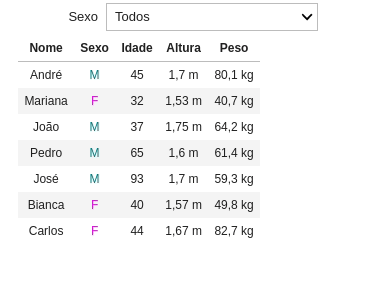

Observe que utilizamos o **continue** para fazer o processo de filtragem.

**Filtrando pela idade:**

Podemos utilizar o widget `ÌntRangeSlider` (Disponível [aqui](https://ipywidgets.readthedocs.io/en/latest/examples/Widget%20List.html#IntRangeSlider)) para trabalhar com **intervalos**. Vamos utilizá-lo para filtrar a idade.

> ```python
> @interact(
>     Sexo=[('Todos','MF'),('Masculino','M'),('Feminino','F')],
>     Idade=widget.IntRangeSlider(min=30,max=100,step=5,value=(30,100))
>          )
> def imprimirTabela(Sexo,Idade):
>     with open('pessoas.csv') as dados:
>         saída='|Nome|Sexo|Idade|Altura|Peso|\n|:-:|:-:|:-:|:-:|:-:|\n'
>         for pessoa in csv.reader(dados):                         
>             if pessoa[1] not in Sexo: 
>                 continue
>             pessoa[1]='<span style="color:{}">{}</span>'.format('Fuchsia' if pessoa[1]=='F' else 'Teal',pessoa[1])
>             pessoa[2:]=[float(num) for num in pessoa[2:]]
>            
>             if pessoa[2]<= Idade[0] or pessoa[2]>=Idade[1]:
>                 continue
>                 
>             saída+='|{}|{}|{:n}|{:.3n} m|{:.4n} kg|\n'.format(*pessoa)
> 
>         md(saída)
> ```
>
> 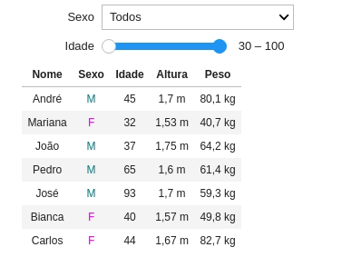

**Tarefa:** Incremente a Tarefa 2 adicionando a possibilidade de:

- Filtrar pelo sexo (Assim como no Exemplo 7)
- Filtrar pela idade (Assim como no Exemplo 7)
- Filtrar pelo qualitativo do IMC (Use um Dropdown)

Sua resposta deve ser parecida com a figura abaixo:

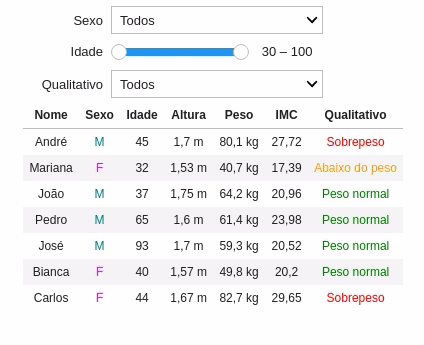

**Solução:**

```python
@interact(
    Sexo=[('Todos','MF'),('Masculino','M'),('Feminino','F')],
    Idade=widget.IntRangeSlider(min=30,max=100,step=5,value=(30,100)),
    Qualitativo=['Todos','Abaixo do peso','Peso normal','Sobrepeso']
         )
def imprimirTabela(Sexo,Idade,Qualitativo):
    with open('pessoas.csv') as dados:
        saída='|Nome|Sexo|Idade|Altura|Peso|IMC|Qualitativo|\n|:-:|:-:|:-:|:-:|:-:|:-:|:-:|\n' 
        for pessoa in csv.reader(dados):
            if pessoa[1] not in Sexo: 
                continue
            
            pessoa[1]='<span style="color:{}">{}</span>'.format('Fuchsia' if pessoa[1]=='F' else 'Teal',pessoa[1])
            pessoa[2:]=[float(num) for num in pessoa[2:]]

            pessoa.append(pessoa[-1]/pessoa[-2]**2) # Calculando o IMC

            if pessoa[-1] < 18.5:
                pessoa.append('<span style="color:Orange">Abaixo do peso</span>') # Cor laranja
            elif pessoa[-1] < 24.9:
                pessoa.append('<span style="color:Green">Peso normal</span>')
            else:
                pessoa.append('<span style="color:Red">Sobrepeso</span>')

            if pessoa[2]<= Idade[0] or pessoa[2]>=Idade[1]:
                continue

            if Qualitativo!= 'Todos' and Qualitativo not in pessoa[-1]:
                continue

            saída+='|{}|{}|{:n}|{:.3n} m|{:.4n} kg|{:.4n}|{}|\n'.format(*pessoa)

        md(saída)
```

# Atividade 3: Para casa

## Exercício 1: Lista de compras modificada

Modifique a Tarefa 1 mostrando o preço do produto e a quantidade em uma sub-lista dentro do item.

- O preço só deve ser mostrado na sub-lista se e somente se o usuário especificar
- O programa deve entender os preços no seguintes formatos:
    - 4.50
    - 4,50
    - R\$ 4,50
    - R\$ 4.50
- A quantidade deve ser mostrada se e somente se o usuário espcificar.

Veja um exemplo:

A string:

```
Arroz - 4,50 - 2
Carne - R$ 12,40 - 4
Lentilha - - 1
Ração Whiskas - 16.30 - 2
Leite - 4,50
```

Resulta em:

- Arroz
    - Preço: R\$ 4,50
    - Qtd: 2
- Carne
    - Preço: R\$ 12,40
    - Qtd: 4
- Lentilha
    - Qtd: 1
- Ração Whiskas
    - Preço: R\$ 16,30
    - Qtd: 2
- Leite
    - Preço: R\$ 4,50
    

**Total:** R$ 95,70

## Exercício 2: Tabela em Markdown

Crie a seguinte tabela em Markdown:

|    Nome | Sexo      | Idade |
| ------: | :-------- | ----: |
|   André | Masculino |    45 |
| Mariana | Feminino  |    32 |
|    João | Masculino |    37 |
|   Pedro | Masculino |    65 |
|    José | Masculino |    93 |
|  Bianca | Feminino  |    40 |
|  Carlos | Feminino  |    44 |

## Exercício 3: Valor nutricional dos alimentos

O **arquivo `csv` em anexo** contém a base de dados do valor nutricional de alguns alimentos consumidos pelos americanos, considerando uma porção de 100 gramas. 

> **Atenção:** Você deve utilizar o arquivo `comida.csv` disponível no **material auxiliar.** Este material foi adaptado de uma base de dados disponível logo abaixo. **Você deve usar preferencialmente o arquivo `comida.csv`, e não os dados originais!**  Pois seu PC vai travar se usar o arquivo original.  
> [https://tools.myfooddata.com/nutrition-facts-database-spreadsheet.php](https://tools.myfooddata.com/nutrition-facts-database-spreadsheet.php)

Neste exercício vamos utilizar o arquivo `comida.csv` que contém apenas um trecho da base de dados, com os seguintes campos:

- Name (Nome da comida)
- Food Group (Grupo da comida)
- Calories (Calorias)
- Fat (Gordura)
- Protein (Proteína)
- Carbohydrate (Carboidrato)

Utilizando os conceitos deste capítulo crie uma tabela dinâmica capaz de filtrar os seguintes campos:

- Food Group (Use um widget Dropdown)
- Calories, Fat, Protein e Carbohydrate (Use um widget do tipo RangeSlider)

Os RangeSlider tem as seguintes configurações:

- Calories (Calorias) $\rightarrow$ `min=17` e `max=642`
- Fat (Gordura) $\rightarrow$ `min=0` e `max=70`
- Protein (Proteína) $\rightarrow$ `min=0` e `max=40`
- Carbohydrate (Carboidrato) $\rightarrow$ `min=0` e `max=90`

Adicione as seguintes cores nos campos `Food Group`:

- `Vegatables` $\rightarrow$ Green
- `Sweets` $\rightarrow$ Fuchsia
- `Snacks` $\rightarrow$ Orange
- `Baked Foods` $\rightarrow$ DarkKhaki
- `Fruits` $\rightarrow$ Blue
- `Meats` $\rightarrow$ Red

Adicione um campo de busca no qual o usuário pode buscar pelo nome da comida (Campo `Name`). A busca deve ser `case insensitive`.

> **Observação:** 
>
> - Lembre-se que esse arquivo csv tem cabeçalho.  
> - **Use apenas os conhecimentos ensinados** até o momento (Não usar dicionários e nem pandas - Isso deixa a tarefa muito simples).

> **Dica:** Pesquise sobre o método `join` para criar o cabeçalho.

Veja o exemplo abaixo:

> ```python
> Cabeçalho = ('Nome','Sexo','Idade')
> saída = '|'+'|'.join(Cabeçalho)+'|\n' #Método Join foi utilizado para criar o cabeçalho usando o próprio cabeçalho da tabela
> saída += '|'+':-:|'*len(Cabeçalho)+'\n'
> md(saída)
> ```
> 
>| Nome | Sexo | Idade |
> | :-:  | :-:  | :-:  |
> |      |      |      |

Sua saída deve ser parecida com essa:

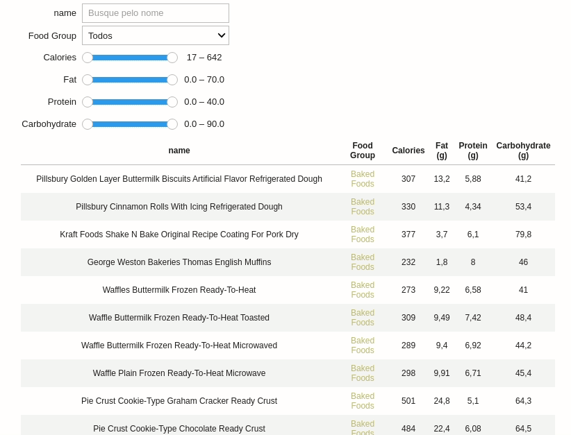