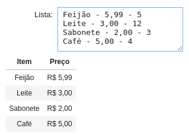

<center><div style="font-size:32px;display:inline-block;line-height:1.1;font-weight:bold;margin:0 0 15px" class="aula-title">Capítulo 8: Saídas do IPython</div></center>

# Atividade 1: Introdução às Saídas do IPython

Nos capítulos anteriores vimos que o `print()` é a principal função de impressão do Python, mas não é a única. Neste capítulo será introduzido as saídas do **IPython**.

A saída IPython é muito rica, com ela podemos mostrar:

- Audio
- Videos (Inclusive do Youtube)
- Videos do Youtube
- LaTeX
- Equações
- HTML (E código JavaScript)
- Figuras
- Sites (IFrame)
- Markdown
- Dentre outros

Mais detalhes podem ser vistos na [documentação](https://ipython.org/ipython-doc/dev/api/generated/IPython.display.html).

### Exemplo 1: Saídas do Ipython

Veja alguns exemplos:

> ```python
> # Importando o IPython.display
> import IPython.display as ipy
> ```

**Audio:**

>```python
># Posso reproduzir um audio qualquer no meu notebook
>ipy.Audio(url="http://www.w3schools.com/html/horse.ogg")
>```
>
><p>
><audio controls>  
><source src="http://www.w3schools.com/html/horse.ogg" type="audio/ogg">
></audio>
>    </p>


**Imagem:**

> ```python
> # Posso mostrar imagens no meu notebook
> ipy.Image(url='http://www.google.fr/images/srpr/logo3w.png')
> ```
>
> <p></p>

**Youtube:**

> ```python
> # Para colocar um vídeo basta colocar o código do vídeo
> ipy.YouTubeVideo('4Ifma_3ZB24')
> ```
>
> <p>
> <iframe width="400" height="300" src="https://www.youtube.com/embed/4Ifma_3ZB24" frameborder="0" allow="accelerometer; autoplay; clipboard-write; encrypted-media; gyroscope; picture-in-picture" allowfullscreen></iframe> 
> </p>

**Código HTML (Linguagem da Web):**

> ```python
> ipy.HTML('<p style="color:blue">Um texto azul em HTML.</p>')
> ```
> 
> <p style="color:blue">Um texto azul em HTML</p>

**Um site (IFrame):**

> ```python
> # Podemos colocar um IFrame, que de forma simplificada é uma página web incorporada ao Notebook
> ipy.IFrame(src="https://cursopythonufac.github.io/", width=400, height=300)
> ```
>
> <p><iframe src="https://cursopythonufac.github.io/" width=400 height=300></iframe></p>

### Exemplo 2: Função Markdown

Embora o IPython tenha várias saídas, neste capítulo vamos focar na saída Markdown. Afinal o Markdown permite inserir vários elementos, como imagens, tabelas, equações, código HTML, e você já está acostumado com a notação desta linguagem. Vamos começar com um exemplo simples:

> ```python
> TextoEmMarkdown="Este texto está em _itálico_ e este em **negrito**."
> 
> ipy.Markdown(TextoEmMarkdown)
> ```
>
> Este texto está em *itálico* e este em **negrito**.

Observe que todas as vezes que digitamos as saídas Markdown sempre apareceu aquele número em colchetes que fica do lado esquerdo da célula (Exemplo `[12]:`). Para eliminar isso basta chamar a função `ipy.Markdown()` dentro da função `display()`. Veja abaixo:

> ```python
> TextoEmMarkdown="Este texto está em _itálico_ e este em **negrito**."
> 
> display(ipy.Markdown(TextoEmMarkdown))
> ```
>
> Este texto está em *itálico* e este em **negrito**.

Ao invés de digitar `display(ipy.Markdown(TextoEmMarkdown))` toda vez que queremos executar um código em Markdown, podemos simplificar tudo através da função abaixo:

> ```python
> ## Função md
> 
> def md(Texto):
>     display(ipy.Markdown(Texto))
> ```
>
> ```python
> # Código
> md(TextoEmMarkdown)
> ```
>
> Este texto está em *itálico* e este em **negrito**.

Agora só precisaremos utilizar a função `md()` para executar qualquer coisa em Markdown.

### Exemplo 3: Markdown com multi-linha

Vimos nos primeiros capítulos como escrever strings multi-linhas. Quando queremos escrever textos longos  através da saída do IPython utilizar a notação multi-linha é util. Veja como podemos fazer uma lista de compras em Markdown:

> ```python
> md("""
> **Lista de compras:**
> 
> - Maça
> - Banana
> - Leite
> - Queijo
> """)
> ```
>
> **Lista de compras:**
>
> <ul style="margin-left:40px;margin-top:-20px">  
>        <li>Maça</li> 
>        <li>Banana</li> 
>        <li>Leite</li> 
>        <li>Queijo</li> 
> </ul>

### Exemplo 4: Markdown e interação com o usuário

Podemos combinar os poderosos Widgets com a saída Markdown para criar exemplos mais interessantes. Primeiramente vamos importar as bibliotecas necessárias:

> ```python
> # Importando os módulos de widgets
> import ipywidgets as widget
> import ipywidgets as widgets
> from ipywidgets import interact
> ```

Agora vamos **praticar** os **métodos de string** . A maioria dos métodos de string que utilizamos está no:

> [https://www.w3schools.com/python/python_ref_string.asp](https://www.w3schools.com/python/python_ref_string.asp)

Não se esqueça de conferir esta referência caso tenha alguma dúvida.

O primeiro deles é o método `.splitlines()` . Ele quebra cada linha de uma string em um elemento de uma lista. Para entender como funciona veja o exemplo abaixo:

> ```python
> md("Escreva a sua lista de compras abaixo:")
> @interact(Lista=widget.Textarea(
>     description="Lista: ",             
>     placeholder='Separe os itens por quebra linha.')
> )
> def Lista_Saída(Lista):
>     if Lista: #Verifica se a string não é vazia 
>         ListaVec=Lista.splitlines() # Quebrando a string por linha (Lista.split('\n'))
>         display(ListaVec)
> ```
>
> 

Vamos substituir a linha `display(ListaVec)` por uma saída Markdown de lista não ordenada. Desta vez, **toda vez que o usuário digitar algo alfabético (excluindo os espaços)** o programa irá considerar como um item da lista. 

Para remover os espaços vamos utilizar **o método `.replace(' ','')`** que remove os espaços da linha.

> ```python
> md("Escreva a sua lista de compras abaixo:")
> @interact(Lista=widget.Textarea(
>     description="Lista: ",             
>     placeholder='Separe os itens por quebra linha.')
> )
> def Lista_Saída(Lista):
>     if Lista: #Verifica se a string não é vazia
>         ListaVec=Lista.splitlines() # Quebrando a string em uma lista
> 
>         saídaLista="Saída da lista de compras:\n" # Criando um acomulador:
>         for Item in ListaVec:
>             # Verifica se o item que o usuário digitou é alfabético (Sem espaços)
>             if Item.replace(' ','').isalpha():
>                 saídaLista+='- {}\n'.format(Item)  
>         md(saídaLista)
> ```
>
> 

Vamos permitir que o usuário possa digitar o preço da mercadoria através da seguinte notação

> `Item - preço`

Para isso vamos quebrar cada linha utilizando o **método `.split()`** . Veja o que acontece quando utilizamos este método:

> ```python
> md("Escreva a sua lista de compras abaixo:")
> @interact(Lista=widget.Textarea(
>     description="Lista: ",             
>     placeholder='Escreva Item - Preço.')
> )
> def Lista_Saída(Lista):
>     if Lista:
>         ListaVec=Lista.splitlines()
>         for Item in ListaVec:
>             #Utilizando o método split quebramos cada linha em duas partes
>             Item = Item.split(' - ') 
>             display(Item)
> ```
>
> 

Vamos modificar a lista resultante do método `split()` e transformá-la numa saída markdown.

> ```python
> md("Escreva a sua lista de compras abaixo:")
> @interact(Lista=widget.Textarea(
>     description="Lista: ",             
>     placeholder='Escreva Item - Preço.')
> )
> def Lista_Saída(Lista):
>     if Lista: #Verifica se a string não é vazia
>         ListaVec=Lista.splitlines() # Quebrando a string em uma lista
>         saídaLista="Saída da lista de compras:\n"
>         for Item in ListaVec:
>             Item = Item.split(' - ')
>             #display(Item)
>             if len(Item)==2:
>                 if Item[0].replace(' ','').isalpha():
>                     saídaLista+='- {} - R\${:.2f}\n'.format(Item[0],float(Item[1]))  
>         md(saídaLista)
> ```
>
> 

Observe que enquanto digitamos ocorria um erro. Isto acontecia porque **não existe um método para verificar se o item é um `float()`** . Vamos corrigir isso criando a função `isfloat()`:

> ```python
> # Criando uma função que verifica se o número é float:
> def isfloat(value):
>     try: # Tente executar 'float(value)'
>         float(value)
>         return True #Caso a execução seja bem sucedida retorne Verdadeiro
>     except ValueError: # Caso a operação não for bem sucedida retorne falso
>         return False
> ```

E adicionando esta função para verificar se o número é um `float` antes de converté-lo.

> ```python
> md("Escreva a sua lista de compras abaixo:")
> @interact(Lista=widget.Textarea(
>     description="Lista: ",             
>     placeholder='Escreva Item - Preço.')
> )
> def Lista_Saída(Lista):
>     if Lista: #Verifica se a string não é vazia
>         ListaVec=Lista.splitlines() # Quebrando a string em uma lista
>         saídaLista="Saída da lista de compras:\n"
>         for Item in ListaVec:
>             Item = Item.split(' - ')
> 
>             if len(Item)==2:
>                 if Item[0].replace(' ','').isalpha() and isfloat(Item[1]): # Verifica se o item que o usuário digitou é alfabético
>                     saídaLista+='- {} - R\$ {:.2f}\n'.format(Item[0],float(Item[1]))  
>         md(saídaLista)
> ```
>
> 

Vamos aproveitar e adicionar a possibilidade do usuário digitar um número com vírgula (Ao invés do padrão inglês com ponto). Para isso vamos **substituir `,` pelo `.`** no número com o método `.replace()`.

> ```python
> md("Escreva a sua lista de compras abaixo:")
> @interact(Lista=widget.Textarea(
>     description="Lista: ",             
>     placeholder='Escreva Item - Preço.')
> )
> def Lista_Saída(Lista):
>     if Lista: #Verifica se a string não é vazia
>         ListaVec=Lista.splitlines() # Quebrando a string em uma lista
>         saídaLista="Saída da lista de compras:\n"
>         for Item in ListaVec:
>             Item = Item.split(' - ')
>             
>             if len(Item)==2:
>                 Item[1] = Item[1] #Item[1] é a variável preço
>                 Preço = Item[1].replace(",",'.')
>                 
>                 if Item[0].replace(' ','').isalpha() and isfloat(Preço): # Verifica se o item que o usuário digitou é alfabético
>                     saídaLista+='- {} - R\$ {:.2f}\n'.format(Item[0],float(Preço))  
>         md(saídaLista)
> ```
>
> 

Podemos utilizar a mesma função para colocar o preço em português. Vamos definir uma função que converte **preço**:

> ```python
> #Definindo a função que converte um float em um preço
> def conv_Preço(Preço):
>     return 'R\$ {:.2f}'.format(float(Preço)).replace('.',',')
> ```

E incluí-la no código:

> ```python
> # Substituindo a função no programa
> md("Escreva a sua lista de compras abaixo:")
> @interact(Lista=widget.Textarea(
>     description="Lista: ",             
>     placeholder='Escreva Item - Preço.')
> )
> def Lista_Saída(Lista):
>     if Lista: #Verifica se a string não é vazia
>         ListaVec=Lista.splitlines() # Quebrando a string em uma lista
>         saídaLista="Saída da lista de compras:\n"
>         for Item in ListaVec:
>             Item = Item.split(' - ')
>             
>             if len(Item)==2:
>                 Preço = Item[1].replace(",",'.')
>                 
>                 if Item[0].replace(' ','').isalpha() and isfloat(Preço): # Verifica se o item que o usuário digitou é alfabético
>                     saídaLista+='- {} - {}\n'.format(Item[0],conv_Preço(Preço))  
>         md(saídaLista)
> ```
>
> 

Finalmente, vamos utilizar o método **`.strip()`** para **remover todos os espaços laterais da string**. Assim podemos escrever a nossa lista de forma mais flexivel.

> ```python
> # Substituindo a função no programa
> md("Escreva a sua lista de compras abaixo:")
> @interact(Lista=widget.Textarea(
>     description="Lista: ",             
>     placeholder='Escreva Item - Preço.')
> )
> def Lista_Saída(Lista):
>     if Lista:
>         ListaVec=Lista.splitlines()
>         saídaLista="Saída da lista de compras:\n"
>         for Item in ListaVec:
>             Item = Item.split('-')
>             
>             #Removendo espaço das bordas
>             Item[0]=Item[0].strip()
>             
>             #Verificando se o nome do item é válido
>             if Item[0].replace(' ','').isalpha():
>                 saídaLista+='- {} '.format(Item[0])
>             
>                 #Verificando se o preço foi adicionado
>                 if len(Item)==2:
>                     Preço = Item[1].strip() #Removendo espaço das bordas
>                     Preço = Preço.replace(",",'.') #Convertendo para inglês
>                     if isfloat(Preço):
>                         saídaLista+=' - ' + conv_Preço(Preço)
>                 saídaLista+='\n'
>         md(saídaLista)
> ```
>
> 

**Tarefa 1:** Adicione ao Exemplo 1:

- Suporte a quantidade de itens
- Cálculo do gasto total com as compras.

A entrada de um item na lista do usuário deve ser da seguinte forma:

> `[Item] - [Preço] - [Quantidade]`

E ainda:
- Se o usuário não digitar o preço o preço deve ser considerado nulo.
- Se o usuário não digitar a quantidade a quantidade deverá ser consideradada como 1.

> **Dica:** Use um List Comprehension como `[i.strip() for i in Item]` para simplificar seu código.

# Atividade 2: Tabelas no Markdown

Para criar Tabelas no Markdown é muito simples. Veja o exemplo abaixo:

> **%Jup%**
>
> ```markdown
> |A esquerda (Padrão)|Centralizado|A direita|A esquerda|
> |-------------------|:----------:|--------:|:---------|
> | Valor 1           |Valor 2     |Valor 3  |   Valor 4|
> ```
>
> > | A esquerda (Padrão) | Centralizado | A direita | A esquerda |
> > | ------------------- | :----------: | --------: | :--------- |
> > | Valor 1             |   Valor 2    |   Valor 3 | Valor 4    |

Ou ainda:

> **%Jup%**
>
> ```markdown
> |A esquerda (Padrão)|Centralizado|A direita|A esquerda|
> |-|:-:|-:|:-|
> |Valor 1|Valor 2|Valor 3|Valor 4|
> ```
>
> > | A esquerda (Padrão) | Centralizado | A direita | A esquerda |
> > | ------------------- | :----------: | --------: | :--------- |
> > | Valor 1             |   Valor 2    |   Valor 3 | Valor 4    |

Você pode usar o site abaixo para criar tabelas facilmente:

> [https://www.tablesgenerator.com/markdown_tables](https://www.tablesgenerator.com/markdown_tables)

### Exemplo 5: Trabalhando com tabelas

Sendo assim, podemos refazer o Exemplo 4 na forma de Tabelas:

> ```python
> # Substituindo a função no programa
> md("Escreva a sua lista de compras abaixo:")
> @interact(Lista=widget.Textarea(
>     description="Lista: ",             
>     placeholder='Escreva Item - Preço.')
> )
> def Lista_Saída(Lista):
>     if Lista:
>         ListaVec=Lista.splitlines()
>         saídaLista="|Item|Preço|\n|:-:|:-:|\n" #Cria o início da Tabela
>         for Item in ListaVec:
>             Item = Item.split(' - ')
>             
>             #Tratando a entrada
>             Item[0]=Item[0].replace('-','')
>             
>             #Verificando se o nome do item é válido
>             if Item[0].replace(' ','').isalpha():
>                 #Verificando se o preço foi adicionado
>                 Preço = 0
>                 if len(Item)>=2:
>                     #Tratando a entrada
>                     Item[1] = Item[1].replace(' ','').replace(",",'.')
>                     
>                     if isfloat(Item[1]):
>                         Preço = float(Item[1])
>                 
>                 saídaLista+='|{}|{}|\n'.format(Item[0],conv_Preço(Preço))
>         md(saídaLista)
> ```
>
> 

# Atividade 3: Para casa

## Exercício 1: Lista de compras modificada

Modifique a Tarefa 1 mostrando o preço do produto e a quantidade em uma sub-lista dentro do item.

- O preço só deve ser mostrado na sub-lista se e somente se o usuário especificar
- O programa deve entender os preços no seguintes formatos:
    - 4.50
    - 4,50
    - R\$ 4,50
    - R\$ 4.50
- A quantidade deve ser mostrada se e somente se o usuário espcificar.

Veja um exemplo:

A string:

```
Arroz - 4,50 - 2
Carne - R$ 12,40 - 4
Lentilha - - 1
Ração Whiskas - 16.30 - 2
Leite - 4,50
```

Resulta em:

- Arroz
    - Preço: R\$ 4,50
    - Qtd: 2
- Carne
    - Preço: R\$ 12,40
    - Qtd: 4
- Lentilha
    - Qtd: 1
- Ração Whiskas
    - Preço: R\$ 16,30
    - Qtd: 2
- Leite
    - Preço: R\$ 4,50
    

**Total:** R$ 95,70

### Exercício 2: Tabela em Markdown

Crie a seguinte tabela em Markdown:

|    Nome | Sexo      | Idade |
| ------: | :-------- | ----: |
|   André | Masculino |    45 |
| Mariana | Feminino  |    32 |
|    João | Masculino |    37 |
|   Pedro | Masculino |    65 |
|    José | Masculino |    93 |
|  Bianca | Feminino  |    40 |
|  Carlos | Feminino  |    44 |