<center><div style="font-size:32px;display:inline-block;line-height:1.1;font-weight:bold;margin:0 0 15px" class="aula-title">Capítulo 9: dicionários e a biblioteca Pandas</div></center>

# Atividade 1: Dicionários

Dicionários, ou arrays associativos, são uma das estruturas de dados presentes na linguagem Python.

Os dicionários são pares de chave-valor, também vistos como **mapeamentos**. Estes são uma coleção de objetos identificados por **chaves**. As listas, por exemplo, são sequências identificadas pela sua **posição relativa**.

A sintaxe de um dicionário é dada a seguir:

```python
meu_dicionario = {
 key1: value1, 
 key2: value2, 
 key3: value3
}
```

Outra forma:

```python
dicionario = {}
dicionario['Elemento 1'] = 'Valor 1'
dicionario['Elemento 2'] = 'Valor 2'
```

### Exemplo 1: Criando um dicionário

> ```python
> # dicionario de notas
> alunos = {'Beatriz': [10.0, 4.0, 8.0, 10.0],
>           'Ana': [4.0, 7.0, 7.5, 10.0],
>           'José': [2.0, 4.5, 4.5, 8.0]}
> ```

Para acessar uma chave específica, a sintaxe é similar ao acesso em uma lista. Contudo, ao invés de passar a posição do elemento, passa-se a **chave**.

Se o seu dicionário for impresso em uma ordem diferente da minha, não se preocupe. A ordem não importa e é randômica.


### Exemplo 2: Alguns métodos dos dicionários

**Método `keys()`:** recebe um dicionário e retorna uma lista com as chaves.

> ```python
> alunos.keys()
> ```
> [4.0, 7.0, 7.5, 10.0]


**Método `values()`:** também retorna uma lista, mas agora são os valores do dicionário.

> ```python
> alunos.values()
> ```
> dict_keys(['Beatriz', 'Ana', 'José'])

**Métodos `items()`:** retorna uma lista de tuplas cujo os elementos são (chave, valor).

> ```python
> alunos.items()
> ```
> dict_values([[10.0, 4.0, 8.0, 10.0], [4.0, 7.0, 7.5, 10.0], [2.0, 4.5, 4.5, 8.0]])

Os métodos citados acima não recebem parâmetros ao serem invocados.

No python 2.x existia o método `.has_key()`, porém foi retirado do python 3.x. Na atual versão, o equivalente é o **operador `in`**, que retorna `True` se a chave estiver contida no dicionário; senão, `False`.

> ```python
> 'Josué' in alunos
> ```
> False
> ```python
> 'Ana' in alunos
> ```
> True

**Método `len()`:** retorna o comprimento de um dicionário.

> ```python
> len(alunos)
> ```
> 3

**Método `del()`:** remove um item do dicionário.

> ```python
> # removendo item
> del alunos['Beatriz']
> 
> # imprimindo o novo dicionario
> alunos
> ```
> {'Ana': [4.0, 7.0, 7.5, 10.0], 'José': [2.0, 4.5, 4.5, 8.0]}

**Tarefa 1:** crie uma lista de telefone com 5 contatos.

**Tarefa 2:** percorra o dicionário e imprima as chaves.

**Tarefa 3:** percorra o dicionário e imprima as chaves e os valores.

---

# Atividade 2: Biblioteca `pandas`

A biblioteca `pandas` é uma das bibliotecas mais famosas e utilizadas pela comunidade, principalmente em ciência de dados.

Você pode verificar a documentação oficial no site abaixo:

> https://pandas.pydata.org/docs

De acordo com a própria documentação do pandas, esta biblioteca é construída em cima do `NumPy` e a ideia é ser integrada a outras de uso majoritariamente científico. Além de ser também uma dependência da `statsmodels`, uma importante lib estatística.

Primeiro, vamos importar o pandas com a sintaxe a seguir:

> import pandas as pd

### Exemplo 3: Importando a biblioteca `pandas`

> ```python
> import pandas as pd
> ```
> 


Existem dois principais tipos na biblioteca `pandas`: `DataFrame` e `Series`. A diferença entre elas consiste na dimensão dos dados, em que a primeira é *2-Dimensional* e comporta diferentes tipos de dados e a segunda é *1-Dimensional* e homogênea.

`DataFrame` são tabelas, em que cada entrada corresponde a uma linha e uma coluna, respectivamente.

### Exemplo 4: Criando `DataFrame`

> ```python
> # criando o dataframe
> df = pd.DataFrame({'Nome': ['Beatriz', 'Alvaro'], 'Sobrenome': ['Nascimento', 'Duarte'], 'Idade': [22, 32]})
> 
> # imprimindo o dataframe
> df
> ```
>
> |       | Positivo | Negativo |
> | ----- | -------- | -------- |
> | **0** | 15       | 5        |
> | **1** | 5        | 5        |

O `DataFrame` está alocado em uma variável chamada `df`, nome este comum para se dar aos dataframes criados. 

Perceba que a criação é através de **dicionários**, em que as *keys* são os **nomes das colunas** e o *value* será uma lista, que representa as **linhas**.

> ```python
> # a ideia é dar erro
> df_error = pd.DataFrame({'Nome':'Beatriz', 'Idade': 22})
> ```
>
> ```java
> ---------------------------------------------------------------------------
> ValueError                                Traceback (most recent call last)
> <ipython-input-19-ad30e821a534> in <module>
>       1 # a ideia é dar o erro mesmo
> ----> 2 df_error = pd.DataFrame({'Nome': 'Beatriz', 'Idade': 22})
> 
> ~/.anaconda3/lib/python3.8/site-packages/pandas/core/frame.py in __init__(self, data, index, columns, dtype, copy)
>     433             )
>     434         elif isinstance(data, dict):
> --> 435             mgr = init_dict(data, index, columns, dtype=dtype)
>     436         elif isinstance(data, ma.MaskedArray):
>     437             import numpy.ma.mrecords as mrecords
> 
> ~/.anaconda3/lib/python3.8/site-packages/pandas/core/internals/construction.py in init_dict(data, index, columns, dtype)
>     252             arr if not is_datetime64tz_dtype(arr) else arr.copy() for arr in arrays
>     253         ]
> --> 254     return arrays_to_mgr(arrays, data_names, index, columns, dtype=dtype)
>     255 
>     256 
> 
> ~/.anaconda3/lib/python3.8/site-packages/pandas/core/internals/construction.py in arrays_to_mgr(arrays, arr_names, index, columns, dtype)
>      62     # figure out the index, if necessary
>      63     if index is None:
> ---> 64         index = extract_index(arrays)
>      65     else:
>      66         index = ensure_index(index)
> 
> ~/.anaconda3/lib/python3.8/site-packages/pandas/core/internals/construction.py in extract_index(data)
>     353 
>     354         if not indexes and not raw_lengths:
> --> 355             raise ValueError("If using all scalar values, you must pass an index")
>     356 
>     357         if have_series:
> 
> ValueError: If using all scalar values, you must pass an index
> ```

Um conjunto de dados bem famoso para quem inicia no pandas é o *Titanic*. Vamos trabalhar com ele inicialmente.

### Exemplo 5: Guardando os nomes e as idades dos passageiros do navio Titanic

> ```python
> # criando um dataframe
> df = pd.DataFrame({'Nome': ['Braund, Mr. Owen Harris', 'Allen, Mr. William Henry', 'Bonnell, Miss. Elizabeth'],
>                    'Idade': [22, 35, 58],
>                    'Sexo': ['Masculino', 'Masculino', 'Feminino']})
> 
> # visualizando o nosso dataframe
> df
> ```
>
> |       | Nome                     | Idade | Sexo      |
> | ----- | ------------------------ | ----- | --------- |
> | **0** | Braund, Mr. Owen Harris  | 22    | Masculino |
> | **1** | Allen, Mr. William Henry | 35    | Masculino |
> | **2** | Bonnell, Miss. Elizabeth | 58    | Feminino  |

**Tarefa 2:** crie um dataframe que contenha o nome de 5 alunos e as suas respectivas notas durante um ano letivo.

### Exemplo 6: mudando o index

> ```python
> alunos.set_index(['Ana', 'Beatriz', 'Bernardo', 'Valentin', 'Sofia'])
> ```
>
> | Ana  | Beatriz | Bernardo | Valentin | Sofia |
> | ---- | ------- | -------- | -------- | ----- |
> | 10.0 | 10.0    | 10.0     | 10.0     | 10.0  |
> | 4.0  | 4.0     | 4.0      | 4.0      | 4.0   |
> | 2.0  | 2.0     | 2.0      | 2.0      | 2.0   |
> | 10.0 | 10.0    | 10.0     | 10.0     | 10.0  |
>

Agora os nomes das colunas passam a ser os index, assim o dataframe será indicado por eles.

### Exemplo 7: Importando DataFrame com `pandas_datareader`

Primeiro, vamos instalar a biblioteca `pandas_datareader`. Esta biblioteca é utilizada para acessar dados remotos, nela encontramos fontes como `Yahoo`, `Quandl`, `World Bank`, etc.

Digite no *powershell*:

```bash
conda install -c anaconda pandas-datareader
```

Em seguida, importe o módulo `data` utilizando a seguinte sintaxe:

> ```python
> from pandas_datareader import data as web
> ```

A documentação pode ser vista no seguinte link: https://pandas-datareader.readthedocs.io/en/latest/index.html.

O código acima indica como pegaremos os dados provenientes da web utilizando a biblioteca em questão.

```python
from pandas_datareader import data as web
```

Vamos utilizar o `pandas_datareader` para ter acesso aos preços diários de algumas ações listadas na bolsa de valores brasileira, B3. Isso é útil quando se quer criar **modelos preditivos**, **analisar dados**, **otimizar uma carteira de investimento** ou **automatizar operações**.

Duas formas de se capturar os tickets das ações são:

**Forma 1:**

> ```python
> itau = web.DataReader('ITSA4.SA', data_source='yahoo', start='2020-1-1')
> 
> petrobras = web.DataReader('PETR4.SA', data_source='yahoo', start='2020-1-1')
> 
> vale = web.DataReader('VALE3.SA', data_source='yahoo', start='2020-1-1')
> ```

**Forma 2:**

> ```python
> tickers = ['ABEV3.SA', 'ENGI3.SA', 'PETR4.SA', 'TAEE11.SA']
> 
> ativos = []
> 
> for t in tickers:
>     ativos[t] = web.DataReader(t, data_source='yahoo', start='2020-1-1')
> ```

**Obs.:** poderia ser qualquer ativo, estes foram escolhidos aleatoriamente.

### Exemplo 8: Visualizando os dataframes

Podemos visualizar os dataframes escrevendo os nome deles. Tente rodar cada um deles e veja o que acontece:

> ```python
> # visualizando itau
> itau
> ```
>
>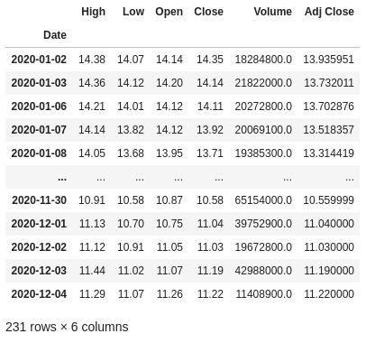
>
> ```python
> # visualizando petrobras
> petrobras
> ```
>
>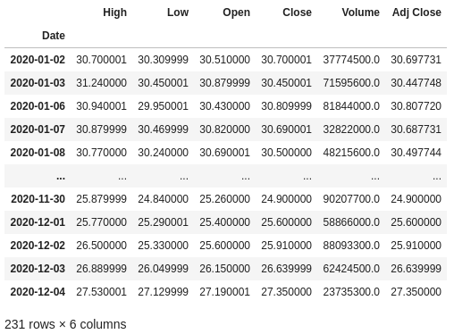
>
> ```python
> # visualizando vale
> vale
> ```
>
>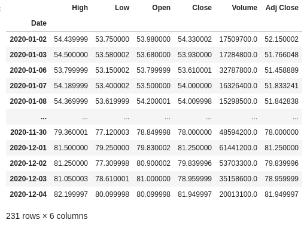
>
> ```python
> # visualizando os ativos
> ativos
> ```
>
>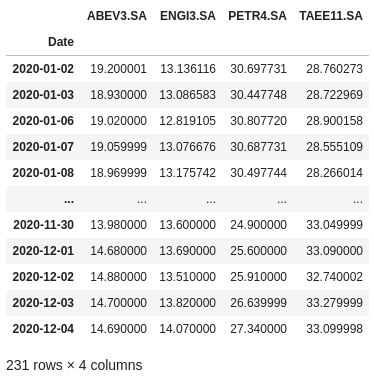
>


Esses conjuntos de dados referem-se aos preços negociados das ações diariamente desde 01 de janeiro de 2020. Trata-se de um conjunto temporal de dados (série temporal), ou seja, um conjunto cujo as observações são igualmente espaçadas ao longo do tempo.

Uma breve explicação sobre as colunas desses *datasets*:

- **High:** preço máximo daquele ativo no dia.

- **Low:** preço mínimo daquele ativo no dia.

- **Open:** preço de abertura do ativo.

- **Close:** preço de fechamento do ativo.

- **Volume:** volume financeiro negociado.

- **Adj Close:** preço de fechamento ajustado, ou seja, é o preço após a distribuição de dividendos, splits, etc.

### Exemplo 9: Importando um DataFrame de um arquivo `.csv`

Na internet existem diversos sites em que você pode encontrar bases de dados, planilhas e conjuntos de dados no geral para se trabalhar. Vamos trabalhar com um arquivo csv chamado "Salary".

Para simplificar, baixe o arquivo no mesmo diretório dos seus notebooks.

A sintaxe para importá-lo é:

> ```pd.read_csv(caminho)```

<div style="font-size:12px;display:inline-block;line-height:1.1;font-weight:bold" class="obs">Obs.: lembre-se de, ao digitar o caminho, trocar o caracter `\` por `/`.</div>

Vamos guardá-lo em uma variável e, por curiosidade, vamos ver os parâmetros que o método `read_csv` recebe.

Para isso, ao digitar `pd.read_csv`, aperte as teclas `Shift + Tab`.

>```python
>df = pd.read_csv('salarios.csv')
>```

Visualizando o nosso dataframe:

>```python
># visualizando
>df
>```
>
>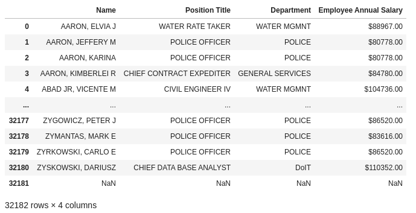

### Exemplo 10: Renomeando as colunas

Para renomear as colunas, utilize o método `rename(columns = {'Nome antigo': 'Nome novo'})`.

> ```python
> df.rename(columns={'Name': 'Nome', 'Position Title': 'Cargo', 'Department': 'Departamento', 'Employee Annual Salary': 'Salário Anual', inplace=True})
> ```
> ```python
> df
> ```
> 
>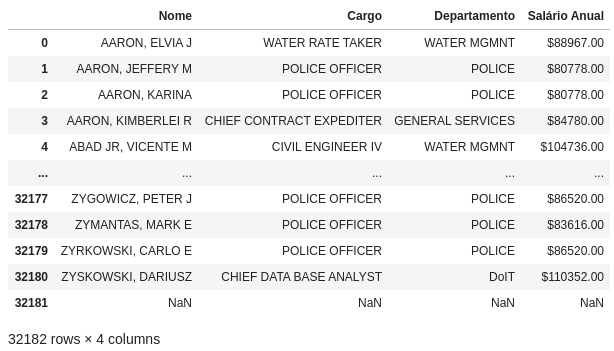
>


### Exemplo 11: Criando novas colunas em um DataFrame

Vamos criar um dataframe simples.

> ```python
> # criando novo dataframe
> exemplo = pd.DataFrame({'Nome': ['Valentina', 'Anastácio', 'Joseph'], 'Sexo': ['F', 'M', 'M'], 'Dia nascimento': [2, 3, 2]})
> 
> # visualizando o dataframe exemplo
> exemplo
> ```
>
> |       | Nome      | Sexo | Dia nascimento | Mês de nascimento |
> | ----: | :-------- | :--- | -------------: | :---------------- |
> | **0** | Valentina | F    |              2 | Setembro          |
> | **1** | Anastácio | M    |              3 | Outubro           |
> | **2** | Joseph    | M    |              2 | Julho             |

Criando uma nova coluna referente ao `mês de nascimento`.

> ```python
> #Criando a nova coluna
> exemplo['Mês de nascimento'] = ['Setembro', 'Outubro', 'Julho']
> 
> # visualizando o dataframe exemplo
> exemplo
> ```
>
> |       | Nome      | Sexo | Dia nascimento | Mês de nascimento |
> | ----: | :-------- | :--- | -------------: | :---------------- |
> | **0** | Valentina | F    |              2 | Setembro          |
> | **1** | Anastácio | M    |              3 | Outubro           |
> | **2** | Joseph    | M    |              2 | Julho             |

**Tarefa 4:** crie um dataframe de uma loja com 5 funcionários.

**Tarefa 5:** a partir do dataframe anterior, insira novas colunas como tempo de serviço e se tem férias marcada.

### Exemplo 12: Alguns métodos do pandas

Para saber o tamanho do dataset, utilizamos o método `.shape()`.

> ```python
> df.shape
> ```
>
> (32182, 4)

Ele nos retorna uma tupla, em que o primeiro item é o **número de linhas** e o segundo **número de colunas**.

Para visualizar os primeiros dados, utiliza-se o método `.head()`.

> ```python
> df.head()
> ```
>
> |       | Nome                | Cargo                    | Departamento     | Salário Anual |
> | ----: | :------------------ | :----------------------- | :--------------- | ------------: |
> | **0** | AARON,  ELVIA J     | WATER RATE TAKER         | WATER MGMNT      |         88967 |
> | **1** | AARON,  JEFFERY M   | POLICE OFFICER           | POLICE           |         80778 |
> | **2** | AARON,  KARINA      | POLICE OFFICER           | POLICE           |         80778 |
> | **3** | AARON,  KIMBERLEI R | CHIEF CONTRACT EXPEDITER | GENERAL SERVICES |         84780 |
> | **4** | ABAD JR,  VICENTE M | CIVIL ENGINEER IV        | WATER MGMNT      |        104736 |

Já para visualizar os últimos dados, utiliza-se o método `.tail()`.

> ```python
> df.tail()
> ```
>
> |           | Nome                | Cargo                   | Departamento | Salário Anual |
> | --------: | :------------------ | :---------------------- | :----------- | ------------: |
> | **32177** | ZYGOWICZ,  PETER J  | POLICE OFFICER          | POLICE       |         86520 |
> | **32178** | ZYMANTAS,  MARK E   | POLICE OFFICER          | POLICE       |         83616 |
> | **32179** | ZYRKOWSKI,  CARLO E | POLICE OFFICER          | POLICE       |         86520 |
> | **32180** | ZYSKOWSKI,  DARIUSZ | CHIEF DATA BASE ANALYST | DoIT         |        110352 |
> | **32181** | nan                 | nan                     | nan          |           nan |

Em ambas as estruturas acima, `.head()` e `.tail()`, é possível definir a quantidade de dados como parâmetro que você quer observar. Se você não informa o parâmetro, ele, por padrão, mostra as **cinco** primeiras e últimas entradas, respectivamente.

O método `.info()` é utilizado para visualizar informações sobre o arquivo.

> ```python
> df.info()
> ```
>
> 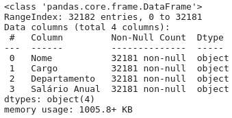

Quando se faz uma EDA (Análise Exploratória de Dados) ou quer treinar um modelo de ML existem algumas coisas que merecem ser observadas no resultado de `.info()`. Por exemplo, a quantidade de valores `NaN`, que significa `Not A Number`. São valores **nulos**.

Neste dataset especificamente, podemos perceber que enquanto as colunas `Nome`, `Cargo`, `Departamento` contém 32181 valores não-nulos, a coluna `Salário Anual` possui 32182.

O que isso quer dizer?

A interpretação depende do que o dataset, em si, quer nos informar. Como tratamos de salários de funcionários, seria uma espécie de *funcionário fantasma*? Alguém que foi demitido e esqueceram de tirar? Ou, melhor ainda, **a companhia está gastando mais sem necessidade?**

Para retirar os valores `NaN`, existe um método específico: `.dropna()`.

> ```python
> df.dropna()
> ```
>
> 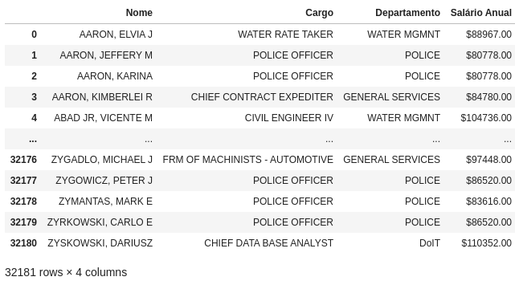

Para saber os tipos dos dados, utiliza-se o método `dtypes`.

> ```Nome             object
> df.dtypes
> ```
>
> 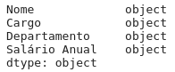

Para visualizar informações **estatísticas**, o método `describe()`pode ser invocado.

> ```python
> df['Salário Anual'].describe()
> ```
>
> |       | Salário Anual |
> | :---- | ------------: |
> | count |         32181 |
> | mean  |       79167.5 |
> | std   |       24462.4 |
> | min   |          0.96 |
> | 25%   |         69888 |
> | 50%   |         83616 |
> | 75%   |         91764 |
> | max   |        260004 |

Perceba que a coluna `Salário Anual` não era pra ser um objeto e sim float. Neste caso, é necessário fazer uma transformação a fim de tirarmos algunas informações estatísticas.

**Tarefa 6:** volte ao pequeno conjunto de dados e extraia informações estatísticas da coluna `Salário`.

**Tarefa 7:** calcule a média utilizando o método `.mean()` do salário dos funcionários.

**Tarefa 8:** calcule o desvio padrão da coluna `Salário`.

### Exemplo 13: transformar tipo `object` para `float`

Se visualizarmos especificamente a coluna `Salário Anual` nos deparamos com um problema.

Os campos dos salários estão como `object` e possuem um cifrão antes dele, o que nos impede de extrair algumas informações estatísticas.

Para resolver este problema, precisamos de uma estrutura para, primeiro, retirar o cifrão; posteriormente, converter para dados do tipo `float`.

> ```python
> # utilizando expressoes regulares para retirar o $
> df['Salário Anual'] = df['Salário Anual'].str.replace('\$\s*', '', regex=True)
> ```
>
> ```python
> # convertendo para float
> df['Salário Anual'] = df['Salário Anual'].astype(float)
> ```
>
> ```python
> # visualizando a serie
> df['Salário Anual']
> ```
>
> 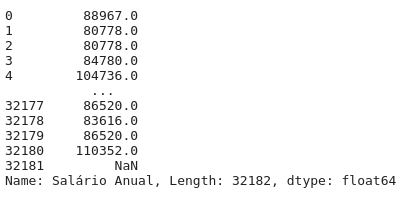

Agora, ao invocar `.describe()`, note como a saída alterou.

> ```python
> df['Salário Anual'].describe()
> ```
>
> 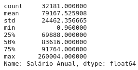

Veja que agora temos uma saída mais adequada para se trabalhar, em que **informações estatísticas** são impressas.

- **Count:** quantidade de dados.

- **mean:** média dos dados.

- **std:** **_standard deviation_**, desvio padrão dos dados.

- **min:** menor valor.

- **25%:** primeiro quartil.

- **50%:** segundo quartil correspondente a **mediana**.

- **75%:** terceiro quartil.

- **max:** o valor máximo.

Nós modificamos o tipo de dado partindo de `object`e chegando até um `float`. Porém, existem outros dados que podem ser transformados e dependendo do problema, **devem** ser modificados. Por exemplo, o `Datetime`, principalmente quando se trabalha com **séries temporais**.

### Exemplo 14: métodos de seleção de dados

Para selecionar um intervalo de dados, utilizamos os métodos `.loc()` e `.iloc()`. Ambos são muito úteis. Pode-se dizer que são os `slices` da lib Pandas.

#### Método `.loc()`

O `.loc()` seleciona os dados baseados nos labels das colunas. A sintaxe é:

```python
df.loc[<linha>, <coluna>]
```

>```python
>df.loc[[4]]
>```
>
>|       | Nome                | Cargo             | Departamento | Salário Anual |
>| ----: | :------------------ | :---------------- | :----------- | ------------: |
>| **4** | ABAD JR,  VICENTE M | CIVIL ENGINEER IV | WATER MGMNT  |        104736 |

Vamos pegar o intervalo entre 10 a 20 pessoas da coluna `Nome` até `Salário Anual`.

> ```python
> df.loc[9:19, 'Nome':'Salário Anual']
> ```
>
> 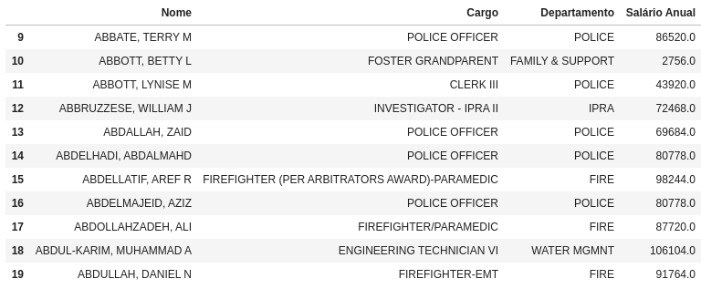

#### Método `.iloc()`

O `.iloc()` é parecido com o `.loc()`. A diferença consiste que este é baseado na localização, ou seja, é dado por um inteiro que seleciona a posição e não o label.

> ```python
> ativos.iloc[20:50]
> ```
>
> | Date                | ABEV3.SA | ENGI3.SA | PETR4.SA | TAEE11.SA |
> | :------------------ | -------: | -------: | -------: | --------: |
> | 2020-01-30 00:00:00 |    18.34 |  12.5516 |  28.9379 |   29.1426 |
> | 2020-01-31 00:00:00 |    17.85 |  12.6903 |  28.4479 |   29.0307 |
> | 2020-02-03 00:00:00 |    17.59 |  12.6804 |  28.1779 |   29.1333 |
> | 2020-02-04 00:00:00 |    17.65 |  13.0371 |  28.6279 |   29.1146 |
> | 2020-02-05 00:00:00 |    17.25 |  12.9875 |  28.3879 |   29.1613 |
> | 2020-02-06 00:00:00 |    16.87 |  12.9875 |  29.1778 |   28.8069 |
> | 2020-02-07 00:00:00 |    16.92 |   12.829 |  28.9279 |   28.4712 |
> | 2020-02-10 00:00:00 |    16.73 |  12.5913 |  29.1278 |   27.8184 |
> | 2020-02-11 00:00:00 |     16.8 |  12.7993 |  29.4778 |   28.6297 |
> | 2020-02-12 00:00:00 |    16.65 |  12.6309 |  30.1278 |   29.2732 |
> | 2020-02-13 00:00:00 |    16.27 |  12.5417 |  29.7178 |    29.068 |
> | 2020-02-14 00:00:00 |    16.41 |   12.938 |  29.4178 |   28.9375 |
> | 2020-02-17 00:00:00 |     16.6 |  12.7498 |  29.3578 |   29.3664 |
> | 2020-02-18 00:00:00 |    16.18 |  12.3931 |  29.7478 |   29.0587 |
> | 2020-02-19 00:00:00 |    16.13 |  12.6804 |  30.5477 |   29.3478 |
> | 2020-02-20 00:00:00 |    16.17 |  12.8885 |  29.9178 |   28.5831 |
> | 2020-02-21 00:00:00 |    16.25 |  12.6804 |  29.1378 |   28.6763 |
> | 2020-02-27 00:00:00 |     14.5 |  12.8587 |  25.2981 |   28.0515 |
> | 2020-02-28 00:00:00 |    14.54 |  12.3351 |  25.3381 |   27.3894 |
> | 2020-03-02 00:00:00 |    14.72 |  12.4844 |   26.528 |   28.2007 |
> | 2020-03-03 00:00:00 |    14.74 |  12.5441 |  26.0481 |   28.1914 |
> | 2020-03-04 00:00:00 |    15.31 |  12.6736 |   26.888 |     29.04 |
> | 2020-03-05 00:00:00 |    15.23 |   12.564 |  25.2881 |   27.8837 |
> | 2020-03-06 00:00:00 |    15.32 |  12.9324 |  22.8283 |   27.5293 |
> | 2020-03-09 00:00:00 |    14.67 |  12.3749 |  16.0488 |   27.0444 |
> | 2020-03-10 00:00:00 |    14.42 |  12.6437 |  17.5587 |   28.2474 |
> | 2020-03-11 00:00:00 |    13.75 |  11.1503 |  15.8488 |   27.7438 |
> | 2020-03-12 00:00:00 |    11.58 |  11.7178 |  12.5991 |   26.0838 |
> | 2020-03-13 00:00:00 |     12.7 |  12.4446 |  15.3989 |   26.8951 |
> | 2020-03-16 00:00:00 |    11.03 |  11.9169 |   13.089 |    25.002 |

---

# Atividade 3: Para casa

### Exercício 1: extração de datasets

Extraia outros dois conjuntos de dados de sua preferência e faça uma análise sobre ele (em markdown). Abordando as características, possíveis problemas de negócio, etc.

> Não entre no mérito de código por ora.

### Exercício 2: identificação de problemas no arquivo `precipitacao.xlsx`

Aponte eventuais problemas no arquivo `precipitacao.xlsx`, com relação aos tipos de dados, *NaN*, etc.

### Exercício 3: extração de informações estatísticas

Extraia informações estatísticas do conj. de dados de ações. Faça para outros 5 diferentes ativos.

> O código dos ativos do Yahoo Finance é: código do ativo + .SA

### Exercício 4: série temporal e `Datetime`

Utilizando o arquivo `precipitacao.xlsx`, deixe-a no formato de uma série temporal.

> Lembre-se que uma série temporal contém as datas como index.


